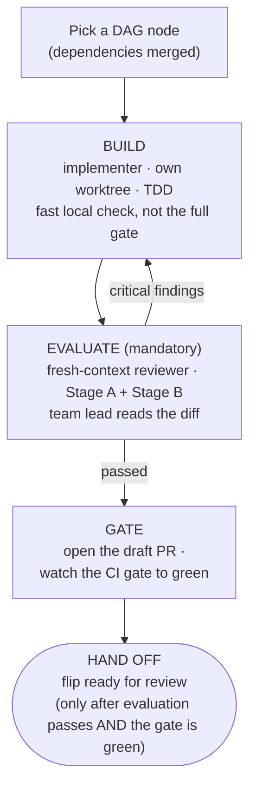

# Implementation orchestration strategy

How **Écluse** (package `ecluse`) is built as a coordinated multi-agent effort. This document owns
_process_; the system design is in [`../docs/architecture.md`](../docs/architecture.md), the
development workflow and CI in [`../CONTRIBUTING.md`](../CONTRIBUTING.md), Haskell style in
[`../docs/style.md`](../docs/style.md), and agent-facing essentials in [`../AGENTS.md`](../AGENTS.md).

This document is the reference. The `orchestrate-implementation` skill is the imperative procedure a
team lead runs: it carries the per-PR loop and the hand-off gate and links back here for depth.

## Roles

- **Principal architect** (the repo owner) owns the design and the requirements and is the final
  decision-maker on both. Reviews and merges every PR.
- **Team lead** (the coordinating agent) decomposes the finalised architecture into PR-sized work,
  dispatches and supervises implementation subagents, evaluates their output, runs a fast local
  check, and hands review-ready PRs to the architect. The team lead never merges and, during
  implementation, never pushes to `main`: all code lands through PRs the architect reviews.

## Operating principle: escalate, don't guess

The single most important rule. When an agent is stuck, unsure, blocked, or facing an ambiguous,
missing, or contradictory spec, it stops and surfaces the problem rather than inventing a way past
it. Agents make a _bounded_ attempt against the existing specs first, then escalate; they do not
thrash or paper over uncertainty. An implementation agent must never:

- fabricate a config key, path, value, or **API behaviour** (verify via `hoogle` or the docs, or
  escalate);
- silently weaken, skip, or `xfail` a test to reach green;
- add a `.semgrepignore` entry or `nosemgrep` comment (those need the architect's approval, always);
- sprawl beyond the slice's file scope to route around a blocker, rather than staying in scope or
  justifying the exception;
- leave a `TODO`, `undefined`, or stub and call the work done.

A leftover stub or a quietly-relaxed test is a blocker, not a delivery, and how guessing hides; the
team lead scans for exactly that in review. Surfacing is also **proactive**: concerns, limitations,
and risks are raised as warranted, not only at a hard block.

## Phase 0: architecture to delivery plan

Done once, when the architecture is frozen. The team lead turns the design into a
**dependency-ordered DAG of PR-sized slices**, recorded in the issue tracker:

- **Walking skeleton first:** the thinnest end-to-end path, then capabilities layered onto it.
- **Handles before consumers:** the Handle-pattern records (`MetadataClient`, `MirrorQueue`,
  `CredentialProvider`) are defined as interfaces early so downstream slices can be built in parallel
  against them.
- **Each slice is one coherent, reviewable-in-a-sitting capability**, with acceptance criteria traced
  to specific architecture sections, the test tier(s) it owes, a limited file scope, and its
  dependencies.

The architect signs off on this breakdown before any code is written.

## Convergence slices: contract before construction

The DAG encodes _ordering_ (`depends-on`) but not the **shape** of what crosses each edge. Where
several producer slices converge on one consumer (the packument pipeline, launch composition),
specify the consumer's interface, the types crossing the boundary, before building the producers, so
producers build _to_ a known contract instead of the consumer reverse-engineering whatever they emit.
That interface is a deliverable of this planning pass, not a discovery of the build pass; skipping it
is how the packument pipeline's typed-decision-vs-served-`Value` contract surfaced late (see
[Registry model: decision vs served
surface](../docs/architecture/registry-model.md#decision-surface-vs-served-surface)).

## The per-PR loop



> **Two gates, not one.** A PR flips **ready for review** only when both hold: the independent
> [Stage A + Stage B evaluation](#evaluation-two-independent-passes) has passed with no open critical
> findings, and the CI `gate` is green. A green gate is necessary but not sufficient. It verifies
> build and test; it does not judge requirements, quality, or security, which the evaluation covers.
> Neither substitutes for the other, and a green gate never flips a PR ready on its own.

**Draft until ready.** A PR opens as a **draft** and stays one until both gates hold and the team
lead is confident handing it over. Marking it **ready for review** is the hand-off signal: ready for
the architect to review and potentially merge, nothing less. A PR still building, mid-review,
evaluation-blocked, gate-red, or that the team lead is simply unsure of stays a draft, so the
architect never spends attention on, or merges, work that was not deliberately offered. This is the
one definition of ready-for-review; later sections reference it.

**Fix routing.** A reviewer's "changes required" routes one of three ways. A **background**
implementer agent can be **resumed** (`SendMessage` to its agent ID) with its full build context
intact, the natural first choice for a fix that continues what it just built. Or the team lead
applies a small, reviewer-specified fix **directly** (then re-runs the gate); or, for a larger
rework, briefs a **fresh** build agent with the review. Either way the fix lands as a distinct,
separately-reviewable commit.

## Subagents and isolation

- **Implementer:** builds one slice. General-purpose agent, full tools.
- **Reviewer:** evaluates a slice with **fresh context** (no exposure to the implementer's
  reasoning), read-and-verify only.

**One git worktree per agent**, each on its own branch, is a hard rule: it keeps parallel slices from
colliding on a shared tree and contains each agent's blast radius. It is hard for a mechanical reason
too: HLS keys its `hiedb` by workspace path, so agents sharing one checkout contend on a single
database and stall each other. Concurrency is capped at **2-3 slices in flight** in the
local-verification mode so evaluation quality holds; the [CI-verified batch
mode](#ci-verified-batches-the-wide-parallel-mode) runs wider, bounded by disjoint file ownership
rather than local compute. After every merge, the team lead rebases the dependent worktrees onto the
new base and re-runs their gate, so integration drift surfaces immediately. Slices that cannot be
split become **stacked PRs**; otherwise they stay small and independent.

**Match the worktree flavour to the verification mode.** A CI-verified batch agent navigates by grep
and never builds locally, so it uses a plain `git worktree add <path> -b <branch> origin/main`:
nothing warms, and a bare `git worktree remove` retires it. An agent that will use HLS or run local
tiers wants a warm worktree: create it with `task new-worktree BRANCH=<branch>`, which adds the
worktree and kicks off a background `task build` so the interface files HLS reuses are on disk before
the agent arrives. Stagger the creations so parallel cold typechecks don't thrash the CPU, and re-run
`task build` after a post-merge rebase. Retire a warmed worktree with `task rm-worktree
BRANCH=<branch>`: its HLS index is roughly 1 GB and cabal keeps it _outside_ the checkout under the
hie-bios cache, so a bare `git worktree remove` strands the gigabyte and a few dozen retired slices
consume the disk live worktrees need. `rm-worktree` removes both halves and keeps the branch;
`task worktree-clean` sweeps up caches stranded by hand-removed worktrees.

**A brief is not a summary: carry the architect's full acceptance criteria into it.** An implementer
never sees the alignment conversation that shaped a slice, so the brief is its only window into it.
When requirements were settled through back-and-forth (a type's exact fields, an edge case's
disposition, a value preserved verbatim, the _why_ behind a constraint), the brief transcribes all of
it in its final agreed form, not a paraphrase that drops the nuance. A too-terse brief narrows the
target without anyone deciding to: the implementer guesses past the gap (the failure _escalate, don't
guess_ exists to prevent) or surfaces it late, costing a round-trip. So when the architect has done
the alignment work, **over-specify**. The design-checkpoint (the implementer proposes its design, the
team lead confirms before deep work) is a backstop for genuine forks, not licence for a thin brief.

**Pin the model; there is no effort dial.** The Agent tool's `model` argument, left unset, takes the
general-purpose agent's default, which may be lighter than the team lead's own model, and the tool
exposes no thinking-effort parameter, so `model` is the only capability lever. A lighter default
heads straight to implementation and skips the exploration a slice needs, so for **design-bearing or
security-sensitive** work (a shared type, the credential-discipline serve path, a parse-don't-validate
boundary) pin it to the strongest available; reserve the default for mechanical slices.

**Have agents bootstrap their tools, the LSP MCP especially.** The HLS-over-MCP navigation tools
(`start_lsp`, `go_to_definition`, `find_references`, and friends, from `agent-lsp`) are _deferred_:
an agent must load them before it can call them, and a less-exploratory agent skips that and falls
back to `grep`. Direct the agent to **first call `start_lsp` with `root_dir` set to its worktree
root** (without it, agent-lsp drops to single-file mode and HLS reports "Could not find module ...",
because a worktree's `.git` is a file), then use find-references for blast radius, go-to-definition
across re-exports, and type-at-point to confirm a signature, all higher-precision than `grep` over
this codebase's qualified imports. Confirm the MCP is wired into the agent's environment; an
instruction to use a tool it cannot reach is decoration.

**Invoke the toolchain through the current flake, never the ambient shell.** A long-lived agent
session enters `nix develop` once; if a flake upgrade merges mid-session (a new GHC, fourmolu, or
dependency pin), that ambient shell goes stale while the code on disk moves on. Run every command as
`env -u IN_NIX_SHELL nix develop --command task <target>`, which rebuilds the shell from the on-disk
flake. This is an agent-workflow rule, not a repo one: CI enters the shell fresh per run and humans'
direnv re-evaluates on pull, so the Taskfile is left as-is.

## Evaluation: two independent passes

Independent evaluation is mandatory for every PR before it flips ready. A fresh-context reviewer runs
both passes: no exposure to the implementer's reasoning, read-and-verify only (see [Subagents and
isolation](#subagents-and-isolation)). The implementer's own "it works" does not count; evidence
does. A green CI gate does not stand in for this pass.

- **Stage A, requirements.** Every acceptance criterion is met _and_ backed by a deterministic,
  gating test (unit or integration); a non-gating smoke test detects drift but never stands in for a
  criterion (see [Testing strategy: what gates, and what
  doesn't](../docs/testing.md#what-gates-and-what-doesnt)). Nothing in the slice's architecture scope
  is silently dropped; changes stay within the slice's file scope (touching others needs strong
  justification); documentation is updated in the _same_ PR (per [`../AGENTS.md`](../AGENTS.md)).
- **Stage B, quality and security.** Idiomatic Haskell per [`../docs/style.md`](../docs/style.md); totality;
  `-Werror`-clean; no unsafe or partial functions; a **security review** appropriate to a
  supply-chain tool (input parsing, deny-by-default invariants, injection-free workflows); **test
  quality** (properties present where required, e.g. rules-engine deny-precedence, not tautological
  assertions, with the foreseeable branches tested by intent; `codecov/patch` ≥ 85% is a CI backstop,
  not a number to chase); and **comment appropriateness** (Haddock documents the timeless contract
  and the _why_, never project/roadmap/slice narration, per [`../docs/haddock.md`](../docs/haddock.md) §11).

Critical findings block; the fix is routed per **Fix routing** above, then re-verified.

## Inter-wave quality and alignment pass

Per-PR review judges each slice **in isolation** and cannot see the whole that parallel slices
compose into. Slices built concurrently against the handles drift (divergent idioms, duplicated
helpers, inconsistent Haddock, type-conversion churn at the boundaries), and none of that fails a
single-slice review. So **between waves**, once a wave's PRs are all merged and before the next is
dispatched, a dedicated agent audits the integrated tree (fresh context, read-and-verify) for:

- **Structural improvements:** cross-slice duplication, misplaced or mis-sized modules, abstractions
  to share or split, leaky handles, and error/idiom patterns that diverged.
- **Haddock cleanup:** gaps, drift, docs/haddock.md §11 violations (roadmap or slice narration that crept
  in), inconsistent voice or cross-references.
- **Performance problems likely to surface:** needless type conversions (the
  `String`/`Text`/`ByteString` bounce), avoidable re-parsing or re-allocation, lazy/strict
  mismatches, accidentally-quadratic patterns, before later slices build on them. Once the benchmark
  harness exists this is measured against the informational trend (which never gates), not eyeballed.
- **Spec and doc reconciliation:** for each merged slice, reconcile the as-built code against its
  slice file and architecture document(s), folding learnings, discoveries, and deviations back into
  the tracker and the architecture doc so the design of record matches what shipped. **Material
  design changes escalate to the architect** (they may reshape later slices), not silently rewritten.

The team lead triages the report: safe, in-scope, behaviour-preserving fixes (rename, dedupe,
Haddock, a localised conversion, doc reconciliation) land together as one reviewed, gated
`refactor`/`docs` PR through the same loop; design-level or far-reaching findings escalate to the
architect as new slices or issues.

The pass also does **housekeeping**. Prune the spent worktrees and merged branches so
`git worktree list` stays an accurate map; a worktree carrying uncommitted or unmerged work is
surfaced to the architect, never force-removed. It also **closes out the tracker**: a squash-merge
can drop a `Closes #N` keyword, so as each PR lands, confirm its issue closed and close it manually
if the keyword did not fire, and as a backstop scan open issues against the wave's merged PRs, closing
any whose fix shipped with a `Resolved by #PR` note. An issue left open for a real reason (partially
addressed, or a follow-on tracked separately) keeps a note on what remains. The pass **gates the next
wave**: the integrated base is made coherent first, recorded in the milestone sequence.

## Verification: fast local, CI gates build and test

CI is the gate for build and test verification; local verification is for fast feedback, not a
pre-push ceremony. The `gate` is necessary but not sufficient for hand-off: it proves the code builds
and the tests pass, not that the slice meets its requirements or clears quality and security review.
That judgement is the independent [Stage A + Stage B evaluation](#evaluation-two-independent-passes),
a separate required step. A green gate never flips a PR ready on its own; the evaluation must have
passed with no open critical findings as well. Neither substitutes for the other.

Every CI job just calls `task`, and CI runs the tiers in parallel, so reproducing the slow
parallelisable ones (Docker integration, `nix-check`, Haddock) serially on one contended host is
wasted work, and reproducing the whole gate before pushing runs it twice.

For single-slice work on an otherwise-idle host, the **fast floor** is the whole local obligation
before pushing:

```bash
task check
```

`task check` runs build, unit tests, doctest, fourmolu/hlint, Semgrep, `cabal check`, workflow-lint,
**and** dead-code (`weeder`) plus Haskell static analysis (`stan`). The hard stops within it are
**Semgrep clean** (zero findings, no new ignores without the architect's approval) and a clean
weeder/stan floor. Then push early, let CI parallelise the Docker and Haddock tiers, and watch the
real run to green (`gh pr checks --watch`). A red gate is root-caused, not patched over.

### CI-verified batches: the wide parallel mode

When several implementation agents run in parallel on one host, the fast floor does not scale: each
agent's `task check` contends for the cores every sibling needs. In this mode the floor shrinks to
formatting and the PR's CI run is the whole verification loop:

- The one build-adjacent local command is `env -u IN_NIX_SHELL nix develop --command task format`,
  run as the last edit before every commit (CI gates on format-check).
- No local `task check`, builds, test tiers, Docker, or HLS; agents navigate by grep and read, in a
  plain worktree (see [Subagents and isolation](#subagents-and-isolation)).
- Verification is watching the PR: `gh pr checks <pr> --watch`; on a red,
  `gh run view <run-id> --log-failed`, fix, format, commit, push, re-watch. An agent supersedes only
  its own branch's runs.
- The invariant that makes the width safe: **disjoint file sets per batch, one owner per file across
  every open PR**. An issue whose files collide with an in-flight branch waits for that merge and
  starts from the new base.
- Each green draft is reviewed by the lead, then flipped ready.

This is the default for batch work; the fast floor above serves single-slice work on an idle host.

Reproduce a tier locally **only to debug a red**: map the red CI job to its `task` target and run
just that one, never the whole gate. The canonical tier and gate semantics live in
[`../docs/testing.md`](../docs/testing.md); the gating jobs are the `needs` of the terminal `gate`
job in [`../.github/workflows/ci.yml`](../.github/workflows/ci.yml), and they map:

| Gating CI job | Local command |
| --- | --- |
| `build-test` (build, unit, integration) | `task check` (build + unit); `task test-integration` (Docker integration) |
| `static-checks` (format, lint, Semgrep, workflows, site) | included in `task check` |
| `docs` (Haddock) | `task docs-check` |
| `e2e` (whole-system, real npm) | `task test-e2e` |
| `weeder` (dead code) | `task weeder` (also in `task check`) |
| `stan` (static analysis) | `task stan` (also in `task check`) |
| `gate` | green iff every job above is green |
| `smoke` (live registries) | `task test-smoke`, **non-gating, never blocks** |

`task nix-check` is worth a _proactive_ local run when you have touched the flake or added a module:
it catches `-Werror` warnings and the _flakes only see git-tracked files_ trap, so a new module must
be `git add`-ed (and listed in the `.cabal` file) before it runs, a failure a plain `task build`
misses.

Coverage takes the same posture: `codecov/patch` is a CI backstop (≥ 85% on changed lines), so write
the behaviour tests you would write anyway and let it flag genuine gaps rather than pre-running
`task coverage` to colour a number up. Coverage comes only from the **unit ∪ integration** tiers; the
E2E and Smoke suites surface none (no HPC, no Codecov flag), so a changed line flagged by
`codecov/patch` wants a unit or integration test, not the assumption that an e2e run covers it. See
[Testing strategy: coverage](../docs/testing.md#coverage-codecov-gating).

**Scale verification to the change.** Light by default. Reserve heavier local reproduction and
exhaustive case-enumeration for the risky surfaces: the parsers and identifier canonicalisation, the
credential path, deny-by-default rule precedence, and egress/SSRF, where a regression is costly and a
fast unit pass under-covers the threat. A small refactor must not cost an hour of ceremony.

## Definition of done

A PR reaches the architect only when **all** hold:

- [ ] Every acceptance criterion met, each with passing deterministic, gating (unit/integration) test
      evidence; a non-gating smoke test never stands in for a criterion.
- [ ] Independent Stage A + Stage B evaluation, by a fresh-context reviewer, passed with no open
      critical findings. Mandatory for every PR; a green CI `gate` does not substitute.
- [ ] Local verification passed before pushing: `task check` for single-slice work, `task format`
      plus a green CI run for batch work.
- [ ] Foreseeable branches tested by intent; `codecov/patch` green (≥ 85%, a CI backstop, not a
      number chased locally).
- [ ] Comments are contract-and-why only, no roadmap/slice/PR references (docs/haddock.md §11).
- [ ] Semgrep clean (no new ignores).
- [ ] Any workflow change stays injection-free with SHA-pinned actions.
- [ ] CI `gate` (and every job it needs) green on the PR.
- [ ] Docs updated in the same PR; changes limited to the slice's file scope (other files only with
      strong justification).
- [ ] The slice-completing PR names the issue it resolves (`Closes #N`) and folds in the as-built
      delta (design decisions, discoveries, deviations from the acceptance criteria) in the same PR;
      an issue left open after its PR merged is a hand-off defect, caught at GATE.
- [ ] Commits GPG-signed and DCO `Signed-off-by` (`git commit -s`), Conventional Commits, AI help
      disclosed with `Assisted-by:`. The
      [`open-pull-request`](skills/open-pull-request/SKILL.md) skill is the recipe.
- [ ] PR taken out of draft and marked **ready for review**, the hand-off itself, done only once
      every box above holds.

## Escalation

The team lead is a filter, not a megaphone: the architect should not see noise but must see every
real fork.

**Handled silently by the team lead:** idiomatic choices among equivalent options; formatting, lint,
build wiring, and test plumbing; flaky-CI reruns; worktree or rebase conflicts; anything answerable
from the existing specs.

**Escalated to the architect:**

- ambiguous, missing, or contradictory **spec or requirement**;
- a requirement that proves infeasible, or materially costlier or riskier than it looked;
- a **security or correctness trade-off** with no clear right answer;
- a design assumption that turns out false, or a scope question ("is X in this slice?");
- external blockers (a missing secret or credential; an upstream API that behaves unlike the spec);
- an agent genuinely stuck after its bounded attempt.

Escalations arrive **decision-ready**:

> **Decision needed** (one sentence, phrased as a question) · **Context / what was tried** ·
> **Options** (2-3, with a recommendation marked) · **Blast radius** (this PR only, or blocking
> dependents?) and urgency.

## Guardrails (always on)

The [per-PR loop](#the-per-pr-loop) and [Definition of done](#definition-of-done) carry the per-PR
checklist. These are the standing rules it does not capture:

- Implementation work lands via **PRs only**; the team lead never merges and never pushes to `main`.
- Generated artifacts (e.g. version-ordering fixtures via `task gen-version-fixtures`) are
  regenerated with their tooling, never hand-edited.
- **Cross-cutting invariants live in one helper.** When the same invariant is enforced by more than
  one slice (`latest` resolution in the npm filter and the packument merge; lossless `Value`
  passthrough across filter, merge, and serve), extract it into a single shared helper the slices
  call. Duplicated invariant logic drifts and gets fixed N times.
- **Surface decisions one at a time.** When several design questions are open at once, the team lead
  does not front-load them all in one message. They are parked (a short-lived `design-queue.md` under
  `.agents/`, spun up when decisions accumulate and removed once drained into `docs/` and issues)
  and brought one at a time, lead-with-a-recommendation. This complements _escalate, don't guess_:
  surface proactively, but serialised.
- **Reference work by identifiers the architect can see.** Name a piece of work by its PR or issue
  number (`#168`) or a short descriptive title, never an internal task-tracker ID the architect's
  view does not render.
- **The Handle pattern is the canonical name for the records-of-functions abstraction.**
  `MetadataClient`, `MirrorQueue`, and `CredentialProvider` are the Handle pattern. Say "the Handle
  pattern" for the abstraction and "integration boundary" / "interface contract" / "abstraction
  boundary" for where components meet.

## What lives under `.agents/`

Everything agent-facing: this strategy, the context-management and remote-execution guides, the
compaction prompt, the skills, and, when design questions accumulate, a short-lived
`design-queue.md` holding area (worked one at a time, then drained into `docs/` and issues, and
removed once empty). Design lives in `docs/`; process lives here.
