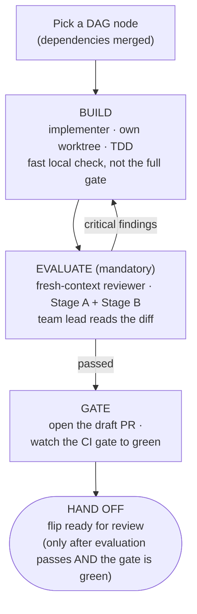

# Implementation orchestration strategy

How a coordinated multi-agent effort builds **Écluse** (package `ecluse`). This document owns the
_process_. The system design is in [`../docs/architecture.md`](../docs/architecture.md), the
development workflow and CI in [`../CONTRIBUTING.md`](../CONTRIBUTING.md), Haskell style in
[`../docs/style.md`](../docs/style.md), and the agent-facing essentials in
[`../AGENTS.md`](../AGENTS.md).

This document is the reference. The `orchestrate-implementation` skill is the procedure a team lead
runs. It carries the per-PR loop and the hand-off gate, and links back here for depth.

## Roles

- **Principal architect** (the repo owner) owns the design and the requirements and decides both.
  The architect reviews and merges every PR.
- **Team lead** (the coordinating agent) decomposes the finalised architecture into PR-sized work.
  It dispatches and supervises the implementation subagents and evaluates their output. It runs a
  fast local check and hands review-ready PRs to the architect. The team lead never merges, and
  during implementation it never pushes to `main`: all code lands through PRs the architect reviews.

## Operating principle: escalate, don't guess

The single most important rule. An agent that is stuck, unsure, blocked, or facing an ambiguous,
missing, or contradictory spec stops and surfaces the problem. It does not invent a way past it. An
agent makes a _bounded_ attempt against the existing specs first, then escalates. It does not thrash
or paper over uncertainty. An implementation agent must never:

- fabricate a config key, path, value, or **API behaviour** (verify it with `hoogle` or the docs, or
  escalate)
- silently weaken, skip, or `xfail` a test to reach green
- add a `.semgrepignore` entry or a `nosemgrep` comment (those always need the architect's approval)
- sprawl beyond the slice's file scope to route around a blocker, instead of staying in scope or
  justifying the exception
- leave a `TODO`, `undefined`, or stub and call the work done

A leftover stub or a quietly-relaxed test is a blocker, not a delivery. It is how guessing hides, so
the team lead scans for exactly that in review. Surface a concern, a limitation, or a risk as
warranted. A hard block is not the only trigger.

## Phase 0: architecture to delivery plan

Done once, after the architect freezes the design. The team lead turns it into a
**dependency-ordered DAG of PR-sized slices**, recorded in the issue tracker:

- **Walking skeleton first:** build the thinnest end-to-end path, then layer capabilities onto it.
- **Handles before consumers:** define the Handle-pattern records (`MetadataClient`, `MirrorQueue`,
  `CredentialProvider`) as interfaces early, so downstream slices build against them in parallel.
- **Slice size:** each slice is one coherent capability a reviewer can read in a sitting. It carries
  acceptance criteria traced to specific architecture sections, the test tiers it owes, a limited
  file scope, and its dependencies.

The architect signs off on this breakdown before anyone writes code.

## Convergence slices: contract before construction

The DAG encodes the ordering (`depends-on`), not the shape of what crosses each edge. Where several
producer slices converge on one consumer (the packument pipeline, launch composition), specify the
consumer's interface first: the types that cross the boundary. The producers then build to a known
contract, so the consumer does not reverse-engineer whatever they emit. That interface is a
deliverable of this planning pass, not a discovery of the build pass. Skipping it is how the
packument pipeline's typed-decision-vs-served-`Value` contract surfaced late (see [Registry model:
decision vs served surface](../docs/architecture/registry-model.md#decision-surface-vs-served-surface)).

## The per-PR loop


```mermaid
flowchart TD
    P["Pick a DAG node<br/>(dependencies merged)"] --> B["BUILD<br/>implementer · own worktree · TDD<br/>fast local check, not the full gate"]
    B --> E["EVALUATE (mandatory)<br/>fresh-context reviewer · Stage A + Stage B<br/>team lead reads the diff"]
    E -->|critical findings| B
    E -->|passed| G["GATE<br/>open the draft PR ·<br/>watch the CI gate to green"]
    G --> H(["HAND OFF<br/>flip ready for review<br/>(only after evaluation passes AND the gate is green)"])
```

> **Two gates, not one**. A PR flips ready for review only when both hold. The independent
> [Stage A + Stage B evaluation](#evaluation-two-independent-passes) passed with no open critical
> findings, and the CI `gate` is green. A green gate is necessary but not sufficient. It verifies
> build and test. It does not judge requirements, quality, or security, which the evaluation covers.
> Neither substitutes for the other. A green gate never flips a PR ready on its own.

**Draft until ready**. A PR opens as a draft. It stays one until both gates hold and the team lead
is confident handing it over. Marking it ready for review is the hand-off signal: ready for the
architect to review and possibly merge, nothing less. Before the flip, the team lead checks that the
gate ran on the reviewer's head commit. The team lead also checks that every context the ruleset
requires passes. Only then does the team lead flip the PR with `gh pr ready` and report it to the
architect. Never report a draft as done. A PR stays a draft while it is still building, mid-review,
evaluation-blocked, or gate-red, or while the team lead is unsure of it. The architect then never
spends attention on, or merges, work nobody deliberately offered. This is the one definition of
ready-for-review, and later sections reference it.

**Fix routing**. A reviewer's "changes required" routes one of three ways. Resume a background
implementer agent (`SendMessage` to its agent ID) with its full build context intact. That is the
natural first choice for a fix that continues what it just built. Or the team lead applies a small,
reviewer-specified fix directly, then re-runs the gate. Or, for a larger rework, it briefs a fresh
build agent with the review. Either way the fix lands as a distinct, separately-reviewable commit.

## Subagents and isolation

- **Implementer:** builds one slice. General-purpose agent, full tools.
- **Reviewer:** evaluates a slice with **fresh context** (no exposure to the implementer's
  reasoning), read-and-verify only.

**One git worktree per agent**, each on its own branch, is a hard rule. It keeps parallel slices
from colliding on a shared tree and contains each agent's blast radius. A mechanical reason backs it
too. HLS keys its `hiedb` by workspace path, so agents that share one checkout contend on a single
database and stall each other. The local-verification mode caps concurrency at 2-3 slices in flight,
so evaluation quality holds. The [CI-verified batch
mode](#ci-verified-batches-the-wide-parallel-mode) runs wider, bounded by disjoint file ownership
rather than by local compute. After every merge, the team lead rebases the dependent worktrees onto
the new base and re-runs their gate, so integration drift surfaces at once. A slice that cannot be
split becomes a stacked PR. Otherwise slices stay small and independent.

**Match the worktree flavour to the verification mode**. A CI-verified batch agent navigates by
grep and never builds locally. It uses a plain `git worktree add <path> -b <branch> origin/main`:
nothing warms, and a bare `git worktree remove` retires it. An agent that will use HLS or run local
tiers wants a warm worktree. Create it with `task new-worktree BRANCH=<branch>`, which adds the
worktree and starts a background `task build`. HLS then finds the interface files it reuses already
on disk when the agent arrives. Stagger the creations so parallel cold typechecks don't thrash the
CPU, and re-run `task build` after a post-merge rebase. Retire a warmed worktree with `task
rm-worktree BRANCH=<branch>`. Its HLS index is roughly 1 GB, and cabal keeps that index outside the
checkout under the hie-bios cache. A bare `git worktree remove` strands the gigabyte, and a few
dozen retired slices eat the disk that live worktrees need. `rm-worktree` removes both halves and
keeps the branch. `task worktree-clean` sweeps up caches stranded by hand-removed worktrees.

**A brief is not a summary**. Carry the architect's full acceptance criteria into it. An implementer
never sees the alignment conversation that shaped a slice, so the brief is its only window into it.
Back-and-forth settles some requirements: a type's exact fields, an edge case's disposition, a value
preserved verbatim, the _why_ behind a constraint. The brief transcribes all of that in its final
agreed form. A paraphrase drops the nuance. A too-terse brief narrows the target without anyone
deciding to. The implementer then guesses past the gap, the failure _escalate, don't guess_ exists
to prevent. Or it surfaces the gap late and costs a round-trip. So after the architect does the
alignment work, over-specify. The design-checkpoint is a backstop for a genuine fork, not licence
for a thin brief. In it the implementer proposes its design and the team lead confirms before deep
work.

**Pin the model**. There is no effort dial. Left unset, the Agent tool's `model` argument takes the
general-purpose agent's default. That default may be lighter than the team lead's own model. The
tool exposes no thinking-effort parameter, so `model` is the only capability lever. A lighter
default heads straight to implementation and skips the exploration a slice needs. For
design-bearing or security-sensitive work (a shared type, the credential-discipline serve path, a
parse-don't-validate boundary), pin `model` to the strongest available. Reserve the default for a
mechanical slice.

**Have agents bootstrap their tools, the LSP MCP especially**. The HLS-over-MCP navigation tools
(`start_lsp`, `go_to_definition`, `find_references`, and friends, from `agent-lsp`) are _deferred_.
An agent must load them before it can call them, and a less exploratory agent skips that step and
falls back to `grep`. Direct the agent to call `start_lsp` first, with `root_dir` set to its
worktree root. Without `root_dir`, agent-lsp drops to single-file mode and HLS reports "Could not
find module ...", because a worktree's `.git` is a file. The agent then uses find-references for
blast radius, go-to-definition across re-exports, and type-at-point to confirm a signature. All
three are more precise than `grep` over this codebase's qualified imports. Confirm that the agent's
environment provides the MCP. An instruction to use a tool the agent cannot reach is decoration.

**Invoke the toolchain through the current flake, never the ambient shell** (the `env -u
IN_NIX_SHELL` form in [AGENTS.md → Build and tooling](../AGENTS.md#build-and-tooling)). A
long-lived session's `nix develop` shell goes stale when a flake upgrade merges mid-session.

## Evaluation: two independent passes

Independent evaluation is mandatory for every PR before it flips ready. A fresh-context reviewer
runs both passes: no exposure to the implementer's reasoning, read-and-verify only (see [Subagents
and isolation](#subagents-and-isolation)). The implementer's own "it works" does not count. Evidence
does. A green CI gate does not stand in for this pass.

- **Stage A, requirements**. The slice meets every acceptance criterion, and a deterministic,
  gating test (unit or integration) backs each one. A non-gating smoke test detects drift but never
  stands in for a criterion (see [Testing strategy: what gates, and what
  doesn't](../docs/testing.md#what-gates-and-what-doesnt)). The slice drops nothing from its
  architecture scope. Changes stay within the slice's file scope, and touching another file needs
  strong justification. The _same_ PR updates the documentation (per
  [`../AGENTS.md`](../AGENTS.md)).
- **Stage B, quality and security**. Idiomatic Haskell per [`../docs/style.md`](../docs/style.md):
  total, `-Werror`-clean, and free of unsafe or partial functions. A security review appropriate to
  a supply-chain tool covers input parsing, deny-by-default invariants, and injection-free
  workflows. Test quality: the required properties are present, rules-engine deny-precedence for
  example. The assertions are not tautological, and the tests cover the foreseeable branches by
  intent. `codecov/patch` ≥ 85% is a CI backstop, not a number to chase. Comment appropriateness:
  Haddock documents the timeless contract and the _why_, never project, roadmap, or slice narration,
  per [`../docs/haddock.md`](../docs/haddock.md) §11.

A critical finding blocks. Route the fix per **Fix routing** above, then re-verify it.

## Inter-wave quality and alignment pass

Per-PR review judges each slice in isolation. It cannot see the whole that parallel slices compose
into. Slices built concurrently against the handles drift: divergent idioms, duplicated helpers,
inconsistent Haddock, type-conversion churn at the boundaries. None of that fails a single-slice
review. So a dedicated agent audits the integrated tree between waves, with fresh context and
read-and-verify only. It runs after every PR in a wave merges, before the team lead dispatches the
next wave. It looks for:

- **Structural improvements:** cross-slice duplication, misplaced or mis-sized modules, abstractions
  to share or split, leaky handles, and error/idiom patterns that diverged.
- **Haddock cleanup:** gaps, drift, docs/haddock.md §11 violations (roadmap or slice narration that
  crept in), inconsistent voice or cross-references.
- **Performance problems likely to surface:** needless type conversions (the
  `String`/`Text`/`ByteString` bounce), avoidable re-parsing or re-allocation, lazy/strict
  mismatches, and accidentally-quadratic patterns. Catch them before later slices build on them.
  Once the benchmark harness exists, measure this against the informational trend, which never
  gates, instead of eyeballing it.
- **Spec and doc reconciliation:** for each merged slice, reconcile the as-built code against its
  slice file and its architecture document(s). Fold the learnings, discoveries, and deviations back
  into the tracker and the architecture doc, so the design of record matches what shipped. A
  material design change escalates to the architect, because it may reshape a later slice. Never
  rewrite one silently.

The team lead triages the report. Safe, in-scope, behaviour-preserving fixes (rename, dedupe,
Haddock, a localised conversion, doc reconciliation) land together as one reviewed, gated
`refactor`/`docs` PR through the same loop. A design-level or far-reaching finding escalates to the
architect as a new slice or issue.

The pass also does housekeeping. Prune the spent worktrees and merged branches so
`git worktree list` stays an accurate map. Surface a worktree that carries uncommitted or unmerged
work to the architect, and never force-remove one. The pass also closes out the tracker. A
squash-merge can drop a `Closes #N` keyword. As each PR lands, confirm that its issue closed, and
close it by hand if the keyword did not fire. As a backstop, scan the open issues against the wave's
merged PRs and close any whose fix shipped, with a `Resolved by #PR` note. An issue left open for a
real reason (partly addressed, or a follow-on tracked separately) keeps a note on what remains. The
pass gates the next wave: make the integrated base coherent first, and record that in the milestone
sequence.

## Verification: fast local, CI gates build and test

CI is the gate for build and test verification. Local verification is for fast feedback, not a
pre-push ceremony. The `gate` is necessary but not sufficient for hand-off. It proves that the code
builds and the tests pass. It does not prove that the slice meets its requirements or clears quality
and security review. That judgement is the independent [Stage A + Stage B
evaluation](#evaluation-two-independent-passes), a separate required step. A green gate never flips
a PR ready on its own. The evaluation must also pass with no open critical findings. Neither
substitutes for the other.

Every CI job just calls `task`, and CI runs the tiers in parallel. Running the slow parallel tiers
(Docker integration, `nix-check`, Haddock) one after another on one contended host wastes work.
Reproducing the whole gate before you push runs it twice.

For single-slice work on an otherwise-idle host, the fast floor is the whole local obligation before
pushing:

```bash
task check
```

`task check` runs build, unit tests, doctest, fourmolu/hlint, Semgrep, `cabal check`, workflow-lint,
and dead-code (`weeder`) plus Haskell static analysis (`stan`). The hard stops within it are Semgrep
clean (zero findings, no new ignores without the architect's approval) and a clean weeder/stan
floor. Then push early, let CI parallelise the Docker and Haddock tiers, and watch the real run to
green (`gh pr checks --watch`). Root-cause a red gate. Do not patch over it.

### CI-verified batches: the wide parallel mode

When several implementation agents run in parallel on one host, the fast floor does not scale. Each
agent's `task check` contends for the cores every sibling needs. In this mode the floor shrinks to
formatting, and the PR's CI run is the whole verification loop:

- The one build-adjacent local command is `env -u IN_NIX_SHELL nix develop --command task format`,
  run as the last edit before every commit (CI gates on format-check).
- No local `task check`, builds, test tiers, Docker, or HLS. Agents navigate by grep and read, in a
  plain worktree (see [Subagents and isolation](#subagents-and-isolation)).
- Verification is watching the PR: `gh pr checks <pr> --watch`. On a red, run
  `gh run view <run-id> --log-failed`, fix, format, commit, push, and re-watch. An agent supersedes
  only its own branch's runs.
- The invariant that makes the width safe: disjoint file sets per batch, one owner per file across
  every open PR. An issue whose files collide with an in-flight branch waits for that merge and
  starts from the new base.
- The lead reviews each green draft, then flips it ready.

This is the default for batch work. The fast floor above serves single-slice work on an idle host.

Reproduce a tier locally only to debug a red. Map the red CI job to its `task` target and run
that one target, never the whole gate. The canonical tier and gate semantics live in
[`../docs/testing.md`](../docs/testing.md). The gating jobs are the `needs` of the terminal `gate`
job in [`../.github/workflows/ci.yml`](../.github/workflows/ci.yml), and they map:

| Gating CI job | Local command |
| --- | --- |
| `build-test` (build, unit, integration) | `task check` (build + unit); `task test-integration` (Docker integration) |
| `static-checks` (format, lint, Semgrep, workflows, site) | included in `task check` |
| `docs` (Haddock) | `task docs-check` |
| `e2e` (whole-system, real npm) | `task test-e2e` |
| `weeder` (dead code) | `task weeder` (also in `task check`) |
| `stan` (static analysis) | `task stan` (also in `task check`) |
| `gate` | green exactly when every job above passes |
| `smoke` (live registries) | `task test-smoke`, **non-gating, never blocks** |

`task nix-check` is worth a _proactive_ local run after you touch the flake or add a module. It
catches `-Werror` warnings and the _flakes only see git-tracked files_ trap. A new module needs
`git add` and a `.cabal` entry before `nix-check` sees it. A plain `task build` misses that failure.

Coverage takes the same posture. `codecov/patch` is a CI backstop: ≥ 85% on changed lines. Write the
behaviour tests you would write anyway, and let it flag a genuine gap. Do not pre-run
`task coverage` to colour a number up. Coverage comes only from the unit ∪ integration tiers.
The E2E and Smoke suites surface none: no HPC, no Codecov flag. So a changed line that
`codecov/patch` flags wants a unit or integration test, not the assumption that an e2e run covers
it. See [Testing strategy: coverage](../docs/testing.md#coverage-codecov-gating).

**Scale verification to the change**. Light by default. Reserve heavier local reproduction and
exhaustive case-enumeration for the risky surfaces: the parsers and identifier canonicalisation, the
credential path, deny-by-default rule precedence, and egress/SSRF. On those surfaces a regression is
costly, and a fast unit pass under-covers the threat. A small refactor must not cost an hour of
ceremony.

## Definition of done

A PR reaches the architect only when **all** hold:

- [ ] Every acceptance criterion met, each with passing deterministic, gating (unit/integration)
      test evidence. A non-gating smoke test never stands in for a criterion.
- [ ] Independent Stage A + Stage B evaluation, by a fresh-context reviewer, passed with no open
      critical findings. Mandatory for every PR. A green CI `gate` does not substitute.
- [ ] Local verification passed before pushing: `task check` for single-slice work, `task format`
      plus a green CI run for batch work.
- [ ] Foreseeable branches tested by intent. `codecov/project` is a context the ruleset requires,
      so it must be green. `codecov/patch` (≥ 85% on changed lines) prompts a unit or integration
      test. It is not a gate.
- [ ] Comments are contract-and-why only, no roadmap/slice/PR references (docs/haddock.md §11).
- [ ] Semgrep clean (no new ignores).
- [ ] Any workflow change stays injection-free with SHA-pinned actions.
- [ ] CI `gate` (and every job it needs) green on the PR.
- [ ] Docs updated in the same PR. Changes limited to the slice's file scope (another file only with
      strong justification).
- [ ] The slice-completing PR names the issue it resolves (`Closes #N`). It folds the as-built delta
      (design decisions, discoveries, deviations from the acceptance criteria) into the same PR. An
      issue left open after its PR merged is a hand-off defect, caught at GATE.
- [ ] Commits GPG-signed and DCO `Signed-off-by` (`git commit -s`), Conventional Commits, AI help
      disclosed with `Assisted-by:`. The
      [`open-pull-request`](skills/open-pull-request/SKILL.md) skill is the recipe.
- [ ] PR taken out of draft and marked **ready for review**, the hand-off itself, done only once
      every box above holds.

## Escalation

The team lead is a filter, not a megaphone: the architect should not see noise but must see every
real fork.

**Handled silently by the team lead:** an idiomatic choice among equivalent options, formatting,
lint, build wiring, or test plumbing. Also a flaky-CI rerun, a worktree or rebase conflict, and
anything the existing specs answer.

**Escalated to the architect:**

- an ambiguous, missing, or contradictory spec or requirement
- a requirement that proves infeasible, or materially costlier or riskier than it looked
- a security or correctness trade-off with no clear right answer
- a design assumption that turns out false, or a scope question ("is X in this slice?")
- an external blocker: a missing secret or credential, or an upstream API that behaves unlike the
  spec
- an agent genuinely stuck after its bounded attempt

Escalations arrive decision-ready, and carry:

- the decision needed, in one sentence, phrased as a question
- the context, and what you tried
- 2-3 options, with a recommendation marked
- the blast radius (this PR only, or blocking dependents) and the urgency

## Guardrails (always on)

The [per-PR loop](#the-per-pr-loop) and [Definition of done](#definition-of-done) carry the per-PR
checklist. These are the standing rules it does not capture:

- Implementation work lands through PRs only. The team lead never merges and never pushes to
  `main`.
- Regenerate a generated artifact with its tooling (version-ordering fixtures through
  `task gen-version-fixtures`, for example). Never hand-edit one.
- **Cross-cutting invariants live in one helper**. More than one slice can enforce the same
  invariant. Two examples: `latest` resolution in the npm filter and in the packument merge, and
  lossless `Value` passthrough across filter, merge, and serve. Extract that invariant into a single
  shared helper the slices call. Duplicated invariant logic drifts, and someone fixes it N times.
- **Surface decisions one at a time, paced by a task list**. When several design questions are open
  at once, the team lead does not front-load them all in one message. The series goes on a task list
  first, one entry per question. Use the harness task list where available, otherwise a short-lived
  `design-queue.md` under `.agents/`. Create that file when decisions accumulate, and remove it once
  the questions drain into `docs/` and issues. Bring one question at a time, each leading with a
  recommendation. Resolve and record it before you ask the next. This complements
  _escalate, don't guess_: surface proactively, but in series.
- **Reference work by identifiers the architect can see**. Name a piece of work by its PR or issue
  number (`#168`), or by a short descriptive title. Never use an internal task-tracker ID the
  architect's view does not render.
- **The Handle pattern is the canonical name for the records-of-functions abstraction**.
  `MetadataClient`, `MirrorQueue`, and `CredentialProvider` are the Handle pattern. Say "the Handle
  pattern" for the abstraction and "integration boundary" / "interface contract" / "abstraction
  boundary" for where components meet.

## What lives under `.agents/`

Everything agent-facing: this strategy, the context-management guide, the compaction prompt, and
the skills. When design questions accumulate, a short-lived `design-queue.md`
holding area joins them. Work it one question at a time, drain it into `docs/` and issues, and
remove it once it is empty. Design lives in `docs/`. Process lives here.
