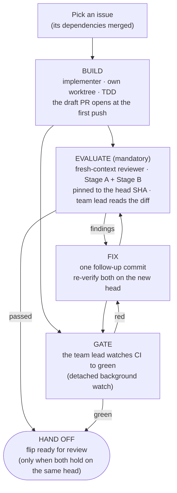

# Implementation orchestration strategy

How a coordinated multi-agent effort builds **Écluse** (package `ecluse`). This document owns the
_process_. The system design is in [`../docs/architecture.md`](../docs/architecture.md), the
development workflow and CI in [`../CONTRIBUTING.md`](../CONTRIBUTING.md), Haskell style in
[`../docs/style.md`](../docs/style.md), and the agent-facing essentials in
[`../AGENTS.md`](../AGENTS.md).

This document is the reference and the procedure both. The sections below carry what a team lead
runs: the per-PR loop, verification, evaluation, the hand-off gate, and the guardrails.

## Roles

- **Principal architect** (the repo owner) owns the design and the requirements and decides both.
  The architect reviews and merges every PR.
- **Team lead** (the coordinating agent) decomposes the finalised architecture into PR-sized work.
  It dispatches and supervises the implementation subagents and evaluates their output. It watches
  CI to green and hands review-ready PRs to the architect. The team lead never merges, and
  during implementation it never pushes to `main`: all code lands through PRs the architect reviews.

## Operating principle: escalate, don't guess

The single most important rule. An agent that is stuck, unsure, blocked, or facing an ambiguous,
missing, or contradictory spec stops and surfaces the problem. It does not invent a way past it. An
agent makes a _bounded_ attempt against the existing specs first, then escalates. It does not thrash
or paper over uncertainty. An implementation agent must never:

- fabricate a config key, path, value, or **API behaviour** (verify it with `hoogle` or the docs, or
  escalate)
- silently weaken, skip, or `xfail` a test to reach green
- add a `.semgrepignore` entry or a `nosemgrep` comment (those always need the architect's approval)
- sprawl beyond the issue's file scope to route around a blocker, instead of staying in scope or
  justifying the exception
- leave a `TODO`, `undefined`, or stub and call the work done

A leftover stub or a quietly-relaxed test is a blocker, not a delivery. It is how guessing hides, so
the team lead scans for exactly that in review. Surface a concern, a limitation, or a risk as
warranted. A hard block is not the only trigger.

## How work is described

Écluse uses a normal GitHub workflow. An issue describes a problem, and a pull request ships the
work that remedies it.

- An issue's state, open or closed, is the status of its work.
- A milestone groups issues.
- A `Depends on #N` line in an issue's body orders the work.

## Phase 0: architecture to delivery plan

Done once for each design, after the architect freezes it. The team lead turns the design into
**issues, each sized for one PR and ordered by its dependencies**:

- **Walking skeleton first:** build the thinnest end-to-end path, then layer capabilities onto it.
- **Handles before consumers:** define the Handle-pattern records (`MetadataClient`, `MirrorQueue`,
  `CredentialProvider`) as interfaces early, so the work downstream builds against them in
  parallel.
- **Issue size:** each issue covers one coherent capability, and a reviewer can read its PR in a
  sitting. It carries acceptance criteria traced to specific architecture sections, the test tiers
  it owes, a limited file scope, and its dependencies.

The architect signs off on this breakdown before anyone writes code.

## Convergence points: contract before construction

The `Depends on #N` lines encode the ordering, not the shape of what crosses each edge. Where
several producers converge on one consumer (the packument pipeline, launch composition), specify the
consumer's interface first: the types that cross the boundary. The producers then build to a known
contract, so the consumer does not reverse-engineer whatever they emit. That interface is a
deliverable of this planning pass, not a discovery of the build pass. Skipping it is how the
packument pipeline's typed-decision-vs-served-`Value` contract surfaced late (see [Registry model:
decision vs served surface](../docs/architecture/registry-model.md#decision-surface-vs-served-surface)).

## The per-PR loop


```mermaid
flowchart TD
    P["Pick an issue<br/>(its dependencies merged)"] --> B["BUILD<br/>implementer · own worktree · TDD<br/>the draft PR opens at the first push"]
    B --> E["EVALUATE (mandatory)<br/>fresh-context reviewer · Stage A + Stage B<br/>pinned to the head SHA · team lead reads the diff"]
    B --> G["GATE<br/>the team lead watches CI to green<br/>(detached background watch)"]
    E -->|findings| F["FIX<br/>one follow-up commit<br/>re-verify both on the new head"]
    G -->|red| F
    F --> E
    F --> G
    E -->|passed| H(["HAND OFF<br/>flip ready for review<br/>(only when both hold on the same head)"])
    G -->|green| H
```

> **Two gates, not one**. A PR flips ready for review only when both hold. The independent
> [Stage A + Stage B evaluation](#evaluation-two-independent-passes) passed with no open critical
> findings, and the CI `gate` is green. A green gate is necessary but not sufficient. It verifies
> build and test. It does not judge requirements, quality, or security, which the evaluation covers.
> Neither substitutes for the other. A green gate never flips a PR ready on its own.

**Evaluate beside the gate, not after it**. The implementer opens the draft PR at its first push,
reports the PR number and the head SHA at once, and exits. It does not idle in a watch loop
([watch ownership](#verification-fast-local-ci-gates-build-and-test)). The team lead dispatches
the reviewer at that moment, pinned to that head, while CI runs. Findings from the review and reds from CI land as one follow-up commit,
and both re-verify on the new head. A review that starts only after a green gate costs a second
full CI cycle on every PR with a finding.

**Draft until ready**. A PR opens as a draft. It stays one until both gates hold and the team lead
is confident handing it over. Marking it ready for review is the hand-off signal: ready for the
architect to review and possibly merge, nothing less. Before the flip, the team lead checks that the
gate ran on the reviewer's head commit. The team lead also checks the contexts the ruleset
requires, per [Gating jobs and required contexts](#gating-jobs-and-required-contexts). Only then
does the team lead flip the PR with `gh pr ready` and report it to the architect. Never report a
draft as done. A PR stays a draft while it is still building, mid-review, evaluation-blocked, or
gate-red, or while the team lead is unsure of it. The architect then never spends attention on, or
merges, work nobody deliberately offered. This is the one definition of ready-for-review, and later
sections reference it.

**Fix routing**. A reviewer's "changes required" routes one of three ways. Resume a background
implementer agent (`SendMessage` to its agent ID) with its full build context intact. That is the
natural first choice for a fix that continues what it just built. Or the team lead applies a small,
reviewer-specified fix directly, then re-runs the gate. Or, for a larger rework, it briefs a fresh
build agent with the review. Either way the fix lands as a distinct, separately-reviewable commit.

**One issue, one live delivery**. Before dispatch, query open PRs, branches, and worktrees for the
issue.

- Keep a parallel fresh attempt local unless the architect explicitly asks for competing PRs.
- Do not push the attempt or open its PR.
- For a replacement, close the old PR and stop its watch first.
- Retire the old worktree before opening the replacement.
- After an overlapping merge, rebase the remaining branch and remove every duplicate hunk.
- Run its review and CI again.

## Subagents and isolation

- **Implementer:** builds the work for one issue. General-purpose agent, full tools.
- **Reviewer:** evaluates one PR with **fresh context** (no exposure to the implementer's
  reasoning), read-and-verify only.

**One git worktree per agent**, each on its own branch, is a hard rule. It keeps parallel work
from colliding on a shared tree and contains each agent's blast radius. A mechanical reason backs it
too. HLS keys its `hiedb` by workspace path, so agents that share one checkout contend on a single
database and stall each other. The local-verification mode caps concurrency at 2-3 PRs in flight,
so evaluation quality holds. The [CI-verified batch
mode](#ci-verified-batches-the-wide-parallel-mode) runs wider, bounded by disjoint file ownership
rather than by local compute. After every merge, the team lead rebases the dependent worktrees onto
the new base and re-runs their gate, so integration drift surfaces at once. Work that cannot be
split becomes a stacked PR. Otherwise PRs stay small and independent.

**Match the worktree flavour to the verification mode**. A CI-verified batch agent navigates by
grep and leaves the build to CI. It uses a plain `git worktree add <path> -b <branch> origin/main`:
nothing warms, and a bare `git worktree remove` retires it. An agent that will use HLS or run local
tiers wants a warm worktree. Create it with `task new-worktree BRANCH=<branch>`, which adds the
worktree and starts a background `task build`. HLS then finds the interface files it reuses already
on disk when the agent arrives. Stagger the creations so parallel cold typechecks don't thrash the
CPU, and re-run `task build` after a post-merge rebase. Retire a warmed worktree with `task
rm-worktree BRANCH=<branch>`. Its HLS index is roughly 1 GB, and cabal keeps that index outside the
checkout under the hie-bios cache. A bare `git worktree remove` strands the gigabyte, and a few
dozen retired worktrees eat the disk that live worktrees need. `rm-worktree` removes both halves and
keeps the branch. `task worktree-clean` sweeps up caches stranded by hand-removed worktrees.

**A brief is not a summary**. Carry the architect's full acceptance criteria into it. An implementer
never sees the alignment conversation that shaped an issue, so the brief is its only window into it.
Back-and-forth settles some requirements: a type's exact fields, an edge case's disposition, a value
preserved verbatim, the _why_ behind a constraint. The brief transcribes all of that in its final
agreed form. A paraphrase drops the nuance. A too-terse brief narrows the target without anyone
deciding to. The implementer then guesses past the gap, the failure _escalate, don't guess_ exists
to prevent. Or it surfaces the gap late and costs a round-trip. So after the architect does the
alignment work, over-specify. The design-checkpoint is a backstop for a genuine fork, not licence
for a thin brief. In it the implementer proposes its design and the team lead confirms before deep
work. Every brief also carries the comment budget as a numbered acceptance criterion: a function
comment is one or two lines, a new module header is at most eight, and the implementer reports
each comment block the diff adds, with its line count, in its report to the team lead
([`../docs/haddock.md`](../docs/haddock.md) §3 and §5). The brief also restates the owner's
boy-scout rule: a file the PR edits leaves with its existing comments at the cap, trimmed in
the same change, scoped to that file and behaviour-preserving. That rule lives in the owner's own
harness-level instruction file, outside this repository, so an implementer reads it only when the
brief carries it. The same holds for every other convention that file owns, the banned-term list
and the punctuation rule among them. Transcribe them. Never assume them. The commit message names
the trims and carries any justification for a block left over cap. The PR body carries none of
this: it is the goal, the motivation, and the consequence, per
[CONTRIBUTING, Pull requests](../CONTRIBUTING.md#pull-requests). Without the boy-scout sentence
an implementer reads "stay in scope" as "touch nothing beside your hunk" and leaves the comment
wall standing.

**Pin the model**. There is no effort dial. Left unset, the Agent tool's `model` argument takes the
general-purpose agent's default. That default may be lighter than the team lead's own model. The
tool exposes no thinking-effort parameter, so `model` is the only capability lever. A lighter
default heads straight to implementation and skips the exploration the work needs. For
design-bearing or security-sensitive work (a shared type, the credential-discipline serve path, a
parse-don't-validate boundary), pin `model` to the strongest available. Reserve the default for a
mechanical change.

**Have agents bootstrap their tools, the LSP MCP especially**. The HLS-over-MCP navigation tools
(`start_lsp`, `go_to_definition`, `find_references`, and friends, from `agent-lsp`) are _deferred_.
An agent must load them before it can call them, and a less exploratory agent skips that step and
falls back to `grep`. Direct the agent to call `start_lsp` first, with `root_dir` set to its
worktree root. Without `root_dir`, agent-lsp drops to single-file mode and HLS reports "Could not
find module ...", because a worktree's `.git` is a file. The agent then uses find-references for
blast radius, go-to-definition across re-exports, and type-at-point to confirm a signature. All
three are more precise than `grep` over this codebase's qualified imports. Confirm that the agent's
environment provides the MCP. An instruction to use a tool the agent cannot reach is decoration.

**Invoke the toolchain through the current flake, never the ambient shell** (the `env -u
IN_NIX_SHELL` form in [AGENTS.md, Build and tooling](../AGENTS.md#build-and-tooling)). A
long-lived session's `nix develop` shell goes stale when a flake upgrade merges mid-session.

## Evaluation: two independent passes

Independent evaluation is mandatory for every PR before it flips ready. A fresh-context reviewer
runs both passes: no exposure to the implementer's reasoning, read-and-verify only (see [Subagents
and isolation](#subagents-and-isolation)). The implementer's own "it works" does not count. Evidence
does. A green CI gate does not stand in for this pass.

- **Stage A, requirements**. The PR meets every acceptance criterion of its issue, and a
  deterministic, gating test (unit or integration) backs each one. A non-gating smoke test detects
  drift but never stands in for a criterion (see [Testing strategy: what gates, and what
  doesn't](../docs/testing.md#what-gates-and-what-doesnt)). The PR drops nothing from the issue's
  architecture scope. Changes stay within the issue's file scope, and touching another file needs
  strong justification. A comment trim inside a file the PR already edits is within scope. The
  _same_ PR updates the documentation (per
  [`../AGENTS.md`](../AGENTS.md)).
- **Stage B, quality and security**. Idiomatic Haskell per [`../docs/style.md`](../docs/style.md):
  total, `-Werror`-clean, and free of unsafe or partial functions. A security review appropriate to
  a supply-chain tool covers input parsing, deny-by-default invariants, and injection-free
  workflows. Test quality: the required properties are present, rules-engine deny-precedence for
  example. The assertions are not tautological, and the tests cover the foreseeable branches by
  intent. `codecov/patch` ≥ 85% is a CI backstop, not a number to chase. Comment appropriateness:
  Haddock documents the timeless contract and the _why_, never project, roadmap, or issue narration,
  per [`../docs/haddock.md`](../docs/haddock.md) §11. Comment length is counted, not eyeballed:
  the reviewer lists every comment block the diff adds, and a function comment over two lines or a
  new header over eight (§3, §5) is a finding that blocks. The reviewer also lists every
  pre-existing block over the cap in each file the PR edits, and an untrimmed one is a finding
  unless the commit message that touched the file says why it stayed.

A critical finding blocks. Route the fix per **Fix routing** above, then re-verify it.

## Inter-wave quality and alignment pass

Per-PR review judges each PR in isolation. It cannot see the whole that parallel PRs compose
into. PRs built concurrently against the handles drift: divergent idioms, duplicated helpers,
inconsistent Haddock, type-conversion churn at the boundaries. None of that fails the review of one
PR. So a dedicated agent audits the integrated tree between waves, with fresh context and
read-and-verify only. It runs on a cadence, after every few merges, while file-disjoint dispatches
continue. It looks for:

- **Structural improvements:** duplication across PRs, misplaced or mis-sized modules, abstractions
  to share or split, leaky handles, and error/idiom patterns that diverged.
- **Haddock cleanup:** gaps, drift, docs/haddock.md §11 violations (roadmap or issue narration that
  crept in), inconsistent voice or cross-references.
- **Performance problems likely to surface:** needless type conversions (the
  `String`/`Text`/`ByteString` bounce), avoidable re-parsing or re-allocation, lazy/strict
  mismatches, and accidentally-quadratic patterns. Catch them before later work builds on them.
  Measure this against the informational benchmark trend, which never gates, instead of
  eyeballing it.
- **Spec and doc reconciliation:** for each merged PR, reconcile the as-built code against its
  issue and its architecture document(s). Fold the learnings, discoveries, and deviations back
  into the tracker and the architecture doc, so the design of record matches what shipped. A
  material design change escalates to the architect, because it may reshape a later issue. Never
  rewrite one silently.

The team lead triages the report. Safe, in-scope, behaviour-preserving fixes (rename, dedupe,
Haddock, a localised conversion, doc reconciliation) land together as one reviewed, gated
`refactor`/`docs` PR through the same loop. A design-level or far-reaching finding escalates to the
architect as a new issue.

The pass also does housekeeping. Prune the spent worktrees and merged branches so
`git worktree list` stays an accurate map. Surface a worktree that carries uncommitted or unmerged
work to the architect, and never force-remove one. The pass also closes out the tracker. GitHub's
issue auto-close is not configured on this repository, so a `Closes #N` keyword never closes
anything. It is a cross-reference only. As each PR lands, the team lead closes its issue by hand
with a `Resolved by #PR` note, and only after checking that the PR met that issue's acceptance
criteria. Never close an issue a PR merely cross-references. As a backstop, scan the open issues
against the wave's merged PRs and close any whose fix shipped. An issue left open for a real reason
(partly addressed, or a follow-on tracked separately) keeps a note on what remains. The pass
never holds a file-disjoint dispatch back. Record each pass in the milestone sequence.

## Verification: fast local, CI gates build and test

CI is the gate for build and test verification. An agent does not call its work ready until it is
verified, and a green CI run on its head is that verification. What an agent runs locally is its
own choice: local verification is for fast feedback, not a pre-push ceremony. The `gate` is
necessary but not sufficient for hand-off. It proves that the code builds and the tests pass. It
does not prove that the PR meets its issue's requirements or clears quality and security review.
That judgement is the independent [Stage A + Stage B
evaluation](#evaluation-two-independent-passes), a separate required step. A green gate never flips
a PR ready on its own. The evaluation must also pass with no open critical findings. Neither
substitutes for the other.

In every mode the team lead owns the CI watch. At each PR-open report it starts one detached
background watch per PR (`gh pr checks <pr> --watch` in a background shell). The watch returns
once, at the terminal state, and is the authoritative signal. A watch started at the report can
land before GitHub attaches check runs to the new head, and `gh pr checks --watch` then exits at
once with "no checks reported". Guard every start: poll plain `gh pr checks` until that message
clears (about 20 seconds between tries), then start the watch. Only the no-checks message retries.
A red exit is terminal. A foreground watch inside a subagent dies invisibly: the shell call times
out before a cold run finishes, an API drop kills the agent silently, and a host suspend kills
every watcher on the machine. An invisible death fails open.
After any gap (a host suspend, a session restart) the team lead sweeps `gh pr checks` across every
open PR and restarts the watches.

Every CI job just calls `task`, and CI runs the tiers in parallel. Running the slow parallel tiers
(Docker integration, `nix-check`, Haddock) one after another on one contended host wastes work.
Reproducing the whole gate before you push runs it twice.

For one agent on an otherwise-idle host, `task check` is the local pre-push run:

```bash
task check
```

It runs three tiers:

- `cabal-checks` runs `build`, `coverage`, `test-residency`, `doctest`, and `cabal-check`, in that
  order. `coverage` runs the three unit suites and the integration suite instrumented, so
  `task check` needs a running Docker daemon and starts the integration containers.
- `static-checks` runs beside it: format-check, the vendored-source check, hlint, Semgrep, the
  workflow, script, and SPDX lints, the script tests, and the site build over placeholder
  fragments.
- `analysis-checks` runs after both: dead-code (`weeder`) and Haskell static analysis (`stan`).

The hard stops within it are Semgrep clean (zero findings, no new ignores without the architect's
approval) and a clean weeder/stan floor. Push early and let CI run the tiers in parallel. The team
lead watches the run to green, per the
[watch ownership](#verification-fast-local-ci-gates-build-and-test) above. Root-cause a red gate.
Do not patch over it.

**Scale verification to the change**. Light by default. Reserve heavier local reproduction and
exhaustive case-enumeration for the risky surfaces: the parsers and identifier canonicalisation, the
credential path, deny-by-default rule precedence, and egress/SSRF. On those surfaces a regression is
costly, and a fast unit pass under-covers the threat. A small refactor must not cost an hour of
ceremony.

### CI-verified batches: the wide parallel mode

When several implementation agents run in parallel on one host, `task check` does not scale. The
host is shared: each agent's run contends for the cores and the memory every sibling needs.
Container tiers that run at once across worktrees contend too, and a hard-killed run leaves its
containers behind ([Tests and Docker](../docs/testing.md#tests-and-docker)). So the team lead sets
a limit on local runs for the wave. That limit belongs to the wave and its host. It is not a rule
of the project. The PR's CI run is the whole verification loop:

- The usual limit allows two commands before every commit: hlint on the changed Haskell files
  (`env -u IN_NIX_SHELL nix develop --command hlint <files>`), fixing what it reports, then
  `env -u IN_NIX_SHELL nix develop --command task format` as the last edit. CI gates on the hints
  and on format-check, and hlint needs no build.
- Under that limit an agent runs no `task check`, build, test tier, Docker container, or HLS on
  the shared host. It navigates by grep and read, in a plain worktree (see
  [Subagents and isolation](#subagents-and-isolation)).
- The team lead watches the PR's CI run
  ([watch ownership](#verification-fast-local-ci-gates-build-and-test)). The implementer reports
  at PR-open and exits, per [the per-PR loop](#the-per-pr-loop).
- On a red, the team lead resumes the implementer with the failing run's log
  (`gh run view <run-id> --log-failed`). The fix lands as a distinct commit, and the lead restarts
  the watch on the new head. An agent supersedes only its own branch's runs: a push cancels that
  branch's in-flight run, so run `gh run list --branch <branch>` before every push and push only
  when no run you still need is live. A terminal report
  from an implementer that stayed alive is a secondary signal, never the awaited one.
- The invariant that makes the width safe: disjoint hunks across every open PR. Two PRs may touch
  one file when their hunks do not overlap, and the later PR owns the rebase when the earlier one
  merges. An issue whose hunks collide with an in-flight branch waits for that merge and starts
  from the new base.
- The lead reviews each green draft, then flips it ready.

This is the default for batch work. `task check` above suits one agent on an idle host.

### Gating jobs and required contexts

To debug a red, map the red CI job to its `task` target and run that one target, not the whole
gate. The canonical tier and gate semantics live in [`../docs/testing.md`](../docs/testing.md). The
gating jobs are the `needs` of the terminal `gate` job in
[`../.github/workflows/ci.yml`](../.github/workflows/ci.yml), and they map:

| Gating CI job | Display name (`gh pr checks`) | Local command |
| --- | --- | --- |
| `changes` | Classify the change | none, it classifies the PR's changed paths |
| `build` | Build & compile checks (all targets, residency, doctest) | `task build test-residency doctest cabal-check` |
| `allocation` | Allocation budgets (committed captures) | `task perf-allocation` |
| `coverage` | Coverage (`<suite>`), one leg per suite | `task coverage-unit SUITE=<suite>`, or `task coverage-integration` (Docker) for the integration leg |
| `codecov-notify` | Codecov statuses | none, it only releases the Codecov statuses |
| `static-checks` | Static checks (format, lint, Semgrep, workflows, site) | `task static-checks` (also in `task check`) |
| `docs` | Haddock builds | `task nix-check`, which builds the same three flake checks |
| `e2e` | End-to-end tests (whole-system, real clients) | `task test-e2e` (Docker) |
| `weeder` | Dead-code check (weeder) | `task weeder` (also in `task check`) |
| `stan` | Haskell static analysis (stan) | `task stan` (also in `task check`) |
| `release-dry-run` | Release dry-run / Build image (`<arch>`), one leg per architecture | `task docker-build`, then `task sbom`, for the host's architecture |
| `release-dry-run-assemble` | Release dry-run (multi-arch index) | none, it needs the image archives of both architectures |
| `release-dry-run-boot` | Release dry-run (start `<arch>`), one leg per architecture | none, it starts each built image with `--version` |
| `gate` | CI gate | none, green when every job above passed or the change classifier skipped it |

Verify a PR's gate with `gh pr checks`, which prints the display names above. Do not trust
`gh run watch`'s exit code: it can exit 0 on a failed run.

The ruleset on `main` requires three contexts: `CI gate`, `codecov/project`, and `Semgrep OSS`.
Code scanning posts `Semgrep OSS` from the SARIF file the `static-checks` job uploads. The Codecov
statuses are a signal for the architect, so a pending or odd Codecov status does not hold a
hand-off. The `gate` job does need the `Codecov statuses` job: when the coverage legs pass and
that job fails to release the statuses, the gate is red.

`task nix-check` is worth a _proactive_ local run after you touch the flake or add a module. It
catches `-Werror` warnings and the _flakes only see git-tracked files_ trap. A new module needs
`git add` and a `.cabal` entry before `nix-check` sees it. A plain `task build` misses that failure.

`codecov/patch` is a CI backstop: ≥ 85% on changed lines. Write the behaviour tests you would write
anyway, and let it flag a genuine gap. Do not pre-run `task coverage` to colour a number up.
Coverage comes only from the unit ∪ integration tiers. The E2E and Smoke suites surface none: no
HPC, no Codecov flag. So a changed line that `codecov/patch` flags wants a unit or integration
test, not the assumption that an e2e run covers it. See
[Testing strategy: coverage](../docs/testing.md#coverage-codecov).

### Jobs that do not gate

Two jobs of the CI workflow are absent from the `needs` of the `gate` job:

| CI job | Display name (`gh pr checks`) | Runs on | Local command |
| --- | --- | --- | --- |
| `smoke` | Smoke tests (live registries, non-gating) | every run that is not documentation-only | `task test-smoke` |
| `grype` | Vulnerability scan (grype, report-only) | the nightly schedule and a manual dispatch | `task scan`, for the host's architecture |

Neither job gates a merge. An agent still gets both green on its PR, and hands off a red one only
with a very good reason, stated in the hand-off. A pull request shows `grype` as skipped. For a PR
that changes dependencies or the image, dispatch the CI workflow on the branch
(`gh workflow run ci.yml --ref <branch>`) so that `grype` runs, and read it before the hand-off.

## Definition of done

A PR reaches the architect only when **all** hold:

- [ ] Every acceptance criterion met, each with passing deterministic, gating (unit/integration)
      test evidence. A non-gating smoke test never stands in for a criterion.
- [ ] Independent Stage A + Stage B evaluation, by a fresh-context reviewer, passed with no open
      critical findings. Mandatory for every PR. A green CI `gate` does not substitute.
- [ ] Verified by a green CI run on the PR's head: CI `gate` and every job it needs. A local run
      does not stand in for it.
- [ ] A PR that touches npm serving or fetching (the serve path or the worker's back-fill) does
      not flip ready until the team lead reads both perf suites against main's latest artifacts:
      the PR's own Work-per-request benchmarks run, and a load run dispatched with
      `gh workflow run bench-load.yml --ref <branch>`. That dispatch runs at the default knobs, so
      at or below the latency ceiling it is held to the success floors
      ([`docs/testing.md`, Success floors](../docs/testing.md#success-floors)) and goes red below
      one. The floors are loose minimums, so the comparison with main stays a manual artifact
      read. Allocations per request are the signal. Normalise by successes when shedding
      dominates. Wall time is runner noise.
- [ ] Foreseeable branches tested by intent. `codecov/patch` (≥ 85% on changed lines) prompts a
      unit or integration test. It is not a gate.
      [Gating jobs and required contexts](#gating-jobs-and-required-contexts) says how to read
      `codecov/project`.
- [ ] Comments are contract-and-why only, no roadmap, issue, or PR references (docs/haddock.md
      §11), and within the length caps: a function comment one or two lines, a new header at most
      eight (§3, §5). Every file the PR edits leaves with its existing comments at the cap, or the
      commit message that touched the file says why not.
- [ ] Semgrep clean (no new ignores).
- [ ] Any workflow change stays injection-free with SHA-pinned actions.
- [ ] Docs updated in the same PR. Changes limited to the issue's file scope (another file only with
      strong justification).
- [ ] The PR that completes an issue names it (`Closes #N`). Its body is the goal, the motivation,
      and the consequence, with a deviation from the acceptance criteria stated in one sentence.
      The detail behind a deviation lives in the commit message that made it. The keyword does not
      close the issue here (auto-close is off), so the team lead closes it by hand after the
      merge, in the inter-wave pass.
- [ ] Commits GPG-signed and DCO `Signed-off-by` (`git commit -s`), Conventional Commits, AI help
      disclosed with `Assisted-by:`. The commands are in
      [CONTRIBUTING, DCO](../CONTRIBUTING.md#developer-certificate-of-origin-dco).
- [ ] PR taken out of draft and marked **ready for review**, the hand-off itself, done only once
      every box above holds.

## Escalation

The team lead is a filter, not a megaphone: the architect should not see noise but must see every
real fork.

**Handled silently by the team lead:** an idiomatic choice among equivalent options, formatting,
lint, build wiring, or test plumbing. Also a flaky-CI rerun, a worktree or rebase conflict, and
anything the existing specs answer.

**Escalated to the architect:**

- an ambiguous, missing, or contradictory spec or requirement
- a requirement that proves infeasible, or materially costlier or riskier than it looked
- a security or correctness trade-off with no clear right answer
- a design assumption that turns out false, or a scope question ("is X in this issue?")
- an external blocker: a missing secret or credential, or an upstream API that behaves unlike the
  spec
- an agent genuinely stuck after its bounded attempt

Escalations arrive decision-ready, and carry:

- the decision needed, in one sentence, phrased as a question
- the context, and what you tried
- 2-3 options, with a recommendation marked
- the blast radius (this PR only, or blocking dependents) and the urgency

## Guardrails (always on)

The [per-PR loop](#the-per-pr-loop) and [Definition of done](#definition-of-done) carry the per-PR
checklist. These are the standing rules it does not capture:

- Implementation work lands through PRs only. The team lead never merges and never pushes to
  `main`.
- Regenerate a generated artifact with its tooling (version-ordering fixtures through
  `task gen-version-fixtures`, for example). Never hand-edit one.
- **Cross-cutting invariants live in one helper**. More than one PR can enforce the same
  invariant. Two examples: `latest` resolution in the npm filter and in the packument merge, and
  lossless `Value` passthrough across filter, merge, and serve. Extract that invariant into a single
  shared helper that each of them calls. Duplicated invariant logic drifts, and someone fixes it N
  times.
- **Surface decisions one at a time, paced by a task list**. When several design questions are open
  at once, the team lead does not front-load them all in one message. The series goes on a task list
  first, one entry per question. Prefer the harness task list. When none is available, keep the
  queue in agent memory or under a gitignored scratch location. Never park it as an untracked file
  in the working tree, per [AGENTS.md, Workspace
  hygiene](../AGENTS.md#project-structure-and-code-conventions). Bring one question at a time, each
  leading with a recommendation. Resolve and record it before you ask the next. Record a ruling by
  amending its issue, so that the issue's body states the decision and carries no open question. A
  decision that is not yet made is its own issue under the `needs-decision` label. This complements
  _escalate, don't guess_: surface proactively, but in series.
- **Reference work by identifiers the architect can see**. Name a piece of work by its PR or issue
  number (`#168`), or by a short descriptive title. Never use an internal task-tracker ID the
  architect's view does not render.
- **The Handle pattern is the canonical name for the records-of-functions abstraction**.
  `MetadataClient`, `MirrorQueue`, and `CredentialProvider` are the Handle pattern. Say "the Handle
  pattern" for the abstraction and "integration boundary" / "interface contract" / "abstraction
  boundary" for where components meet.

## What lives under `.agents/`

The agent-facing process documents: this strategy, the context-management guide, and the
compaction prompt. Agent skills live outside the repository
([AGENTS.md, Skills](../AGENTS.md#skills)). Only tracked files live here: a decision queue or any
other temporary working file belongs in the harness task list, agent memory, or a gitignored
scratch location instead. Design lives in `docs/`. Process lives here.
