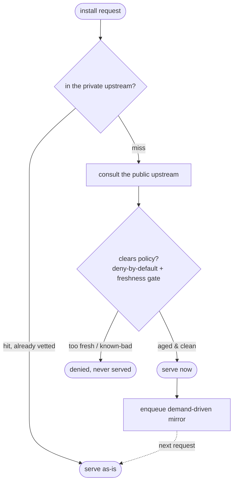

# Why Écluse?

Écluse is a supply-chain policy proxy: it holds fresh public packages behind a short
freshness quarantine, under a deny-by-default policy, at a single chokepoint that CI and
developers both pass through. This page is the reasoning behind that design. The *how* lives
in the [architecture docs](docs/architecture.md), and a fair guide to the other tools in
this space is in [`ALTERNATIVES.md`](ALTERNATIVES.md).

## The blast radius of a bad publish

A modern dependency graph is huge, and almost all of it is other people's code. That's
usually fine, right up until one popular package gets hijacked or maliciously republished.
At that point a single bad version can reach a vast number of builds before anyone even
knows there's a problem.

The threat has automated on both sides, and that's the part that changed for me. On the
attacker's side, self-propagating campaigns now harvest credentials from whatever machine
they land on and republish themselves through any token they find, which compresses
propagation from weeks down to hours. On the consuming side, automated and AI-assisted
development installs dependencies at machine speed, which removes the human "wait, that
doesn't look right" pause that used to catch some of this by accident.

The one property I keep coming back to is that the danger is time-bounded. A malicious
version is dangerous in the window between when it's published and when the ecosystem
notices and pulls it. Most get caught fast; the harm falls on whoever consumed them
*inside* that window.

## The bet: resilience, not detection

You can try to *detect* malicious packages: scan them, score them, analyse their
behaviour. That's a hard, never-certain target that keeps moving, and "we think it's
clean" just isn't the same as knowing.

So Écluse makes a narrower bet. Don't try to adjudicate whether a given version is
malicious; arrange for nothing to reach a build *inside its dangerous window*. The plainest
form of that is a **freshness quarantine**: a public version isn't eligible until it's been
visible long enough that, if it were malicious, it would very likely already have been
found and pulled. The whole premise rests on a real regularity in how these incidents go,
which is that compromised versions tend to get caught fast; analyses of past attacks put
most exploitation windows under a week. That's the posture the name describes, and it's
where the name comes from: *écluse* is French for a canal lock, a controlled passage every
dependency is held in and cleared through before it's let forward. The goal is resilience:
shrinking the blast radius of a bad publish, not detecting malware.

And the point of all of it is operational. When a malicious package gets disclosed, you
shouldn't have to convene a response, comb through logs, and trace egress to find out
whether you were exposed. If your quarantine window is longer than the package's lifetime
(the gap between when it was published and when it was pulled), then it was never served to
you. The question becomes arithmetic, not forensics: the incident you simply don't have
to run. That guarantee is exactly as strong as that one comparison, which is why everything
hinges on the next section.

## The bar: a chokepoint you can't step around

The audit-free property has a precondition: enforcement has to be total. It only holds
if nothing can fetch a package by some other route. That's a demanding bar, and it's the
bar that rules out most of the obvious answers.

The ecosystem does now offer freshness controls at the package-manager level (a
minimum-release-age setting, resolver flags that refuse versions newer than a given date),
and they're genuinely useful. But they're advisory and per-project. Even if you ship a
"secure" configuration, or a patched package manager, to every machine, it still doesn't
hold, because modern development deliberately routes *around* machine globals: version
managers, Nix shells, containers, and committed project-local config each bring their own
toolchain and ignore whatever you set globally. The one layer you can centrally configure
is exactly the layer that projects are built to override.

So enforcement has to live *below* the toolchain. The one place every install has to pass
through, whatever produced it, is the network. A single proxy that all package traffic
resolves through, with direct egress to the public registries closed off, can't be
side-stepped by a per-project toolchain: whatever `npm` or `pnpm` a project conjures up,
its fetches still cross the network, and the only thing answering there is the chokepoint.
That's what turns "please install safely" into "you can only install through here," for CI
runners and developer laptops alike. The enforcement side is an operator concern: see
[`USAGE.md` → Locking down CI egress](USAGE.md#locking-down-ci-egress-recommended). This
document is about why it matters.

## You can buy it, at a price

Granted a chokepoint with a freshness policy, can't you just buy one? Partly, yes, and I
want to be honest about that. The commercial repository-firewall and curation platforms do
exactly this, off the shelf: an age-based quarantine, enforced at the proxy. If that's what
you need and you can fund it, buying is a legitimate, working answer. The catch isn't
capability; it's cost and shape.

- The managed cloud registry you may already run gives you the chokepoint, the storage, and
  the authentication: everything except this. It has no notion of a freshness policy.
- Commercial repository-firewall and curation platforms *do* sell exactly this safeguard,
  and it works, but it tends to sit behind a platform's upper licensing tiers, readily into
  five figures a year, bundled inside a full artifact-hosting product. To add one capability
  you adopt, operate, and pay for a second registry, most of which duplicates the one you
  already run.
- Hosted inspection services avoid the migration but bill by usage, which scales the wrong
  way for an organisation running many CI jobs a day, and route your dependency requests, and
  your private-package metadata, through a third party.
- Cryptographic provenance is valuable and complementary, but it attests *where* a package
  was built, not *whether* it's safe.

So buying really isn't off the table. For a team that can absorb the licence and wants a
vendor to own it, it can be the right call. The friction is cost and proportion: a
whole platform, at enterprise prices, to rent one safeguard you could otherwise just place
in front of the registry you already run. I'm keeping names out of the critique here on
purpose; a fair, *named* guide to these tools (and when each might suit you better than
Écluse) is in [`ALTERNATIVES.md`](ALTERNATIVES.md).

## Why it's open

The safeguard is small and specific; the off-the-shelf way to get it is large. For a big
organisation the licence cost rounds to nothing. For a small or early-stage one it's a real
line on the budget: argued for, spending political capital, competing with hiring and the
rest of the toolchain, and often losing that contest until an incident makes the case in
hindsight. The effect is regressive: the protection costs relatively the most for the
people least able to absorb it, who are frequently the same people for whom a breach would
be the most serious.

Building it in-house answers the cost but not the durability: a private tool is one team's
burden, indefinitely. Being open changes that. A shared, openly-developed tool spreads
its upkeep across everyone who relies on it, and it's reachable on an engineering-time
budget rather than a licensing one. That's the reason to make this open rather than
internal, and the reason it's built to be genuinely maintainable, held to a high
correctness bar with its own supply chain hardened and attested, rather than a private
script.

## Why you can't naively build it either

Open and self-hosted doesn't, by itself, make this simple. The naive constructions all
fail, and honestly, walking through the failures is the clearest route to the design.

1. **Add a delay to the managed registry.** It has no such control.
2. **Put a proxy in front, and let the registry pull through it to the public source.** The
   act of pulling caches the fetched version into your trusted store, so an unvetted,
   possibly malicious version lands in the clean registry before anything can stop it.
3. **Invert it: a worker that pushes only approved packages in.** Now you have to either
   predict, ahead of demand, every package a developer might want (unbounded complexity),
   or mirror the whole "safe" subset of the registry (an unbounded bill).

And any survivor has to clear two more constraints that a simple mirror can't:

**Internal packages can't be delayed.** Your own organisation's packages have to flow
without quarantine. If one team ships an internal library and another can't adopt it for a
week, the safeguard has become a tax nobody will tolerate. So the policy has to be
*source-aware*: trust what's internal, gate what's public.

**A simple mirror forces a lose-lose on developers.**

Serve only what's already been replicated, and a legitimate package gets 404'd until the
mirror catches up. Serve eagerly to avoid that, and an unvetted version gets served and
culled only afterwards, which is too late. Neither one is acceptable.

### The design that's left: three registries

What survives all of that is a model of three **roles**[^publish-target] (not necessarily three servers): a
**private upstream** (the vetted store developers pull from), a **public upstream** (the
outside world, consulted but never trusted blindly), and a **mirror target** (where
approved packages are replicated for fast serving later).

- A hit in the private upstream is already vetted, so it's served as-is.
- On a miss, the public upstream is consulted, and the version is served *only if it clears
  the policy, freshness gate included*. So a legitimate, sufficiently-aged package never
  404s, while a too-fresh or known-bad version is denied, never served. That single qualifier
  is the whole trick: it's what makes "no false 404" and "no serving fresh malware" both true
  at the same time.
- Serving on a miss also enqueues replication: demand-driven, so only what's actually used
  ever gets copied (no prediction, no wholesale mirror), and the next request for it is
  served hot from the private upstream.
- Internal packages take the trusted path and are never gated.
- When a version is later found malicious, it's pruned from the mirror and the private
  upstream, so future requests are clean.

Because Écluse delegates storage to the registry you already run, all of this composes in
front of your existing setup instead of replacing it. How packuments get merged across
upstreams, how the rules engine evaluates, how mirroring and credentials work: that's the
*how*, and it's in the [architecture docs](docs/architecture.md). This is the *why* they
answer to.

## What Écluse is not

- **Not a malware detector.** It reduces blast radius; it doesn't promise to recognise
  malice.
- **Not a registry.** It hosts nothing of its own; it delegates storage to the backend you
  choose.
- **Not a wall.** Legitimate dependencies pass, on a controlled delay, under an explicit
  policy.
- **Not a finished, proven product.** As I write this it's early: pre-MVP, under active
  development, and not yet shown to do all of this out in the world. I'm confident in the
  strategy; the software hasn't earned that confidence yet, and I'm not going to pretend
  otherwise.
- **Not novel, and not the only option.** The freshness-quarantine idea is one that several
  other people have independently arrived at. [`ALTERNATIVES.md`](ALTERNATIVES.md) is an
  honest map of them.

## Offered, not sold

Écluse is free and permissively licensed, with no commercial agenda behind it. I'm putting
it forward in good faith as a contribution to the commons: take what's useful, adapt it, or
take the reasoning here and apply it with some other tool entirely. It's offered in the
spirit of a thing that might help. Please receive it that way.

## Where to go next

- [`docs/architecture.md`](docs/architecture.md): the design of record (the *how*).
- [`USAGE.md`](USAGE.md): how to deploy and operate it, including the network-egress side
  of enforcement.
- [`ALTERNATIVES.md`](ALTERNATIVES.md): other tools in this space, and when they might suit
  you better.

[^publish-target]: The full architecture actually carries a fourth registry role, a *publication target* for first-party `npm publish` (the write counterpart to the private read). It's an opt-in convenience for internal publishing, not part of the resilience argument here, so I've kept this section to the three roles that bear on blast radius. See [Registry Model → Publishing first-party packages](docs/architecture/registry-model.md#publishing-first-party-packages-the-publication-target).
