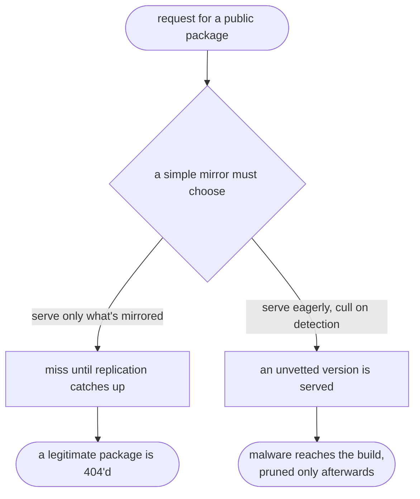
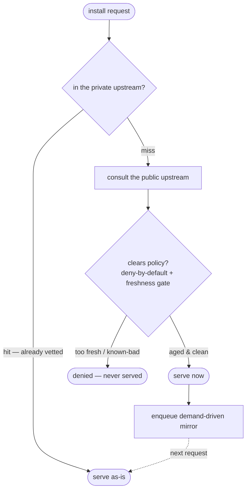

# Why Écluse?

> **In short.** A modern build pulls in thousands of third-party packages, and a single
> malicious or hijacked version can reach an enormous number of builds before anyone
> notices. Most bad publishes are caught and pulled quickly — so the danger lives in a
> narrow window between publication and removal. Écluse's premise is to **stay out of that
> window** rather than to detect malice: hold public packages behind a short **freshness
> quarantine** under a **deny-by-default** policy, enforced at a **single chokepoint** that
> CI and developers alike must pass through. The payoff is operational — when a malicious
> package is disclosed, you compare its lifetime against your quarantine window instead of
> combing logs to learn whether you were hit. To do that *without* either blocking
> legitimate packages or briefly serving malicious ones, Écluse uses a **three-registry**
> design that **composes in front of the registry you already run** rather than replacing
> it, and **delegates storage** to that registry rather than hosting packages itself. It is
> **free and open** — offered, not sold.
>
> This document is the *why*. The *how* lives in the
> [architecture docs](docs/architecture.md); a fair guide to other tools in this space is in
> [`ALTERNATIVES.md`](ALTERNATIVES.md).

## The blast radius of a bad publish

A modern dependency graph is enormous and almost entirely other people's code. That is
usually fine — until one popular package is hijacked or maliciously republished, at which
point a single bad version can reach a vast number of builds before the problem is even
known.

The threat has automated on both sides. On the attacker's side, self-propagating
campaigns now harvest credentials from whatever machine they land on and republish
themselves through any token they find, compressing propagation from weeks to hours. On
the consuming side, automated and AI-assisted development installs dependencies at machine
speed, removing the human "that doesn't look right" pause that once caught some of this by
accident.

The decisive property is that the danger is **time-bounded**. A malicious version is
dangerous in the window between when it is published and when the ecosystem notices and
removes it. Most are caught and pulled quickly; the harm falls on whoever consumed them
*inside* that window.

## The bet: resilience, not detection

You can try to *detect* malicious packages — scan them, score them, analyse their
behaviour. That is a hard, never-certain, perpetually moving target, and "we think it's
clean" is not the same as knowing.

Écluse makes a narrower bet: don't adjudicate whether a given version is malicious;
arrange for nothing to reach a build *inside its dangerous window*. The plainest form is a
**freshness quarantine** — a public version is not eligible until it has been visible long
enough that, were it malicious, it would very likely already have been found and pulled.
The premise rests on a real regularity in how these incidents go: compromised versions
tend to be caught fast — analyses of past attacks put most exploitation windows under a
week. This is the posture the name describes — *écluse* is French for a canal lock: not a
wall that blocks, but a controlled passage every dependency is held in and cleared through
before it is admitted. The goal is **resilience** — shrinking the blast radius of a bad
publish — not malware detection.

The point of all this is operational. When a malicious package is disclosed, you should
not have to convene a response, comb through logs, and trace egress to find out whether
you were exposed. If your quarantine window is longer than the package's lifetime — the
gap between when it was published and when it was pulled — then it was never served to
you. The question becomes **arithmetic, not forensics**: the incident you don't have to
run. That guarantee is exactly as strong as that one comparison — which is why everything
hinges on the next section.

## The bar: a chokepoint you can't step around

The audit-free property has a precondition: enforcement must be **total**. It holds only
if nothing can fetch a package by another route. That is a demanding bar, and it rules out
the most common answers.

The ecosystem now offers freshness controls at the package-manager level — a
minimum-release-age setting, resolver flags that refuse versions newer than a given date —
and they are genuinely useful. But they are advisory and per-project. Even shipping a
"secure" configuration, or a patched package manager, to every machine does not hold,
because modern development deliberately routes *around* machine globals: version managers,
Nix shells, containers, and committed project-local configuration each bring their own
toolchain and ignore whatever you set globally. The layer you can centrally configure is
precisely the layer that projects are built to override.

So enforcement has to live *below* the toolchain. The one place every install must pass,
whatever produced it, is the **network**. A single proxy that all package traffic resolves
through — with direct egress to the public registries closed off — cannot be side-stepped
by a per-project toolchain: whatever `npm` or `pnpm` a project conjures, its fetches still
cross the network, where only the chokepoint answers. That is what turns "please install
safely" into "you can only install through here," for CI runners and developer laptops
alike. (The enforcement side is an operator concern — see [`USAGE.md` → Locking down CI
egress](USAGE.md#locking-down-ci-egress-recommended); this document is about why it matters.)

## Why you can't simply buy it

Granted a chokepoint with a freshness policy, why build anything? Because each off-the-shelf
option sits at an awkward point.

- **The managed cloud registry you may already run** gives you the chokepoint, the storage,
  and the authentication — everything except this. It has no notion of a freshness policy.
- **Commercial repository-firewall and curation platforms** *do* enforce policy at the
  proxy, and some offer exactly this age-based quarantine — but the capability tends to sit
  behind a platform's upper licensing tiers, bundled inside a full artifact-hosting product.
  To add one safeguard you adopt, operate, and pay for a second registry, most of which
  duplicates the one you already run.
- **Hosted inspection services** avoid the migration but bill by usage — which scales the
  wrong way for an organisation running many CI jobs a day — and route your dependency
  requests, and your private-package metadata, through a third party.
- **Cryptographic provenance** is valuable and complementary, but it attests *where* a
  package was built, not *whether* it is safe.

None of this means buying is wrong; for many teams it is the right call. This section keeps
names out of the critique on purpose. A fair, *named* guide to these tools — and when each
may suit you better than Écluse — is in [`ALTERNATIVES.md`](ALTERNATIVES.md).

## Why it is open

The safeguard is small and specific; the off-the-shelf way to obtain it is large. For a big
organisation the licence cost rounds to nothing. For a small or early-stage one it is a real
line on the budget — argued for, spending political capital, competing with hiring and the
rest of the toolchain, and often losing that contest until an incident makes the case in
hindsight. The effect is **regressive**: the protection costs relatively the most for those
least able to absorb it, who are frequently those for whom a breach would be most serious.

Building it in-house answers the cost but not the durability — a private tool is one team's
burden, indefinitely. Being **open** changes that: a shared, openly-developed tool spreads
its upkeep across everyone who relies on it, and is reachable on an engineering-time budget
rather than a licensing one. That is the reason to make this open rather than internal — and
the reason it is built to be genuinely maintainable, held to a high correctness bar with its
own supply chain hardened and attested, rather than a private script.

## Why you can't naively build it either

Open and self-hosted does not, by itself, make it simple. The naive constructions all fail,
and walking through the failures is the clearest route to the design.

1. **Add a delay to the managed registry.** It has no such control.
2. **Put a proxy in front, and let the registry pull through it to the public source.** The
   act of pulling caches the fetched version into your trusted store — an unvetted, possibly
   malicious version lands in the clean registry before anything can stop it.
3. **Invert it: a worker that pushes only approved packages in.** Now you must either
   predict, ahead of demand, every package a developer might want — unbounded complexity —
   or mirror the whole "safe" subset of the registry — an unbounded bill.

And any survivor must also clear two constraints a simple mirror cannot:

**Internal packages cannot be delayed.** Your own organisation's packages must flow without
quarantine; if one team ships an internal library and another cannot adopt it for a week,
the safeguard has become a tax no one will tolerate. The policy has to be *source-aware* —
trust what is internal, gate what is public.

**A simple mirror forces a lose-lose on developers.**

Serve only what has already been replicated, and a legitimate package is **404'd** until
the mirror catches up. Serve eagerly to avoid that, and an unvetted version is **served and
culled only afterwards** — too late. Neither is acceptable.

### The design that's left: three registries

What survives is a model of three **roles** — not necessarily three servers: a **private
upstream** (the vetted store developers pull from), a **public upstream** (the outside
world, consulted but never trusted blindly), and a **mirror target** (where approved
packages are replicated for fast future serving).

- A **hit** in the private upstream is already vetted, and is served as-is.
- On a **miss**, the public upstream is consulted — and the version is served *only if it
  clears the policy, freshness gate included*. So a legitimate, sufficiently-aged package
  never 404s, while a too-fresh or known-bad version is denied, never served. That single
  qualifier is what makes "no false 404" and "no serving fresh malware" true at the same
  time.
- Serving on a miss also **enqueues replication** — demand-driven, so only what is actually
  used is ever copied (no prediction, no wholesale mirror), and the next request for it is
  served hot from the private upstream.
- **Internal packages** take the trusted path and are never gated.
- When a version is later found malicious, it is **pruned** from the mirror and the private
  upstream, so future requests are clean.

Because Écluse delegates storage to the registry you already run, all of this **composes in
front of your existing setup** instead of replacing it. How packuments are merged across
upstreams, how the rules engine evaluates, how mirroring and credentials work — that is the
*how*, in the [architecture docs](docs/architecture.md). This is the *why* they answer to.

## What Écluse is not

- **Not a malware detector.** It reduces blast radius; it does not promise to recognise
  malice.
- **Not a registry.** It hosts nothing of its own; it delegates storage to the backend you
  choose.
- **Not a wall.** Legitimate dependencies pass — on a controlled delay, under an explicit
  policy.
- **Not a finished, proven product.** At the time of writing it is early: pre-MVP, under
  active development, and not yet shown to do all of this in the world. The strategy is one
  its author is confident in; the software has not yet earned that confidence, and this
  document does not pretend otherwise.
- **Not novel, and not the only option.** The freshness-quarantine idea is one that several
  others have independently arrived at. [`ALTERNATIVES.md`](ALTERNATIVES.md) is an honest
  map of them.

## Offered, not sold

Écluse is free and permissively licensed, with no commercial agenda behind it. It is put
forward in good faith as a contribution to the commons: take what is useful, adapt it, or
take the reasoning here and apply it with another tool entirely. It is offered in the
spirit of a thing that might help — please receive it that way.

## Where to go next

- [`docs/architecture.md`](docs/architecture.md) — the design of record (the *how*).
- [`USAGE.md`](USAGE.md) — how to deploy and operate it, including the network-egress side
  of enforcement.
- [`ALTERNATIVES.md`](ALTERNATIVES.md) — other tools in this space, and when they may suit
  you better.
