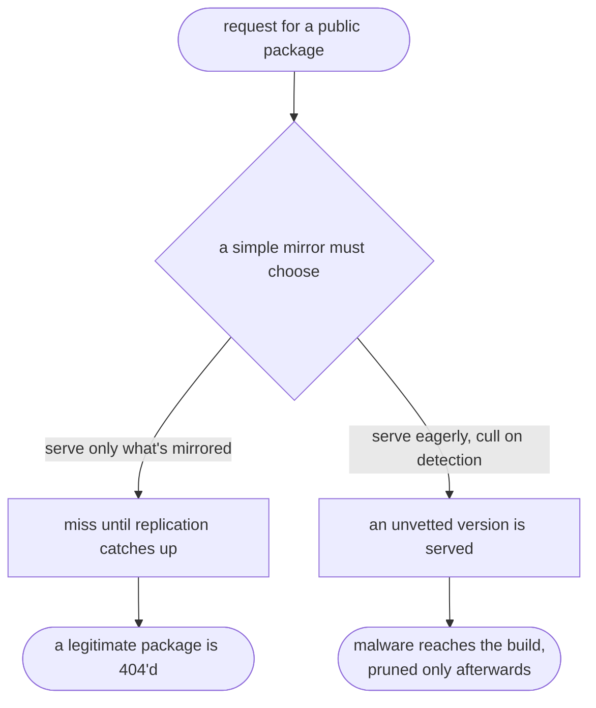
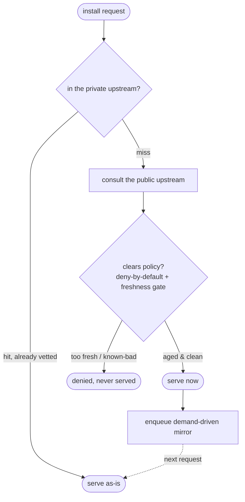

# Why Écluse?

Écluse is a supply-chain policy proxy. It holds fresh public packages behind a short
freshness quarantine, under a deny-by-default policy, at a single chokepoint that CI and
developers both pass through. This document is the reasoning behind that design. The *how*
is in the [architecture docs](docs/architecture.md), and
[`ALTERNATIVES.md`](ALTERNATIVES.md) maps the other tools in this space.

## The blast radius of a bad publish

A modern dependency graph is huge, and almost all of it is other people's code. That's fine
until an attacker hijacks or maliciously republishes one popular package. A single bad
version then reaches a vast number of builds before anyone notices.

The threat has automated on both sides. Self-propagating campaigns harvest credentials from
each machine they land on and republish through any token they find, which compresses
propagation from weeks to hours. On the consuming side, automated and AI-assisted
development installs at machine speed. That removes the human "that doesn't look right"
pause that used to catch some of this by accident.

The property I keep coming back to: the danger is time-bounded. A malicious version is
dangerous only between publication and the moment the ecosystem notices and pulls it. Most
are caught fast, and the harm falls on whoever consumed them inside that window.

## The bet: resilience, not detection

You can try to *detect* malicious packages: scan, score, analyse behaviour. That's a hard,
never-certain target, and "we think it's clean" isn't the same as knowing.

Écluse makes a narrower bet: don't adjudicate whether a version is malicious, just arrange
for nothing to reach a build *inside its dangerous window*. The plainest form is a
**freshness quarantine**. A public version stays ineligible until it has aged in public long
enough that the ecosystem has probably found and pulled a malicious one. The premise rests
on a real regularity: analyses of past attacks put most exploitation windows under a week.
That's where the name comes from: *écluse* is French for a canal lock, a controlled passage
every dependency clears before it's let forward. The goal is resilience: shrinking the blast
radius of a bad publish, not detecting malware.

The payoff is operational. When the ecosystem discloses a malicious package, you shouldn't
need to convene a response, comb logs, and trace egress to learn whether you were exposed. If
your quarantine window is longer than the package's lifetime (published to pulled), Écluse
never served it to you. The question becomes arithmetic, not forensics. The guarantee is
exactly as strong as that one comparison, which is why the next section matters.

## The bar: a chokepoint you can't step around

The guarantee has a precondition: enforcement has to be total. It only holds if nothing can
fetch a package by another route, and that rules out most of the obvious answers.

The ecosystem does offer freshness controls at the package-manager level: minimum-release-age
settings, resolver flags that refuse versions newer than a date. They're useful but advisory
and per-project. Even shipping a "secure" configuration to every machine doesn't hold.
Modern development routes *around* machine globals. Version managers, Nix shells,
containers, and committed project-local config each bring their own toolchain and ignore
what you set globally. The one layer you can centrally configure is the layer projects are
built to override.

So enforcement has to live *below* the toolchain, at the one place every install crosses: the
network. Point all package traffic at a single proxy and close direct egress to the public
registries. Nothing can then step around it. Whatever `npm` or `pnpm` a project conjures up,
its fetches still cross the network, and only the chokepoint answers. That turns "please
install safely" into "you can only install through here." The egress lockdown is an operator
concern: see
[`USAGE.md` → Locking down CI egress](USAGE.md#locking-down-ci-egress-recommended).

## You can buy it, at a price

Can't you just buy this? Partly. The commercial repository-firewall and curation platforms
sell an age-based quarantine at the proxy off the shelf. If that fits and you can fund it,
it's a working answer. The catch is cost and shape, not capability.

The managed cloud registry you may already run has the chokepoint, storage, and
authentication but no freshness policy. The platforms that add one tend to sit behind upper
licensing tiers, readily into five figures a year. They bundle it in a full artifact-hosting
product: a second registry to adopt, operate, and pay for, which mostly duplicates the one
you run. Hosted inspection services avoid the migration but bill by usage, which scales
badly for many CI jobs a day. They also route your dependency requests, and your
private-package metadata, through a third party.

For a team that can absorb the licence, buying is the right call. The friction is
proportion. [`ALTERNATIVES.md`](ALTERNATIVES.md) names these tools.

## Why it's open

The safeguard is small, and the off-the-shelf way to get it is large. For a big organisation
the licence rounds to nothing. For a small or early-stage one it's a real budget line, argued
for against hiring and the rest of the toolchain. That argument is often lost until an
incident makes the case in hindsight. The effect is regressive: the protection costs
relatively the most for the people least able to absorb it. Those are often the same people
a breach would hurt most.

Building it in-house answers the cost but not the durability: a private tool is one team's
burden forever. Open changes that. A shared, openly-developed tool spreads its upkeep across
everyone who relies on it, on an engineering-time budget rather than a licensing one. That
is why I build Écluse to be maintainable, and harden and attest its own supply chain rather
than leaving it a private script.

## Why you can't naively build it either

Self-hosting doesn't make this simple. The naive constructions all fail, and the failures are
the clearest route to the design:

1. **Add a delay to the managed registry.** It has no such control.
2. **Put a proxy in front and let the registry pull through it.** The pull caches the fetched
   version into your trusted store. An unvetted version lands in the clean registry before
   anything can stop it.
3. **Invert it: a worker that pushes only approved packages in.** Now you must predict every
   package a developer might want, which is unbounded complexity. The alternative is to
   mirror the whole safe subset, which is an unbounded bill.

Two more constraints rule out a simple mirror. **Internal packages can't wait:** your own
packages have to flow without quarantine, or the safeguard becomes a tax nobody tolerates. So
the policy has to be source-aware. And **a simple mirror forces a lose-lose:**

```mermaid
flowchart TD
    R(["request for a public package"]) --> N{"a simple mirror must choose"}
    N -->|"serve only what's mirrored"| A1["miss until replication catches up"]
    A1 --> AB(["a legitimate package is 404'd"])
    N -->|"serve eagerly, cull on detection"| B1["an unvetted version is served"]
    B1 --> BB(["malware reaches the build,<br/>pruned only afterwards"])
```

Serve only what's replicated and a legitimate package 404s until the mirror catches up. Serve
eagerly and an unvetted version reaches the build, culled only afterwards. Neither is
acceptable.

### The design that's left: three registries

What survives is a model of three **roles**[^publish-target], not necessarily three servers.
A **private upstream** is the vetted store developers pull from. Écluse consults a
**public upstream** but never trusts it blindly. A **mirror target** holds approved
packages, replicated there for fast serving later.

```mermaid
flowchart TD
    R(["install request"]) --> P{"in the private upstream?"}
    P -->|"hit, already vetted"| HIT(["serve as-is"])
    P -->|"miss"| PUB["consult the public upstream"]
    PUB --> POL{"clears policy?<br/>deny-by-default + freshness gate"}
    POL -->|"too fresh / known-bad"| DENY(["denied, never served"])
    POL -->|"aged & clean"| SERVE(["serve now"])
    SERVE --> MIR["enqueue demand-driven mirror"]
    MIR -.->|"next request"| HIT
```

- A hit in the private upstream is already vetted, so Écluse serves it as-is.
- On a miss, Écluse consults the public upstream and serves the version *only if it clears
  the policy, freshness gate included*. A sufficiently-aged package never 404s, and Écluse
  denies a too-fresh or known-bad one. "No false 404" and "no serving fresh malware" both
  hold at once.
- Serving on a miss enqueues demand-driven replication. The worker copies only what's used,
  with no prediction and no wholesale mirror, so the next request is a hot hit.
- Internal packages take the trusted path and are never gated.
- A version later found malicious is pruned from the mirror and the private upstream.

Écluse delegates storage to the registry you already run, so it composes in front of your
existing setup instead of replacing it. The [architecture docs](docs/architecture.md) cover
the *how*: packument merging, rule evaluation, mirroring, and credentials.

## What Écluse is not

- **Not a malware detector.** It reduces blast radius. It doesn't recognise malice.
- **Not a registry.** It hosts nothing. It delegates storage to the backend you choose.
- **Not a wall.** Legitimate dependencies pass, on a controlled delay, under an explicit
  policy.
- **Not finished.** It's early: pre-MVP, under active development, not yet proven in the
  world. I'm confident in the strategy. The software hasn't earned that confidence yet.
- **Not novel, or the only option.** Several people have independently reached the
  freshness-quarantine idea. [`ALTERNATIVES.md`](ALTERNATIVES.md) maps them.

## Offered, not sold

Écluse is free and permissively licensed, with no commercial agenda. I'm putting it forward in
good faith: take what's useful, adapt it, or apply the reasoning with some other tool
entirely.

[^publish-target]: The architecture carries a fourth registry role, a *publication target* for first-party `npm publish`, the write counterpart to the private read. It's an opt-in convenience for internal publishing, not part of the resilience argument. This section keeps to the three roles that bear on blast radius. See [Registry Model → Publishing first-party packages](docs/architecture/registry-model.md#publishing-first-party-packages-the-publication-target).
