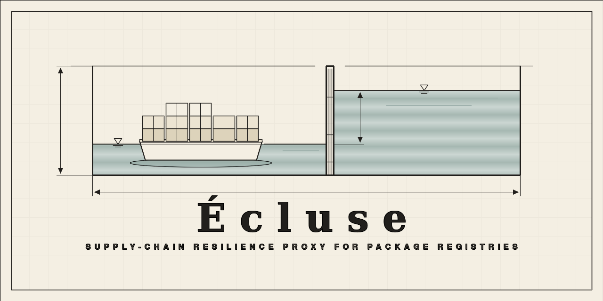

# Écluse

[](https://scorecard.dev/viewer/?uri=github.com/AlexaDeWit/Ecluse)
[](https://www.bestpractices.dev/projects/13335)
[](https://codecov.io/gh/AlexaDeWit/Ecluse)



A supply-chain resilience proxy for package registries, written in Haskell. The
name is French for a canal lock — the controlled passage every dependency clears
before it reaches your build.

**API documentation:** [Haddock for the library](https://alexadewit.github.io/Ecluse/), auto-published from `main`.

## Overview

`ecluse` sits between your development environment (or CI) and the npm
registry, enforcing a configurable resilience policy before any package reaches a
build. It proxies requests through a private upstream first, falls back to the
public npm registry with rules applied, and mirrors approved packages
asynchronously — without hosting packages itself.

See [`docs/architecture.md`](docs/architecture.md) for the full design:
three-registry model, deny-by-default rules engine, mirror queue, and
configuration reference.

## Verifying the image

Every published image carries **provenance** and **SBOM** attestations — keyless
(Sigstore), recorded in the public Rekor transparency log, and stored as
**immutable OCI referrers** on the image (write-once; they can't be overwritten).
Each version's digest is published in its
[GitHub Release](https://github.com/AlexaDeWit/Ecluse/releases). Verify by
**digest** with the GitHub CLI:

```bash
IMAGE=alexadewit/ecluse@sha256:…   # pin by digest

# Verify every attestation (provenance + SBOM) against the release identity + Rekor:
gh attestation verify "oci://$IMAGE" --repo AlexaDeWit/Ecluse

# …or just one, by predicate type:
gh attestation verify "oci://$IMAGE" --repo AlexaDeWit/Ecluse \
  --predicate-type https://slsa.dev/provenance/v1
```

`gh attestation verify` checks each attestation's signature against the release
workflow's identity and the Rekor log, and that its subject matches the digest
you pulled. Add `--format json` to extract the documents (e.g. the SPDX SBOM).

Strongest of all, the image is **bit-for-bit reproducible** — rather than trust
anyone, rebuild it from the pinned source and compare to what you pulled:

```bash
nix build github:AlexaDeWit/Ecluse/v0.1.0#dockerImage   # → ./result (a docker-archive)
```

See [Release & Supply-Chain Operations](docs/architecture/release-supply-chain.md#supply-chain-attestations)
for how the attestations are produced.

## Development

See [`CONTRIBUTING.md`](CONTRIBUTING.md) for the full contributor guide —
codebase conventions, testing strategy, CI / repository requirements, and the
[AI-assisted contribution](CONTRIBUTING.md#ai-assisted-contributions) policy; all
participation is governed by our [Code of Conduct](CODE_OF_CONDUCT.md). A quick
start follows.

### Prerequisites

**[Nix](https://nixos.org/) with flakes enabled is a hard dependency.** The whole
toolchain — GHC 9.6, Cabal, fourmolu, hlint, Semgrep — comes from the dev shell,
pinned by `flake.lock`. There is no supported system-level build: without Nix
you're on your own to reproduce the exact toolchain by hand, which is a long crawl
through the desert. Just install Nix.

A running Docker daemon is required only for the integration test suite (ephemeral
containers via `testcontainers` / `ministack`); the unit suite needs nothing
beyond the dev shell.

### Getting started

Enter the dev shell, then drive everything through `make` (run `make help` for
the full list):

```bash
nix develop        # enter the Nix dev shell — direnv does this automatically

make build         # build library, executable, and tests
make test          # fast, gating unit suite
make check         # build + test + doctest + format + lint + sast (what the CI gate runs)
make run           # run the proxy
```

Run `make` **from inside** the dev shell (`nix develop` / direnv). Targets also
work from a bare terminal — each wraps itself in `nix develop --command` — but
that re-enters the shell once per target, so it's only meant for the occasional
one-off. For a hermetic, reproducible build/checks — sandboxed, what you'd ship —
use `make nix-build` and `make nix-check`.

### Continuous integration

Every push and pull request runs [`.github/workflows/ci.yml`](.github/workflows/ci.yml):
build, unit and integration tests, format & lint, and Semgrep static analysis,
all feeding a single `gate` job (the one required status check). The smoke suite
(live-registry checks) also runs but is allowed to fail and does not gate. CI
uses the same Nix dev shell as local development (pinned by `flake.lock`), so it
validates against the exact same toolchain. See [`CONTRIBUTING.md`](CONTRIBUTING.md)
for details.

## Project Structure

| Path        | Purpose                                                                                                                  |
| ----------- | ------------------------------------------------------------------------------------------------------------------------ |
| `app/`      | Executable entry point — thin wiring only                                                                                |
| `src/`      | Library — all business logic                                                                                             |
| `test/`     | Unit and integration tests                                                                                               |
| `docs/`     | Architecture and design documents                                                                                        |
| `flake.nix` | Nix dev shell (GHC 9.6, cabal, HLS, ghcid) **and** the package build (`nix build`) + hermetic checks (`nix flake check`) |
