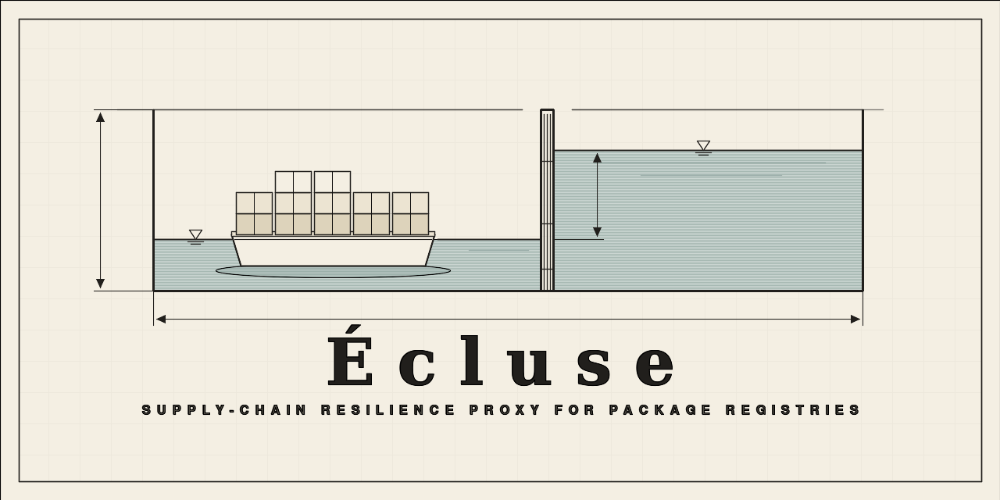

# Écluse

[](https://scorecard.dev/viewer/?uri=github.com/AlexaDeWit/Ecluse)
[](https://www.bestpractices.dev/projects/13335)
[](https://codecov.io/gh/AlexaDeWit/Ecluse)



A supply-chain policy proxy for package registries, written in Haskell. The name
**Écluse** (*Quebec French:* "ayy-cluze", [e.klyz]) is French for a canal lock: the
controlled passage every dependency clears before it reaches your build.

[Verifying the image](#verifying-the-image) covers how to verify a release instead of
trusting it: the keyless provenance and SBOM attestations, and the bit-for-bit reproducible
rebuild.

> **Status: generally available, pre-1.0.0.** The npm packument, tarball, and publish paths
> run today and are ready for use. An AWS-backed deployment is wired end to end: an SQS
> mirror queue, a demand-driven worker, and writes under a container-role credential. The
> GCP backends and the deployment runbook are still to come. Configuration can still change
> before `v1.0.0`, though repeated future-proofing passes aim to keep changes additive. The
> [operator manual](https://ecluse-proxy.com/docs/) is the deployment contract.

[Haddock API docs](https://ecluse-proxy.com/api/) auto-publish from `main`.

## Overview

Écluse is a proxy you put in front of public package registries to protect the builds that install
from them. Point your CI and developer tooling at Écluse instead of at a public registry. Écluse
fetches from that registry on their behalf and decides which versions a build may install. The npm
registry is the first one supported, and any client that speaks its protocol works, such as npm,
pnpm, yarn, or bun.

A new public version waits in a quarantine, seven days by default, before a build can install it.
Most malicious publishes are found and pulled within days, so the wait alone sidesteps them, with no
attempt to detect malice. With an advisory database synced, a version that an advisory names as
the exact fix for a vulnerability skips the wait, so the quarantine never delays a security patch.
Everything else is deny by default and opt-in by name.

If you run a private registry, Écluse reads it first and passes your own packages through untouched.
Any https registry that speaks the ecosystem's protocol serves in that role. Écluse can also mirror
each admitted public version into a registry you nominate, so a mirrored version survives a public
outage or yank. For an AWS CodeArtifact mirror target Écluse mints the short-lived write token
itself, and any other host takes a static token you supply. Écluse hosts no packages itself.

The [operator manual](https://ecluse-proxy.com/docs/) covers running Écluse.
[`docs/architecture.md`](docs/architecture.md) has the design: the registry roles, the rules
engine, and the mirror queue. The threat model (OWASP Threat Dragon, STRIDE) lives in
[`threat-modelling/ecluse.json`](threat-modelling/ecluse.json). The site build renders it as a
readable [register](https://ecluse-proxy.com/docs/threat-model/).

## Using Écluse

The [operator manual](https://ecluse-proxy.com/docs/) covers configuration, connecting your
clients, the network-egress safety you're responsible for, the rule policy, and the health and
observability endpoints. The [`docs/architecture/`](docs/architecture.md) documents are the
*why* behind each setting.

Écluse publishes to GitHub Container Registry and nowhere else: `ghcr.io/alexadewit/ecluse`,
one immutable tag per version, no `latest`. Pin a deployment by digest and verify what you
pin ([Verifying the image](#verifying-the-image)).
[Release and supply-chain operations](docs/architecture/release-supply-chain.md#releases-and-container-image)
covers the publish flow.

## Verifying the image

> **Releases.** The release workflow publishes every version to GitHub Container Registry
> (`ghcr.io/alexadewit/ecluse`).

Each tag is a single multi-arch image (`linux/amd64` + `linux/arm64`) carrying keyless
(Sigstore) provenance and SBOM attestations in the public Rekor log. Each
[GitHub Release](https://github.com/AlexaDeWit/Ecluse/releases) publishes the digest for its
version. Verify with the GitHub CLI:

```bash
IMAGE=ghcr.io/alexadewit/ecluse@sha256:…   # pin by digest

# Verify every attestation (provenance + SBOM) against the release identity + Rekor:
gh attestation verify "oci://$IMAGE" --repo AlexaDeWit/Ecluse

# …or just one, by predicate type:
gh attestation verify "oci://$IMAGE" --repo AlexaDeWit/Ecluse \
  --predicate-type https://slsa.dev/provenance/v1
```

The command checks each signature against the release workflow's identity and the Rekor
log, and confirms the subject matches your digest. Add `--format json` to extract the
documents.

Stronger still, the image is bit-for-bit reproducible. Rebuild it from pinned source and
compare, instead of trusting anyone.

```bash
nix build github:AlexaDeWit/Ecluse/<ref>#dockerImage   # → ./result (a docker-archive)
```

See [Release and supply-chain operations](docs/architecture/release-supply-chain.md#supply-chain-attestations).

## Versioning

The version lives in `ecluse.cabal`'s `version:` field, and the image, git, and release tags
derive from it. [`VERSIONING.md`](VERSIONING.md) is the policy: what the numbers promise, and
what `0.y.z` does not.

## Development

[Nix](https://nixos.org/) with flakes is a hard dependency: the whole toolchain (GHC 9.10,
Cabal, fourmolu, hlint, Semgrep) comes from the pinned dev shell.

```bash
nix develop        # enter the dev shell (direnv does this automatically)
task build         # build the library, executable, and tests
task check         # fast pre-push checks (a subset of the gate)
task gate          # the full CI-gate mirror (adds the Docker integration + Haddock tiers)
```

[Getting Started](docs/getting-started.md) covers full setup, the `task` workflow, and
dependency locking. [`CONTRIBUTING.md`](CONTRIBUTING.md) covers the contribution process and
DCO sign-off. The [Code of Conduct](CODE_OF_CONDUCT.md) governs participation, and
[`GOVERNANCE.md`](GOVERNANCE.md) says who decides.

## Project structure

| Path        | Purpose                                                                                                                  |
| ----------- | ------------------------------------------------------------------------------------------------------------------------ |
| `core/`     | `ecluse-core` library: the pure, ecosystem-agnostic capability core (`Ecluse.Core.*`)                                    |
| `runtime/`  | `ecluse-runtime` library: the effectful edge (OTel SDK, warp, scribes, and cloud adapters, `Ecluse.Runtime.*`)           |
| `src/`      | `ecluse` library: the composition shell that assembles and runs the tiers (`Ecluse.*`)                                  |
| `app/`      | Executable entry point, thin wiring only                                                                                  |
| `test/`     | Unit and integration tests                                                                                               |
| `config/`   | The embedded defaults (`default.yaml`), the schema guidepost operator configs override                                    |
| `runbooks/` | Maintainer procedures run step by step (releases)                                                                        |
| `docs/`     | Architecture and design documents                                                                                        |
| `web/`      | The documentation site (Zola): content, templates, and styles. `web/content/docs/` holds the operator manual              |
| `flake.nix` | Nix dev shell (GHC 9.10, cabal, HLS, ghcid) and the package build (`nix build`) plus hermetic checks (`nix flake check`) |
