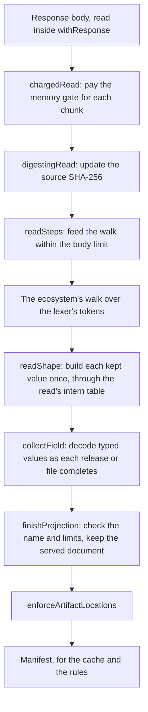

# Adding an ecosystem

Read this before you bring a new package ecosystem, such as Rust crates, into Écluse. Every
ecosystem adopts the reader and measurement pattern that npm and PyPI follow. npm is the model,
because it carries the most complete form of that pattern. This guide sets out the techniques of
that pattern, the reason for each one, and the order to apply them in.

The rest of the pattern has its own homes. The adapter boundary is in
[Registry model, Registry abstraction](architecture/registry-model.md#registry-abstraction). The
testing side is in
[Testing strategy, One pattern for every ecosystem](testing.md#one-pattern-for-every-ecosystem),
and the checklist of tests, benchmarks and fixtures is in
[Onboarding an ecosystem](testing.md#onboarding-an-ecosystem).

Two constraints hold through every step:

- A performance change never changes what Écluse serves or decides. Served bytes, ETags, verdicts
  and refusals stay byte-identical, and a walk accepts and refuses the same input as its reference
  reader. When you need different output, make it a separate change with its own review.
- No technique moves the fail-closed boundary. An undetermined signal stays `CodeExecUnknown` or
  `Nothing` ([the internal domain model](architecture/registry-model.md#the-internal-domain-model)),
  and a broken release drops as an `InvalidEntry`
  ([graceful degradation](architecture/registry-model.md#graceful-degradation-per-version-not-per-package)).

## What the bar checks

Each property below has a check that fails, or a report that shows the regression. Meet each one
for the new ecosystem before you call its reads done.
[Onboarding an ecosystem](testing.md#onboarding-an-ecosystem) names the file each check needs.

| Property | Check |
|---|---|
| Served bytes, ETags, typed facts and selected reads stay the same across a performance change | The recorded corpus outputs |
| The walk accepts and refuses the same input as its reference reader | The walk parity property ([The vendored JSON lexer](testing.md#the-vendored-json-lexer)) |
| A walk holds nothing for the input it drops | The walk residency specs |
| A full read hands back a fully evaluated result | [Read evaluation](testing.md#read-evaluation) |
| Retained heap per source byte stays within its regression limit | The retained-heap gate of the [residency tier](testing.md#residency-gate-ecluse-residency-gating) |
| A read's peak and a listing's render fit what the memory gate charges | [Listing peaks](testing.md#listing-peaks) |
| Time and allocation per request show on every pull request | The work-per-request benchmarks ([Benchmarks](testing.md#benchmarks-non-gating)) |

## The read, end to end

A full read streams the response body through a chain of small steps, and each step owns one
concern. Keep that shape in a new ecosystem. Add a concern as its own step on the chunk source,
never as a flag or a mode inside the walk.
[Incremental npm extraction](architecture/registry-model.md#incremental-npm-extraction) describes
the chunking, the source digest and the body limit.

`fetchNpmManifest` in `Ecluse.Core.Registry.Npm.Metadata` shows the composition, and
`fetchPyPIManifest` follows it. The pipeline sets the charge for each chunk from the adapter's
charge factors, so a full read only passes its chunks through
`chargedRead (ocChargeFullRead origin)`. A selected read runs the same walk without `chargedRead`
and `digestingRead`, so it pays no charge per byte.

## Apply the techniques in this order

The corpus comes first, because every later claim of less memory with the same output needs fixed
inputs to prove it.

### 1. Capture a corpus and record its outputs

- Capture complete upstream documents under `bench/corpus/<ecosystem>/`, pin each one in
  `bench/corpus/pins.json`, and list them in `Ecluse.Test.Corpus` with a `CaptureUpstream`
  ([Benchmark captures](testing.md#benchmark-captures)).
- Include several captures of at least one 1 MiB meter step, the unit the memory gate charges in.
  Only those captures set the read charges.
- Record the captures' outputs in the golden set, as the recorded-outputs row of
  [Onboarding an ecosystem](testing.md#onboarding-an-ecosystem) describes.

From then on, every performance change reproduces those lines byte for byte. A change that needs a
new line is a change of behaviour, not of performance.

### 2. Walk the lexer's tokens

A reader that builds the whole document tree, or runs json-stream's parser combinators, allocates
for fields that Écluse then drops. It also rebuilds maps as it goes. A walk over the lexer's tokens
builds only what the read keeps, and builds it once.

- [`Ecluse.Core.Registry.Json.Walk`](../core/src/Ecluse/Core/Registry/Json/Walk.hs) holds the
  primitives. `withElement` reads the next token, `eachMember` and `eachItem` visit containers,
  and `skipFrom` passes a value unread. `readJsonWalk` drives a walk within the body limit.
- Write the ecosystem's walk in `Ecluse.Core.Registry.<Ecosystem>.Reader`, and model it on
  `npmWalk`, as `pypiWalk` does. The walk passes one field to the consumer's step function as each
  release, file or top-level member completes.
- Read one document per body. `npmWalk` and `pypiWalk` finish after the first top-level value, and
  `readSteps` drains the rest of the body against the same limit.
- Hold the walk to its reference reader, as
  [One pattern for every ecosystem](testing.md#one-pattern-for-every-ecosystem) requires.
  [Incremental npm extraction](architecture/registry-model.md#incremental-npm-extraction) states
  the acceptance the walk keeps and how it skips unknown fields.

### 3. Declare what to keep as shapes

The fields a read keeps are a contract with clients, such as npm's
[operator field contract](https://ecluse-proxy.com/docs/protocol-support/#npm-metadata-fields). A
depth budget at each level bounds hostile nesting. A `Shape` states both in one value, so the walk
builds each kept value straight from its members.

- [`Ecluse.Core.Registry.Json.Shape`](../core/src/Ecluse/Core/Registry/Json/Shape.hs) holds the
  shapes and `readShape`, which reads one value under a shape. `releaseMembers` in
  `Ecluse.Core.Registry.Npm.Reader` is the largest worked example.
- Name the kept members of a fixed object with `namedMembers`. Use `everyMember` for a map whose
  names vary, such as dependencies. Use `knownMembers` for a map that also has well-known names,
  such as PyPI's hash algorithms.
- Take each budget from `maxNestingDepth`, one level less for each level down. A kept value with no
  budget left fails the read with the nesting limit.
- Let the first member under a repeated key win, as json-stream does. The walk reads a repeat where
  json-stream reads it, then drops it.

`namedMembers` and `knownMembers` also make one key for each listed name, which every object read
with those members can hold. So a document with thousands of releases holds each fixed name once.

### 4. Intern keys and strings for each read

Releases repeat the same keys, dependency names and ranges thousands of times. A table that belongs
to one read holds one copy of each, and every release that repeats one shares it.
[Incremental npm extraction](architecture/registry-model.md#incremental-npm-extraction) describes
the table and the key it draws for each read.

- [`Ecluse.Core.Registry.Json.Intern`](../core/src/Ecluse/Core/Registry/Json/Intern.hs) holds the
  table. Create one for each read with `newInternTable <$> newTableKey <*> pure uniqueFields`, as
  `readNpmPackument` does, and let it go when the read ends.
- Read each kept release in `Share` mode. `readShape` then finds each key and string in the table
  by the bytes the lexer read, before it builds any text. It takes every key from the table,
  including names that no member list names.
- List the fields whose values differ in every release, such as artifact URLs and digests, as the
  unique fields (`releaseUniqueFields`, `fileUniqueFields`). The table keeps their values as read,
  so they never grow it.
- Let only what the projection keeps enter the table. The walk asks the consumer's keep predicate
  (`keepsRelease`, `keepsFile`), and reads a release it will drop in `Keep` mode.

Never share a table between reads. A table for the whole process would keep every string any
upstream sent, so upstream content would set a permanent memory floor.

### 5. Parse repeated values once per read

Some values cost work to parse, and many releases repeat them. Parse each distinct value once per
read, and keep the results only for that read, for the same reason the intern table ends with it.
PyPI's `FilenameMemo` in `Ecluse.Core.Registry.PyPI.Project` parses each distinct version text
once, so the files of one release share one parse. A version requirement that many releases repeat
is a candidate for the same treatment.

### 6. Derive per-document values once, and check each artifact once

Some checks run for every artifact, but most of their inputs depend only on the document. Derive
those inputs once per read, and do the per-artifact part only where it can change the answer. A new
ecosystem's reads get this for artifact locations by calling `enforceArtifactLocations` and
`enforceArtifactLocationsOf` in `Ecluse.Core.Package.Filter`.

- [`Ecluse.Core.Package.Filter.Internal`](../core/src/Ecluse/Core/Package/Filter/Internal.hs)
  shows the pattern. `artifactOrigin` derives an `ArtifactOrigin` once per document: the declared
  artifact hosts, the upstream's authority and its https host. `resolveArtifact` checks each
  artifact against it.
- Repeat a check only when an earlier step changed its input. `resolveArtifact` checks the filename
  again only when the https normalisation changed the URL text. When the text did not change, it
  keeps the original string.
- Test a fixed prefix without lowering the whole text. `isPrefixOfLowered` in `Ecluse.Core.Text`
  lowers only the prefix's length of the text and compares by equality. Each `LowerPrefix` carries
  that length beside its text.
- Never swap one URL parser for another to save work. The download gate and the read-time check
  both decide an artifact's authority with `hostPortAddress`, so they cannot disagree about which
  host a URL names.

Hold a faster check to the check it replaces, as
[`InternalSpec`](../core/test/unit/Ecluse/Core/Package/Filter/InternalSpec.hs) does.

### 7. Read selected versions without decoding the rest

An artifact decision or a mirror write needs one release and its publish time. Decoding every other
release would cost it a full read.

- Give the read type a case for one release, as npm's `OneRelease` and PyPI's `SelectedRead` do.
- Skip a value unread only where the reference reader skips it, so the walk keeps the reference's
  acceptance. npm's reference skips each other release, and json-stream's `objectWithKey` skips the
  rest of the `time` and `dist-tags` objects after the member it wants. So `npmWalk` skips them
  too, and still counts each skipped release toward the version cap.
- PyPI's reference folds every retained member of every file, so PyPI's `selectedFile` reads each
  file's retained members in `Keep` mode. A file the name rejects then never enters the intern
  table.

### 8. Keep only what a reader uses in the typed view

The cache keeps a typed view, `PackageDetails`, for every version. So every cached version pays for
every field of that view, including a field that nothing reads.

- Decode typed values in the consumer's step (`collectField`) as each release or file completes,
  so the read never holds the source document.
- Add a field to `PackageDetails` only when a rule, the merge, admission, serving or the mirror
  worker reads it. [The internal domain model](architecture/registry-model.md#the-internal-domain-model)
  sets out what the view holds and why. Removing a field never means defaulting a signal: a signal
  the rules read stays explicitly unknown when the reader cannot determine it.
- Take typed text from the kept value's own strings, not a fresh copy, so the typed view and the
  served document share one text. npm's integrity string in the typed view is the
  served document's own text.
- Keep that text as `Text`, although [the style guide, 6.5](style.md#6-naming-and-domain-types)
  stores bulk identifiers as `ShortText`. A conversion copies the text, so the view would hold a
  second copy of what the served document holds. On the corpus, `ShortText` made the cache entry no
  smaller than sharing the text, and it raised merge allocation where versions collide.

### 9. Finish the read strictly

An unevaluated field in a read's result keeps decoder state alive. That state then lives through
the rules phase. On a `304`, which never renders, it lives until the request ends.

- Evaluate each typed value as the step stores it, as `Right $! details` does in npm's
  `collectField`.
- Evaluate the elements of each list the result keeps with `strictElements` from
  `Ecluse.Core.Strict`.
- Rebuild a list in source order with its keys evaluated, as PyPI's `servedFiles` does, instead of
  leaving a lazy comprehension over the read's accumulator.

[Read evaluation](testing.md#read-evaluation) checks that every capture's result is fully evaluated
when its read finishes.

### 10. Set the memory charges from measured peaks

The memory gate admits work by what each request pays, not by what it holds. A charge below a
read's real peak lets the heap overflow. A charge far above it holds budget that live data never
fills, which costs throughput.
[Runtime sizing](architecture/configuration.md#runtime-sizing-cores-and-heap-ceiling) explains the
gate and owns the rule that derives the full-read charge.

The adapter's `metadataChargeFactors` holds a `ChargeFactors` with two fields, as
`npmChargeFactors` shows:

- `cfFullReadPermille` is what a full read pays per source byte as it reads. Derive it from the
  largest read peak by the rule in Runtime sizing.
- `cfOutputPermille` is what a listing's response pays per source byte before it renders. The
  listing check sets its floor from one meter step of source up
  ([Listing peaks](testing.md#listing-peaks)). It must cover the listing's peak above its held
  entry, and twice the served body.

To calibrate them:

- Add the ecosystem to the residency tier as the metadata residency row of
  [Onboarding an ecosystem](testing.md#onboarding-an-ecosystem) lists, with its own retained-heap
  and read-peak limits.
- Read each capture's `metadata-listing` line in the output of CI's arm64 Build job. It reports the
  read peak, the peak above the entry and the served body, each per source byte.
- Derive the read-peak limit by the rule in [Listing peaks](testing.md#listing-peaks), and add the
  captures to that section's table.

The existing figures come from CI's arm64 Build job. Calibrate a new ecosystem there too, so its
figures compare with theirs. From then on, the residency tier fails when a change to the
representation outgrows a charge, so the charge moves only with new evidence.

## Measure every change

Allocation varies little between runs of one build on one input, for example through the table key
each read draws. So allocation figures compare closely across a change. Wall-clock time
varies with the runner, so take timing from CI's `bench.yml` run, and label a local timing as
indicative only.

[Benchmarks](testing.md#benchmarks-non-gating) lists the benchmark workflows and what each one
measures, and the [residency gate](testing.md#residency-gate-ecluse-residency-gating) describes the
memory probes. To look at one read in isolation, run the residency executable's
[source probes](testing.md#streaming-source-probes), which report one read's allocation and live
bytes for a capture. Every new test, benchmark row and load scenario also gets a counterpart in
every ecosystem ([One pattern for every ecosystem](testing.md#one-pattern-for-every-ecosystem)).

## Reuse before you write

npm and PyPI already share many definitions that a new ecosystem needs. Before you write a helper,
search for the npm and PyPI definition of the same job. Call, extend or hoist it
([the style guide, 4.9](style.md#4-module-organisation-namespacing-and-exports)). The steps above
name the walk, shape, intern and artifact-location modules. These shared modules serve the rest of
a read:

| Job | Shared definition |
|---|---|
| Reported-name checks and stream error mapping | `Ecluse.Core.Registry.Metadata.Projection`, `Ecluse.Core.Registry.WireSupport` |
| Replaying a merge plan, rebasing artifact URLs, the name gate | `Ecluse.Core.Registry.ServedDocument` |
| Caching, metrics and failure logs around the reads | `Ecluse.Core.Server.Metadata` |
