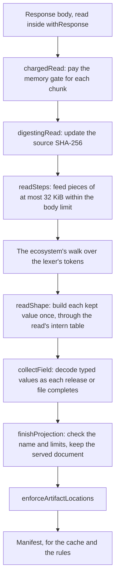

# Adding an ecosystem

Read this before you bring a new package ecosystem, such as Rust crates, up to the memory and
allocation bar that npm and PyPI meet. It gives the order in which to apply the techniques their
metadata reads use, and the reason for each one. The adapter boundary is in
[Registry model, Registry abstraction](architecture/registry-model.md#registry-abstraction). The
tests, benchmarks and fixtures an ecosystem must supply are in
[Testing strategy, Onboarding an ecosystem](testing.md#onboarding-an-ecosystem). This guide does
not repeat either.

One constraint holds through every step: a performance change never changes what Écluse serves or
decides. Served bytes, ETags, verdicts and refusals stay byte-identical, and a new reader accepts
and refuses the same input as the reader it replaces. When you need different output, make it a
separate change with its own review.

## What the bar checks

Each property below has a check that fails, or a report that shows the regression. Meet each one
for the new ecosystem before you call its reads done.

| Property | Where it is checked |
|---|---|
| Served bytes, ETags, typed facts and selected reads stay the same across a performance change | The recorded corpus outputs in `core/test/unit/fixtures/corpus-outputs.tsv` |
| The walk accepts and refuses the same input as json-stream's parser combinators | The differential properties in `ecluse-core-unit` ([The vendored JSON lexer](testing.md#the-vendored-json-lexer)) |
| A read holds nothing for the input it drops | The reader residency specs, such as `Ecluse.Core.Registry.PyPI.ReaderResidencySpec` |
| A full read hands back a fully evaluated result | [Read evaluation](testing.md#read-evaluation) |
| Retained heap per source byte stays within its regression limit | The retained-heap gate of the [residency tier](testing.md#residency-gate-ecluse-residency-gating) |
| A read's peak and a listing's render fit what the memory gate charges | [Listing peaks](testing.md#listing-peaks) |
| Time and allocation per request show on every pull request | The work-per-request rows of `bench.yml` ([Benchmarks](testing.md#benchmarks-non-gating)) |

## The read, end to end

A full read streams the response body through a chain of small steps, and each step owns one
concern. Keep that shape in a new ecosystem. Add a concern as its own step on the chunk source,
never as a flag or a mode inside the walk.

`fetchNpmManifest` in `Ecluse.Core.Registry.Npm.Metadata` and `fetchPyPIManifest` in
`Ecluse.Core.Registry.PyPI.Metadata` show the composition. The pipeline sets the charge for each
chunk from the adapter's charge factors (step 8), so a full read only passes its chunks through
`chargedRead (ocChargeFullRead origin)`. A selected read, which reads one version for an artifact
decision or the mirror worker, runs the same walk without the first two steps. It pays no charge per byte, and it skips
the hash because a selected release carries no source digest.

## Apply the techniques in this order

Each step uses the evidence of the step before it. The corpus comes first, because every later
claim of less memory with the same output needs fixed inputs to prove it.

### 1. Capture a corpus and record its outputs

- Capture complete upstream documents under `bench/corpus/<ecosystem>/`, and pin the size and
  SHA-256 of each one in `bench/corpus/pins.json` ([Benchmark captures](testing.md#benchmark-captures)).
- Include several captures of at least one 1 MiB meter step, the unit the memory gate charges in.
  Only those captures set the read charges in step 8.
- Add a `CorpusRead` for the ecosystem to `Ecluse.Test.Corpus.Outputs`, and record its lines in
  `core/test/unit/fixtures/corpus-outputs.tsv`. The lines hash the typed facts, the cache charge,
  the served bytes, merge plan and ETag for three survivor sets, and the selected reads.

From then on, every performance change reproduces those lines byte for byte. A change that needs a
new line is a change of behaviour, not of performance.

### 2. Walk the lexer's tokens

A reader that builds the whole document tree, or runs json-stream's parser combinators, allocates
for fields that Écluse then drops. It also rebuilds maps as it goes. A walk over the lexer's tokens
builds only what the read keeps, and builds it once.

- [`Ecluse.Core.Registry.Json.Walk`](../core/src/Ecluse/Core/Registry/Json/Walk.hs) holds the
  primitives. `withElement` reads the next token, `eachMember` and `eachItem` visit containers,
  and `skipFrom` passes a value unread. `readJsonWalk` drives a walk within the body limit.
- Write the ecosystem's walk in `Ecluse.Core.Registry.<Ecosystem>.Reader`, as `npmWalk` and
  `pypiWalk` do. It passes one field to the consumer's step function as each top-level item
  completes.
- Skip every member you do not keep with `skipFrom`. It passes the value token by token and
  decodes nothing.
- Keep json-stream's acceptance. Each primitive accepts and refuses the same input as the
  combinator it replaces, and the lexer's documented leniency passes through unchanged. Performance
  work never tightens or loosens what a read accepts.
- Hold the walk to an independent reader of the same fields with a differential property, as
  `Ecluse.Core.Registry.PyPI.ReaderSpec` does. The property compares every emitted field, the byte
  count, the refusal and the failure class, on generated and damaged bodies split at random. The
  reference reader uses json-stream's combinators. Keep it in test support, as
  `Ecluse.Test.Registry.PyPI.Streaming` does, when production does not read with it.

### 3. Declare what to keep as shapes

The fields a read keeps are a contract with clients, such as npm's
[operator field contract](https://ecluse-proxy.com/docs/protocol-support/#npm-metadata-fields). A
depth budget at each level bounds hostile nesting. A `Shape` states both in one value, so the walk
builds each kept value straight from its members.

- [`Ecluse.Core.Registry.Json.Shape`](../core/src/Ecluse/Core/Registry/Json/Shape.hs) holds the
  shapes and `readShape`, which reads one value under a shape. `releaseMembers` in
  `Ecluse.Core.Registry.Npm.Reader` is the largest worked example.
- Name the kept members of a fixed object with `namedMembers`. Use `everyMember` for a map whose
  names vary, such as dependencies. Use `knownMembers` for a map that also has well-known names,
  such as PyPI's hash algorithms.
- Take each budget from `maxNestingDepth`, one level less for each level down. A kept value with no
  budget left fails the read with the nesting limit.
- Let the first member under a repeated key win, as json-stream does. The walk reads a repeat where
  json-stream reads it, then drops it.

Keys are shared too, so a document with thousands of releases holds each fixed name once. A read in
`Share` mode takes every key from the intern table (step 5). A read in `Keep` mode still shares
each name that `namedMembers` or `knownMembers` lists, because those helpers make one key per name.

### 4. Read selected versions without decoding the rest

An artifact decision or a mirror write needs one release and its publish time. Decoding every other
release would cost it a full read.

- Give the read type a case for one release, as npm's `OneRelease` and PyPI's `SelectedRead` do.
  Let the walk skip the other releases unread. npm still counts each skipped release toward the
  version cap.
- Read the selected release's neighbours only as far as the decision needs. npm reads only the
  release's own `time` member and the `latest` tag, and skips the rest of each object.
- Keep a rejected candidate out of the intern table (step 5). PyPI's `selectedFile` gives each
  file's text its own copy, so a file the name rejects never enters the table.

### 5. Intern keys and strings for each read

Releases repeat the same keys, dependency names and ranges thousands of times. A table that belongs
to one read holds one copy of each, and every release that repeats one shares it.

- [`Ecluse.Core.Registry.Json.Intern`](../core/src/Ecluse/Core/Registry/Json/Intern.hs) holds the
  table. Create one for each read with `newInternTable <$> newTableKey <*> pure uniqueFields`, as
  `readNpmPackument` and `readPyPIIndex` do, and let it go when the read ends.
- Read each kept release in `Share` mode. `readShape` then finds each key and string in the table
  by the bytes the lexer read, before it builds any text.
- List the fields whose values differ in every release, such as artifact URLs and digests, as the
  unique fields (`releaseUniqueFields`, `fileUniqueFields`). The table keeps their values as read,
  so they never grow it.
- Let only what the projection keeps enter the table. The walk asks the consumer's keep predicate
  (`keepsRelease`, `keepsFile`), and reads a release it will drop in `Keep` mode.

Never let a table outlive its read, and never share one between reads. A table for the whole
process would keep every string any upstream sent, so upstream content would set a permanent memory
floor. Each read also draws a fresh SipHash-1-3 key for its table, so upstream text cannot choose
which names collide in the table's hash map.

### 6. Keep only what a reader uses in the typed view

The cache keeps a typed view, `PackageDetails`, for every version. So every cached version pays for
every field of that view, including a field that nothing reads.

- Decode typed values in the consumer's step (`collectField`) as each release or file completes,
  so the read never holds the source document.
- Add a field to `PackageDetails` only when a rule, the merge, admission, serving or the mirror
  worker reads it. [The internal domain model](architecture/registry-model.md#the-internal-domain-model)
  sets out what the view holds and why.
- Take typed text from the kept value's own strings, which the table already shares, instead of a
  fresh copy. npm's integrity string in the typed view is the served document's own text.

### 7. Finish the read strictly

An unevaluated field in a read's result keeps decoder state alive. That state then lives through
the rules phase. On a `304`, which never renders, it lives until the request ends.

- Evaluate each typed value as the step stores it, as `Right $! details` does in npm's
  `collectField`.
- Evaluate the elements of each list the result keeps with `strictElements` from
  `Ecluse.Core.Strict`.
- Rebuild a list in source order with its keys evaluated, as PyPI's `servedFiles` does, instead of
  leaving a lazy comprehension over the read's accumulator.

[Read evaluation](testing.md#read-evaluation) checks that every capture's result is fully evaluated
when its read finishes.

### 8. Set the memory charges from measured peaks

The memory gate admits work by what each request pays, not by what it holds. A charge below a
read's real peak lets the heap overflow. A charge far above it holds budget that live data never
fills, which costs throughput.
[Runtime sizing](architecture/configuration.md#runtime-sizing-cores-and-heap-ceiling) explains the
gate and owns the rule that derives each charge.

- Supply the ecosystem's charges as `ChargeFactors` in the adapter's `metadataChargeFactors`, as
  `npmChargeFactors` and `pypiChargeFactors` do.
- Add the ecosystem's captures to `MemoryModelResidencySpec`, and give it its own retained-heap
  and read-peak limits. An ecosystem without a read-peak limit skips the listing checks, and one
  without retained-heap limits falls back to the generic ones.
- Read each capture's `metadata-listing` line in the output of CI's arm64 Build job. It reports the
  read peak and the served body per source byte.
- Derive the full-read charge from the largest read peak by the rule in Runtime sizing. Derive the
  read-peak limit by the rule in [Listing peaks](testing.md#listing-peaks), and add the captures to
  that section's table.

The existing figures come from CI's arm64 Build job. Calibrate a new ecosystem there too, so its
figures compare with theirs. From then on, the residency tier fails when a change to the
representation outgrows a charge, so the charge moves only with new evidence.

## Measure every change

Allocation is deterministic for one build and one input. So compare allocation figures exactly,
and treat a change of a few bytes as real. Wall-clock time varies with the runner, so take timing
from CI's `bench.yml` run, and label a local timing as indicative only.

| Instrument | What it tells you |
|---|---|
| Residency tier (`ecluse-residency`, gating) | Retained heap per source byte, read and render peaks, full evaluation, and held bytes as the input repeats |
| Work-per-request benchmarks (`bench.yml`, on every pull request) | Time and RTS allocation per operation over the committed captures |
| [Advisory rule rows](testing.md#advisory-rule-rows) | What an advisory database adds to one request's rule phase |
| [Load scenarios](testing.md#load-tests-under-a-pod-shape) (`bench-load.yml`, scheduled or dispatched) | Successes, allocation per success, and memory under a pod-shaped cgroup |
| Performance acceptance (`perf-acceptance.yml`) | Overhead on live registry documents against reviewed budgets |

[Onboarding an ecosystem](testing.md#onboarding-an-ecosystem) lists the file or module that
registers the ecosystem with each one. To look at one read in isolation, run the residency
executable's [source probes](testing.md#streaming-source-probes), which report one read's
allocation and live bytes for a capture.

### Give every test a counterpart in every ecosystem

When you add a test, a benchmark row or a load scenario for one ecosystem, add a counterpart for
each other ecosystem. Do this wherever the other ecosystem has the same path, even while its
support is incomplete. A cost that shows in one ecosystem often has a twin in another, and a missing
counterpart hides it. Where no counterpart can exist yet, name the gap in the pull request instead
of leaving it out.

## Reuse before you write

npm and PyPI already share many definitions that a new ecosystem needs. Before you write a helper,
search for the npm and PyPI definition of the same job, and call, extend or hoist it
([style guide, 4.9](style.md#4-module-organisation-namespacing-and-exports)).

| Job | Shared definition |
|---|---|
| Walk primitives, shapes and the intern table | `Ecluse.Core.Registry.Json.Walk`, `.Shape` and `.Intern` |
| Bounded reads, source digests and per-chunk charges | `Ecluse.Core.Registry.JsonStream.readSteps`, `Ecluse.Core.Registry.Exchange` |
| Reported-name checks and stream error mapping | `Ecluse.Core.Registry.Metadata.Projection` |
| Replaying a merge plan, rebasing artifact URLs, the name gate | `Ecluse.Core.Registry.ServedDocument` |
| Artifact-location enforcement | `Ecluse.Core.Package.Filter` |
| Caching, metrics and failure logs around the reads | `Ecluse.Core.Server.Metadata.newMetadataReads` |
| Corpus inputs and adapter operations for the benchmarks and performance acceptance | `Ecluse.Test.EcosystemBench` |
| Live-byte sampling of a walk | `Ecluse.Core.Registry.Json.WalkProbe` in the residency tier |
