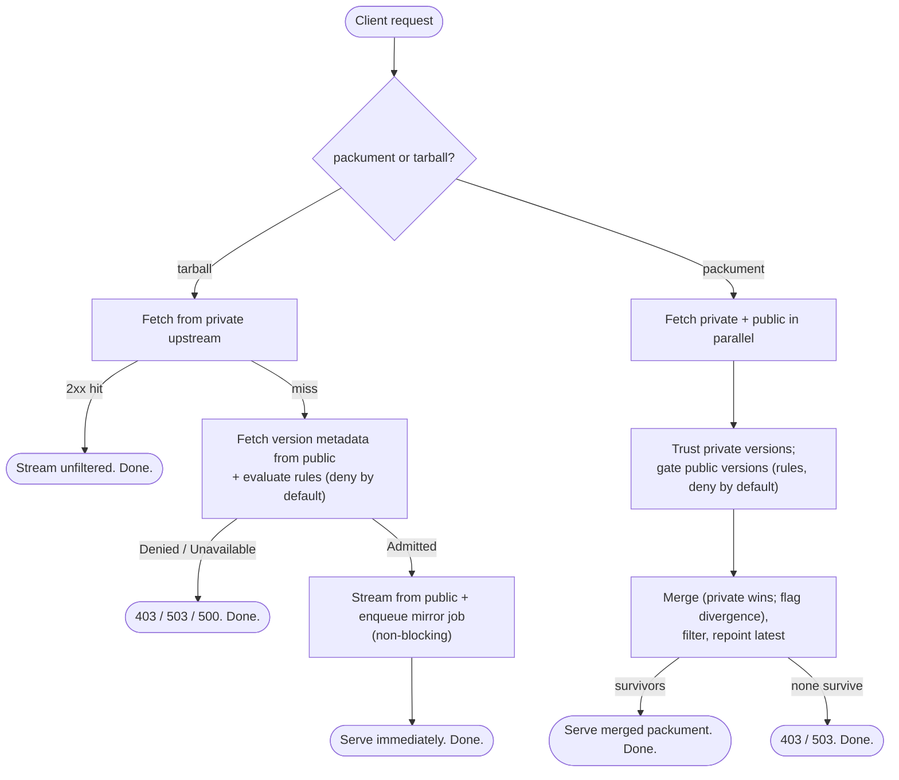

# Architecture & Requirements

This is the **index** to Écluse's systems design. It captures the vision, how a
request flows end to end, and what is out of scope; the detailed design of each
concern lives in the linked documents under [`architecture/`](architecture/).
Development practices — codebase layout, testing strategy, and CI / repo
requirements — live in [`../CONTRIBUTING.md`](../CONTRIBUTING.md).

> These documents describe the **intended target design** (the design of record),
> not necessarily the current state of the code. Implementation tracks toward them
> slice by slice; a slice's PR reconciles the doc where its as-built reality diverges.
> Read them as the destination — and check `git` and the `planning/` DAG for what has
> actually shipped.

## Vision

Supply chain attacks through malicious or hijacked package publications are an
increasing threat in high-volume ecosystems like npm. **Écluse** (package
`ecluse`) is a lightweight proxy that sits between consumers (developers, CI)
and the npm registry, applying a configurable resilience policy before any
package reaches a build — without taking on the cost or complexity of hosting
packages itself.

The name is French for a canal lock — a chamber whose gates never open at once.
That is the posture: not a wall that blocks, but a controlled passage every
dependency is held in and cleared through before it is admitted to a build. The
goal is resilience — mitigating the blast radius of a bad publish — rather than
malware detection.

The proxy is not a registry. It delegates storage to whatever backend the
operator chooses (e.g. AWS CodeArtifact or GCP Artifact Registry), and enforces a
configurable policy on what may be fetched and mirrored from the public registry.

## Request Lifecycle

The two request shapes diverge in how they use the upstreams — a tarball
*falls back*, a packument *merges*:

A **tarball/artifact** request is gated for *that one version*: a private-upstream
hit is streamed unfiltered (already vetted); on a private miss the proxy fetches
the version's metadata from the public upstream, runs the rules, and either streams
it from public **and enqueues a mirror job** or returns the serve
[error model](architecture/web-layer.md#error-model) (403 / 503 / 500). Lockfile
installs (`npm ci`) hit tarball URLs directly, often with no preceding packument
request, so the artifact path gates on its own. **Mirroring is demand-driven** — a
job is enqueued when an artifact is *accepted on the tarball path*, not when a
packument is filtered — so only versions actually pulled are mirrored.

A **packument** request is not a private-then-public fallback but a **merge**: the
private and public upstreams are fetched in parallel, public versions are filtered
by the rules (denied / undecidable removed) while private versions are trusted, and
the two are combined into one document — private wins on a version collision, an
integrity divergence between the two is flagged as a supply-chain signal, `latest`
is repointed to the newest survivor across the union, and a 403/503 is returned
only if nothing survives. Merging — rather than short-circuiting on a private hit —
is what keeps not-yet-mirrored public versions **visible**, so demand-driven
mirroring can fire for them. See
[Registry Model → Packument merge](architecture/registry-model.md#packument-merge-across-upstreams)
and [Rules Engine → Applying verdicts to a packument](architecture/rules-engine.md#applying-verdicts-to-a-packument).

## Document Map

| Document | Covers |
|---|---|
| [Diagrams](architecture/diagrams.md) | **Visual companion (Mermaid):** system overview, packument / tarball / worker sequences, and the rules-engine and credential lifecycles. |
| [Registry Model](architecture/registry-model.md) | The three-registry model and the `RegistryClient` protocol handle. |
| [Internal Domain Model](architecture/domain-model.md) | `PackageDetails` and the ecosystem-agnostic signal vocabulary the rules engine consumes. |
| [Multi-Ecosystem Hosting](architecture/hosting.md) | Mounting ecosystems under path prefixes, URL rewriting, and dispatch. |
| [Web Layer](architecture/web-layer.md) | The raw-WAI front door: routing, the control/data-plane split, streaming, middleware. |
| [API Surface & Capability Manifest](architecture/api-surface.md) | The OpenAPI **capability manifest** — which protocols Écluse speaks and what is / isn't supported — generated from the route enumeration × mounts; the synthesized-packument schema. |
| [Rules Engine & Responses](architecture/rules-engine.md) | Deny-by-default evaluation, the rule tiers, the CVE subsystem, and denial responses. |
| [Cloud Backends & Mirroring](architecture/cloud-backends.md) | The mirror queue and the two cloud handles (`MirrorQueue`, `CredentialProvider`); AWS & GCP. |
| [Configuration & Authentication](architecture/configuration.md) | Environment configuration, outbound registry credentials, and inbound client authentication. |
| [Access & Credential Model](architecture/access-model.md) | The per-mount credential strategy (`passthrough` / `service` / `delegated-cache`), edge authentication, and how each interacts with caching and authorisation. |
| [Security Invariants](architecture/security.md) | Outbound-request & input-validation defences — identifier canonicalisation, the outbound host allowlist, internal-range blocking, and response bounds (issue #11). |
| [Observability](architecture/observability.md) | Opt-in, vendor-neutral OpenTelemetry/OTLP tracing & metrics; Datadog as a first-class but optional target. |
| [Technology Stack](architecture/technology-stack.md) | Library choices and the key cross-cutting decisions. |
| [Release & Supply-Chain Operations](architecture/release-supply-chain.md) | The reproducible OCI image, the publish/attest chain (keyless provenance + SBOM), Docker Hub token handling, and CVE scanning + dependency freshness. |

## Out of Scope (for now)

- Package hosting / storage (delegated to the configured registries).
- Mirroring to raw object storage (S3 / GCS). The mirror target is a registry and
  writes go through `publishArtifact`, so no blob-store handle is introduced;
  revisit only if a non-registry mirror target is ever wanted.
- Web UI or admin API.
- **Re-specifying upstream registry protocols** in the
  [capability manifest](architecture/api-surface.md). Écluse documents *its
  coverage* of each protocol — and what is unsupported — not npm's full
  packument / registry contract: clients hardcode that, and it is npm's to specify.
- PyPI and other non-npm **adapters** — the hosting model and `RegistryClient`
  handle are designed to accommodate them (see
  [Multi-Ecosystem Hosting](architecture/hosting.md#multi-ecosystem-hosting)), but
  only the npm adapter ships at launch.
- Cloud IAM validation at the proxy edge (gateway concern).
- Local on-disk caching of artifacts (the mirror retry window is acceptable).
- **GCP backends at launch** — the cloud handles (mirror queue, managed-registry
  token) are designed for GCP from day one, but shipping a GCP backend is gated on
  the client-viability spike; AWS ships first (see
  [Cloud Backends](architecture/cloud-backends.md#cloud-backends)).
