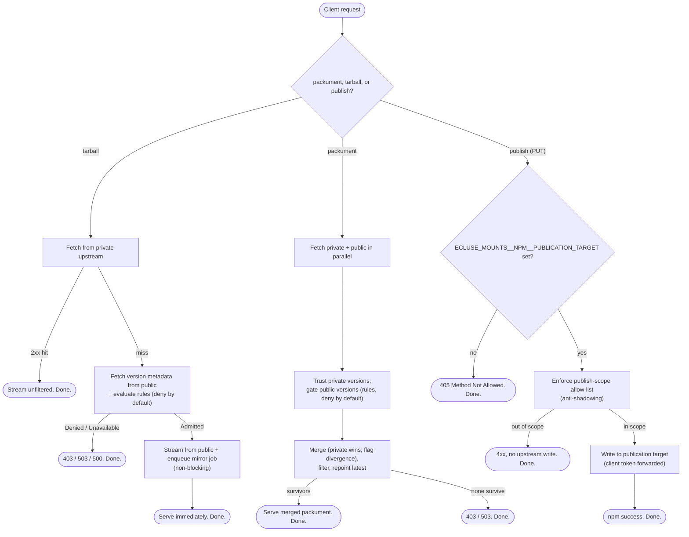

# Architecture and requirements

Index to Écluse's systems design: the vision, how a request flows, and what is out of
scope. Each concern's detailed design lives under [`architecture/`](architecture/).
Development practices, layout, testing, and CI live in
[`../CONTRIBUTING.md`](../CONTRIBUTING.md); the _why_ is in
[`../MOTIVATION.md`](../MOTIVATION.md). This document and its links are the _how_.

> These documents describe the **target design**, not necessarily the current code.
> Implementation tracks toward them; check `git` and the `planning/` DAG for what has
> shipped.

## Vision

Supply-chain attacks through malicious or hijacked publications are a growing threat in
high-volume ecosystems like npm. **Écluse** (package `ecluse`) is a lightweight proxy
between consumers (developers, CI) and the upstream registry that applies a configurable
policy before any package reaches a build, without hosting packages itself.

The name is French for a canal lock: the controlled passage every dependency clears
before it reaches a build. The goal is resilience, mitigating the blast radius of a bad
publish, not malware detection.

Écluse is not a registry. It delegates storage to the operator's backend (e.g. AWS
CodeArtifact or GCP Artifact Registry) and enforces policy on what may be fetched and
mirrored from the public registry.

## Codebase decomposition

Écluse builds as three libraries behind one [`ecluse.cabal`](../ecluse.cabal), splitting
the ecosystem-agnostic core, the effectful runtime edge, and the composition shell:

- **`ecluse-core`** (`core/src`, `Ecluse.Core.*`): the ecosystem-agnostic core, the
  domain model, registry protocol and version grammars, pure and effectful rule tiers,
  the CVE advisory lookup and the OSV advisory-producer logic, credential-refresh policy,
  queue and security primitives, the agnostic server layer (routing, response model,
  streaming, conditional-GET, metadata cache, serve admission, request pipeline), the
  telemetry instrument catalogue and its abstract ports, and the mirror worker. Its
  effects are all local, injectable values (an http `Manager`, a SQLite handle); it
  depends on the OpenTelemetry API only, never the SDK, and never on `warp` or `amazonka`,
  so it carries no process-global wiring and no cloud SDK.
- **`ecluse-runtime`** (`runtime/src`, `Ecluse.Runtime.*`): the effectful edge, the
  capabilities that bind the process-global runtime substrate the core excludes: the
  OpenTelemetry SDK / OTLP export wiring, the `warp` server binding, the `katip` log
  scribes, the runtime `Env` handle bundle, and the cloud adapters (the AWS SQS queue,
  the CodeArtifact credential mint, the S3 advisory-database sync and export) that
  concretely implement the core's handle interfaces. It depends on `ecluse-core`.
- **`ecluse`** (`src`, `Ecluse.*`): the composition shell, the config loader and
  resolver, the `Composition` root and `Boot` bracket that assemble the runtime `Env`
  from configuration, and the `proxy`/`pilot`/`dredger` role runners that wire the
  capabilities together and run them. It depends on `ecluse-runtime` and `ecluse-core`.
- **`ecluse` executable** (`app/Main.hs`): a multicall CLI router for the `serve`,
  `pilot`, and `dredger` roles.

The build graph enforces the boundary: the dependency arrow points inward only
(`ecluse` → `ecluse-runtime` → `ecluse-core`), and the core's unit suite depends on
neither higher tier, so a core module reaching outward fails to compile.
[`ecluse.cabal`](../ecluse.cabal) is the authoritative component and module map.

## Request lifecycle

The three request shapes use the upstreams differently: a tarball _falls back_, a
packument _merges_, and a publish _writes through_.

- **Tarball/artifact**, gated for one version. A private hit streams unfiltered (already
  vetted); a private miss fetches the version's public metadata, runs the rules, and
  either streams from public and enqueues a mirror job or returns the
  [error model](architecture/web-layer.md#error-model) (403 / 503 / 500). Lockfile
  installs (`npm ci`) hit tarball URLs directly, so the artifact path gates on its own.
  Mirroring is demand-driven: a job is enqueued only when an artifact is accepted here,
  so only versions actually pulled are mirrored.
- **Packument**, a merge, not a fallback. Private and public upstreams are fetched in
  parallel; public versions are rule-filtered while private versions are trusted; the two
  combine into one document (private wins a collision, integrity divergence is flagged,
  `latest` is repointed to the newest survivor). A 403/503 returns only if nothing
  survives. Merging keeps not-yet-mirrored public versions visible so demand-driven
  mirroring can fire for them. See
  [Packument merge](architecture/registry-model.md#packument-merge-across-upstreams) and
  [Applying verdicts](architecture/rules-engine.md#applying-verdicts-to-a-packument).
- **Publish** (`PUT /{pkg}`, `npm publish`), the one client-driven write. Accepted at the
  mount, checked against the operator's publish-scope allow-list (anti-shadowing, rejected
  before any upstream write), and relayed to the publication target with the publisher's
  own forwarded credential. Opt-in (a `405` when `ECLUSE_MOUNTS__NPM__PUBLICATION_TARGET`
  is unset). Published packages read back through the private upstream, distinct from the
  mirror target the worker writes with Écluse's own credential. See
  [Publishing first-party packages](architecture/registry-model.md#publishing-first-party-packages-the-publication-target).

## Document map

| Document | Covers |
| --- | --- |
| [Diagrams](architecture/diagrams.md) | Mermaid visual companion: system overview, packument / tarball / worker sequences, rules and credential lifecycles. |
| [Registry Model](architecture/registry-model.md) | The four registry roles (two reads, two writes) and the `RegistryClient` handle. |
| [Internal Domain Model](architecture/domain-model.md) | `PackageDetails` and the ecosystem-agnostic signals the rules engine consumes. |
| [Web Layer](architecture/web-layer.md) | Raw-WAI front door: routing and multi-ecosystem mounts, the control/data-plane split, streaming, middleware, and graceful shutdown. |
| [API Surface & Capability Manifest](architecture/api-surface.md) | The OpenAPI capability manifest and the synthesised-packument schema. |
| [Rules Engine & Responses](architecture/rules-engine.md) | Deny-by-default evaluation, the rule tiers, the CVE subsystem, and denial responses. |
| [Cloud Backends & Mirroring](architecture/cloud-backends.md) | The mirror queue and the two cloud handles (`MirrorQueue`, `CredentialProvider`); AWS and GCP. |
| [Configuration & Authentication](architecture/configuration.md) | Environment config, outbound registry credentials, and inbound client auth. |
| [Access & Credential Model](architecture/access-model.md) | The per-mount credential strategy (`passthrough` / `service`), edge auth, and the no-private-cache posture. |
| [Security Invariants](architecture/security.md) | Outbound-request and input-validation defences, canonicalisation, the host allowlist, internal-range blocking, response bounds. |
| [Fault Model](architecture/fault-model.md) | Failures as typed values, the confined-exception pattern, the two outer edges (request perimeter, process supervisor), the disposition vocabulary, and the stays-inner catch inventory. |
| [Threat Model](https://ecluse-proxy.com/threat-model.html) | The STRIDE register, generated from the Threat Dragon model (`threat-modelling/ecluse.json`); the single source of truth for the system's threats. |
| [Observability](architecture/observability.md) | Opt-in OpenTelemetry/OTLP tracing and metrics; Datadog optional. |
| [Technology Stack](architecture/technology-stack.md) | Library choices and the key cross-cutting decisions. |
| [Release & Supply-Chain Operations](architecture/release-supply-chain.md) | The reproducible OCI image, the publish/attest chain (provenance + SBOM), Docker Hub tokens, and CVE and freshness scanning. |

## Out of scope (for now)

- Package hosting / storage (delegated to the registries).
- Mirroring to raw object storage (S3 / GCS): the mirror target is a registry and writes
  go through `publishArtifact`; revisit only for a non-registry mirror target.
- Web UI or admin API.
- Re-specifying upstream registry protocols in the
  [capability manifest](architecture/api-surface.md): Écluse documents its coverage, not
  npm's full packument / registry contract, which clients hardcode.
- Non-npm adapters: the mount model and `RegistryClient` handle accommodate them (see
  [Multi-ecosystem mounts](architecture/web-layer.md#multi-ecosystem-mounts)), but only npm
  ships at launch. PyPI and RubyGems are planned.
- Cloud IAM validation at the proxy edge (gateway concern).
- Local on-disk caching of artifacts (the mirror retry window is acceptable).
- GCP backends at launch: the cloud handles (mirror queue, managed-registry token) are
  designed for GCP, but a GCP backend is gated on the client-viability spike; AWS ships
  first (see [Cloud Backends](architecture/cloud-backends.md#cloud-backends)).
