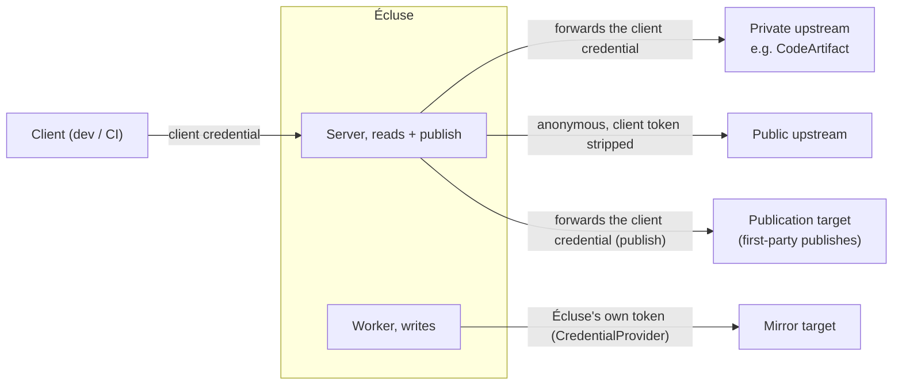

# Access and credential model

> Part of the [Écluse architecture overview](../architecture.md).

Écluse sits in the read path of someone else's build, so it keeps three concerns apart:

- **Edge authentication**: who is calling the proxy?
- **Authorisation (retrievability)**: which packages may this caller retrieve?
- **Credential supply**: what bearer token does each upstream require on the wire?

Authorisation is always delegated, to the upstream or to the deployment edge; Écluse never builds
an authentication system. It's a thin network broker, and a shared private cache is never worth
the re-authorisation machinery it demands.

## The shipped model: passthrough

Écluse forwards the caller's own credential to the private upstream, which authorises each
request; the public upstream is queried anonymously, with that credential stripped. Because the
upstream re-decides every request, this is correct whether its read authorisation is coarse
(repo-level, e.g. GCP Artifact Registry) or fine-grained (per-package, e.g. CodeArtifact
resource policies), and authorisation granularity is not Écluse's concern. It's safe under any
upstream authorisation model; the costs are a per-request round-trip and no sharing of the
private origin across callers, both accepted by design.

The client's credential is never sent to the public upstream. It is forwarded to the private
upstream (the shipped passthrough posture) and, on publish, to the publication target; the
worker writes the mirror target with Écluse's own token. See
[Credential flow and authority](registry-model.md#credential-flow-and-authority).

## Why Écluse never caches the private origin

A shared cache of the private origin is tempting (one fetch could serve many callers) but never
safe for free. A cache key carries no credential dimension, so a shared private entry is safe
only if every hit is re-authorised against the upstream (a per-request probe) or authority moves
to the edge so everyone past it shares one view. Both buy cache-sharing with standing overhead,
so Écluse declines the trade: the private origin is read per request and never entered into the
shared cache, so the cross-client disclosure hazard is unrepresentable by construction rather
than fenced off by a probe. Only the anonymous public-gated origin is cached, one shared document
with no per-caller authority to preserve. Reintroducing a shared private cache later would be a
deliberate design change that must first re-establish per-hit authorisation, never a config
toggle.

## Edge authentication

The npm client authenticates with an opaque bearer in `.npmrc` (`//host/:_authToken=`) or via
`npm login`; it doesn't speak SigV4, per-request mTLS, or interactive OIDC. So edge
authentication must terminate into a storable bearer or be handled in front of Écluse. Two
modes ship:

1. **Open**: no app-level check, access gated at the network layer (VPC, mesh). Appropriate on
   a closed network.
2. **Static token**: `ECLUSE_SERVER__AUTH_TOKEN`, presented as `Bearer` / `_authToken`.
   Standard npm tooling supports it directly.

Validating cloud IAM at the npm edge is out, since the npm client can't speak it.

## Publishing: the publication target (passthrough write)

The one client-driven write, `npm publish` to the
[publication target](registry-model.md#publishing-first-party-packages-the-publication-target),
also uses passthrough: Écluse forwards the publisher's own `Authorization` / `_authToken`. It
substitutes no identity here, unlike a mirrored mount's mirror-target write, which always uses
Écluse's own `CredentialProvider` token.

Before any forward, the publish path enforces the publish scope allow-list
(`ECLUSE_MOUNTS__NPM__PUBLISH_ALLOW`): a name outside the configured scopes is refused with no
upstream write. The allow-list scopes names, not callers, and is not authentication. A static
`ECLUSE_MOUNTS__NPM__PUBLICATION_TARGET_TOKEN` makes Écluse publish under its own credential, so
it's fail-closed: set without `ECLUSE_SERVER__AUTH_TOKEN`, Écluse refuses to boot (see
[Security → a static publish credential is fail-closed](security.md#a-static-publish-credential-is-fail-closed)).
Like every credential-bearing request, the publish relay disables redirect-following.

## Caching

The [metadata cache](web-layer.md#metadata-cache) holds only the anonymous public-gated origin,
under a key with no credential dimension (the upstream base URL plus the package) and a value
that is never a credential or credential-derived verdict. The private origin is read per request
with the caller's forwarded token.

The assembled-representation store sits beside it, memoising the encoded merged document keyed
by a content fingerprint of every input it's a function of, including the digest of the private
document this request's own authorised fetch returned. A credential-blind key would let one
caller's entry answer another, but a content key can only be produced by a caller whose own
per-credential private read returned identical content, so the private fetch and authorisation
are never shared or skipped.

## Credential supply: the `CredentialProvider`

The [`CredentialProvider`](cloud-backends.md#credential-provider) mints and refreshes a bearer
for an upstream endpoint that requires one: a mirrored mount's mirror-target write, and, for
CodeArtifact, the token behind its npm endpoint. A serve-only passthrough deployment holds no
standing credential, since passthrough reads use the forwarded caller token.

## Safe defaults and unrepresentable unsafe combinations

- The default and only credential model today is passthrough; a correct deployment needs
  nothing else.
- A shared private-origin cache is forbidden by construction: no code path admits a private
  entry to the metadata cache.
- A static publish credential without a verifiable edge is refused at boot
  (`PublishStaticCredentialNeedsEdge`).
- Unknown or contradictory configuration fails fast at startup
  ([config validation](configuration.md#validation-fail-fast-reject-the-unknown)).

## Multi-instance is an isolation tool, not an authorisation mechanism

Running separate Écluse instances per tenant is a legitimate blast-radius or policy-isolation
choice, but not a substitute for the credential model, and it scales to team granularity, never
per-developer.

## Planned: service credentials and trusted edge identity

Two extensions are designed but not shipped. A service credential model would authenticate the
caller at the edge and let Écluse read the upstreams with its own workload identity through the
[`CredentialProvider`](cloud-backends.md#credential-provider), forwarding no caller credential.
A trusted-edge-identity mode would accept a verified identity asserted by a fronting proxy,
cloud IAP, or service mesh, honoured only over a verifiable binding to that edge (mutual TLS, or
a shared secret / HMAC on the assertion), since a bare trusted header is forgeable anywhere
Écluse is reachable off the edge path. Neither is config-selectable today; passthrough is what
ships.

## Universal invariants

- The caller's credential is never sent to the public upstream.
- Outbound fetches stay within the [security invariants](security.md): https-only egress with
  certificate validation, the host allowlist, identifier canonicalisation, and bounded
  responses.
- Public versions are always gated by the [rules engine](rules-engine.md); trusted private
  versions enter the [packument merge](registry-model.md#packument-merge-across-upstreams)
  unfiltered.
