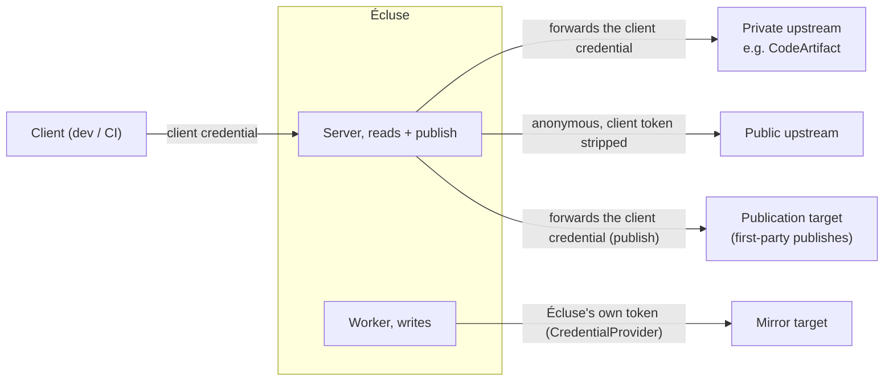

# Access and credential model

> Part of the [Écluse architecture overview](../architecture.md).

Which credential Écluse sends on each request, who authorises it, and what an operator gets to
choose. The proxy sits in the read path of someone else's build, so it keeps three concerns apart:

- **Edge authentication**: who is calling the proxy?
- **Authorisation (retrievability)**: which packages may this caller retrieve?
- **Credential supply**: what bearer token does each upstream require on the wire?

Écluse always delegates authorisation, to the upstream or to the deployment edge, and never
builds an authentication system. It's a thin network broker, and a shared private cache is never
worth the re-authorisation machinery it demands.

## The shipped model: passthrough

Écluse forwards the caller's own credential to the private upstream, which authorises each
request. The proxy queries the public upstream anonymously, with that credential stripped. The
upstream re-decides every request. Passthrough therefore holds whether its read authorisation is
coarse (repo-level, for example GCP Artifact Registry) or fine-grained (per-package, for example
CodeArtifact resource policies). Authorisation granularity is not Écluse's concern. The costs are
a per-request round-trip and no sharing of the private origin across callers, both accepted by
design.

Écluse never sends the client's credential to the public upstream. It forwards that credential to
the private upstream, and on publish to the publication target. The worker writes the mirror
target with Écluse's own token. See
[Credential flow and authority](registry-model.md#credential-flow-and-authority).

```mermaid
flowchart LR
    Client["Client (dev / CI)"]
    subgraph E["Écluse"]
        SRV["Server, reads + publish"]
        WK["Worker, writes"]
    end
    Priv["Private upstream<br/>e.g. CodeArtifact"]
    Pub["Public upstream"]
    Mirror["Mirror target"]
    PubT["Publication target<br/>(first-party publishes)"]

    Client -->|"client credential"| SRV
    SRV -->|"forwards the client credential"| Priv
    SRV -->|"anonymous, client token stripped"| Pub
    SRV -->|"forwards the client credential (publish)"| PubT
    WK -->|"Écluse's own token (CredentialProvider)"| Mirror
```

## Why Écluse never caches the private origin

A shared cache of the private origin is tempting, since one fetch could serve many callers, but
it is never safe for free. A cache key carries no credential dimension. A shared private entry is
safe in only two ways. Either the proxy re-authorises every hit against the upstream (a
per-request probe), or authority moves to the edge so everyone past it shares one view. Both buy
cache-sharing with standing overhead, so Écluse declines the trade. It reads the private origin
per request and never enters it into the shared cache. The cross-client disclosure hazard is
unrepresentable by construction, not fenced off by a probe. The cache holds only the anonymous
public-gated origin, one shared document with no per-caller authority to preserve. Adding a
shared private cache later is a deliberate design change that must first re-establish per-hit
authorisation, never a config toggle.

## Edge authentication

The npm client authenticates with an opaque bearer in `.npmrc` (`//host/:_authToken=`) or
through `npm login`. It doesn't speak SigV4, per-request mTLS, or interactive OIDC. So edge
authentication must end in a storable bearer, or something in front of Écluse must handle it.
Two modes ship:

1. **Open**: no app-level check, access gated at the network layer (VPC, mesh). Appropriate on
   a closed network.
2. **Static token**: `ECLUSE_SERVER__AUTH_TOKEN`, presented as `Bearer` / `_authToken`.
   Standard npm tooling supports it directly.

Validating cloud IAM at the npm edge is out of scope, since the npm client can't speak it.

Each mount's ecosystem decides the form the credential arrives in. An npm mount accepts `Bearer`
(`_authToken`), because npm tooling sends that, and reads nothing else as a credential. Every mount
compares the credential the same way: constant-time against the configured token. Écluse refuses a
request that carries no credential the mount recognises.

## Publishing: the publication target (passthrough write)

The one client-driven write, `npm publish` to the
[publication target](registry-model.md#publishing-first-party-packages-the-publication-target),
also uses passthrough: Écluse forwards the publisher's own `Authorization` / `_authToken`. It
substitutes no identity here, unlike a mirrored mount's mirror-target write, which always uses
Écluse's own `CredentialProvider` token.

Before any forward, the publish path enforces the publish scope allow-list
(`ECLUSE_MOUNTS__NPM__PUBLISH_ALLOW`). Écluse refuses a name outside the configured scopes and
makes no upstream write. The allow-list scopes names, not callers, and is not authentication. A
static `ECLUSE_MOUNTS__NPM__PUBLICATION_TARGET_TOKEN` makes Écluse publish under its own
credential, so it's fail-closed. Set it without `ECLUSE_SERVER__AUTH_TOKEN` and Écluse refuses to
boot (see
[Security → a static publish credential is fail-closed](security.md#a-static-publish-credential-is-fail-closed)).
Like every credential-bearing request, the publish relay disables redirect-following.

## Caching

The [metadata cache](web-layer.md#metadata-cache) holds only the anonymous public-gated origin.
Its key has no credential dimension (the upstream base URL plus the package), and its value is
never a credential or a credential-derived verdict. The proxy reads the private origin per
request with the caller's forwarded token.

The assembled-representation store sits beside it. It memoises the encoded merged document under
a content fingerprint of every input that document is a function of. That fingerprint includes
the digest of the private document this request's own authorised fetch returned. A
credential-blind key would let one caller's entry answer another. A content key needs a caller
whose own per-credential private read returned identical content. No request shares or skips the
private fetch and its authorisation.

## Credential supply: the `CredentialProvider`

The [`CredentialProvider`](cloud-backends.md#credential-provider) mints and refreshes a bearer
for an upstream endpoint that requires one. Écluse needs one for a mirrored mount's mirror-target
write and, for CodeArtifact, for the token behind its npm endpoint. A serve-only passthrough
deployment holds no standing credential, since passthrough reads use the forwarded caller token.

## Safe defaults and unrepresentable unsafe combinations

- Passthrough is the default and only credential model today. A correct deployment needs
  nothing else.
- No code path admits a private entry to the metadata cache, so a shared private-origin cache
  cannot exist.
- Écluse refuses to boot with a static publish credential and no verifiable edge
  (`PublishStaticCredentialNeedsEdge`).
- Unknown or contradictory configuration fails fast at startup
  ([config validation](configuration.md#validation-fail-fast-reject-the-unknown)).

## Multi-instance is an isolation tool, not an authorisation mechanism

Separate Écluse instances per tenant are a legitimate blast-radius or policy-isolation choice.
They are not a substitute for the credential model, and they scale to team granularity, never
per-developer.

## Planned: service credentials and trusted edge identity

Two extensions are designed but not shipped. A service credential model would authenticate the
caller at the edge. The proxy would then read the upstreams with its own workload identity
through the [`CredentialProvider`](cloud-backends.md#credential-provider), and forward no caller
credential. A trusted-edge-identity mode would accept a verified identity asserted by a fronting
proxy, cloud IAP, or service mesh. It would honour that assertion only over a verifiable binding
to the edge: mutual TLS, or a shared secret / HMAC on the assertion. A bare trusted header is
forgeable anywhere Écluse is reachable off the edge path. Neither is config-selectable today.
Passthrough is what ships.

## Universal invariants

- Écluse never sends the caller's credential to the public upstream.
- Outbound fetches stay within the [security invariants](security.md): https-only egress with
  certificate validation, the host allowlist, identifier canonicalisation, and bounded
  responses.
- The [rules engine](rules-engine.md) always gates public versions. Trusted private versions
  enter the [packument merge](registry-model.md#packument-merge-across-upstreams) unfiltered.
