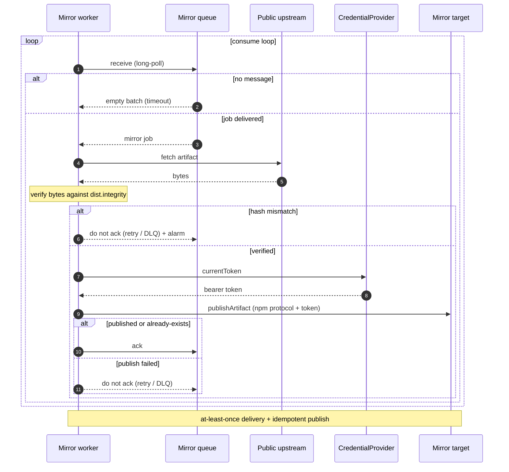

# Cloud backends and mirroring

> Part of the [Écluse architecture overview](../architecture.md).

## Mirror queue

Mirroring is demand-driven: when a client pulls an artifact whose version passes the rules
(the tarball path on a private-upstream miss), the proxy enqueues a mirror job (package,
version, artifact location, filename) and serves the client immediately, never blocking on
mirror completion. Metadata requests filter but never mirror, so only versions a client
actually fetches are mirrored. The publish target is resolved from the mount configuration,
not named on the message.

A separate worker receives jobs and, for each one:

1. **Probes the mirror target** and acknowledges a confirmed-present duplicate outright,
   sparing a fleet-wide install's duplicate jobs a full download and no-op publish. A probe
   that cannot tell falls through to the full pipeline.
2. **Re-evaluates current policy** through the same shared admission gate the serve path runs
   (`Ecluse.Core.Package.Admission`), and re-checks the fetch URL against the mount's
   tarball-host gate. A version refused since its serve-time admit (a new advisory, a raised
   floor, a withdrawn file) is dropped rather than frozen into the rule-exempt mirror.
3. Fetches the artifact from the public upstream.
4. **Verifies its bytes against the re-admitted artifact's integrity digest** (npm
   `dist.integrity`, from the current metadata; the queue payload carries no digest at all).
5. Publishes to the mirror target and acknowledges the job.

A hash mismatch fails the job: no publish, it routes to retry or the dead-letter path, and
alarms, so a corrupt or tampered artifact never enters the private upstream, which is later
served without rules. At-least-once delivery is safe because publishing is idempotent: versions
are immutable, so a redelivered job finds it already present and succeeds.

Between approval and a package appearing in the private upstream, requests fall through to the
public upstream and re-run the deterministic rules.

The mirror worker exists only when a mount mirrors: a serve-only deployment starts no worker
and builds no queue. It runs inside the `ecluse proxy` process as a supervised concurrent
thread, not a separate service, and its consume-loop heartbeat backs the process's liveness
surface, distinct from HTTP readiness. The queue backend is derived from the configured queue
URL: SQS for durability, or a bounded in-memory queue with a boot warning when unset (keys in
[USAGE](../../USAGE.md)).

## Cloud backends

Écluse couples to a cloud provider in exactly two handles, so a provider is an additive
backend rather than a structural change, the same posture as the
[registry abstraction](registry-model.md#registry-abstraction):

1. **`MirrorQueue`**, the durable hand-off from the request path to the [mirror
   worker](#mirror-queue).
2. **`CredentialProvider`**, which mints the short-lived bearer token for the managed registry
   (see [Credential provider](#credential-provider)).

The npm data plane, publish included, is written once and reused across every cloud (a managed
registry is just an npm endpoint plus a token), so there is no per-cloud publish path. The
mirror and publish paths need no object-store handle; S3 is used only by the advisory-database
sync. AWS ships today; GCP and Azure slot into these same two handles, but neither is built and
neither carries a committed date, each gated on a queue-client de-risking spike.

### Service mapping

| Concern | AWS (shipped) |
|---------|-----|
| Mirror queue | SQS |
| Managed npm registry | CodeArtifact |
| Workload identity / token source | STS / instance role |

The managed registry speaks the npm protocol over HTTPS; only the token source differs per
cloud.

### Credential provider

Outbound auth (proxy to registry) is its own handle: a `CredentialProvider` yields the current
bearer token for a registry endpoint, refreshing before expiry. Today it is used only for the
mirror-target write; private-upstream reads forward the caller's own credential (the shipped
passthrough posture) and the public upstream is anonymous. The per-mount strategies live in
[Access & credential model](access-model.md#the-shipped-model-passthrough) and
[Credential flow and authority](registry-model.md#credential-flow-and-authority).

The mirror-write credential is **derived from the mirror-target URL**, so a token can never be
paired with an endpoint it was not minted for (see
[Configuration → outbound registry credentials](configuration.md#outbound-registry-credentials)).
A mount naming an uninitialised provider fails at boot with the other config errors (see
[Configuration → validation](configuration.md#validation-fail-fast-reject-the-unknown)), never
at runtime.

Because the token is mirror-write only, its blast radius is bounded: only an expired token
*and* a still-failing mint fails the dependent operation, which is the mirror publish (the job
is left un-acked and retries or dead-letters), never the client serve path.
