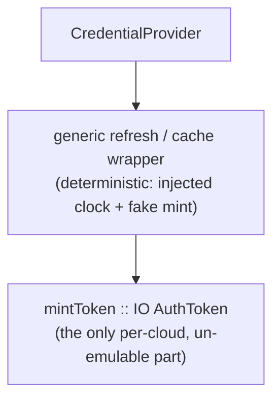

# Cloud Backends & Mirroring

> Part of the [Écluse architecture overview](../architecture.md).

## Mirror Queue

Mirroring is **demand-driven**: when a client pulls an *artifact* whose version
passes the rules (the tarball path on a private-upstream miss), the proxy:

1. Enqueues a mirror job (the mirror target URL, package name, version, and
   artifact location) to the configured **mirror queue**.
2. Returns the artifact to the client **immediately**, no blocking on mirror
   completion.

Metadata (packument) requests filter but do **not** mirror, only versions a
client actually fetches are mirrored, rather than every admitted version of every
package anyone browses.

The queue is a cloud-agnostic handle with backends for AWS SQS and GCP Pub/Sub
(see [Cloud Backends](#cloud-backends)). A consumer (a separate worker process)
receives jobs, fetches the artifact from the public upstream, **verifies its bytes
against the version's integrity hash** (npm `dist.integrity`), publishes it to the
mirror target via `publishArtifact`, and acknowledges the job. A hash mismatch
fails the job (no publish, it routes to retry/DLQ) and alarms, so a corrupt or
tampered artifact never enters the private upstream, which is later served without
rules. The worker thus
touches both cloud handles, [`MirrorQueue`](#queue-abstraction) to receive and
[`CredentialProvider`](#credential-provider) to authenticate the write, while the
publish itself is **plain npm protocol plus a bearer token**: pushing to a managed
registry is no different from pushing to any npm registry, so there is no
per-cloud publish path. Both backends give at-least-once delivery with retry and a
dead-letter path for jobs that keep failing, the semantics the worker needs,
regardless of cloud. At-least-once is safe here because **publishing is idempotent**: registries treat
versions as immutable, so a redelivered job's publish finds the version already
present and is treated as success. The worker does **not** re-run the rules, the
artifact was gated at serve time when the job was enqueued; the enqueue→process
window is too short for meaningful policy drift, and anything mirrored is in any
case later served without rules.

This means there is a window between a package being approved and it appearing
in the private upstream. Subsequent requests for the same package during this
window will fall through to the public upstream again and re-run rules; this is
acceptable; the rules are deterministic for a given package version.

### Process model: The Unified Multicall Binary

Écluse ships as a **single, unified executable** (the "BusyBox" or "multicall" pattern). Instead of building separate binaries for the proxy server, the OSV ingestion pipeline (`pilot`), and the registry cleanup worker (`dredger`), `app/Main.hs` acts as a CLI router that runs different sub-systems based on the invocation command (e.g., `ecluse serve`, `ecluse pilot`, `ecluse dredger`). 

This pattern is a deliberate architectural and security decision:
1. **Config & Rule Synchronization:** Because `pilot`, `dredger`, and `serve` are the same binary parsing the same configuration file, they share the exact same runtime state (the same `Env` and config models). A manual package revocation rule (`DenyByIdentity`) configured in `ecluse.yaml` is guaranteed to be respected by Dredger (to purge it) and the Proxy (to block it). There is zero chance of drift.
2. **First-party Scope Protection:** By sharing the configuration, Dredger is inherently aware of the `ECLUSE_MOUNTS__NPM__PUBLISH_SCOPES` (internal first-party scopes) that the Proxy routes to the Publication Target. Dredger automatically and unconditionally excludes these scopes from its purge routines, preventing catastrophic data loss of first-party packages.
3. **Collapsed Registry Mitigation:** If an operator misconfigures the system by collapsing the Mirror Target and the Publication Target onto a single shared registry, Dredger will detect this and explicitly refuse to boot. This hard failure prevents Dredger from treating first-party packages (that might fall outside the explicit `ECLUSE_MOUNTS__NPM__PUBLISH_SCOPES`) as stale public ones and deleting them.
4. **Deployment Simplicity:** The operator deploys the same versioned Docker image for all three components, simply changing the container command and the IAM role.

**Security Boundaries:** The security model relies on the orchestrator (Kubernetes or AWS ECS). The roles (e.g., `s3:GetObject` for Proxy vs `s3:PutObject` for Pilot) and network egress bounds (e.g., zero ingress for Dredger) are applied per-container. Even though the proxy *contains* the Pilot code, it has neither the IAM permissions nor the CLI invocation to execute it.

At launch, the **mirror worker** runs in the `ecluse serve` process as a supervised concurrent thread (`async` / `unliftio`), not a separate service: worker load is front-loaded, a cold mirror back-fills heavily for the first few days, then settles to a modest steady state, so an extra deployable is not yet worth it. The worker carries its **own health/liveness surface** (a consume-loop heartbeat / last-successful-poll), distinct from the server's HTTP readiness.

The worker is the consumer of the composition root's **publish-side
`RegistryClient`**: it `publishArtifact`s approved packages to the mirror target
through it, paired with the global [`CredentialProvider`](#credential-provider) for
the bearer token. That handle is resolved **per ecosystem** at the composition root, the same `ecosystem → RegistryClient` resolution the mounts are keyed by. The
request serve path does **not** share it: each packument upstream builds its own
client over the shared HTTP manager (two upstreams, per-origin credentials), so the
handle is **publish-side only**.

## Cloud Backends

Écluse couples to a cloud provider in exactly **two handles**, both records of
functions (the Handle pattern; see [Handles](#handles-records-of-functions)) so that
a provider is an additive backend rather than a structural change, the same
posture as [`RegistryClient`](registry-model.md#registry-abstraction):

1. **`MirrorQueue`**, the durable hand-off from the request path to the mirror
   worker (see [Mirror Queue](#mirror-queue)).
2. **`CredentialProvider`**, mints the short-lived bearer token for any registry
   endpoint (private upstream or mirror target) that is a cloud-managed registry
   rather than a static-credential one (see
   [Credential Provider](#credential-provider)).

These two are the **cloud axis**. The **ecosystem axis** is
[`RegistryClient`](registry-model.md#registry-abstraction), which is
cloud-agnostic, so the npm protocol/data plane, **including publish**, is written
once and reused across every cloud (a managed registry is just an npm endpoint
plus a token; there is no per-cloud publish path and no object-store handle).
Everything else, the proxy core, rules engine, web layer, CVE subsystem, is
cloud-agnostic too. **AWS and GCP are both first-class targets**; the design
admits a third provider by adding backends behind these two handles, **Azure is
the worked example** (designed-for, furthest-out; see
[Azure backends](#azure-backends-designed-for-furthest-out)).

### Handles: records of functions

Every handle, `RegistryClient`, `MirrorQueue`, `CredentialProvider`, is a
**record whose fields are functions** (the *Handle pattern*), constructed by a
per-backend smart constructor (`newSqsQueue :: SqsConfig -> IO MirrorQueue`). This
is Haskell's idiomatic equivalent of an interface with swappable implementations:
the record type is the interface, a smart constructor is a concrete
implementation, and the closure it returns captures that backend's private state
(an `amazonka` env, an HTTP manager) exactly as an object's fields would.

Backend choice is **runtime, config-driven, single-binary**: all adapters are
compiled in, and one **composition root** reads the configured provider, calls the
matching smart constructor, and stores the resulting record in `Env`. Nothing
downstream knows which backend it holds, it just applies the field. This keeps
the cloud SDKs' selection in one place rather than smeared across the code, and
leaves the door open to split adapters into separate libraries later without
disturbing the handle.

*Alternatives considered.* A **free monad** (operations reified as data, AWS/GCP
as interpreters) and **tagless-final** both abstract the backend too, but they buy
*program-as-data* / compile-time dispatch we do not need: selection here is at
runtime by config, the per-op work lives in the interpreter either way, and both
would mean a heavier dependency than the `ReaderT Env IO` baseline. Records of
functions give the same swappability and trivial test doubles (an in-memory
record) with none of that. The free monad would earn its keep only if we needed to
inspect/rewrite mirror programs (e.g. batch enqueues), and that has a contained
answer behind the existing handle if it ever arises.

### Service mapping

| Concern | AWS | GCP | Azure (designed-for, furthest-out) |
|---------|-----|-----|-----|
| Mirror queue | SQS | Cloud Pub/Sub | Service Bus *or* Storage Queues ([see below](#azure-backends-designed-for-furthest-out)) |
| Managed npm registry | CodeArtifact | Artifact Registry | Azure Artifacts (Azure DevOps feed) |
| Workload identity / token source | STS / instance role | Workload Identity / ADC | Microsoft Entra ID (Managed Identity / Workload Identity Federation) |
| Local emulator (tests) | `ministack` (LocalStack-style) | Google's official Pub/Sub emulator | Service Bus emulator (**AMQP-only**) / Azurite (Storage Queues, REST) |

Both managed registries speak the **npm protocol over HTTPS** and differ only in
how the bearer token is obtained and refreshed, so they sit behind the
[`CredentialProvider`](#credential-provider) handle while the `RegistryClient`
protocol/data plane (`http-client`) is identical across them (see
[Web Layer](web-layer.md#web-layer)).

### Credential Provider

Outbound auth (proxy → registry) is its own handle, separate from
[`RegistryClient`](registry-model.md#registry-abstraction). A `CredentialProvider`
yields the current bearer token for a registry endpoint, refreshing it before
expiry:

```haskell
newtype CredentialProvider = CredentialProvider
  { currentToken :: IO AuthToken }            -- refreshes-before-expiry internally

data AuthToken = AuthToken { secret :: Secret, expiresAt :: Maybe UTCTime }
```

A `CredentialProvider` mints the token for any upstream that needs one: the
**mirror-target write** always, and, under `service`, the **private-upstream read**
as well. Under the default `passthrough` strategy a deployment configures **one**
provider (for the mirror target) and reads forward the client's own credential;
`service` adds a **read** provider for the private upstream (reads use Écluse's own
identity, **per-request and uncached**, Écluse forbids a shared private cache). The
public upstream is anonymous under every strategy. See [Access & Credential Model](access-model.md) and
[Credential flow and authority](registry-model.md#credential-flow-and-authority).

**Providers are global; mounts reference them.** A `CredentialProvider` is the
service's own cloud identity, typically a single **container task role** (AWS) or
**workload identity** (GCP), available process-wide, so it is built **once at the
composition root**, not per mount. A mount carries no provider of its own; it
**names which configured provider** its strategy draws on. In the common deployment
those references collapse to **one** identity: the same container role both writes
the mirror target and (under `service`)
reads the private upstream, Écluse acts as one consistent entity. A multi-cloud
process holds one provider per cloud, keyed by cloud; the region/project scoping
each (`ECLUSE_AWS_REGION` / `ECLUSE_GOOGLE_PROJECT`) are likewise process-global. **A mount
that names a credential source with no initialized provider is a boot-time failure**
(aggregated with other config errors; see
[Configuration → Validation](configuration.md#validation-fail-fast-reject-the-unknown)),
never a runtime surprise.

**The sub-handle that matters.** The interesting logic is the refresh / cache /
expiry / concurrency policy, *not* the cloud call. So a single generic wrapper
holds that policy, parameterised over a tiny per-cloud `mintToken` leaf:



Adapters supply only the leaf: `static` (a fixed token, no expiry), **CodeArtifact**
(`GetAuthorizationToken` via `amazonka`, TTL up to 12h), **ADC** (an OAuth2 access
token, TTL ~1h). The wide TTL spread is exactly why the wrapper refreshes off the
token's own `expiresAt` rather than a fixed interval, the same policy then fits
either cloud, and each cloud contributes ~10 lines. This isolation also bounds the
test gap (see [Testing](#testing)): everything but `mintToken` is unit-testable.

**Refresh policy.** The wrapper refreshes **proactively in the background** when a
token passes ~80% of its lifetime (configurable, with jitter to desynchronise
instances) plus a hard floor near expiry; because the current token stays valid
during refresh, the request hot path **never blocks on a mint** in the common
case. Refresh is **single-flight** per provider (an STM flag / `TMVar`): at most
one mint is ever in flight, so a cohort of requests never stampedes the cloud
token API. On mint failure the wrapper keeps serving the still-valid token,
**retries with backoff behind a circuit breaker** (the same machinery as the
effectful tier; see
[Rules Engine → Effectful-rule failure](rules-engine.md#effectful-rule-failure)),
and alarms; only if the token has actually **expired *and* mint still fails** does
the dependent operation fail. For a **mirror-write** credential that is the publish,the job is left un-acked and retries / dead-letters (see [Mirror Queue](#mirror-queue)),
never touching the client serve path. For a **read** credential, under `service`, the dependent operation *is* a client
read, so an exhausted read credential degrades serving (surfaced per the
[serve error model](web-layer.md#error-model)), one reason `passthrough`, which holds
no read credential, stays the simplest option. The `static`
provider has no expiry and never refreshes. The clock is injected, so the whole
policy is unit-tested deterministically.

### Queue abstraction

The queue is the one piece with materially different APIs per cloud, so it is its
own handle. The record returns `IO` (per the
[effect model](technology-stack.md#key-decisions)):

```haskell
data MirrorQueue = MirrorQueue
  { enqueue          :: MirrorJob -> IO ()        -- producer; best-effort (see below)
  , receive          :: IO [QueueMessage]         -- consumer; one long-poll, [] on timeout
  , ack              :: ReceiptHandle -> IO ()
  , extendVisibility :: ReceiptHandle -> Seconds -> IO ()
  }

data QueueMessage     = QueueMessage { job :: MirrorJob, receipt :: ReceiptHandle }
newtype ReceiptHandle = ReceiptHandle Text        -- opaque: SQS receipt handle | Pub/Sub ackId
```

SQS (`SendMessage` / `ReceiveMessage`+visibility-timeout / `DeleteMessage`) and
Pub/Sub (`Publish` / `Pull`+ack-deadline / `Acknowledge`) both fit this
receive → process → ack shape; their differences (visibility timeout vs ack
deadline, batch limits, dead-letter wiring) stay behind the handle, and
`ReceiptHandle` is opaque so neither leaks. Conventions:

- **`enqueue` is best-effort.** It runs on the request hot path (enqueue, then
  serve immediately), so a failure is logged/metered and **never fails the client
  response**; the artifact is already served, and a later pull re-enqueues.
- **Retry is "don't ack."** A job that fails processing is simply not acked; the
  visibility timeout / ack deadline redelivers it, and the backend's native
  **dead-letter** path (max-receive-count) catches the persistently failing ones.
  There is no explicit `nack`. Redelivery is safe because publishing is idempotent
  (see [Mirror Queue](#mirror-queue)).
- **`extendVisibility`** lets the worker hold a long publish (a large artifact)
  past the visibility window; it is an optimization, not correctness-critical,
  since idempotency already makes redelivery harmless.
- **Batch size, long-poll window, and visibility timeout are configuration**
  (per provider, with sane defaults).

The provider is chosen by [configuration](configuration.md#configuration).

### Haskell client maturity, a design risk to retire early

This is the one place GCP is **not** a free addition. `amazonka` is comprehensive
and well-maintained; the GCP side is weaker, and the design names that risk
rather than assuming it away:

- **`gogol`** (the amazonka-equivalent GCP SDK, by the same author) covers
  Pub/Sub but has historically trailed `amazonka` in coverage and release
  cadence, its current state must be verified before it is relied on.
- `gogol` is **REST/JSON**-generated, whereas the official Pub/Sub **emulator is
  gRPC-first**, so "does our chosen client work against the emulator?" is not a
  given. Native Haskell gRPC (`grpc-haskell`) is itself immature and is avoided.
- The hedge that fits our philosophy, adopt for big infrastructure, hand-roll
  the small domain surface (see [Web Layer](web-layer.md#web-layer)), is a thin
  REST client: Pub/Sub's `publish` / `pull` / `acknowledge` is a handful of
  JSON-over-HTTPS calls, and we already run `http-client` + `aeson` + a
  bearer-token pattern. A small client behind the `MirrorQueue` handle keeps us off
  a possibly-stale SDK, **provided** the emulator serves those REST calls.

**Design requirement.** GCP is *designed for* from day one (the two handles above),
but shipping it is **gated on a de-risking spike**: stand up the Pub/Sub emulator
via `testcontainers` and prove one client path can `publish → pull → ack` against
it. That single experiment resolves both the client-maturity and
emulator-compatibility questions before GCP is committed to a release. AWS
(`amazonka` + `ministack`) carries no such risk and ships first.

### Testing

`testcontainers` is a generic container manager, not an AWS-specific one, it
runs `ministack` today and the Pub/Sub emulator the same way. Each cloud's queue
backend is exercised in the integration tier against its own emulator (no real
cloud account or credentials; the Pub/Sub emulator ignores auth entirely), so the
`MirrorQueue` handle is verified per provider.

The managed-registry backends need no emulator, neither CodeArtifact nor
Artifact Registry has a usable one, and the handle split is what makes that a
non-problem. The npm **protocol** is just HTTPS+JSON, so it is exercised **once**
against a real npm-speaking registry (e.g. Verdaccio) or an in-process WAI stub,
and that single suite covers every managed registry because they share the
protocol. The only genuinely un-emulable surface is the per-cloud token *mint*,
isolated in the [`CredentialProvider`](#credential-provider)'s `mintToken` leaf:
the refresh/cache/expiry policy around it is unit-tested deterministically with an
injected clock and a fake mint, and the real cloud mint runs end-to-end only in
the (non-gating) smoke tier. The split shrinks the un-testable surface to one
small function per cloud, an explicit, accepted residual risk, consistent with
how `ecluse-smoke` is already treated.

### Azure backends (designed-for, furthest-out)

Azure is the **worked third backend**: it slots into the same two handles with **no
structural change**, but it sits **last in the priority queue**, after AWS and GCP,because its queue side carries a risk sharper than GCP's. Azure is therefore the
**furthest-out track**, designed for, but sequenced after AWS and GCP.

Its arms split cleanly into *easy* and *risky*:

- **Credential leaf, easy.** `mintToken` acquires a **Microsoft Entra ID** bearer
  token over plain HTTPS+JSON, via **Managed Identity** (the IMDS endpoint
  `169.254.169.254/metadata/identity/oauth2/token`, ~1h TTL) or **Workload Identity
  Federation** on AKS (exchange the projected service-account token, audience
  `api://AzureADTokenExchange`). No SDK; it is the size of the ADC leaf and rides the
  existing refresh-off-`expiresAt` wrapper. For an **Azure Artifacts** mirror target
  the token's `resource` is the Azure DevOps app ID
  `499b84ac-1321-427f-aa17-267ca6975798`.
- **Managed registry, unchanged.** **Azure Artifacts** feeds speak the npm protocol
  over HTTPS (`https://pkgs.dev.azure.com/{org}/{project}/_packaging/{feed}/npm/registry/`),
  so they ride the existing npm `RegistryClient` plus an Entra bearer, no per-cloud
  publish path. (Azure Artifacts' own *upstream sources* are a registry-composition
  feature, the analog of CodeArtifact external connections, the same
  [registry composition, don't bypass the gate](registry-model.md#registry-level-composition-the-recommended-topology)
  caveat applies.)
- **Queue, the risk, and why Azure is last.** Sharper than the GCP gRPC-vs-REST gap:
  - The natural fit is **Service Bus** (peek-lock → `receive`, renew-lock →
    `extendVisibility`, complete → `ack`, native dead-letter; lock token →
    `ReceiptHandle`). But its primary protocol is **AMQP 1.0**, for which Haskell has
    **no** client (the `amqp` package is AMQP 0.9.1 / RabbitMQ), and the only Service
    Bus Hackage package is **deprecated (2014)**. A hand-rolled **REST** client works
    against the *real* service, but the **official Service Bus emulator is AMQP-only**
    (messaging on 5672; its HTTP port is management-only), so REST messaging **cannot
    be tested against the emulator**.
  - The testable alternative is **Storage Queues over REST**, which **Azurite** (the
    official storage emulator) serves, so a hand-rolled client *is*
    `testcontainers`-testable. The cost is **no native dead-letter** (emulate via a
    poison-queue keyed on `DequeueCount`) and a thinner feature set.
  - Service Bus's lock duration also **caps at 5 min** (vs SQS 12h / Pub/Sub 10min),
    so under that option `extendVisibility` becomes load-bearing for large publishes.

So Azure is **gated on its own de-risking spike**, the queue decision (Service Bus
over REST, smoke-tested only, vs Storage Queues on Azurite), exactly as GCP is gated
on the Pub/Sub spike (see
[Haskell client maturity](#haskell-client-maturity--a-design-risk-to-retire-early)
for the pattern). The credential and registry arms need no spike. Because the queue
risk is the steepest of the three clouds and AWS and GCP already cover the launch and
the first follow-on, Azure is sequenced **last**, the lowest priority in the queue.
