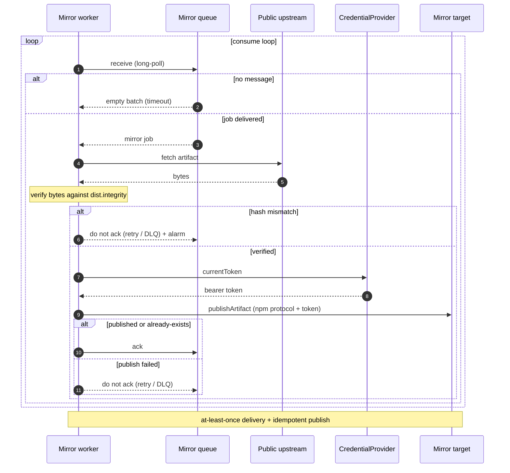
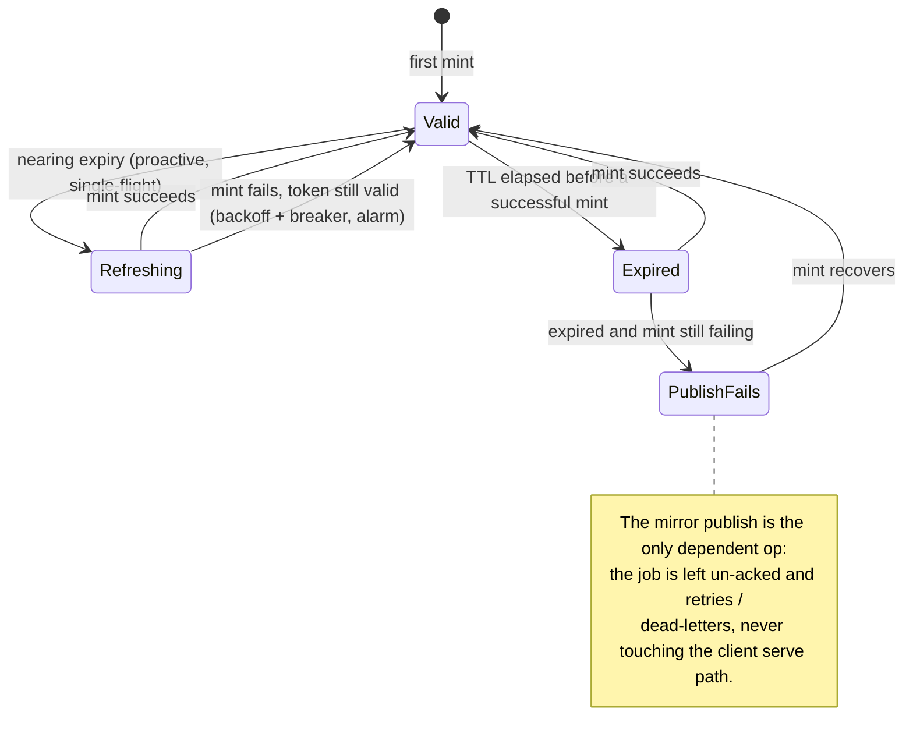

# Cloud backends and mirroring

> Part of the [Écluse architecture overview](../architecture.md).

## Mirror queue

Mirroring is demand-driven: when a client pulls an artifact whose version passes the rules
(the tarball path on a private-upstream miss), the proxy enqueues a mirror job (package,
version, artifact location, filename) and serves the client immediately, never blocking on
mirror completion. Metadata requests filter but never mirror, so only versions a client
actually fetches are mirrored. The worker publishes through the mirror target resolved from
the mount configuration, not a target named on the message.

A separate worker receives jobs and, for each one:

1. **Probes the mirror target** and acknowledges a confirmed-present duplicate outright: a
   fleet-wide install enqueues many jobs, and the probe retires each duplicate for one
   metadata round trip instead of a full download and no-op publish. A probe that cannot tell
   falls through to the full pipeline.
2. **Re-evaluates current policy** through the same shared admission gate the serve path runs
   (`Ecluse.Core.Package.Admission`: the rules, artifact selection by the job's filename, and
   the public-integrity floor), and re-checks the fetch URL against the mount's tarball-host
   gate. A version refused since its serve-time admit (a new advisory, a rule change, a raised
   floor, a withdrawn file) is dropped rather than frozen into the rule-exempt mirror.
3. Fetches the artifact from the public upstream.
4. **Verifies its bytes against the re-admitted artifact's integrity digest** (npm
   `dist.integrity`, from the current metadata; the queue payload carries no digest at all).
5. Publishes to the mirror target and acknowledges the job.

A hash mismatch fails the job: no publish, it routes to retry or the dead-letter path, and
alarms, so a corrupt or tampered artifact never enters the private upstream, which is later
served without rules. At-least-once delivery is safe because publishing is idempotent:
registries treat versions as immutable, so a redelivered job finds the version already present
and treats it as success. The probe is an optimisation; the idempotent publish is the
correctness mechanism.

There is a window between approval and a package appearing in the private upstream. Requests
during it fall through to the public upstream and re-run the rules, which is acceptable
because the rules are deterministic for a given version.

The queue backend is derived from the configured queue URL. An SQS URL selects the durable
SQS backend; a Pub/Sub topic resource names the GCP backend (roadmap, see [Service
mapping](#service-mapping)); with no URL set, mirroring runs on a bounded in-memory queue
(non-durable, best-effort) with a boot warning.

The worker fetches each accepted artifact from the public upstream, verifies its bytes
against the version's integrity hash, and publishes to the mirror target via the credential
handle. Retry is "don't ack"; at-least-once delivery is safe because publishing is
idempotent.



### Process model: the unified multicall binary

Écluse ships as a single image with the `ecluse proxy`, `ecluse pilot` (OSV ingestion), and
`ecluse dredger` (registry cleanup) roles, plus `ecluse check-config` for validating a
configuration; the binary shape is described in the
[architecture overview](../architecture.md). The operator deploys the same image for every
role, changing only the command and the IAM role. The dredger currently boots and serves its
health probes only; its reaper loop is designed and tracked but not yet implemented. Sharing
one config document keeps the dredger and proxy from drifting, and the design leans on that
in two load-bearing ways:

- **First-party scope protection (planned).** The dredger reads the same
  `ECLUSE_MOUNTS__NPM__PUBLISH_ALLOW` first-party scopes the proxy routes to the publication
  target, and excludes them from every purge, so it never deletes first-party packages.
- **Collapsed-registry refusal (planned).** If an operator points the mirror target and the
  publication target at one shared registry, the dredger refuses to boot, so it can never
  mistake a first-party package for a stale public one and delete it. The proxy supports the
  collapsed arrangement itself and flags it with a boot advisory warning.

The mirror worker exists only when a mount mirrors: a serve-only deployment starts no worker
and builds no queue. It runs inside the `ecluse proxy` process as a supervised concurrent
thread (`async` / `unliftio`), not a separate service (worker load is front-loaded, so an
extra deployable is not yet worth it), and carries its own health and liveness surface,
distinct from the server's HTTP readiness.

## Cloud backends

Écluse couples to a cloud provider in exactly two handles, both records of functions (the
Handle pattern), so a provider is an additive backend rather than a structural change, the
same posture as the [registry abstraction](registry-model.md#registry-abstraction):

1. **`MirrorQueue`**, the durable hand-off from the request path to the mirror worker (see
   [Mirror queue](#mirror-queue)).
2. **`CredentialProvider`**, which mints the short-lived bearer token for a cloud-managed
   registry endpoint (see [Credential provider](#credential-provider)).

The ecosystem axis is the [adapter's capability record](registry-model.md#registry-abstraction),
which is cloud-agnostic, so the npm protocol and data plane, publish included, is written once
and reused across every cloud: a managed registry is just an npm endpoint plus a token, with
no per-cloud publish path. The mirror and publish paths need no object-store handle; object
storage (S3) is used elsewhere, by the advisory-database sync. AWS ships today; GCP and Azure
are roadmap behind these same two handles.

### Handles: records of functions

Every handle, `MirrorPublish`, `MirrorQueue`, `CredentialProvider`, is a record whose fields
are functions, built by a per-backend smart constructor (`newSqsQueue`,
`newCodeArtifactProvider`) whose closure captures that backend's private state: an `amazonka`
env, an HTTP manager. The advisory-sync S3 client seals its `amazonka` env the same way, in
`newS3CveSource`. No raw SDK env crosses a runtime boundary: no module in `ecluse-core` or the `ecluse`
composition shell imports the SDK, and every `amazonka` import lives in `ecluse-runtime`.

Backend choice is runtime, config-driven, and single-binary: all adapters are compiled in,
and one composition root reads the configured provider, calls the matching constructor, and
stores the record in `Env`. Nothing downstream knows which backend it holds; it just applies
the field. Records of functions are chosen over a free monad or tagless-final because
runtime, config-driven selection needs neither program-as-data nor compile-time dispatch,
and they keep the `ReaderT Env IO` baseline with trivial in-memory test doubles.

### Service mapping

| Concern | AWS (shipped) | GCP (roadmap) | Azure (roadmap) |
|---------|-----|-----|-----|
| Mirror queue | SQS | Cloud Pub/Sub | Service Bus *or* Storage Queues |
| Managed npm registry | CodeArtifact | Artifact Registry | Azure Artifacts feed |
| Workload identity / token source | STS / instance role | Workload Identity / ADC | Microsoft Entra ID |
| Local emulator (tests) | `ministack` (image `ministackorg/ministack`, port 4566) | Pub/Sub emulator | Service Bus emulator / Azurite |

Both managed registries speak the npm protocol over HTTPS and differ only in how the bearer
token is obtained and refreshed, so they sit behind the
[`CredentialProvider`](#credential-provider) handle while the npm data plane (`http-client`)
is identical across them.

### Credential provider

Outbound auth (proxy to registry) is its own handle, separate from the [protocol
boundary](registry-model.md#registry-abstraction). A `CredentialProvider` yields the current
bearer token for a registry endpoint, refreshing before expiry:

```haskell
newtype CredentialProvider = CredentialProvider
  { currentToken :: IO AuthToken }            -- refreshes before expiry internally

data AuthToken = AuthToken
  { authSecret    :: Secret
  , authExpiresAt :: Maybe UTCTime            -- Nothing for a static, non-expiring token
  }
```

Today the handle is used only for the mirror-target write; private-upstream reads forward the
caller's own credential (the shipped passthrough posture) and the public upstream is
anonymous. The per-mount credential strategies, including a planned option for Écluse to read
the private upstream with its own credential, live in
[Access & credential model](access-model.md#the-shipped-model-passthrough) and
[Credential flow and authority](registry-model.md#credential-flow-and-authority).

The mirror-write credential is **derived from the mirror-target URL**: a CodeArtifact host
mints per its domain, any other host uses a static token, so a token can never be paired with
an endpoint it was not minted for. Granularity follows the credential's real scope: a
CodeArtifact token is minted per domain, so mounts whose resolved identities coincide share
one provider (one mint, one refresh schedule, one breaker), each still naming its own
reference.

A `CredentialProvider` is the service's own cloud identity, typically one container task role,
so it is built once at the composition root, not per mount, with region scoping parsed per
destination from the URL. A mount naming an uninitialised provider fails at boot, aggregated
with other config errors (see
[Configuration → validation](configuration.md#validation-fail-fast-reject-the-unknown)),
never at runtime.

The interesting logic is the refresh, cache, and expiry policy, not the cloud call. A single
generic wrapper holds it over a tiny per-cloud `mintToken` leaf, the only un-emulable part.
Adapters supply only the leaf: `static` (a fixed token, no expiry) and CodeArtifact
(`GetAuthorizationToken` via `amazonka`, TTL up to 12h); the GCP backend's ADC leaf (an
OAuth2 token, TTL around 1h) is designed to slot in the same way when that backend lands. The wide TTL spread is why the wrapper refreshes off the token's own `authExpiresAt`
rather than a fixed interval. It refreshes proactively at around 80% of the token's lifetime
(with jitter) while the current token stays valid, single-flight per provider so a cohort
never stampedes the token API. On mint failure it keeps serving the still-valid token, retries
with backoff behind a circuit breaker (the same machinery as the
[effectful tier](rules-engine.md#effectful-rule-failure)), and alarms; only an expired token
*and* a still-failing mint fails the dependent operation, which is the mirror publish: the job
is left un-acked and retries or dead-letters, never touching the serve path. The `static`
provider never refreshes, and the clock is injected, so the policy is unit-tested
deterministically.

A `CredentialProvider` refreshes a registry token off its own `expiresAt`, proactively and
single-flight, so the hot path never blocks on a mint. The token is mirror-write only, so
even a failed refresh touches only the mirror publish, never the serve path.



### Queue abstraction

The queue is the one piece with materially different APIs per cloud, so it is its own
handle. The record returns `IO` (per the [effect model](technology-stack.md#key-decisions)):

```haskell
data MirrorQueue = MirrorQueue
  { enqueue          :: MirrorJob -> IO (Either QueueFault ())         -- producer; best-effort
  , receive          :: IO (Either QueueFault [QueueMessage])          -- consumer; one long-poll, Right [] on timeout
  , ack              :: ReceiptHandle -> IO (Either QueueFault ())
  , extendVisibility :: ReceiptHandle -> Seconds -> IO (Either QueueFault ())
  }

data QueueFault       = QueueFault   { qfCause :: TransportCause, qfDetail :: Text }
data QueueMessage     = QueueMessage { msgJob :: MirrorJob, msgReceipt :: ReceiptHandle }
newtype ReceiptHandle = ReceiptHandle Text        -- opaque: SQS receipt handle | Pub/Sub ackId
```

SQS (`SendMessage` / `ReceiveMessage` + visibility timeout / `DeleteMessage`) and Pub/Sub
(`Publish` / `Pull` + ack-deadline / `Acknowledge`) both fit this receive-process-ack shape;
their differences stay behind the handle, and `ReceiptHandle` is opaque so neither leaks. The
conventions:

- **Every field reports its backend failure as a typed `QueueFault`**, classified into the
  core transport vocabulary (`Ecluse.Core.Fault`) at the adapter edge, so a queue outage
  never rides the exception channel through a caller. Each fault is safe to absorb.
- **`enqueue` is best-effort.** It runs on the hot path, so a failure is logged and metered
  but never fails the client response; the artifact is already served, and a later pull
  re-enqueues.
- **Retry is "don't ack".** A failed job is not acked; the visibility timeout or ack deadline
  redelivers it, and the native dead-letter path catches the persistent failures. There is no
  `nack`.
- **`extendVisibility`** holds a long publish past the visibility window, an optimisation,
  since idempotency makes redelivery harmless.
- **Batch size, long-poll window, and visibility timeout are configuration**, per provider.

### Testing

`testcontainers` runs `ministack` (and, for the GCP roadmap, the Pub/Sub emulator) the same
way, so each queue backend is exercised in the integration tier against its own emulator, no
real cloud account. The managed registries need no emulator: the npm protocol is just HTTPS
and JSON, exercised once against a real npm-speaking registry (Verdaccio) or an in-process WAI
stub. The only un-emulable surface is the per-cloud token mint, isolated in `mintToken`: the
policy around it is unit-tested with an injected clock and a fake mint, and the real mint runs
end-to-end only in the non-gating smoke tier.

### GCP and Azure, on the roadmap

GCP and Azure slot into the same two handles with no structural change, but neither is built.
Shipping GCP Pub/Sub is gated on a de-risking spike: prove one client can
`publish → pull → ack` against the Pub/Sub emulator under `testcontainers`. `gogol` (the GCP
SDK) has trailed `amazonka` and is REST-generated while the emulator is gRPC-first, so a thin
REST client behind the `MirrorQueue` handle is the likely hedge; the credential leaf is an ADC
token.

Azure is sequenced last because its queue side carries the sharpest risk. Its credential and
registry arms are easy (`mintToken` acquires a Microsoft Entra ID token over HTTPS, and Azure
Artifacts feeds speak the npm protocol), but Service Bus is AMQP-only, for which Haskell has
no client and whose emulator is AMQP-only; the testable alternative, Storage Queues over REST
on Azurite, gives up native dead-letter. Azure ships behind its own queue spike once AWS and
GCP cover the launch and first follow-on.
