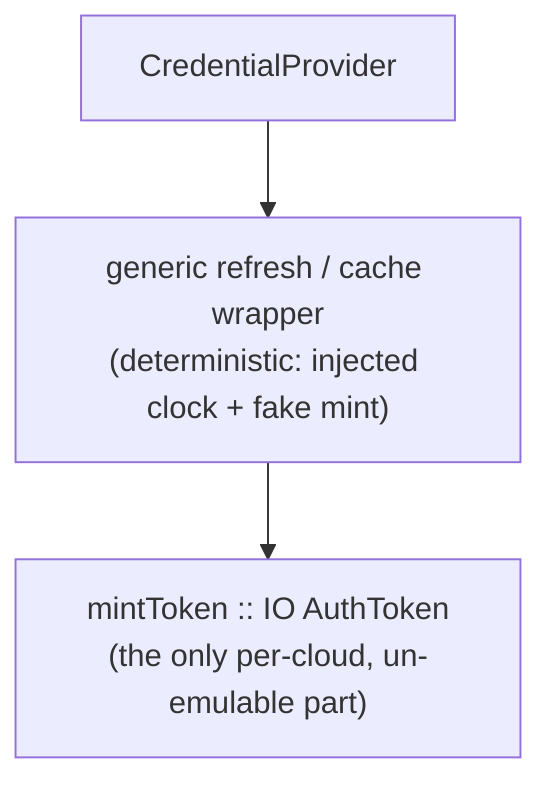

# Cloud backends and mirroring

> Part of the [Écluse architecture overview](../architecture.md).

## Mirror queue

Mirroring is **demand-driven**: when a client pulls an artifact whose version
passes the rules (the tarball path on a private-upstream miss), the proxy:

1. Enqueues a mirror job (package name, version, artifact location, and filename)
   to the configured **mirror queue**. The worker publishes through the mirror target
   resolved from the mount configuration, not a target named on the message.
2. Returns the artifact to the client **immediately**, no blocking on mirror
   completion.

Metadata (packument) requests filter but do not mirror: only versions a client
actually fetches are mirrored, not every admitted version anyone browses.

The queue is a cloud-agnostic handle with backends for AWS SQS and GCP Pub/Sub (see
[Cloud Backends](#cloud-backends)). A consumer (a separate worker process) receives
jobs, and for each one:

1. **probes the mirror target** for the version, acknowledging a confirmed-present
   duplicate outright: a fleet-wide install of a novel version enqueues many jobs, and
   the probe retires each duplicate for one metadata round trip instead of a full
   download and no-op publish (positive confirmation only: a probe that cannot tell
   falls through to the full pipeline),
2. **re-evaluates current policy** through the same shared admission gate the serve
   path runs (`Ecluse.Core.Package.Admission`: the rules, artifact selection by the
   job's filename, and the public-integrity floor, over the same single-version
   fetch), and re-checks the job's fetch URL against the mount's tarball-host gate,
   so a version refused since its serve-time admit (a new denylist entry, a fresh
   advisory, a rule change, a raised floor, a withdrawn file, a no-longer-honoured
   host) is dropped rather than frozen into the rule-exempt mirror,
3. fetches the artifact from the public upstream,
4. **verifies its bytes against the re-admitted artifact's integrity digest** (npm
   `dist.integrity`, from the same current metadata step 2 gated; the queue payload
   carries no digest at all), and
5. publishes it to the mirror target via `publishArtifact` and acknowledges the job.

A hash mismatch fails the job (no publish; it routes to retry/DLQ) and alarms, so a
corrupt or tampered artifact never enters the private upstream, which is later served
without rules. The worker touches both cloud handles, [`MirrorQueue`](#queue-abstraction)
to receive and [`CredentialProvider`](#credential-provider) to authenticate the write,
while the publish is plain npm protocol plus a bearer token, so there is no per-cloud
publish path. Both backends give at-least-once delivery with retry and a dead-letter
path, and at-least-once is safe because **publishing is idempotent**: registries treat
versions as immutable, so a redelivered job finds the version already present at publish
and treats it as success. The probe is an optimisation; the idempotent publish is the
correctness mechanism.

There is a window between approval and a package appearing in the private upstream.
Requests during that window fall through to the public upstream and re-run rules, which
is acceptable since the rules are deterministic for a given version.

### Process model: the unified multicall binary

Écluse ships as a single, unified executable (the "BusyBox" or "multicall"
pattern). Instead of building separate binaries for the proxy server, the OSV
ingestion pipeline (`pilot`), and the registry cleanup worker (`dredger`),
`app/Main.hs` acts as a CLI router that runs a sub-system per invocation command
(`ecluse proxy`, `ecluse pilot`, `ecluse dredger`).

This pattern is a deliberate architectural and security decision:

1. **Config and rule synchronisation.** Because `pilot`, `dredger`, and `proxy`
   are the same binary parsing the same configuration file, they share the exact
   same runtime state (the same `Env` and config models). A manual package
   revocation rule (`DenyByIdentity`) configured in the config document is respected by
   the dredger (to purge it) and the proxy (to block it), so the two never drift.
2. **First-party scope protection.** By sharing the configuration, the dredger is
   aware of the `ECLUSE_MOUNTS__NPM__PUBLISH_ALLOW` (internal first-party scopes)
   the proxy routes to the publication target. The dredger unconditionally excludes
   those scopes from its purge routines, so it never deletes first-party packages.
3. **Collapsed-registry mitigation.** If an operator collapses the mirror target
   and the publication target onto a single shared registry, the dredger detects
   this and refuses to boot. That hard failure keeps the dredger from treating
   first-party packages (which might fall outside the explicit
   `ECLUSE_MOUNTS__NPM__PUBLISH_ALLOW`) as stale public ones and deleting them.
4. **Deployment simplicity.** The operator deploys the same versioned Docker image
   for all three components, changing only the container command and the IAM role.

**Security boundaries.** The security model relies on the orchestrator (Kubernetes
or AWS ECS). The roles (`s3:GetObject` for the proxy vs `s3:PutObject` for the
pilot) and network-egress bounds (zero ingress for the dredger) are applied
per-container. Even though the proxy *contains* the pilot code, it has neither the
IAM permissions nor the CLI invocation to run it.

The **mirror worker** exists only when a mount mirrors (a serve-only deployment starts
no worker and builds no queue). It runs in the `ecluse proxy` process as a supervised concurrent
thread (`async` / `unliftio`), not a separate service: worker load is front-loaded (a
cold mirror back-fills heavily for a few days, then settles), so an extra deployable is
not yet worth it. It carries its own health/liveness surface (a consume-loop heartbeat /
last-successful-poll), distinct from the server's HTTP readiness.

The worker publishes through each job ecosystem's own bundle: the composition root
marries that ecosystem's protocol codec (from its adapter) to the shared publish
transport at the mount's declared mirror target, paired with the
[`CredentialProvider`](#credential-provider) for the token, and the bundle carries the
married `MirrorPublish` capability. The serve
path does not share it: each packument upstream builds its own client over the shared
HTTP manager (two upstreams, per-origin credentials), so the capability is publish-side
only.

## Cloud backends

Écluse couples to a cloud provider in exactly **two handles**, both records of functions
(the Handle pattern), so a provider is an additive backend, not a structural change, the
same posture as the [registry abstraction](registry-model.md#registry-abstraction):

1. **`MirrorQueue`**, the durable hand-off from the request path to the mirror worker
   (see [Mirror Queue](#mirror-queue)).
2. **`CredentialProvider`**, mints the short-lived bearer token for any cloud-managed
   registry endpoint (private upstream or mirror target) rather than a static-credential
   one (see [Credential Provider](#credential-provider)).

These two are the cloud axis. The ecosystem axis is the
[adapter's capability record](registry-model.md#registry-abstraction), which is
cloud-agnostic, so
the npm protocol and data plane, including publish, is written once and reused across
every cloud (a managed registry is just an npm endpoint plus a token; no per-cloud
publish path, no object-store handle). The proxy core, rules engine, web layer, and CVE
subsystem are cloud-agnostic too. AWS and GCP are both first-class; a third provider is
additive behind these two handles, with Azure the worked example (see
[Azure backends](#azure-backends-designed-for-furthest-out)).

### Handles: records of functions

Every handle, `MirrorPublish`, `MirrorQueue`, `CredentialProvider`, is a record whose
fields are functions (the Handle pattern), built by a per-backend smart constructor
(`newSqsQueue :: SqsConfig -> IO MirrorQueue`). The record type is the interface, the
smart constructor a concrete implementation, and its closure captures that backend's
private state (an `amazonka` env, an HTTP manager).

Backend choice is runtime, config-driven, single-binary: all adapters are compiled in,
and one composition root reads the configured provider, calls the matching constructor,
and stores the record in `Env`. Nothing downstream knows which backend it holds; it just
applies the field. This keeps the SDK selection in one place, and the concrete adapters
live in the `ecluse-runtime` library behind the core's handle interfaces, so `ecluse-core`
carries no cloud SDK.

*Alternatives considered.* A free monad and tagless-final both abstract the backend, but
buy program-as-data or compile-time dispatch Écluse does not need: selection is at
runtime by config, and both cost a heavier dependency than the `ReaderT Env IO` baseline.
Records of functions give the same swappability and trivial in-memory test doubles. A
free monad would earn its keep only to inspect or rewrite mirror programs (e.g. batch
enqueues), which the existing handle can accommodate if it ever arises.

### Service mapping

| Concern | AWS | GCP | Azure (designed-for, furthest-out) |
|---------|-----|-----|-----|
| Mirror queue | SQS | Cloud Pub/Sub | Service Bus *or* Storage Queues ([see below](#azure-backends-designed-for-furthest-out)) |
| Managed npm registry | CodeArtifact | Artifact Registry | Azure Artifacts (Azure DevOps feed) |
| Workload identity / token source | STS / instance role | Workload Identity / ADC | Microsoft Entra ID (Managed Identity / Workload Identity Federation) |
| Local emulator (tests) | `ministack` (LocalStack-style) | Google's official Pub/Sub emulator | Service Bus emulator (**AMQP-only**) / Azurite (Storage Queues, REST) |

Both managed registries speak the npm protocol over HTTPS and differ only in how the
bearer token is obtained and refreshed, so they sit behind the
[`CredentialProvider`](#credential-provider) handle while the npm data plane
(`http-client`) is identical across them.

### Credential provider

Outbound auth (proxy → registry) is its own handle, separate from the
[protocol boundary](registry-model.md#registry-abstraction). A `CredentialProvider`
yields the current bearer token for a registry endpoint, refreshing before expiry.
Provider granularity follows the credential's real scope, not the mount count: a
CodeArtifact token is minted per domain, so mounts whose resolved CodeArtifact
identities coincide share one provider (one boot mint, one refresh schedule, one
breaker), while each mount still names its own reference:

```haskell
newtype CredentialProvider = CredentialProvider
  { currentToken :: IO AuthToken }            -- refreshes-before-expiry internally

data AuthToken = AuthToken { secret :: Secret, expiresAt :: Maybe UTCTime }
```

It mints the token for any upstream that needs one: the mirror-target write always, and
under `service` the private-upstream read too. The mirror-target provider is **derived from
the mirror-target URL** (a CodeArtifact host mints per its domain; any other host uses a
static token), so a token can never be paired with an endpoint it was not minted for. Under
the default `passthrough` strategy a deployment holds one provider (for the mirror target)
and forwards the client's own credential; `service` adds a read provider for the private
upstream (per-request and uncached, since Écluse forbids a shared private cache). The public upstream is anonymous
under every strategy. See [Access & Credential Model](access-model.md) and
[Credential flow and authority](registry-model.md#credential-flow-and-authority).

**Providers are global; mounts reference them.** A `CredentialProvider` is the service's
own cloud identity, typically one container task role (AWS) or workload identity (GCP),
so it is built once at the composition root, not per mount. A mount names which
configured provider its strategy draws on. In the common deployment those references
collapse to one identity: the same container role writes the mirror target and (under
`service`) reads the private upstream. A multi-cloud process holds one provider per
cloud; region scoping is per destination, parsed from the URL each mechanism serves
(the CodeArtifact mint's region from the mirror-target host, the SQS backend's from
the queue URL's host; the ambient `AWS_REGION` matters only under an
`AWS_ENDPOINT_URL_SQS` override, whose endpoint carries no region), and a GCP project
scope arrives with the Pub/Sub backend, deriving from its topic resource the same way. A
mount naming a credential source with no initialised provider fails at boot (aggregated
with other config errors; see
[Configuration → Validation](configuration.md#validation-fail-fast-reject-the-unknown)),
never at runtime.

**The sub-handle that matters.** The interesting logic is the
refresh/cache/expiry/concurrency policy, not the cloud call. A single generic wrapper
holds it, parameterised over a tiny per-cloud `mintToken` leaf:



Adapters supply only the leaf: `static` (fixed token, no expiry), CodeArtifact
(`GetAuthorizationToken` via `amazonka`, TTL up to 12h), ADC (an OAuth2 access token, TTL
~1h). The wide TTL spread is why the wrapper refreshes off the token's own `expiresAt`
rather than a fixed interval, so one policy fits either cloud and each contributes ~10
lines. This also bounds the test gap (see [Testing](#testing)): everything but
`mintToken` is unit-testable.

**Refresh policy.** The wrapper refreshes proactively in the background at ~80% of a
token's lifetime (configurable, with jitter to desynchronise instances) plus a hard floor
near expiry; the current token stays valid during refresh, so the hot path never blocks
on a mint in the common case. Refresh is single-flight per provider (an STM flag /
`TMVar`), so a cohort of requests never stampedes the cloud token API. On mint failure the
wrapper keeps serving the still-valid token, retries with backoff behind a circuit breaker
(the same machinery as the effectful tier; see
[Effectful-rule failure](rules-engine.md#effectful-rule-failure)), and alarms; only if the
token has expired *and* mint still fails does the dependent operation fail. For a
mirror-write credential that is the publish: the job is left un-acked and retries /
dead-letters, never touching the serve path. For a read credential under `service` it *is*
a client read, so an exhausted read credential degrades serving (per the
[serve error model](web-layer.md#error-model)), one reason `passthrough` stays simplest.
The `static` provider never refreshes. The clock is injected, so the policy is unit-tested
deterministically.

### Queue abstraction

The queue is the one piece with materially different APIs per cloud, so it is its
own handle. The record returns `IO` (per the
[effect model](technology-stack.md#key-decisions)):

```haskell
data MirrorQueue = MirrorQueue
  { enqueue          :: MirrorJob -> IO (Either QueueFault ())         -- producer; best-effort (see below)
  , receive          :: IO (Either QueueFault [QueueMessage])          -- consumer; one long-poll, Right [] on timeout
  , ack              :: ReceiptHandle -> IO (Either QueueFault ())
  , extendVisibility :: ReceiptHandle -> Seconds -> IO (Either QueueFault ())
  }

data QueueFault       = QueueFault { qfCause :: TransportCause, qfDetail :: Text }
data QueueMessage     = QueueMessage { job :: MirrorJob, receipt :: ReceiptHandle }
newtype ReceiptHandle = ReceiptHandle Text        -- opaque: SQS receipt handle | Pub/Sub ackId
```

SQS (`SendMessage` / `ReceiveMessage`+visibility-timeout / `DeleteMessage`) and
Pub/Sub (`Publish` / `Pull`+ack-deadline / `Acknowledge`) both fit this
receive → process → ack shape; their differences (visibility timeout vs ack
deadline, batch limits, dead-letter wiring) stay behind the handle, and
`ReceiptHandle` is opaque so neither leaks. Conventions:

- **Every field reports its backend failure as a typed `QueueFault` value**, classified
  into the core transport vocabulary (`Ecluse.Core.Fault`) at the adapter edge, so a
  queue outage never rides the exception channel through a caller. Each fault is safe to
  absorb: the serve path counts a failed enqueue, the worker logs a failed poll and backs
  off (without advancing its liveness heartbeat), and a failed ack simply redelivers.
- **`enqueue` is best-effort.** It runs on the hot path (enqueue, then serve), so a
  failure is logged/metered and never fails the client response; the artifact is already
  served, and a later pull re-enqueues.
- **Retry is "don't ack."** A failed job is not acked; the visibility timeout / ack
  deadline redelivers it, and the native dead-letter path (max-receive-count) catches the
  persistent failures. There is no `nack`. Redelivery is safe because publishing is
  idempotent.
- **`extendVisibility`** lets the worker hold a long publish past the visibility window;
  an optimisation, not correctness-critical, since idempotency makes redelivery harmless.
- **Batch size, long-poll window, and visibility timeout are configuration** (per
  provider, with sane defaults).

The provider is chosen by [configuration](configuration.md#configuration).

### Haskell client maturity, a design risk to retire early

This is the one place GCP is not a free addition. `amazonka` is broad and
well-maintained; the GCP side is weaker, and the design names that risk:

- `gogol` (the amazonka-equivalent GCP SDK) covers Pub/Sub but has trailed `amazonka` in
  coverage and cadence; its current state must be verified before relying on it.
- `gogol` is REST/JSON-generated, whereas the official Pub/Sub emulator is gRPC-first, so
  client-against-emulator compatibility is not a given. Native Haskell gRPC
  (`grpc-haskell`) is immature and avoided.
- The hedge is a thin REST client: Pub/Sub's `publish` / `pull` / `acknowledge` is a
  handful of JSON-over-HTTPS calls, and Écluse already runs `http-client` + `aeson` + a
  bearer-token pattern. A small client behind the `MirrorQueue` handle avoids a
  possibly-stale SDK, provided the emulator serves those REST calls.

**Design requirement.** GCP is designed for from day one, but shipping it is gated on a
de-risking spike: stand up the Pub/Sub emulator via `testcontainers` and prove one client
can `publish → pull → ack` against it, resolving the client-maturity and
emulator-compatibility questions at once. AWS (`amazonka` + `ministack`) carries no such
risk and ships first.

### Testing

`testcontainers` is a generic container manager, so it runs `ministack` and the Pub/Sub
emulator the same way. Each cloud's queue backend is exercised in the integration tier
against its own emulator (no real cloud account; the Pub/Sub emulator ignores auth), so
the `MirrorQueue` handle is verified per provider.

The managed-registry backends need no emulator (neither CodeArtifact nor Artifact
Registry has a usable one), and the handle split makes that a non-problem: the npm
protocol is just HTTPS+JSON, so it is exercised once against a real npm-speaking registry
(e.g. Verdaccio) or an in-process WAI stub, covering every managed registry. The only
un-emulable surface is the per-cloud token mint, isolated in `CredentialProvider`'s
`mintToken` leaf: the policy around it is unit-tested with an injected clock and a fake
mint, and the real mint runs end-to-end only in the non-gating smoke tier. The split
shrinks the un-testable surface to one small function per cloud, an accepted residual
risk.

### Azure backends (designed-for, furthest-out)

Azure is the worked third backend: it slots into the same two handles with no structural
change, but sits last, after AWS and GCP, because its queue side carries a risk sharper
than GCP's.

Its arms split into easy and risky:

- **Credential leaf, easy.** `mintToken` acquires a Microsoft Entra ID bearer token over
  HTTPS+JSON, via Managed Identity (IMDS `169.254.169.254/metadata/identity/oauth2/token`,
  ~1h TTL) or Workload Identity Federation on AKS (exchange the projected service-account
  token, audience `api://AzureADTokenExchange`). No SDK; it is the size of the ADC leaf
  and rides the existing refresh-off-`expiresAt` wrapper. For an Azure Artifacts mirror
  target the token's `resource` is the Azure DevOps app ID
  `499b84ac-1321-427f-aa17-267ca6975798`.
- **Managed registry, unchanged.** Azure Artifacts feeds speak the npm protocol over HTTPS
  (`https://pkgs.dev.azure.com/{org}/{project}/_packaging/{feed}/npm/registry/`), so they
  ride the existing npm protocol implementation plus an Entra bearer, no per-cloud publish path.
  (Azure Artifacts' upstream sources are a registry-composition feature, the analogue of
  CodeArtifact external connections, and the same
  [don't bypass the gate](registry-model.md#registry-level-composition-the-recommended-topology)
  caveat applies.)
- **Queue, the risk, and why Azure is last.** Sharper than the GCP gRPC-vs-REST gap:
  - The natural fit is Service Bus (peek-lock → `receive`, renew-lock →
    `extendVisibility`, complete → `ack`, native dead-letter; lock token →
    `ReceiptHandle`). But its primary protocol is AMQP 1.0, for which Haskell has no
    client (the `amqp` package is AMQP 0.9.1 / RabbitMQ), and the only Service Bus Hackage
    package is deprecated (2014). A hand-rolled REST client works against the real service,
    but the official Service Bus emulator is AMQP-only (messaging on 5672; its HTTP port is
    management-only), so REST messaging cannot be tested against it.
  - The testable alternative is Storage Queues over REST, which Azurite (the official
    storage emulator) serves, so a hand-rolled client is `testcontainers`-testable. The
    cost is no native dead-letter (emulate via a poison-queue keyed on `DequeueCount`) and
    a thinner feature set.
  - Service Bus's lock duration also caps at 5 min (vs SQS 12h / Pub/Sub 10min), so
    `extendVisibility` becomes load-bearing for large publishes.

So Azure is gated on its own de-risking spike, the queue decision (Service Bus over REST,
smoke-tested only, vs Storage Queues on Azurite), as GCP is gated on the Pub/Sub spike.
The credential and registry arms need no spike. Since the queue risk is the steepest of
the three and AWS and GCP cover the launch and first follow-on, Azure is sequenced last.
