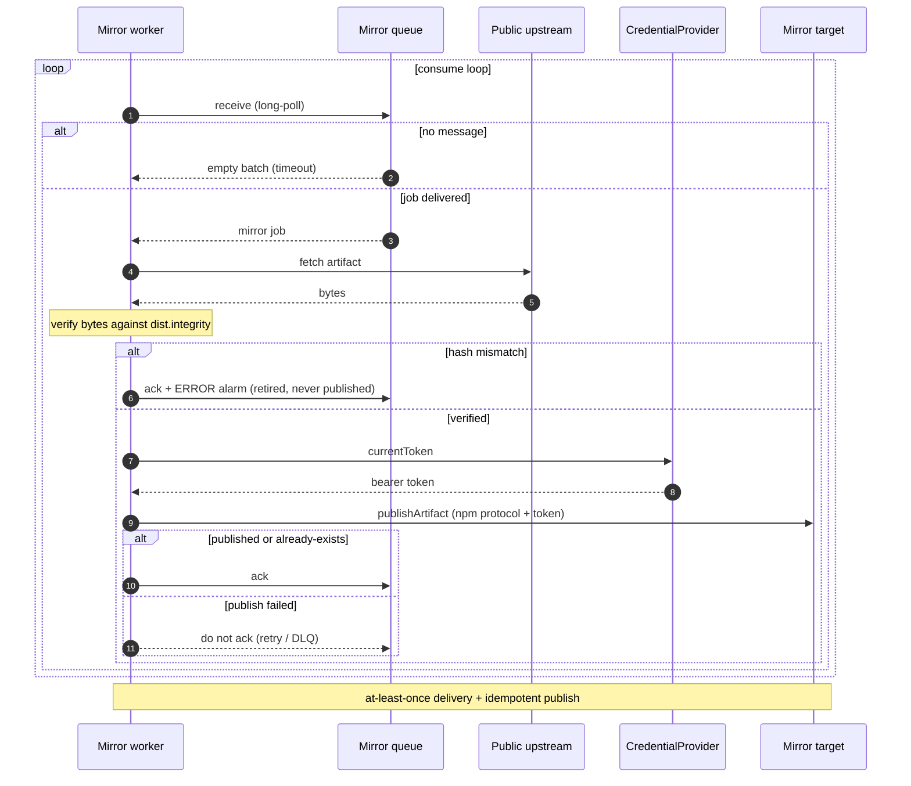

# Cloud backends and mirroring

> Part of the [Écluse architecture overview](../architecture.md).

How Écluse mirrors approved public packages, and the three handles that couple it to a cloud
provider.

## Mirror queue

Mirroring is demand-driven. A client pulls an artifact on the tarball path after a private-upstream
miss. If that version passes the rules, the proxy enqueues a mirror job (package, version, artifact
location, filename). It serves the client immediately and never waits for the mirror to finish.
Metadata requests filter but never mirror, so Écluse mirrors only the versions a client fetches.
The mount configuration resolves the publish target, which the message never names.

A separate worker receives jobs and, for each one:

1. **Probes the mirror target** and acknowledges a confirmed-present duplicate outright, sparing
   a fleet-wide install's duplicate jobs a full download and no-op publish. A probe that cannot
   tell falls through to the full pipeline.
2. **Re-evaluates current policy** through the same shared admission gate the serve path runs
   (`Ecluse.Core.Package.Admission`), and re-checks the fetch URL against the mount's
   tarball-host gate. The worker drops a version refused since its serve-time admit: a new
   advisory, a raised floor, a withdrawn file. Such a version never freezes into the
   rule-exempt mirror.
3. Fetches the artifact from the public upstream.
4. **Verifies its bytes against the re-admitted artifact's integrity digest**: npm
   `dist.integrity`, read from the current metadata. The queue payload carries no digest at all.
5. Publishes to the mirror target and acknowledges the job.

A hash mismatch fails the job. The worker publishes nothing, writes an ERROR log, and acknowledges
the message so it stops cycling. The job is never retried and never dead-lettered, because no
redelivery can make tampered bytes verify. A corrupt or tampered artifact therefore never enters
the private upstream, which Écluse later serves without rules. At-least-once delivery is safe because
publishing is idempotent: versions are immutable, so a redelivered job finds the version already
present and succeeds.

Between approval and a package appearing in the private upstream, requests fall through to the
public upstream and re-run the deterministic rules.

The mirror worker exists only when a mount mirrors. A deployment with no mirror target starts no
worker and builds no queue. The configured queue URL picks the backend: SQS for durability, or a
bounded in-memory queue with a boot warning when unset. The keys are in
[the operator manual](https://ecluse-proxy.com/docs/).

By default the worker runs inside the `ecluse proxy` process as a supervised concurrent thread,
which is what the in-memory queue requires: its jobs never leave the process that enqueued them.
Over a durable queue the two halves can be split, so the front door scales on request rate and
the worker fleet on queue depth. `ecluse proxy --no-worker` keeps the producer half and
`ecluse mirror` runs the consumer half, both over the same composition root, so a worker's
policy re-evaluation cannot diverge from the serve decision. Écluse refuses either split role at
boot over the in-memory queue, because every job would be stranded.

The consume-loop heartbeat backs the liveness surface of whichever process runs the worker,
distinct from HTTP readiness. `/livez` reports it as a pass-or-fail status plus the instant of
the last successful poll, so an orchestrator can judge staleness itself. A process that runs no
worker reports no poll and stays live on its listener alone.

```mermaid
sequenceDiagram
    autonumber
    participant W as Mirror worker
    participant Queue as Mirror queue
    participant Pub as Public upstream
    participant Cred as CredentialProvider
    participant Mirror as Mirror target

    loop consume loop
        W->>Queue: receive (long-poll)
        alt no message
            Queue-->>W: empty batch (timeout)
        else job delivered
            Queue-->>W: mirror job
            W->>Pub: fetch artifact
            Pub-->>W: bytes
            Note over W: verify bytes against dist.integrity
            alt hash mismatch
                W->>Queue: ack + ERROR alarm (retired, never published)
            else verified
                W->>Cred: currentToken
                Cred-->>W: bearer token
                W->>Mirror: publishArtifact (npm protocol + token)
                alt published or already-exists
                    W->>Queue: ack
                else publish failed
                    W-->>Queue: do not ack (retry / DLQ)
                end
            end
        end
    end
    Note over W,Mirror: at-least-once delivery + idempotent publish
```

### The terminus for a job that can never succeed

A transient failure retries because the worker does not ack the message. That works only while
something eventually stops the retrying. A job that can never succeed has to end somewhere. An
artifact past the per-artifact byte cap is such a job. Without a terminus the worker fetches and
refuses it on every redelivery, for as long as the queue holds it.

The intended terminus is the operator's own **dead-letter queue**. Écluse returns such a message
without deleting it. An attached SQS redrive policy then moves the message to the dead-letter
queue and keeps it for inspection. That is the only outcome that preserves a forensic trail.
Écluse therefore probes the queue once at boot. A durable queue with no redrive policy attached
earns a loud start-up warning, because the operator cannot see what their proxy could not mirror.

A warning alone leaves the message cycling, so a second and weaker terminus sits beneath it: a
**redelivery budget**. It reaches a decoded job alone. Every delivery carries its own count, and
the worker discards a message that has used up that budget. It writes an error log that names the
job, and records a distinct `discarded` result on the mirror-job counter.

A payload that no longer decodes never becomes a job, so the budget cannot reach it. The poller
logs the drop and leaves the message un-acked, which leaves the dead-letter queue, or the queue's
own retention window, as the only terminus it has.

Discarding retains nothing, so it is deliberately the lesser outcome. The configured count is a
floor. When Écluse can read an attached policy's own `maxReceiveCount`, it holds the budget at
least one delivery above that count, so the dead-letter queue captures the message first and the
budget fires only for a deployment that has none. When the policy's count is unreadable, the
configured floor stands alone. Discarding is safe in the way the rest of mirroring is safe. Mirroring is demand-driven, so the job returns
on the next pull of that artifact and fails the same way until the cause is fixed.

The worker checks the budget before it runs the job, not after. That check spares the repeated
fetch the cycling would otherwise pay for.

The in-memory queue sits outside all of this. It never redelivers a job, so no delivery can
exhaust a budget and there is nothing to capture. Its terminus is the drop that a delivered job
already is. Its observability is the worker's error log and metric.

## Cloud backends

Écluse couples to a cloud provider through exactly three handles. A new provider is an additive
backend, not a structural change, the same posture as the [registry
abstraction](registry-model.md#registry-abstraction):

1. **`MirrorQueue`**, the durable hand-off from the request path to the [mirror
   worker](#mirror-queue).
2. **`CredentialProvider`**, which mints the short-lived bearer token for the managed registry
   (see [Credential provider](#credential-provider)).
3. **`StoreMaintenance`**, which enumerates the mirror store and deletes versions from it for
   `ecluse dredger`. Enumeration and deletion are backend operations, not ecosystem ones, because
   the npm wire protocol has no enumeration and a managed registry deletes through its own control
   plane. Every fact that varies by backend is a value the handle supplies: the batch ceiling for a
   destructive call, whether a deleted version can be published again, the backend's own dry run
   where it has one, and whether a delete finishes before the call answers.

One npm data plane, publish included, serves every cloud, because a managed registry is an npm
endpoint plus a token. There is no per-cloud publish path. The mirror and publish paths need no
object-store handle, and only the advisory-database sync uses S3. AWS ships today.

### Service mapping

| Concern | AWS (shipped) |
|---------|-----|
| Mirror queue | SQS |
| Managed npm registry | CodeArtifact |
| Store maintenance | CodeArtifact |
| Workload identity / token source | STS / instance role |

The managed registry speaks the npm protocol over HTTPS. Only the token source differs per
cloud.

### Credential provider

Outbound auth (proxy to registry) is its own handle. A `CredentialProvider` yields the current
bearer token for a registry endpoint, refreshing before expiry. Only the mirror-target write uses
it: reads forward the caller's own credential and the public upstream is anonymous
([Credential flow and authority](registry-model.md#credential-flow-and-authority)). The
credential is derived from the mirror-target URL, see
[Outbound registry credentials](configuration.md#outbound-registry-credentials).

Only an expired token *and* a still-failing mint fail the dependent operation, the mirror
publish. The worker leaves that job un-acked, and it retries or dead-letters. This never touches
the client serve path.
