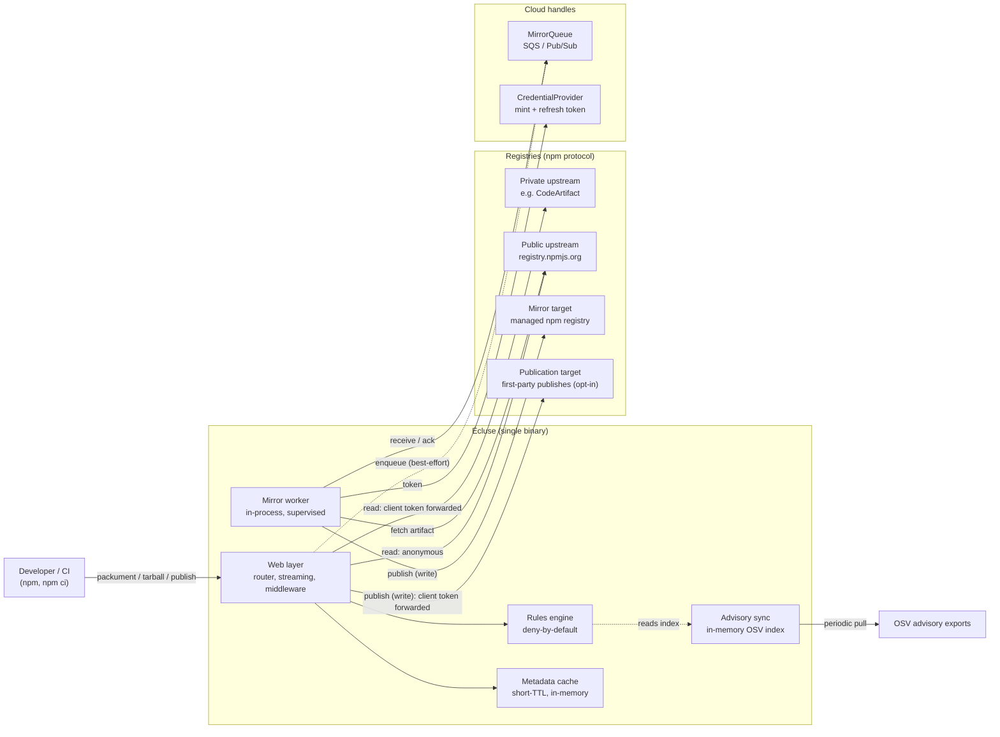
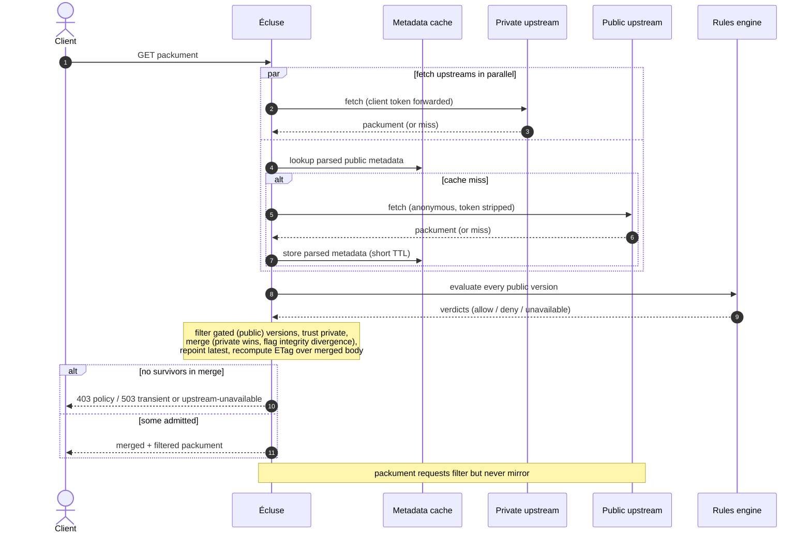
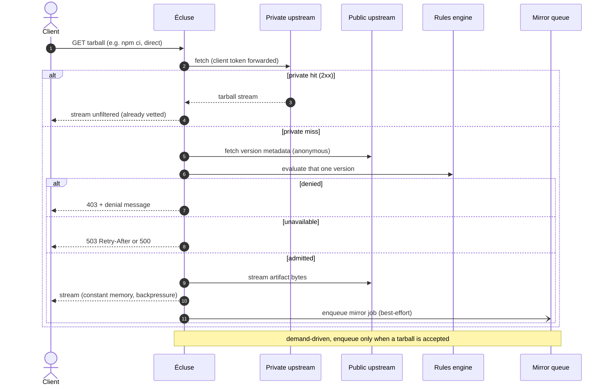
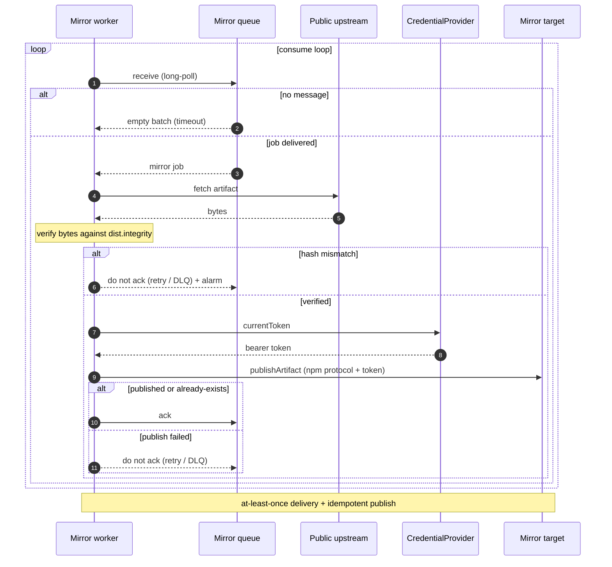
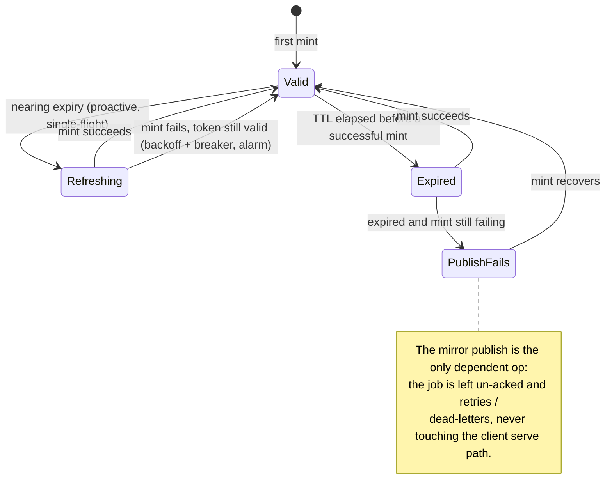
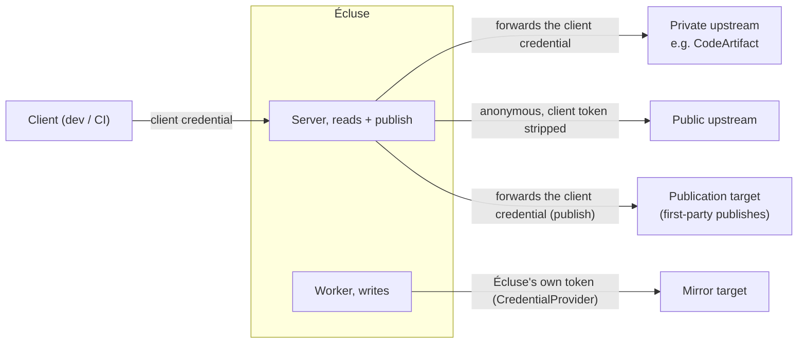
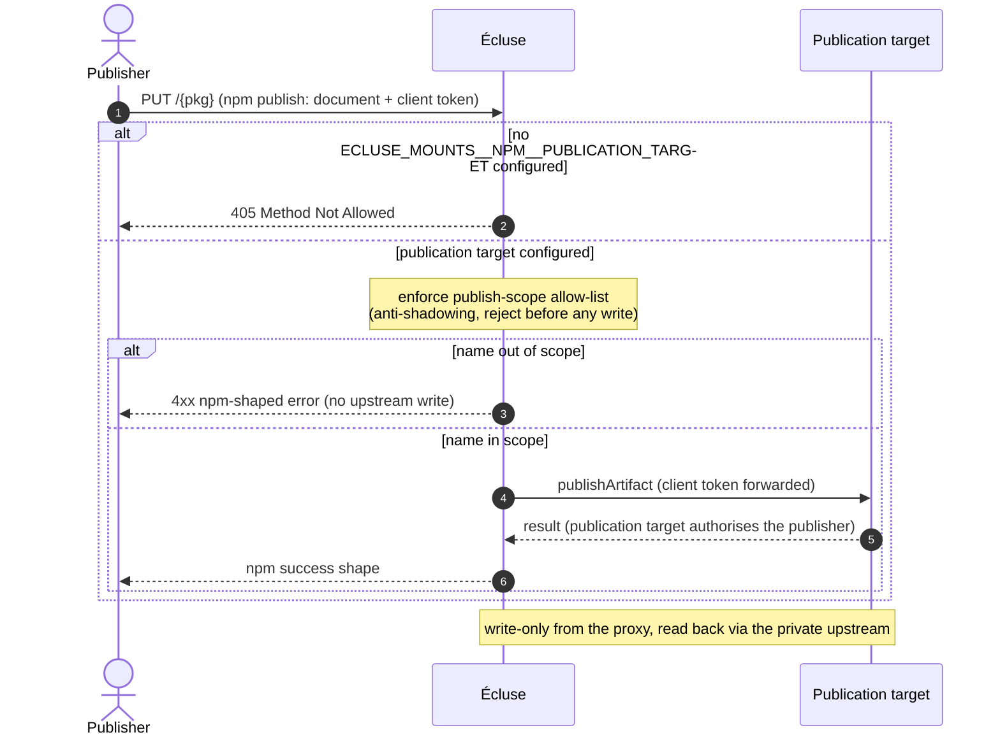

# Architecture diagrams

> Part of the [Écluse architecture overview](../architecture.md).

A visual companion to the prose specifications under [`architecture/`](.). Each section
shows one shipped flow and links to the document that specifies it in full. Diagrams are
[Mermaid](https://mermaid.js.org/), rendered inline by GitHub, never ASCII art.

## 1. System overview

A single Écluse binary runs the HTTP server and an in-process mirror worker over a shared,
handle-based `Env`. The data plane (metadata and artifact bytes) is `http-client`; the
control plane (queue, token mint) sits behind the
[`MirrorQueue`](cloud-backends.md#queue-abstraction) and
[`CredentialProvider`](cloud-backends.md#credential-provider) handles. Solid edges are
synchronous request-path, dotted are best-effort or asynchronous.

## 2. Packument (metadata) request

Private and public upstreams are fetched in parallel and merged (private wins, integrity
divergence flagged); public versions are gated by the rules, and metadata filters but never
mirrors. See [Packument merge](registry-model.md#packument-merge-across-upstreams) and
[Applying verdicts to a packument](rules-engine.md#applying-verdicts-to-a-packument).

## 3. Tarball (artifact) request

A private hit is streamed unfiltered; a private miss gates that one version, then streams
from public and enqueues a demand-driven mirror job, non-blocking, so the client is served
immediately. See [Streaming](web-layer.md#streaming-and-resource-lifetime) and
[Mirror queue](cloud-backends.md#mirror-queue).

## 4. Mirror worker

The worker fetches each accepted artifact from the public upstream, verifies its bytes
against the version's integrity hash, and publishes to the mirror target via the credential
handle. Retry is "don't ack"; at-least-once delivery is safe because publishing is
idempotent. See [Mirror queue](cloud-backends.md#mirror-queue).

## 5. Credential token lifecycle

A `CredentialProvider` refreshes a registry token off its own `expiresAt`, proactively and
single-flight, so the hot path never blocks on a mint. The token is mirror-write only, so
even a failed refresh touches only the mirror publish, never the serve path. See
[Credential provider](cloud-backends.md#credential-provider).

## 6. Credential authority across the four registry roles

The client's credential is never sent to the public upstream. It is forwarded to the private
upstream (the shipped passthrough posture) and, on publish, to the publication target; the
worker writes the mirror target with Écluse's own token. See
[Access & credential model](access-model.md) and
[Credential flow and authority](registry-model.md#credential-flow-and-authority).

## 7. First-party publish path

A client's `npm publish` (`PUT /{pkg}`) is gated by the operator's publish-scope allow-list
(the anti-shadowing guard, rejecting before any upstream write) and relayed to the publication
target with the publisher's own forwarded credential, distinct from the mirror target. It is
opt-in: with no `ECLUSE_MOUNTS__NPM__PUBLICATION_TARGET`, `PUT /{pkg}` is a `405`. See
[Publishing first-party packages](registry-model.md#publishing-first-party-packages-the-publication-target).

