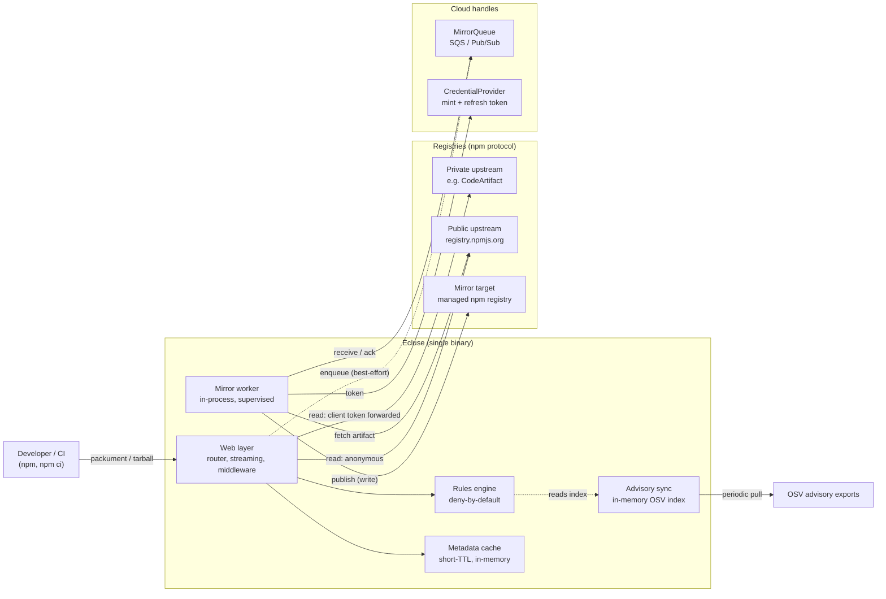
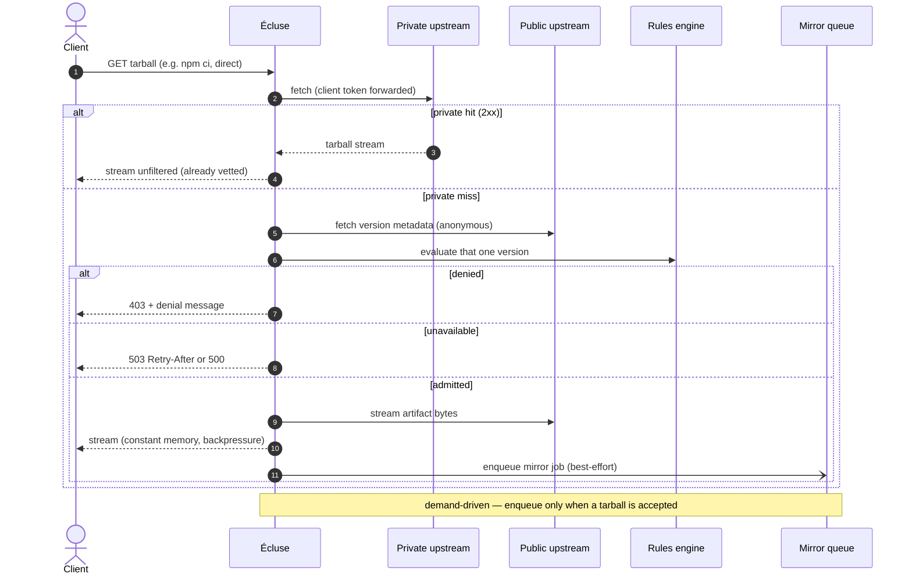
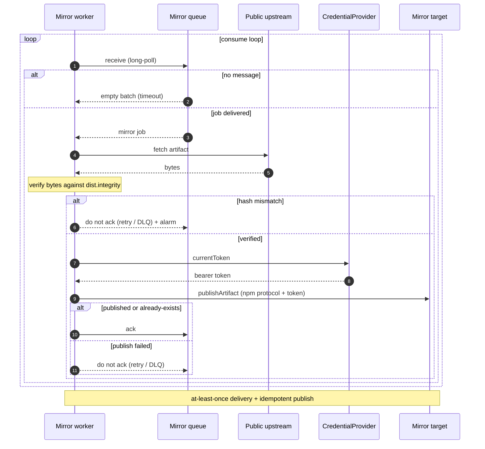
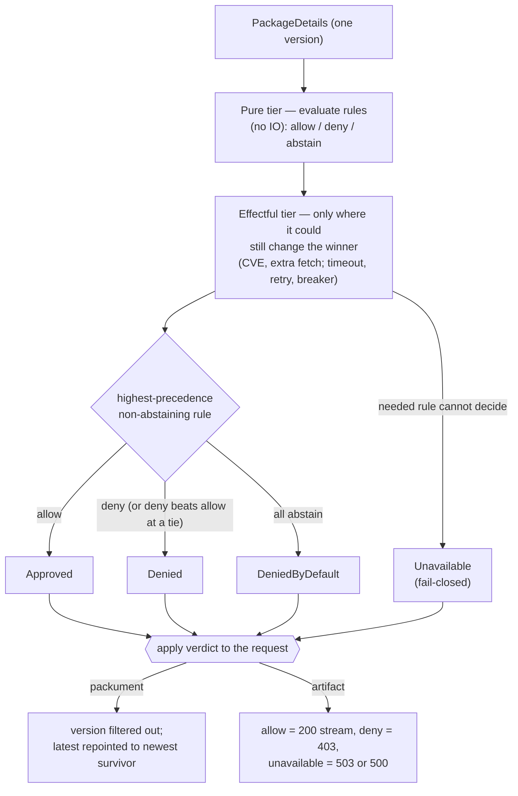
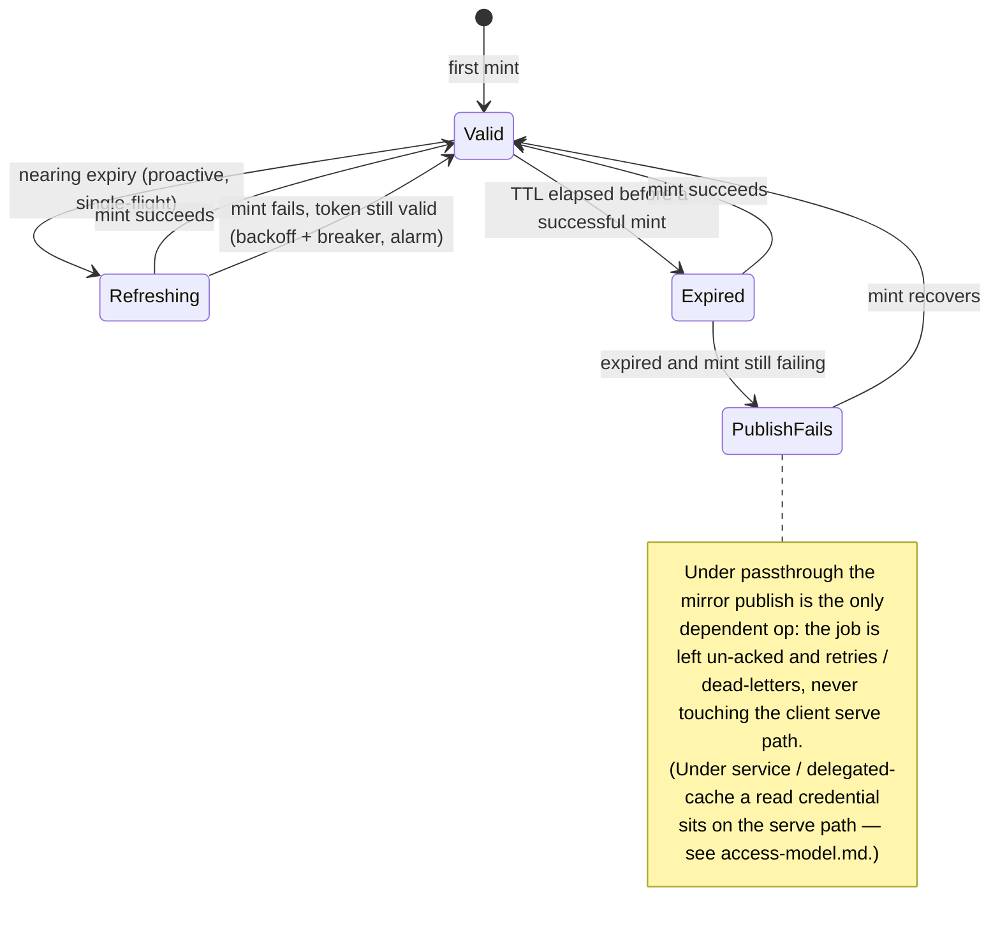
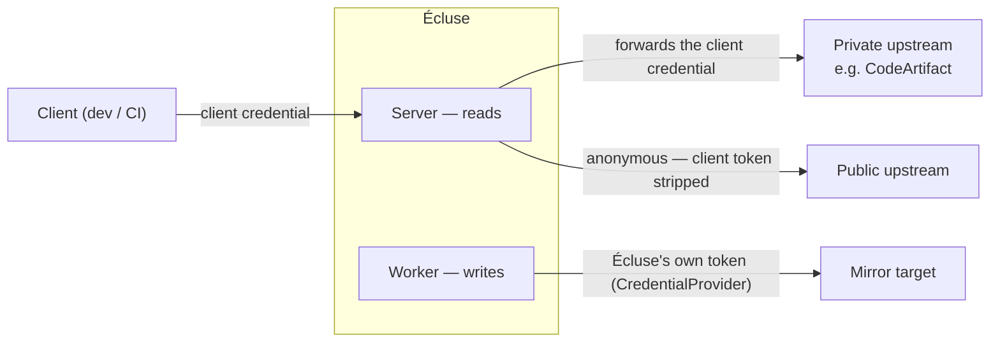

# Architecture Diagrams

> Part of the [Écluse architecture overview](../architecture.md).

A visual companion to the prose specifications under [`architecture/`](.). Like
the rest of these documents, the diagrams describe the **target design** (the
specification being implemented), not necessarily the current state of the code.
Each section links to the document that specifies it in full.

All diagrams are [Mermaid](https://mermaid.js.org/), which GitHub renders inline.

## Contents

1. [System overview](#1-system-overview)
2. [Packument (metadata) request](#2-packument-metadata-request)
3. [Tarball (artifact) request](#3-tarball-artifact-request)
4. [Mirror worker](#4-mirror-worker)
5. [Rules-engine decision flow](#5-rules-engine-decision-flow)
6. [Credential token lifecycle](#6-credential-token-lifecycle)
7. [Credential authority across the three registries](#7-credential-authority-across-the-three-registries)

---

## 1. System overview

A single Écluse binary runs the HTTP server and an in-process mirror worker over a
shared, handle-based `Env`. The **data plane** (metadata + artifact bytes) is
`http-client`; the **control plane** (queue, token mint) sits behind the
[`MirrorQueue`](cloud-backends.md#queue-abstraction) and
[`CredentialProvider`](cloud-backends.md#credential-provider) handles. Solid edges
are request-path / synchronous; dotted edges are best-effort / asynchronous. See
[Registry Model](registry-model.md) and [Cloud Backends](cloud-backends.md).



## 2. Packument (metadata) request

Resolving a package **merges** the upstreams rather than short-circuiting: the
private and public upstreams are fetched in parallel; public versions are gated by
the rules and private versions are trusted, and the two are merged into one
document (private wins on collision; integrity divergence is flagged). This is what
keeps not-yet-mirrored public versions visible so demand-driven mirroring can fire.
Metadata requests **filter but never mirror**. See
[Registry Model → Packument merge](registry-model.md#packument-merge-across-upstreams)
and [Rules Engine → Applying verdicts to a packument](rules-engine.md#applying-verdicts-to-a-packument).

```mermaid
sequenceDiagram
    autonumber
    actor Client
    participant E as Écluse
    participant Cache as Metadata cache
    participant Priv as Private upstream
    participant Pub as Public upstream
    participant Rules as Rules engine

    Client->>E: GET packument
    par fetch upstreams in parallel
        E->>Priv: fetch (client token forwarded)
        Priv-->>E: packument (or miss)
    and
        E->>Cache: lookup parsed public metadata
        alt cache miss
            E->>Pub: fetch (anonymous; token stripped)
            Pub-->>E: packument (or miss)
            E->>Cache: store parsed metadata (short TTL)
        end
    end
    E->>Rules: evaluate every public version
    Rules-->>E: verdicts (allow / deny / unavailable)
    Note over E: filter gated (public) versions; trust private;<br/>merge (private wins; flag integrity divergence);<br/>repoint latest; recompute ETag over merged body
    alt no survivors in merge
        E-->>Client: 403 policy / 503 transient or upstream-unavailable
    else some admitted
        E-->>Client: merged + filtered packument
    end
    Note over E,Pub: packument requests filter but never mirror
```

## 3. Tarball (artifact) request

A tarball is gated for that one version. A private hit is streamed unfiltered; a
private miss fetches the version's metadata, runs the rules, and on acceptance
streams from public **and** enqueues a demand-driven mirror job — non-blocking, so
the client is served immediately. See
[Web Layer → Streaming](web-layer.md#streaming-and-resource-lifetime) and
[Cloud Backends → Mirror Queue](cloud-backends.md#mirror-queue).



## 4. Mirror worker

The worker consumes the queue, fetches each accepted artifact from the public
upstream, **verifies its bytes against the version's integrity hash**, and
publishes to the mirror target via the credential handle. Retry is "don't ack";
at-least-once delivery is safe because publishing is idempotent. See
[Cloud Backends → Mirror Queue](cloud-backends.md#mirror-queue).



## 5. Rules-engine decision flow

Each version is evaluated against the rule set. The two tiers are a **performance
ordering, not a precedence ordering**: pure rules run first because they are cheap,
then effectful rules run only where they could still change the winner — and
**precedence decides** (highest-precedence non-abstaining rule wins; deny beats
allow at a tie; all-abstain is denied by default). A needed-but-undecidable rule
yields `Unavailable` and fails closed. See [Rules Engine](rules-engine.md).



## 6. Credential token lifecycle

A `CredentialProvider` refreshes a registry token off its own `expiresAt`,
proactively and single-flight, so the request hot path never blocks on a mint in
the common case. Under the default `passthrough` strategy credentials are
**mirror-write only**, so even a fully failed refresh never touches the client serve
path — only the mirror publish; under the `service` / `delegated-cache`
[strategies](access-model.md) a read credential failing does degrade serving. See
[Cloud Backends → Credential Provider](cloud-backends.md#credential-provider).



## 7. Credential authority across the three registries

The diagram shows the default **`passthrough`** strategy. The invariant that holds
under **every** strategy is narrower: the client's credential is **never** sent to
the public upstream. Whether it reaches the private upstream is strategy-specific —
it does under `passthrough`; under `service` / `delegated-cache` Écluse reads with
its own credential instead. See [Access & Credential Model](access-model.md) and
[Registry Model → Credential flow and authority](registry-model.md#credential-flow-and-authority).


