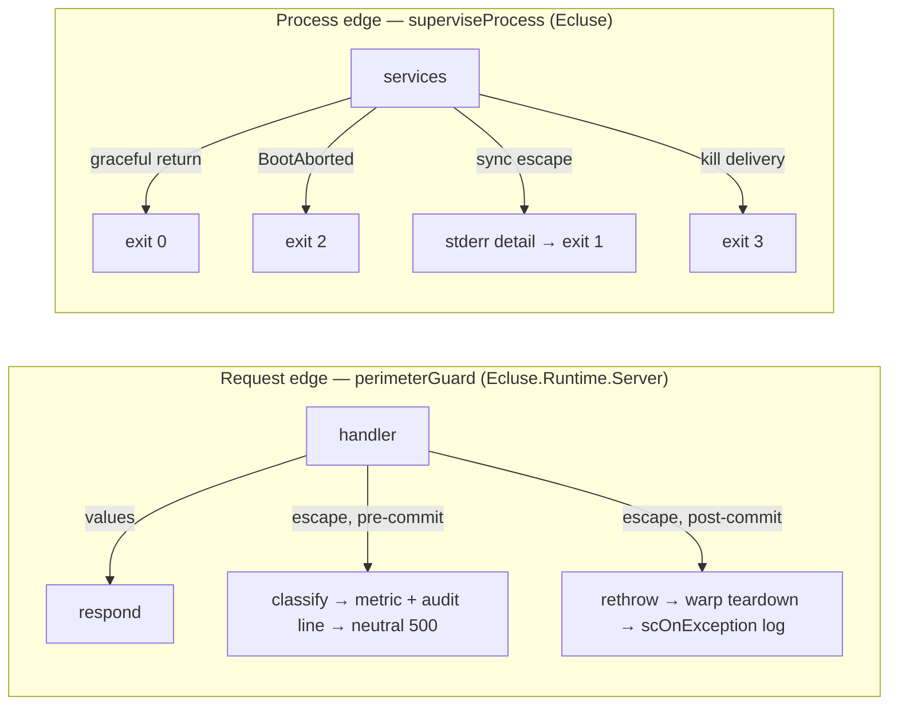

# Fault Model

How Écluse decides what a failure *is*, where it is allowed to travel, and who answers for
it. The short version: routine failures are **values** carried on typed channels; the few
deliberate exceptions are **confined** to a named boundary; and everything that still
escapes is met by one of exactly **two outer edges**, each with an explicit disposition.
This document is the vocabulary those decisions are made in; the coding rules it leans on
are [STYLE.md §10-11](../../STYLE.md), and the operator-facing surfaces it feeds are in
[Observability](observability.md).

## The two edges

Everything between the edges returns values. A handle field reports its backend's failure
as an `Either` (`FetchFault`, `QueueFault`, `OsvDbFetchFault`, `PublishRelayFault`, a
`MetadataError`); the rules engine resolves every evaluation to a `Decision`; a sync step
folds its fetch into a `SyncOutcome`. An exception in flight therefore means one of two
things: a deliberately confined typed throw on its way to its named catcher, or an
invariant break. Both are eventually met by an edge:

- **The request perimeter** (`perimeterGuard`, wrapping the three effectful routes in
  `Ecluse.Runtime.Server.serve`): a synchronous escape before the response is committed is
  classified into the closed `RequestFault` vocabulary (`Ecluse.Core.Server.Fault`),
  counted on `ecluse.serve.perimeter.faults`, logged with its audit payload, and answered
  with the mount-shaped neutral `500`; after the commit there is no honest second response,
  so the escape rethrows and the `scOnException` hook logs the teardown. Details in
  [Web Layer → The typed request perimeter](web-layer.md#the-typed-request-perimeter).
- **The process perimeter** (`superviseProcess` in `Ecluse`): classifies how the whole run
  ended and owns the exit-code table (`0` graceful, `1` service fault, `2` boot abort,
  `3` cancelled; a deliberate `ExitCode` such as the local-dev halt's `130` passes
  through). The operator table is in [USAGE.md → Operating Écluse](../../USAGE.md).

Between the edges sit the **supervised loops**: every long-running background task (the
mirror worker, the enqueue-buffer drain, each advisory sync task, Pilot's export cycle)
runs under one combinator, `Ecluse.Core.Supervision.superviseLoop`, so a loop's file
carries only its step and its policy, never a private copy of catch-log-backoff machinery.

## The disposition vocabulary

Every fault, wherever it surfaces, gets exactly one of a small set of dispositions. Naming
the disposition first is what keeps the shape honest (see STYLE.md rule 11.6):

| Surface | Dispositions |
| --- | --- |
| A background loop (`SupervisionPolicy`) | **Transient** (log, bounded exponential backoff with reset, rerun) · **Permanent** (rethrow: fail the process up for the orchestrator) · **Cancelled** (never caught; the shutdown race always wins) |
| A request | **Deny** (a value rendered through the serve error model: `403`/`404`/`503`/`500` with a reason) · **Propagate** (post-commit: teardown, logged, never answered twice) |
| The process | **Graceful** (exit 0) · **BootAbort** (exit 2; the boot phase already reported every problem) · **FailUp** (exit 1 with the rendered fault on stderr) · **Cancelled** (exit 3) |

The loops' only Permanent classifications today are the wiring faults no retry can fix:
`RegistryUnconfigured` and `CredentialError`'s `Unconfigured`, named by the composition
root's worker policy.

## Two shapes for a failure, and when each applies

**The `Either` shape (the default).** A failure a caller has a per-call decision about is
a value on the field's type: the serve read path maps each `MetadataError` onto a response,
the worker maps a `Left` probe onto fall-through, the drain loop maps a `QueueFault` onto
its per-delivery backoff. Use this shape whenever more than one caller exists or the
decision differs per call site. The reference is `Ecluse.Core.Registry`'s fetch and
publish channels.

**The confined-typed-exception shape (the exception).** When every possible caller wants
the identical disposition and the value would only ever be re-raised, a typed exception
thrown at one edge and absorbed at one named boundary is simpler than reshaping every
signature between them. The codebase has exactly this pattern in:

- `CredentialError`, thrown in the credential-refresh leaf, absorbed by the breaker
  harness around it;
- `CveQueryFault`, thrown at the advisory handle's SQLite edge, absorbed by the rules
  resilience harness (`runEffectfulRule`), which resolves it `Unavailable` and advances
  the breaker;
- `RenderEscape`, wrapped around the assembled render's miss leg, so the request perimeter
  can name the leg an assembly invariant break escaped from;
- `OsvDbCapExceeded`, thrown inside the byte-cap conduit (a conduit has no value channel)
  and folded back into the `OsvDbTooLarge` value at the adapter boundary;
- `ResponseBoundExceeded`, re-raised by the worker's bounded artifact fetch for its
  supervision to classify.

Each one documents its confinement on the type. If you cannot name the single boundary
that absorbs it, it is not this pattern; use a value.

**Classification edges.** Client-library exceptions never travel: the adapter that has the
library's type in scope folds it into the core vocabulary (`Ecluse.Core.Fault.Http` for
`http-client`, `Ecluse.Runtime.Aws.Fault` for `amazonka`), and everything above reasons
over `TransportFault`.

## The stays-inner catch inventory

The remaining broad catches, each with the local knowledge that justifies it (STYLE.md
rule 11.4). This list is the review baseline: a `tryAny`/`catchAny` in `core/src`,
`runtime/src`, or `src/` that is neither below nor justified inline the same way is a
review flag.

| Site | Why it stays |
| --- | --- |
| `Ecluse.Core.Supervision.superviseLoop` | The combinator itself: the one shared catch every background loop runs under. |
| `Ecluse.Runtime.Server.perimeterGuard` | The request edge itself. |
| `Ecluse.Core.Server.Pipeline.Origin` per-origin fetches | The per-origin degrade boundary: the typed channels carry every routine failure, so what this absorbs is invariant-break residue, degraded to that origin contributing nothing rather than taking down the merge. |
| `Ecluse.Core.Server.Pipeline.Packument.markRenderEscape` | Not an absorb: the confined `RenderEscape` marker's wrap point (miss leg only). |
| `Ecluse.Core.Server.Stream` connection opens | The recoverable-miss phase of the hit/miss split: an unopened connection is the fall-through channel; a post-commit pump failure deliberately propagates. |
| `Ecluse.Core.Queue` observer guards (`onDrop`, `onDeliveryFailure`) | Best-effort observers (a log or metric hook) must never fail a serve or tear the drain loop. |
| `Ecluse.Core.Rules.attemptOnce` | The resilience harness: a rule fault becomes `Unavailable` and feeds the breaker. |
| `Ecluse.Core.Rules.evalRules` direct branch | The direct-rule never-throws absorption: a throwing pure rule resolves to the fail-closed `Undecidable` naming the rule. |
| `Ecluse.Core.Cve.taggedQuery` | Not an absorb: the `CveQueryFault` confinement edge (re-raise, typed). |
| `Ecluse.Core.Cve.cveDbClose` | Total by construction: the connection is being discarded, and every close site wants the same disposition. |
| `Ecluse.Runtime.Cve.Sync.s3Download` | Not an absorb: the adapter fold of `amazonka`'s error sum and the cap escape into the `CveFetch` value channel. |
| `Ecluse.Runtime.Cve.Sync.discardTemp` | Best-effort temp discard: the file may already be renamed away or never created. |
| `Ecluse.Runtime.Telemetry` provider shutdowns | Teardown during process exit: a failed flush must not mask the run's own outcome. |
| `Ecluse.Proxy.sweepStaleTemps` | Best-effort boot sweep of stale temp files. Its silence is the known observability gap tracked as [#729](https://github.com/AlexaDeWit/Ecluse/issues/729). |
| `Ecluse.Composition.initProviderFor` | A boot-phase classification edge: an eager mint's throw folds into the aggregated `BootError` block. |
| `Ecluse.superviseProcess` | The process edge, and the codebase's one sanctioned **base** `try`/`throwIO` pair: the outermost boundary must observe a kill delivery to classify it, which the async-hygienic combinators would rethrow first (see the function's Haddock). |

Resource ownership under cancellation is a separate mechanism from catching:
`Ecluse.Core.InFlight.guardInFlight` (the single-flight slot), the admission slot
(`Ecluse.Core.Server.Admission`), and the advisory swap's ownership hand-off
(`Ecluse.Runtime.Cve.Sync.publishVerified`) all use `mask`/`bracket`/`finally`, which act
on every exit without interpreting the exception.

## What this buys, end to end

An unreachable upstream degrades with a typed log cause and no default-handler noise; a
killed dependency drives Transient backoff without a process exit; a wiring fault fails up
to a logged `ServiceExited` and exit `1`; `SIGTERM` drains to exit `0`; an injected
pre-commit fault renders the mount-shaped `500` with its audit line; and a public relay
that visibly was not the admitted artifact is logged, counted, and never mirrored. The
alarms an operator should watch for movement are `ecluse.serve.perimeter.faults` and
`ecluse.serve.relay.anomalies`, both steady-state zero (see
[Observability](observability.md)).
