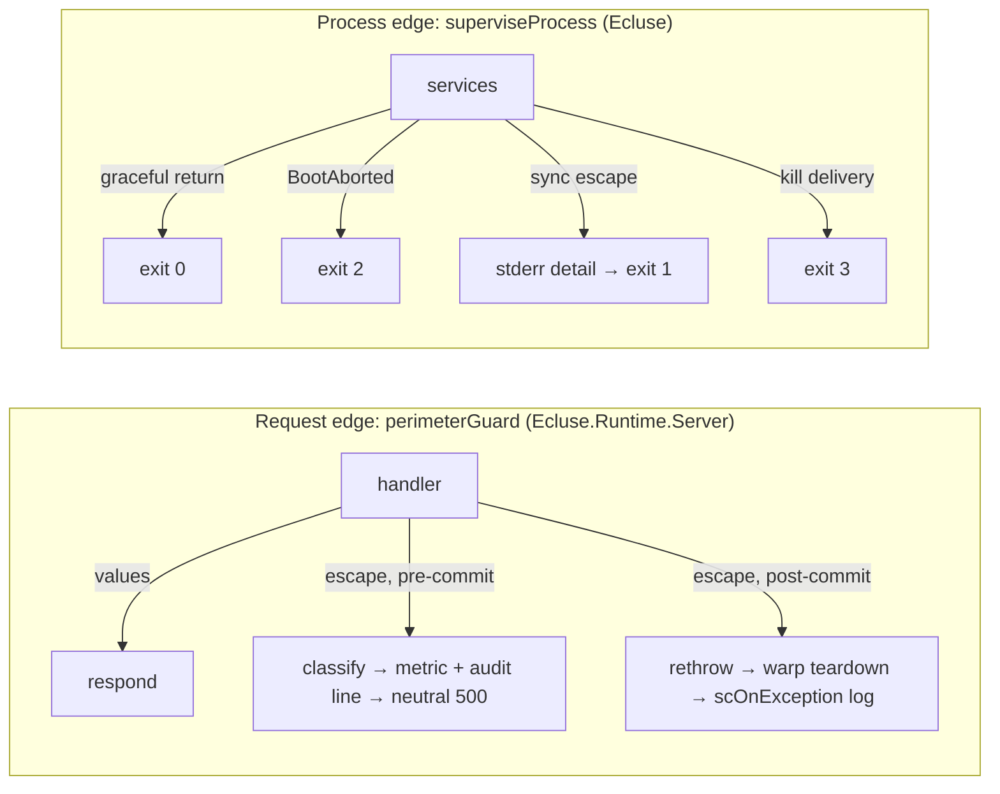

# Fault model

Écluse's vocabulary for failure: what counts as one, where it can travel, and who answers for
it. A routine failure is a value on a typed channel. A few deliberate exceptions stay confined
to one named boundary. Everything that still escapes meets one of exactly two outer edges, each
with an explicit disposition. The coding rules are [docs/style.md rules 10-11](../style.md), and
the operator surfaces this model feeds are in [Observability](observability.md).

## The two edges

Everything between the edges returns values. A handle field reports its backend's failure as an
`Either` (`FetchFault`, `QueueFault`, `OsvDbFetchFault`, `PublishRelayFault`, a `MetadataError`).
The rules engine resolves every evaluation to a `Decision`. A sync step folds its fetch into a
`SyncOutcome`. An exception in flight therefore means one of two things: a confined typed throw
on its way to its named catcher, or an invariant break. An edge meets both.

```mermaid
flowchart LR
    subgraph request ["Request edge: perimeterGuard (Ecluse.Runtime.Server)"]
        H[handler] -->|values| R[respond]
        H -->|escape, pre-commit| P["classify → metric + audit line → neutral 500"]
        H -->|escape, post-commit| T["rethrow → warp teardown → scOnException log"]
    end
    subgraph process ["Process edge: superviseProcess (Ecluse)"]
        S[services] -->|graceful return| E0["exit 0"]
        S -->|BootAborted| E2["exit 2"]
        S -->|sync escape| E1["stderr detail → exit 1"]
        S -->|kill delivery| E3["exit 3"]
    end
```

- **The request perimeter** (`perimeterGuard`, wrapping the three effectful routes in
  `Ecluse.Runtime.Server.serve`). It classifies a synchronous pre-commit escape into the closed
  `RequestFault` vocabulary (`Ecluse.Core.Server.Fault`). It then counts the fault on
  `ecluse.serve.perimeter.faults`, logs it with its audit payload, and answers with the route's
  contract-admitted neutral `500`. After the commit there's no honest second response, so the
  escape rethrows and the `scOnException` hook logs the teardown. Details in
  [Web layer → the typed request perimeter](web-layer.md#error-model).
- **The process perimeter** (`superviseProcess` in `Ecluse`). It classifies how the whole run
  ended and owns the exit-code table: `0` graceful, `1` service fault, `2` boot abort, `3`
  cancelled. A deliberate `ExitCode`, such as the local-dev halt's `130`, passes through. The
  operator table is in [USAGE.md → operating Écluse](../../USAGE.md).

Between the edges sit the supervised loops. Every long-running background task runs under one
combinator, `Ecluse.Core.Supervision.superviseLoop`: the mirror worker, the enqueue-buffer
drain, each advisory sync task, Pilot's export cycle. A loop's file carries only its step and
its policy.

## The disposition vocabulary

Every fault gets exactly one disposition, wherever it surfaces. Naming the disposition first
keeps the shape honest (docs/style.md rule 11.6).

| Surface | Dispositions |
| --- | --- |
| A background loop (`SupervisionPolicy`) | **Transient** (log, bounded backoff with reset, rerun) · **Permanent** (rethrow to fail the process up) · **Cancelled** (never caught: the shutdown race wins) |
| A request | **Deny** (a value rendered through the serve error model: `403`/`404`/`503`/`500`) · **Propagate** (post-commit: teardown, logged, never answered twice) |
| The process | **Graceful** (exit 0) · **BootAbort** (exit 2) · **FailUp** (exit 1, rendered fault on stderr) · **Cancelled** (exit 3) |

Today the loops have exactly one Permanent classification: `CredentialError`'s `Unconfigured`, an
unconfigured credential leaf reached at runtime. No retry fixes that wiring fault. The
composition root's worker policy names it.

## Two shapes for a failure, and when each applies

The `Either` shape is the default. A failure the caller decides on per call becomes a value on
the field's type. The serve read path maps each `MetadataError` onto a response. The worker maps
a `Left` probe onto fall-through, and the drain loop maps a `QueueFault` onto its per-delivery
backoff. Use this shape whenever more than one caller exists, or the decision differs per call
site. The reference is `Ecluse.Core.Registry`'s fetch and publish channels.

The confined-typed-exception shape is the exception. Use it when every caller wants the
identical disposition and the value would only ever be re-raised. One typed exception thrown at
one edge and absorbed at one named boundary is simpler than reshaping every signature between
them. The codebase uses the pattern in exactly these places:

- `CredentialError`: the credential-refresh leaf throws it, and the breaker harness around that
  leaf absorbs it.
- `CveQueryFault`: the advisory handle's SQLite edge throws it. The rules resilience harness
  (`runEffectfulRule`) absorbs it, resolves it `Unavailable`, and advances the breaker.
- `RenderEscape`: the marker wraps the assembled render's miss leg, so the request perimeter
  can name the leg an assembly invariant break escaped from.
- `OsvDbCapExceeded`: the byte-cap conduit throws it, because that conduit has no value channel.
  The adapter boundary folds it back into the `OsvDbTooLarge` value.
- `ResponseBoundExceeded`: the request perimeter absorbs it as a typed gate fault. The worker's
  bounded artifact fetch carries the same breach as a value
  (`Either ResponseBoundExceeded ByteString`), never a re-raise.

Each type documents its confinement. If you can't name the single boundary that absorbs a
throw, it's not this pattern: use a value. Client-library exceptions never travel. The adapter
that has the library's type in scope folds the exception into the core vocabulary:
`Ecluse.Core.Fault.Http` for `http-client`, `Ecluse.Runtime.Aws.Fault` for `amazonka`.
Everything above the adapter reasons over `TransportFault`.

## The stays-inner catch inventory

The table lists every remaining broad catch with the local knowledge that justifies it
(docs/style.md rule 11.4). It is the review baseline. Flag any `tryAny` or `catchAny` in
`core/src`, `runtime/src`, or `src/` that is neither listed nor justified inline the same way.

| Site | Why it stays |
| --- | --- |
| `Ecluse.Core.Supervision.superviseLoop` | The combinator itself: the one shared catch every background loop runs under. |
| `Ecluse.Runtime.Server.perimeterGuard` | The request edge itself. |
| `Ecluse.Core.Server.Pipeline.Origin` per-origin fetches | The per-origin degrade boundary: it absorbs invariant-break residue and degrades that origin to no contribution instead of taking down the merge. |
| `Ecluse.Core.Server.Pipeline.Packument.markRenderEscape` | Not an absorb: the confined `RenderEscape` marker's wrap point (miss leg only). |
| `Ecluse.Core.Server.Stream` connection opens | The recoverable-miss phase of the hit/miss split: an unopened connection is the fall-through channel. A post-commit pump failure propagates on purpose. |
| `Ecluse.Core.Queue` observer guards (`onDrop`, `onDeliveryFailure`) | Best-effort observers (a log or metric hook) must never fail a serve or tear the drain loop. |
| `Ecluse.Core.Rules.Effectful.attemptOnce` | The resilience harness: a rule fault becomes `Unavailable` and feeds the breaker. |
| `Ecluse.Core.Rules.evalRules` direct branch | The direct-rule never-throws absorption: a throwing pure rule resolves to the fail-closed `Undecidable` that names the rule. |
| `Ecluse.Core.Cve.taggedQuery` | Not an absorb: the `CveQueryFault` confinement edge (re-raise, typed). |
| `Ecluse.Core.Cve.cveDbClose` | Total by construction: the code discards the connection, and every close site wants the same disposition. |
| `Ecluse.Runtime.Cve.Sync.s3Download` | Not an absorb: the adapter fold of `amazonka`'s error sum and the cap escape into the `CveFetch` value channel. |
| `Ecluse.Runtime.Cve.Sync.discardTemp` | Best-effort temp discard: the file may be gone already, either renamed away or never created. |
| `Ecluse.Runtime.Telemetry` provider shutdowns | Teardown during process exit: a failed flush must not mask the run's own outcome. |
| `Ecluse.Proxy.CveSync.sweepStaleTemps` | Best-effort boot sweep of stale temp files. Its silence is a known observability gap. |
| `Ecluse.Composition.Credential.initCredentialProviders` | A boot-phase classification edge: a throw from an eager CodeArtifact mint folds into the aggregated `BootError` block. |
| `Ecluse.superviseProcess` | The process edge, and the codebase's one sanctioned base `try`/`throwIO` pair. The outermost boundary must observe a kill delivery to classify it, and the async-hygienic combinators would rethrow that delivery first. |

Resource ownership under cancellation is a separate mechanism from catching. Three sites use
`mask`, `bracket`, and `finally`: `Ecluse.Core.InFlight.guardInFlight` (the single-flight slot),
the admission slot (`Ecluse.Core.Server.Admission`), and the advisory swap's ownership hand-off
(`Ecluse.Runtime.Cve.Sync.publishVerified`). Each acts on every exit without interpreting the
exception.

## What this buys, end to end

- An unreachable upstream degrades with a typed log cause and no default-handler noise.
- A killed dependency drives Transient backoff without a process exit.
- A wiring fault fails up to a logged `ServiceExited` and exit `1`.
- `SIGTERM` drains to exit `0`.
- Écluse logs and counts a public relay that visibly wasn't the admitted artifact, and never
  mirrors it.

Watch two alarms for movement: `ecluse.serve.perimeter.faults` and
`ecluse.serve.relay.anomalies`. Both are steady-state zero (see
[Observability](observability.md)).
