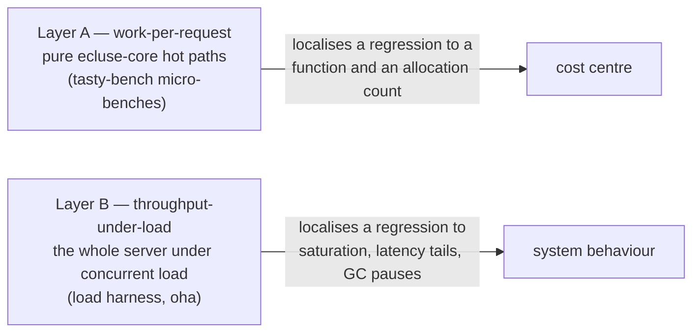
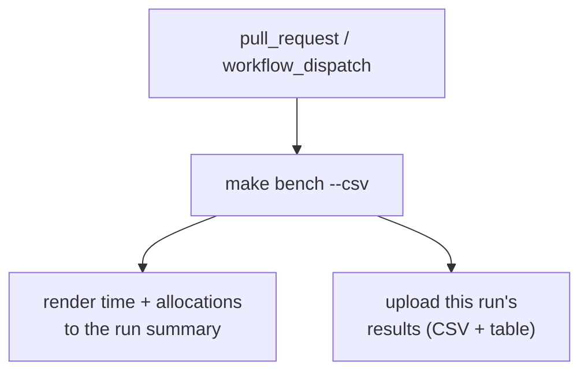

# Performance & Benchmarking

> Part of the [Écluse architecture overview](../architecture.md).

Écluse sits in front of a package registry on the critical path of every build, so
its own overhead matters: a metadata request fans out into decoding a packument,
projecting it, sweeping the rule engine over every version, merging upstreams,
filtering and rewriting the body, and re-serialising it. This document describes how
that cost is measured, what the numbers mean, and — just as importantly — what the
measurements are *not* allowed to do (block a merge on a noisy timing).

## The two-layer model

Performance has two distinct shapes, measured by two distinct mechanisms:



- **Layer A — work-per-request.** The CPU and allocation cost of the
  transformations a single request triggers, benchmarked in isolation over realistic
  input. This is what the benchmark harness in this repository measures today: the
  hot-path computations of [`ecluse-core`](../../core), with no server and no network.
  Most are pure; the rule sweep and the serve filter run through the engine's effectful
  evaluator (rule evaluation is `IO`), so those benches measure that `IO` action — but
  it is still the per-request computation, not a kernel scheduler or a socket. It is the
  layer where an accidentally-quadratic fold or a doubled allocation is caught.
- **Layer B — throughput-under-load.** The whole system under concurrent load —
  request rate, latency tails, GC pause behaviour, memory under sustained traffic. A load
  generator ([`oha`](https://github.com/hatoo/oha)) drives the real composed server, so
  this measures system behaviour — saturation and the latency tail — rather than a pure
  function's cost. Allocations per request (Layer A) are the *leading indicator* of the
  p99 Layer B measures: GC pauses are tail latency for an inline proxy, so the two layers
  are complementary, not redundant.

The next sections cover Layer A; the [final section](#layer-b--throughput--latency-under-load)
covers Layer B.

## What we measure: allocations and time

Each micro-bench reports **two** numbers, and they are not equal in standing.

- **Allocations are the tracked signal.** Bytes allocated (read from the GHC RTS GC
  statistics, enabled by `+RTS -T`, which the benchmark component bakes into its RTS
  options) are very nearly *deterministic* for a pure computation on fixed input:
  they barely depend on the machine, the load, or the wall clock. That makes
  allocations the signal worth comparing across commits and across runners — a change
  in allocated bytes is almost always a change in the code, not the environment.
- **Time is informational.** Wall-clock time is reported because it is what a human
  ultimately cares about, but it is machine-dependent and noisy: a shared CI runner's
  time figure is only loosely comparable from run to run. Treat it as a sanity check
  and a rough magnitude, never as a gate.

### Complexity assertions

Three version-count-scaled benches — the rule sweep, the packument merge, and the
serve-time filter/rewrite — additionally assert their **growth class** with
[`tasty-bench-fit`](https://hackage.haskell.org/package/tasty-bench-fit): they fit the
measured curve and require it to be no worse than linear in the version count. This is
a different kind of check from a timing comparison. A packument with tens of thousands
of versions going quadratic in a fold is an *algorithmic* bug (the class the
accidentally-quadratic regressions in this codebase have fallen into), not a slow
machine — so a failed complexity assertion is a real failure, and it fails the
benchmark run. The synthetic generator that drives these scales toward ~100k versions,
the size at which a super-linear term bites.

## Posture: inform-only, never gates (except on failure)

The benchmark workflow's **only red state is a literal benchmark failure** — a build
error, a crashed harness, or a tripped complexity assertion. It **never computes a
perf-regression fail**: there is no "10% slower than `main`" threshold, no allocation
ceiling that turns a measurement into a merge blocker.

The distinction is deliberate:

| Kind of signal | Example | Gates? |
|---|---|---|
| A perf-regression comparison | "this is 12% slower / allocates 8% more than the baseline" | **Never.** Machine-dependent and noisy; reported for a human to read. |
| An algorithmic-class assertion | "this fold is now O(n²) in version count" | **Yes — it fails the run.** A correctness signal, not a timing. |
| A literal failure | the harness does not build / crashes | **Yes — it fails the run.** |

Concretely: the benchmarks are a **standalone workflow**
([`.github/workflows/bench.yml`](../../.github/workflows/bench.yml)) triggered on
**every pull request and on manual dispatch**. They are **not** wired into `ci.yml`'s
terminal `gate` job, so a benchmark result — fast, slow, or absent — can never block a
pull request. This mirrors the project's other inform-only tiers (weeder, stan):
visible on the PR, never a gate.

## Per-run results



Each run renders its time-and-allocation table into the GitHub run summary and uploads
the results CSV as a downloadable artifact (`bench-results-<sha>`) attached to that run.
There is **no cross-run baseline**: a GitHub Actions artifact is scoped to its own run,
so one run cannot read another's, and a durable cross-run store (a data branch or an
external service) would need write permissions this project deliberately does not take
on. Comparison is therefore **by hand** — read a PR run's allocations against `main`'s,
or, locally, `make bench BENCH_OPTS='--baseline out.csv'` against a CSV you saved.
Because allocations are machine-independent, an eyeballed allocation delta is a reliable
signal even across different runners.

## Consistency posture

Comparable numbers need a comparable environment:

- **A shared public runner is the reference.** Allocations are machine-independent, so
  they compare cleanly across runs regardless of runner; time figures are only loosely
  comparable, and only when produced on the same runner class. The workflow runs on the
  standard shared hosted runner (for both pull-request and dispatch runs), so every
  recorded figure is drawn from the same kind of machine.
- **Local runs are for deep-dives, not for comparison against CI.** Run the benches on
  your own machine to iterate on a change and to profile a regression to a cost centre
  (`make bench-profile`), but compare a local time figure only against another local
  figure on the same machine — never against a CI baseline.

## Running locally

Everything runs from the lean `.#bench` dev shell (the CI toolchain plus the
flame-graph tooling); the `make` targets enter it for you.

```sh
make bench                       # time + allocations for every hot path
make bench BENCH_OPTS='-p serve' # only the matching benches (tasty-bench pattern)
make bench BENCH_OPTS='--csv out.csv'              # write a results CSV
make bench BENCH_OPTS='--baseline out.csv'         # print each delta vs a prior CSV (inform-only)
```

`make bench` reports both numbers per bench, e.g.:

```
serve (filter + url-rewrite + etag)
  express: filter + serve: OK
    5.1 ms ± 0.3 ms, 9.8 MB allocated, ...
```

To localise a regression to a cost centre, build a profiling variant and render a
flame graph:

```sh
make bench-profile                                 # profiles the express benches by default
make bench-profile BENCH_PROFILE_OPTS='-p "serve"' # profile one bench for a focused graph
```

`bench-profile` builds the benchmark with GHC's late cost-centre profiling
(`--profiling-detail=late`, so the centres reflect the optimised code with low skew),
runs it under the cost-centre profiler, and renders `ecluse-bench.svg` from the
resulting `ecluse-bench.prof` with `ghc-prof-flamegraph`. Open the SVG and read the
widest frames — those are where the time and allocations go.

## What is benched

The Layer A benches cover the pure hot paths a metadata request exercises, each
**per package across the curated real-world corpus** (see
[The real-world corpus](#the-real-world-corpus)) — so the work-per-request figures
sample the real distribution of package sizes and shapes, small (`is-odd`) to heavy
(`@types/node`), rather than one anchor — and, where growth matters, over a synthetic
packument scaled toward ~100k versions for the complexity assertion only:

| Hot path | Module | Scaled complexity assertion |
|---|---|---|
| npm wire decode + projection | `Ecluse.Core.Registry.Npm.Wire` / `.Project` | — |
| version parse / order / latest-selection | `Ecluse.Core.Version` | — |
| request classification | `Ecluse.Core.Registry.Npm.Route` | — |
| rule sweep over versions | `Ecluse.Core.Rules` | linear in version count |
| packument merge | `Ecluse.Core.Package.Merge` | linear in version count |
| filter + URL rewrite + re-serialise + ETag | `Ecluse.Core.Registry.Npm.Filter` / `.Serve`, `Ecluse.Core.Server.Conditional` | linear in version count |
| bounded read / nesting / version-count guards | `Ecluse.Core.Security` | — |

The corpus is loaded once and validated up front (a corrupt or mis-pinned capture stops
the run before any benching), and the synthetic generator's invariants are pinned by test
cases that run as part of the benchmark — so a malformed corpus or generator stops the
run rather than benching a degenerate input.

### The real-world corpus

The M9 benches once ran on a thin, partly-synthetic corpus — one real anchor (`express`)
plus a synthetic packument whose versions are structurally identical — which did **not**
sample the heavy, heterogeneous tail (`typescript` / `react` / `@types/node` / `@babel/*`
/ an `aws-sdk`-class package) that dominates the real-world cost. The corpus now spans
that spectrum with **pinned real captures** of substantial, many-version packages.
Trivial few-version packages stress nothing — neither the hot paths nor the metadata
cache — so they are **deliberately excluded**; the corpus leans large.

| Tier | Packages (versions) |
|---|---|
| medium | `lodash` (113), `request` (126) |
| large | `@babel/core` (161), `express` (anchor), `react` (135), `typescript` (168) |
| heavy | `@aws-sdk/client-s3` (668), `webpack` (569), `@types/node` (2339) |

- **Pinned and committed.** Each package is pinned by `package@version` in
  `bench/corpus/package.json` and captured to `bench/corpus/npm/<pkg>.full.json`. The
  pins are kept fresh by Renovate's npm manager exactly as the `test/oracles/`
  version-ordering reference is (a bump is the signal to re-capture). `express` is the
  pre-existing untrimmed anchor under `core/test/unit/fixtures/npm/`, reused in place and
  shared with the unit suite — the one untrimmed capture.
- **Trimmed for size, not shape.** `make gen-bench-corpus` re-captures from the pins: for
  each package it keeps every **stable** release at or below the pin with its full
  per-version manifest — the heterogeneous dependency / `peerDependencies` / `engines` /
  `deprecated` / `scripts` / `dist` shape the hot paths read and re-serialise — and drops
  only (a) the degenerate nightly/canary/dev **prerelease** versions (near-identical
  day-to-day builds that are the bulk of `typescript`/`react`'s size and add no real
  shape — the synthetic generator's degeneracy), and (b) pure-noise fields no hot path
  reads (`readme`, npm operational internals). Capturing at or below the pin makes a
  re-run reproduce the same fixture until Renovate moves a pin, so the dataset stays
  deterministic and committed without silently drifting from what npm serves.
- **Synthetic generator: stress only.** `syntheticPackumentValue` is retained **only**
  for the complexity-scaling (O(n) curve fit) assertions — the version-count stress
  input, not a realistic case. The realistic distribution is the corpus.

## Layer B — throughput & latency under load

Layer B is the *host-sensitive* counterpart to Layer A's deterministic work-per-request
figures: it boots the **real composed server** (`Ecluse.Server.application`) on `warp`
and drives it under concurrent load, so it answers "does the proxy keep up with traffic?"
— throughput, the latency tail, GC pause behaviour, residency under sustained load. It is
a separate `bench-load` **executable** (not a `tasty-bench` component), because it opens
sockets and spawns a load generator.

### Posture: inform-only, never gates

Layer B characterises and trends; it **never asserts a throughput pass/fail**. There is
no SLO, no "10% slower than `main`" threshold, no allocation ceiling. Its only red state
is a **literal failure** — the harness cannot boot, `oha` cannot run, or a scenario
served nothing — surfaced as a non-zero exit. Throughput and latency are runner-dependent
and read coarsely; **allocations per request** is the machine-independent signal that
trends cleanly across runners (decision D2). There is **no
cross-run baseline**: a run uploads its own results, consumed by no other run, so
comparison is by hand.

> **What "allocations / request" includes.** The figure is the RTS `allocated_bytes`
> delta over the whole bench process, which for the HTTP scenarios also runs the two
> in-process stub upstreams and the proxy (only `oha`, a subprocess, is excluded). It
> therefore folds in the stubs' own per-request allocations — a *consistent over-count*,
> fine for trending across commits, but **not** a pure proxy per-request cost, and so
> **not directly comparable** to Layer A's pure per-call allocations. Peak residency is a
> process high-water mark that also spans the warm-up; the allocation and GC figures are
> before/after deltas over the measured window only.

### The scenarios

Each scenario reports throughput, the p50/p90/p99/p99.9 latency distribution, peak
residency, GC stats, and allocations per request.

| Scenario | Shape | What it isolates |
|---|---|---|
| `merge-cold` | `GET /{pkg}` over the large-emphasis corpus mix fanning to both upstreams → merge → rule-filter → URL-rewrite → ETag → re-serialise, **public cache disabled (TTL 0)** | the expensive headline path: the live private fetch, the cross-upstream merge, the rule sweep, and the re-serialise on every request (the public leg's fetch + decode is single-flight-amortised under concurrency, not per-request) |
| `cached-public-hit` | the same `GET` over the corpus mix, with the anonymous public origin served from the **warm metadata cache** (bound holds the whole set) | the cheap, common high-throughput path: the public fetch and decode are elided |
| `cache-fits-large` | a **uniform** working set of large packuments, **TTL > 0**, cache bound **≥ working set** | the eviction-comparison baseline: after warm-up every entry stays resident, served warm with no re-derivation |
| `cache-evicts-large` | the **same** uniform large working set, **TTL > 0**, cache bound **< working set** | **cache eviction under large datasets**: continual eviction + re-derivation — throughput/latency under churn, the alloc/request of re-deriving each evicted large packument, residency bounded by the bound |
| `worker-mirroring` | the mirror worker's `fetch → verify → publish → ack` loop, driven **in-process** (no HTTP surface) | the mirror hot path: an artifact fetch, an integrity recompute-and-verify, and a publish |

#### The serve mix: a real-world corpus, large-emphasis

The packument scenarios serve the **curated real-world corpus**, not one synthetic
payload. The public upstream serves each package's real captured packument by the
requested name (the full Layer A corpus, scoped packages included — the stub recovers
`@scope/name` from the request path); the private upstream serves a small disjoint overlay
per package so every request still merges a genuine cross-upstream union.

The `merge-cold` and `cached-public-hit` scenarios drive a **weighted mix** (`oha`'s
`--urls-from-file`, each package's URL repeated by its weight) with the **large,
many-version packuments as the primary drivers** — the heavy captures (`@types/node`,
`webpack`, `@aws-sdk/client-s3`, …) carry the most weight, since trivial packages stress
nothing. This is a deliberate stress emphasis, not a traffic-realism model. The project
documents no prior access-pattern model, so the weighting is the chosen default (it lives
in `serveCorpus`, in `Ecluse.BenchLoad.Npm`). The worker scenario keeps its synthetic,
payload-sized artifact (it mirrors a tarball, not a packument).

#### Cache eviction under large datasets

The metadata cache (`Ecluse.Core.Server.Cache`) is size-bounded by `cacheMaxEntries`
(default 1024) and holds a parsed `PackageInfo` + raw `Value` per `(Source, PackageName)`.
A working set of large packuments larger than the bound forces continual eviction and
re-derivation — the cost trivial packages never expose. Two paired scenarios isolate it,
serving the **same uniform working set** of large packuments at **TTL > 0** (so entries
are removed by eviction, not expiry), differing only in the bound:

- `cache-fits-large` bounds at the working-set size — everything stays resident, served
  warm: the **fits-in-cache** baseline (low alloc/request; residency ≈ the whole working
  set held at once).
- `cache-evicts-large` bounds **below** the working set — the cache cannot hold it all and
  continually evicts and re-derives (re-fetch + decode + project) each evicted large
  packument on its next request: higher alloc/request and GC churn, lower throughput, and
  a residency bounded by the bound (plus the transient re-derivation, which — because the
  warm-up touches the whole set — keeps the peak high-water mark near the fits baseline;
  the alloc/request and GC deltas are the cleaner eviction-cost signal).

Reading the two side by side isolates the eviction cost. Both the bound and the working
set are knobs (`BENCH_LOAD_CACHE_MAX_ENTRIES`, `BENCH_LOAD_WORKING_SET`), so a
fits-vs-exceeds sweep is a knob change. The whole comparison runs over the committed
fixtures, so it stays deterministic.

A note on the cache scenarios. The default `passthrough` posture caches only the
**anonymous public** origin; the trusted private origin is the per-client authority and
is fetched per request, never cached (see
[Registry Model](registry-model.md) and `Ecluse.Core.Server.Pipeline`). So the packument
scenarios differ in the cache TTL and bound: `merge-cold` uses a zero TTL (cache off),
`cached-public-hit` a long TTL with a bound holding the whole set, and the two
`cache-*-large` scenarios a long TTL with the bound at or below the working set (above).

A zero TTL does **not** make the public fetch+decode a per-request cost, though. The
public leg resolves through the cache's **single-flight** path (`resolveMetadata`): even
at a zero TTL, concurrent misses coalesce onto one in-flight fetch and share the leader's
parsed packument, so followers skip both the fetch and the ~40 ms decode. Under
concurrency the public fetch+decode is therefore **amortised across followers**, which
narrows the contrast with `cached-public-hit` — both amortise the public fetch, one via
the cache, one via single-flight. `merge-cold`'s per-request cost is the live private
leg, the merge, the rule sweep, and the re-serialise. (This is real production behaviour;
the scenario does not defeat coalescing.) A literal "private-only cache hit" is not a
shape the passthrough model has; `cached-public-hit` is its faithful realisation of the
cheap, no-public-fetch path.

### How it measures

- **The real server over stub upstreams.** The composed `application` is booted on
  loopback with `Network.Wai.Handler.Warp.testWithApplication`, over the in-memory mirror
  queue and credential doubles (`newInMemoryQueue`, `staticProvider`). Each upstream is an
  in-process `warp` stub serving a canned payload after an **injectable latency**, so the
  *real* data plane runs — the `http-client` fetch and the JSON decode — minus the WAN.
  Everything is loopback, so the harness opens no external socket and needs no Docker.
- **`oha` drives the HTTP scenarios.** It is spawned via `typed-process` with
  `--output-format json`, whose report yields the throughput and the latency percentiles.
  The worker scenario has no HTTP surface, so its loop is driven and timed in-process.
- **RTS statistics frame each run.** `GHC.Stats.getRTSStats` is snapshotted before and
  after the measured window (the executable bakes in `+RTS -T`), giving allocations per
  request, peak residency, and GC-pause stats. Each scenario runs in its **own process**
  (the driver re-execs the binary once per scenario), because peak residency is a
  process-wide high-water mark — a fresh process keeps each scenario's residency its own.

### Built to extend across ecosystems

Today only npm is served, but the proxy is built to front several upstream ecosystems
(PyPI, RubyGems, …). The harness is split so adding one is cheap:

- the reusable **structure** — the `oha` driver (`Ecluse.BenchLoad.Oha`), the RTS capture,
  the scenario runner, and the report rendering (`Ecluse.BenchLoad.Harness`) — is the same
  whatever ecosystem a scenario drives;
- the per-ecosystem **interface** is an `UpstreamFixture` (the Handle pattern: a record of
  an ecosystem and its `Scenario`s). A `Scenario` holds only the ecosystem-specific setup
  and teardown — booting that ecosystem's stub upstreams with the injected latency and
  payload, wiring the proxy mount, and yielding a `Driver` that tells the harness what to
  drive.

npm is the first and only instance (`Ecluse.BenchLoad.Npm`). Adding PyPI is "write
`pypiFixture` and register its scenarios", not "rewrite the harness".

### Load knobs

The operating point is set by these knobs, each overridable through the environment, with
runner-sane defaults:

| Knob | Environment variable | Default |
|---|---|---|
| concurrency | `BENCH_LOAD_CONCURRENCY` | 50 |
| duration (seconds) | `BENCH_LOAD_DURATION_SECONDS` | 30 |
| injected upstream latency (ms) | `BENCH_LOAD_UPSTREAM_LATENCY_MS` | 5 |
| worker artifact size (bytes) | `BENCH_LOAD_PAYLOAD_BYTES` | 262144 |
| cache-eviction bound (entries) | `BENCH_LOAD_CACHE_MAX_ENTRIES` | 3 |
| cache-eviction working set | `BENCH_LOAD_WORKING_SET` | 64 (capped to the corpus) |

The packument scenarios derive their payloads from the real-world corpus captures, so
`BENCH_LOAD_PAYLOAD_BYTES` sizes only the worker scenario's synthetic artifact.
`BENCH_LOAD_CACHE_MAX_ENTRIES` is the bound for `cache-evicts-large` (set it `≥` the
working set to turn that scenario into a second fits run); `BENCH_LOAD_WORKING_SET` caps
how many of the (heaviest-first) corpus packages the two `cache-*-large` scenarios cycle.

### Running it

Everything runs from the lean `.#bench` dev shell (which carries `oha`); the `make`
target enters it for you.

```sh
make bench-load                               # all scenarios, default operating point
BENCH_LOAD_DURATION_SECONDS=10 make bench-load # a quicker local pass
```

Each scenario's table is rendered to stdout and, in CI, to the run summary. The CI job
([`.github/workflows/bench-load.yml`](../../.github/workflows/bench-load.yml)) is a
standalone, **non-gating** tier: it runs on a **nightly schedule and on manual dispatch**
(never per pull request — shared-runner throughput is too noisy for a per-PR signal), is
not wired into `ci.yml`'s `gate`, and uploads its results as a downloadable artifact with
no cross-run baseline. Trustworthy absolutes come from **local deep-dives** on a quiet
machine, never from a shared-runner figure.
