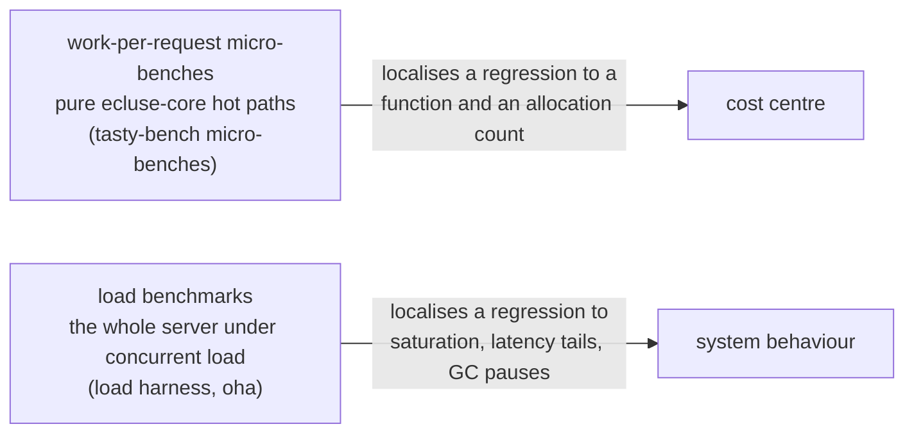
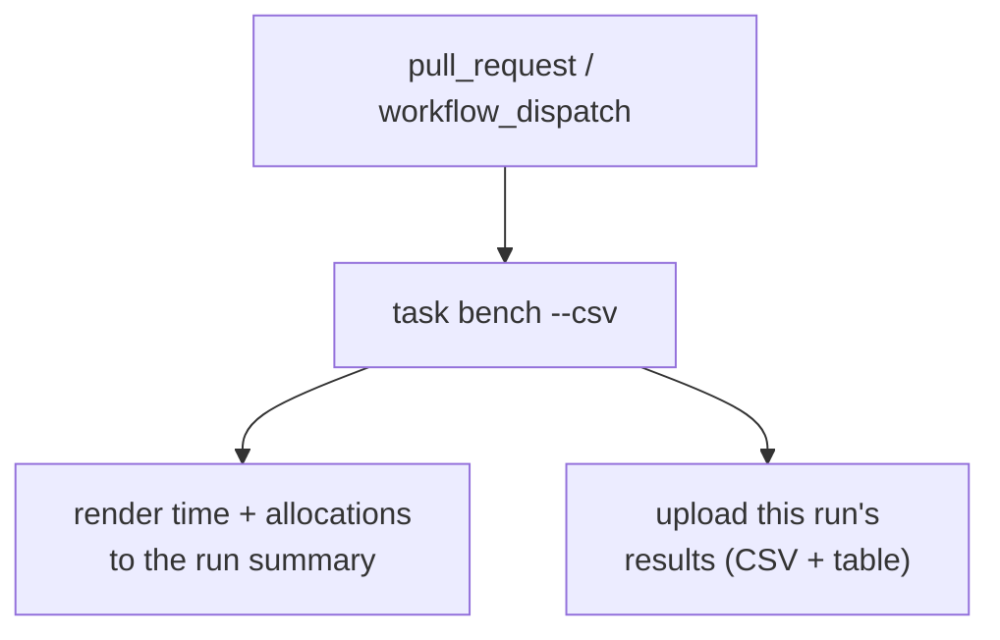

# Performance and benchmarking

> Part of the [Écluse architecture overview](../architecture.md).

Écluse sits on the critical path of every build, so its own overhead matters: a
metadata request decodes a packument, projects it, sweeps the rule engine over every
version, merges upstreams, filters and rewrites the body, and re-serialises it. This
document covers how that cost is measured, what the numbers mean, and what they may
never do: block a merge on a noisy timing.

## The two-layer model

Performance has two distinct shapes, measured by two distinct mechanisms:



- **Work-per-request micro-benches.** The CPU and allocation cost of the
  transformations one request triggers, benchmarked in isolation over realistic input:
  the hot-path computations of [`ecluse-core`](../../core), no server, no network. Most
  are pure; the rule sweep and serve filter run through the effectful evaluator (rule
  evaluation is `IO`), so those benches time that `IO` action, still per-request work
  rather than a scheduler or a socket. This is where an accidentally-quadratic fold or
  a doubled allocation is caught.
- **Load benchmarks.** The whole system under concurrent load: request rate, latency
  tails, GC pauses, residency. A load generator ([`oha`](https://github.com/hatoo/oha))
  drives the real composed server, measuring saturation and the tail rather than a pure
  function's cost. Allocations per request are the leading indicator of the p99 here,
  since GC pauses are tail latency for an inline proxy, so the two tiers are
  complementary.

## What we measure: allocations and time

Each micro-bench reports two numbers of unequal standing.

- **Allocations are the tracked signal.** Bytes allocated (from the GHC RTS GC
  statistics, via `+RTS -T`, baked into the bench's RTS options) are nearly
  deterministic for a pure computation on fixed input, barely depending on machine or
  load. So they compare cleanly across commits and runners: a change in allocated
  bytes is almost always a code change, not an environment one.
- **Time is informational.** Wall-clock time is reported as a rough magnitude, but it
  is machine-dependent and noisy: a shared runner's figure is only loosely comparable
  run to run. Treat it as a sanity check, never a gate.

### Complexity assertions

Three version-count-scaled benches (rule sweep, packument merge, serve-time
filter/rewrite) also assert their **growth class** with
[`tasty-bench-fit`](https://hackage.haskell.org/package/tasty-bench-fit): the fitted
curve must be no worse than linear in the version count. Unlike a timing comparison,
this catches an algorithmic bug: a fold going quadratic over tens of thousands of
versions is a real failure and fails the run, not a slow machine. The synthetic
generator scales toward ~100k versions, where a super-linear term bites.

## Posture: inform-only, never gates (except on failure)

The benchmark workflow's **only red state is a literal failure**: a build error, a
crashed harness, or a tripped complexity assertion. It never computes a
perf-regression fail, no "10% slower than `main`" threshold, no allocation ceiling
that blocks a merge.

The distinction is deliberate:

| Kind of signal | Example | Gates? |
|---|---|---|
| A perf-regression comparison | "this is 12% slower / allocates 8% more than the baseline" | **Never.** Machine-dependent and noisy; reported for a human to read. |
| An algorithmic-class assertion | "this fold is now O(n²) in version count" | **Yes, it fails the run.** A correctness signal, not a timing. |
| A literal failure | the harness does not build / crashes | **Yes, it fails the run.** |

The benchmarks are a standalone workflow
([`bench.yml`](../../.github/workflows/bench.yml)) on every pull request and manual
dispatch, not wired into `ci.yml`'s terminal `gate`, so a result (fast, slow, or
absent) never blocks a PR. This mirrors the other inform-only tiers (weeder, stan):
visible on the PR, never a gate.

## Per-run results



Each run renders its time-and-allocation table into the GitHub run summary and uploads
the results CSV as an artifact (`bench-results-<sha>`). There is no cross-run baseline:
an Actions artifact is scoped to its own run, and a durable store would need write
permissions the project declines. Compare by hand, a PR run's allocations against
`main`'s, or locally with `task bench BENCH_OPTS='--baseline out.csv'`. Allocations are
machine-independent, so an eyeballed delta is reliable across runners.

## Consistency posture

Comparable numbers need a comparable environment:

- **A shared runner is the reference.** Allocations compare across any runner; time
  figures only on the same runner class. The workflow runs on the standard shared
  hosted runner for both triggers, so every figure comes from the same kind of machine.
- **Local runs are for deep-dives.** Iterate and profile a regression to a cost centre
  (`task bench-profile`) on your own machine, but compare a local time figure only
  against another local one, never a CI baseline.

## Running locally

The `.#bench` dev shell (CI toolchain plus flame-graph tooling) carries these; the
`task` targets enter it for you.

```bash
task bench                       # time + allocations for every hot path
task bench BENCH_OPTS='-p serve' # only the matching benches (tasty-bench pattern)
task bench BENCH_OPTS='--csv out.csv'              # write a results CSV
task bench BENCH_OPTS='--baseline out.csv'         # print each delta vs a prior CSV (inform-only)
```

`task bench` reports both numbers per bench, e.g.:

```
serve (filter + merge-assemble + etag)
  express: filter + serve: OK
    5.1 ms ± 0.3 ms, 9.8 MB allocated, ...
```

To localise a regression to a cost centre, build a profiling variant and render a
flame graph:

```bash
task bench-profile                                 # profiles the express benches by default
task bench-profile BENCH_PROFILE_OPTS='-p "serve"' # profile one bench for a focused graph
```

`bench-profile` builds with GHC late cost-centre profiling
(`--profiling-detail=late`, so the centres reflect the optimised code), runs the
profiler, and renders `ecluse-bench.svg` from `ecluse-bench.prof` with
`ghc-prof-flamegraph`. The widest frames are where the time and allocations go.

## What is benched

The benches cover the pure hot paths a metadata request exercises, each per package
across the [real-world corpus](#the-real-world-corpus), so the figures sample the real
distribution of sizes and shapes (`is-odd` to `@types/node`) rather than one anchor.
Growth-class assertions run over a synthetic packument scaled toward ~100k versions:

| Hot path | Module | Scaled complexity assertion |
|---|---|---|
| npm wire decode + projection | `Ecluse.Core.Registry.Npm.Wire` / `.Project` | - |
| version parse / order / latest-selection | `Ecluse.Core.Version` | - |
| request classification | `Ecluse.Core.Registry.Npm.Route` | - |
| rule sweep over versions | `Ecluse.Core.Rules` | linear in version count |
| packument merge | `Ecluse.Core.Package.Merge` | linear in version count |
| filter + URL rewrite + re-serialise + ETag | `Ecluse.Core.Registry.Npm.Filter` / `.Serve`, `Ecluse.Core.Server.Conditional` | linear in version count |
| bounded read / nesting / version-count guards | `Ecluse.Core.Security` | - |

The corpus is loaded and validated up front, and the synthetic generator's invariants
are pinned by tests that run with the benchmark, so a corrupt corpus or generator stops
the run rather than benching a degenerate input.

### The real-world corpus

The corpus is pinned real captures of substantial, many-version packages, spanning the
heavy, heterogeneous tail (`typescript`, `react`, `@types/node`, `@babel/*`, an
`aws-sdk`-class package) that dominates real-world cost. Trivial few-version packages
stress neither the hot paths nor the metadata cache, so they are excluded; the corpus
leans large.

| Tier | Packages (versions) |
|---|---|
| medium | `lodash` (113), `request` (126) |
| large | `@babel/core` (161), `express` (anchor), `react` (135), `typescript` (168) |
| heavy | `@aws-sdk/client-s3` (668), `webpack` (569), `@types/node` (2339) |

- **Pinned, frozen data.** Each package is pinned by `package@version` in
  `bench/corpus/pins.json` (a data file, not an npm project) and captured to
  `bench/corpus/npm/<pkg>.full.json`. Renovate ignores `bench/corpus/**`; refresh is a
  manual re-capture (edit a pin, rerun `task gen-bench-corpus`, review the diff), never
  an automatic bump. (`test/oracles/`, tracking the node-semver reference
  implementation, stays Renovate-managed.) `express` is the untrimmed anchor under
  `core/test/unit/fixtures/npm/`, shared with the unit suite.
- **One shared catalogue.** `bench/corpus/pins.json` is the single source the capture
  script and live test tiers read. Alongside `pins` it carries `smokeNames`, the
  gnarly-version package names driving the non-gating version-oracle smoke differential
  ([testing strategy](../testing.md)). `Ecluse.Test.RegistryCapture` provides the one
  live-registry fetch path; `task gen-bench-corpus` (Node) reads the same file's `pins`.
  Capture stays in Node so its version selection uses real `node-semver`, keeping the
  frozen corpus independent of Écluse's own version engine (the system under test).
  Smoke keeps every published version (ordering is the point); the bench trims to stable
  releases.
- **Trimmed for size, not shape.** For each package `task gen-bench-corpus` keeps every
  **stable** release at or below the pin with its full per-version manifest (the
  `dependencies` / `peerDependencies` / `engines` / `deprecated` / `scripts` / `dist`
  shape the hot paths read), dropping only the degenerate nightly/canary prerelease
  versions (the bulk of `typescript`/`react`'s size, no real shape) and pure-noise
  fields no hot path reads (`readme`, npm internals). Capturing at or below the pin
  reproduces the same fixture until a pin changes, so the dataset stays deterministic
  without drifting from what npm serves.
- **Synthetic generator: stress only.** `syntheticPackumentValue` drives only the
  complexity-scaling curve-fit assertions, a version-count stress input. The realistic
  distribution is the corpus.

## Load benchmarks

The host-sensitive counterpart to the micro-benches: it boots the real composed server
(`Ecluse.Server.application`) on `warp` under concurrent load and answers "does the
proxy keep up?", throughput, latency tail, GC pauses, residency. It is a separate
`bench-load` executable (not a `tasty-bench` component) because it opens sockets and
spawns a load generator.

### Posture: inform-only, never gates

It characterises and trends; it never asserts a throughput pass/fail, no SLO, no
threshold, no ceiling. Its only red state is a literal failure (the harness cannot
boot, `oha` cannot run, or a scenario served nothing), surfaced as a non-zero exit.
Throughput and latency read coarsely; allocations per request is the
machine-independent signal that trends across runners. No cross-run baseline:
comparison is by hand.

**What "allocations / request" includes.** The RTS `allocated_bytes` delta over the
whole bench process, which for HTTP scenarios also runs the two in-process stub
upstreams (only `oha`, a subprocess, is excluded). It folds in the stubs' allocations,
a consistent over-count: fine for trending, but not a pure proxy per-request cost and
not comparable to the micro-benches' per-call figures. Peak residency is a process
high-water mark spanning the warm-up; the allocation and GC figures are deltas over the
measured window only.

### The scenarios

Each scenario reports throughput, the p50/p90/p99/p99.9 latency distribution, peak
residency, GC stats, and allocations per request.

| Scenario | Shape | What it isolates |
|---|---|---|
| `merge-cold` | `GET /{pkg}` over the corpus mix fanning to both upstreams → merge → rule-filter → URL-rewrite → ETag → re-serialise, **public cache off (TTL 0)** | the expensive headline path: live private fetch, cross-upstream merge, rule sweep, and re-serialise on every request |
| `cached-public-hit` | the same `GET`, with the anonymous public origin from the **warm metadata cache** (bound holds the whole set) | the cheap high-throughput path: public fetch and decode elided, memoised assembled bytes served with no re-assembly or re-encode |
| `revalidate-not-modified` | the heaviest corpus packument, every request echoing a primed `ETag` as `If-None-Match`, answered `304` off the derived validator | the conditional short-circuit: per-request private fetch and plan, no assembly, encode, or hashing (the dominant shape for CI fleets restoring npm's local cache) |
| `cache-fits-large` | a **uniform** working set of large packuments, **TTL > 0**, cache bound **≥ working set** | the eviction baseline: every entry stays resident, served warm, no re-derivation |
| `cache-evicts-large` | the **same** working set, **TTL > 0**, cache bound **< working set** | cache eviction: continual eviction + re-derivation, throughput/latency under churn, the alloc/request of re-deriving each evicted packument, residency at the bound |
| `tarball-hot-path` | `GET /npm/{pkg}/-/{file}.tgz` answered by the **private conventional read** (pull-through hits) and streamed | the steady-state workhorse: once the mirror warms, the private hit serves most tarball traffic (see [traffic shape](registry-model.md#traffic-shape-over-time-the-v-and-why-the-public-leg-is-transient)). Throughput is client-bound (connections × RTT), so read it for health, not the proxy's limit |
| `tarball-onboarding` | the same tarball `GET`, private pull-through **missing everything** (404 after the injected latency), public leg serving: single-version gate → public stream → mirror enqueue | the onboarding fail-over regime: what a new project drives until the worker promotes its packages; per-request floor is two sequential upstream round trips plus the stream |
| `tarball-ceiling` | the private-hit relay at **4× the shared concurrency** (about 400 streams at the default base) against a **2 ms** stub latency (overriding the probed RTT) | the proxy's own streaming knee: relay pump, connection handling, and syscall pressure, with the connections × RTT ceiling pushed aside; throughput × the payload approximates the relay's byte rate |
| `worker-mirroring` | the mirror worker's `fetch → verify → publish → ack` loop, **in-process** (no HTTP surface); the mirror-presence probe answers **absent**, so every job runs the full pipeline | the mirror hot path: artifact fetch, integrity recompute-and-verify, publish |

#### The serve mix: a real-world corpus, large-emphasis

The packument scenarios serve the real-world corpus, not one synthetic payload. The
public upstream serves each package's captured packument by name (the stub recovers
`@scope/name` from the path); the private upstream serves a small disjoint overlay per
package, so every request merges a genuine cross-upstream union.

`merge-cold` and `cached-public-hit` drive a weighted mix (`oha`'s `--urls-from-file`,
each URL repeated by its weight), the heavy captures (`@types/node`, `webpack`,
`@aws-sdk/client-s3`) weighted most since trivial packages stress nothing. This is a
stress emphasis, not a traffic-realism model; the weighting is the chosen default
(`serveCorpus`, in `Ecluse.BenchLoad.Npm`). The worker scenario keeps its synthetic,
payload-sized artifact.

#### Cache eviction under large datasets

The metadata cache (`Ecluse.Core.Server.Cache`) is bounded by `cacheMaxEntries`
(default 1024), holding a parsed `PackageInfo` plus raw `Value` per
`(Source, PackageName)`. A working set larger than the bound forces continual eviction
and re-derivation. Two paired scenarios isolate it at `TTL > 0` (so entries leave by
eviction, not expiry), differing only in the bound:

- `cache-fits-large` bounds at the working-set size: everything stays resident, served
  warm. The fits-in-cache baseline (low alloc/request).
- `cache-evicts-large` bounds below it: the cache continually evicts and re-derives
  (re-fetch, decode, project) each evicted packument on its next request. Higher
  alloc/request and GC churn, lower throughput. Peak residency stays near the fits
  baseline because warm-up touches the whole set, so the alloc/request and GC deltas are
  the cleaner eviction-cost signal.

Bound and working set are both knobs (`BENCH_LOAD_CACHE_MAX_ENTRIES`,
`BENCH_LOAD_WORKING_SET`), so a fits-vs-exceeds sweep is a knob change, run over the
committed fixtures and deterministic.

The default `passthrough` posture caches only the anonymous public origin; the private
origin is per-client and fetched per request, never cached (see
[Registry Model](registry-model.md)). So the scenarios differ in TTL and bound:
`merge-cold` zero TTL (cache off), `cached-public-hit` a long TTL holding the whole set,
the `cache-*-large` pair a long TTL with the bound at or below the working set.

A zero TTL does not make the public fetch+decode per-request, though: the public leg
resolves through the cache's single-flight path (`resolveMetadata`), so concurrent
misses coalesce onto one fetch and share the leader's parsed packument, skipping the
~40 ms decode. So `merge-cold`'s real per-request cost is the private leg, the merge,
the rule sweep, and the re-serialise, and its contrast with `cached-public-hit` is
narrower than a naive read suggests. This is production behaviour, not a defeated cache.

### How it measures

- **Real server over stub upstreams.** The composed `application` boots on loopback via
  `Network.Wai.Handler.Warp.testWithApplication`, over in-memory queue and credential
  doubles (`newInMemoryQueue`, `staticProvider`). Each upstream is an in-process `warp`
  stub serving a canned payload after an injectable latency, so the real data plane runs
  (`http-client` fetch, JSON decode) minus the WAN. All loopback: no external socket, no
  Docker.
- **`oha` drives the HTTP scenarios**, spawned via `typed-process` with
  `--output-format json` for throughput and latency percentiles. The worker scenario has
  no HTTP surface, so its loop is driven and timed in-process.
- **RTS statistics frame each run.** `GHC.Stats.getRTSStats` is snapshotted before and
  after the measured window (`+RTS -T`), giving allocations per request, peak residency,
  and GC-pause stats. Each scenario runs in its own process (the driver re-execs per
  scenario), so peak residency, a process-wide high-water mark, stays its own.

### Service-time attribution and load saturation

The per-scenario latency does not separate the upstream floor, Écluse's own overhead,
and queuing under load. Two derived views split them from the same run, via two passes
per scenario:

- a **concurrency-1 service pass**, where nothing queues, so latency is cleanly
  `upstream baseline + Écluse overhead`;
- the **loaded pass** at the configured concurrency, whose p50 above the service p50 is
  the queuing delay.

**Measure-then-seed baseline.** The driver first probes the live public registry
(`Ecluse.Test.RegistryCapture.fetchPackumentBody`) and takes the mean round trip as the
upstream baseline, injected as both passes' stub latency. The probe is non-gating: if
the registry is unreachable or `BENCH_LOAD_PROBE_RTT=0`, the configured
`BENCH_LOAD_UPSTREAM_LATENCY_MS` stands in as a fallback and both passes still run.

**Service-time attribution** (concurrency-1 pass). The latency splits into the upstream
baseline (the public round trip, subtracted once since the legs fan out concurrently and
the public leg is single-flight) and the Écluse overhead (the private leg, merge, rule
sweep, decode, re-serialise). Reported absolute and as a percentage, at p50 (primary)
and p99 (tail, GC included).

**Load saturation** (loaded pass vs service pass). The queuing delay is
`loaded p50 − service p50` at the same injected round trip, a backlog signal, neither
upstream nor per-request. It is reported with throughput (the plateau) and the
deadline-abort count (requests the generator abandoned at the window's close), and
flagged loudly when it exceeds half the loaded p50. The production serve path sheds
requests beyond its admission cap rather than growing a queue, with explicit per-host
pools; this view verifies those controls stay calibrated as the corpus and deployment
evolve. Inform-only: a human reads the flag, never a gate.

The attribution and saturation maths are a pure module (`Ecluse.BenchLoad.Normalise`,
unit-tested in the gating `ecluse-unit` suite); the live probe and two-pass
orchestration are the `bench-load` shell.

### Built to extend across ecosystems

Only npm ships today, but the harness is split so adding an ecosystem (PyPI and
RubyGems are planned) is cheap:

- the reusable structure, the `oha` driver (`Ecluse.BenchLoad.Oha`), RTS capture,
  scenario runner, and report rendering (`Ecluse.BenchLoad.Harness`), is
  ecosystem-independent;
- the per-ecosystem interface is an `UpstreamFixture` (the Handle pattern). Its
  `Scenario`s hold only ecosystem-specific setup and teardown: boot the stub upstreams,
  wire the proxy mount, and yield a `Driver` telling the harness what to drive.

npm is the only instance today (`Ecluse.BenchLoad.Npm`); adding PyPI is "write
`pypiFixture` and register its scenarios", not "rewrite the harness".

### Load knobs

The operating point is set by these knobs, each an environment override with
runner-sane defaults:

| Knob | Environment variable | Default |
|---|---|---|
| concurrency (loaded pass) | `BENCH_LOAD_CONCURRENCY` | 100 |
| duration (seconds) | `BENCH_LOAD_DURATION_SECONDS` | 30 |
| injected upstream latency (ms) | `BENCH_LOAD_UPSTREAM_LATENCY_MS` | 5 |
| probe the live public RTT | `BENCH_LOAD_PROBE_RTT` | on |
| worker and tarball artifact size (bytes) | `BENCH_LOAD_PAYLOAD_BYTES` | 363520 (about the median popular-package tarball) |
| cache-eviction bound (entries) | `BENCH_LOAD_CACHE_MAX_ENTRIES` | 3 |
| cache-eviction working set | `BENCH_LOAD_WORKING_SET` | 64 (capped to the corpus) |
| metadata admission capacity | `BENCH_LOAD_SERVE_MAX_IN_FLIGHT` | computed from the capability count, as in production (set a number to pin it) |
| public connections per host | `BENCH_LOAD_PUBLIC_CONNECTIONS_PER_HOST` | computed from the file-descriptor limit, as in production (set a number to pin it) |
| private connections per host | `BENCH_LOAD_PRIVATE_CONNECTIONS_PER_HOST` | computed from the file-descriptor limit, as in production (set a number to pin it) |

`BENCH_LOAD_UPSTREAM_LATENCY_MS` is the fallback: the live probe overrides it for both
passes, and it stands in only when the probe is off (`BENCH_LOAD_PROBE_RTT=0`) or the
registry is unreachable. The service pass always runs at concurrency 1;
`BENCH_LOAD_CONCURRENCY` sets the loaded pass alone.

The packument scenarios take payloads from the corpus captures, so
`BENCH_LOAD_PAYLOAD_BYTES` sizes only the worker scenario's synthetic artifact.
`BENCH_LOAD_CACHE_MAX_ENTRIES` is the bound for `cache-evicts-large` (set it `≥` the
working set for a second fits run); `BENCH_LOAD_WORKING_SET` caps how many heaviest-first
corpus packages the `cache-*-large` pair cycle.

### Running it

The `.#bench` dev shell carries `oha`; the `task` target enters it for you.

```bash
task bench-load                               # all scenarios, default operating point
BENCH_LOAD_DURATION_SECONDS=10 task bench-load # a quicker local pass
```

Each scenario's table renders to stdout and, in CI, the run summary. The CI job
([`bench-load.yml`](../../.github/workflows/bench-load.yml)) is standalone and
non-gating: nightly schedule and manual dispatch only (shared-runner throughput is too
noisy per-PR), not wired into `gate`, results uploaded with no cross-run baseline.
Trustworthy absolutes come from local deep-dives on a quiet machine.

## Context B, live performance-acceptance

Everything above is **Context A**: deterministic regression benchmarking over
committed, pinned data. Its machine-independent signal is allocations-per-request; a
change in allocated bytes is the code, not the environment. Latency and throughput stay
live and read-coarsely, never a regression gate, since the clock is machine-dependent
and the load run live-probes the registry for its latency operating point
(`BENCH_LOAD_PROBE_RTT=0` fixes it). Context A answers *"did the code regress?"*, read
its allocations, not its clock.

**Context B** is the complementary need: a live performance-acceptance harness answering
*"do we meet our acceptance criteria under today's real-world conditions?"*. Here the
input is live data and drift is signal (it informs the criteria and capacity planning),
not noise. Same machinery, opposite determinism: Context A pins for comparability,
Context B pulls live for acceptance.

### How it measures

For each package in `bench/corpus/pins.json`'s `pins` (read through
`Ecluse.Test.RegistryCapture`), the harness fetches the live packument and times three
legs:

- **upstream**, how long the registry took to serve the packument;
- **full-packument overhead**, Écluse's per-request work over the whole document
  (decode → project → rule sweep → merge → assembly with fused URL rewrite → re-serialise
  → ETag), the median of a few passes; and
- **single-version overhead**, the cold tarball gate's selective decode of one version
  (the latest) from the raw packument. It is tracked separately because a whole-document
  decode dominates it on heavy packuments, so a single-version improvement would
  otherwise hide behind the full-packument figure. Measured by one forced evaluation, not
  a median: the leg is pure and deterministic, so replicating it would let the compiler
  share one evaluation across repetitions.

Separating the legs keeps an upstream-bound cost from being mistaken for an Écluse one,
and keeps the cheap single-version path visible next to the full read.

### The acceptance criteria, version-controlled

The budget lives in a version-controlled config,
[`acceptance/criteria.json`](../../acceptance/criteria.json): a `defaultBudgetMs` with
per-package overrides for the full-packument leg, and a `defaultSingleVersionBudgetMs`
with its own overrides for the single-version leg. Either leg over budget reds the run.
Version-controlling it makes moving the bar an explicit, reviewed act. The committed
budgets carry ~3× headroom over the measured overhead to absorb shared-runner noise and
packument growth. The pure evaluation (budget resolution, per-package verdict, summary)
is `Ecluse.Acceptance`, unit-tested in the gating tier; the live fetch and timing are the
`perf-acceptance` shell.

### Posture: inform-loudly, never blocks

Unlike Context A, Context B reds on a budget breach, a visible red on the PR naming the
breached package and its margin, to prompt a human decision. But the workflow
([`perf-acceptance.yml`](../../.github/workflows/perf-acceptance.yml)) is standalone and
non-required: it runs on pull requests, a daily schedule, and push-to-`main`, is not
wired into `gate`, and must not be a required check, so the red informs without blocking
merge. A flaky registry is reported as unavailable, never a breach: the harness exits
non-zero only on a genuine over-budget measurement, trading extra flakiness for
real-world fidelity.

```bash
task perf-acceptance   # fetch live packuments, check overhead against acceptance/criteria.json
```
