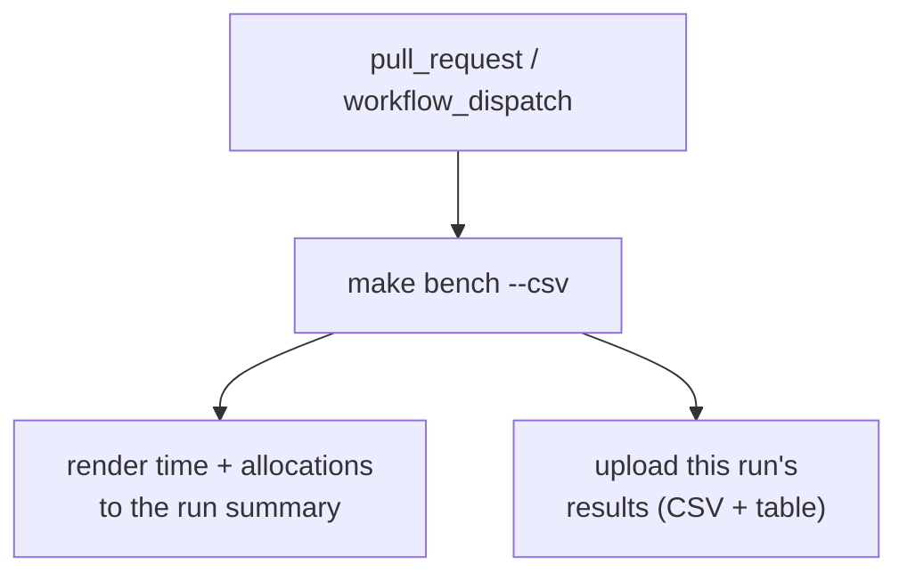

# Performance & Benchmarking

> Part of the [Écluse architecture overview](../architecture.md).

Écluse sits in front of a package registry on the critical path of every build, so
its own overhead matters: a metadata request fans out into decoding a packument,
projecting it, sweeping the rule engine over every version, merging upstreams,
filtering and rewriting the body, and re-serialising it. This document describes how
that cost is measured, what the numbers mean, and — just as importantly — what the
measurements are *not* allowed to do (block a merge on a noisy timing).

## The two-layer model

Performance has two distinct shapes, measured by two distinct mechanisms:


- **Layer A — work-per-request.** The CPU and allocation cost of the
  transformations a single request triggers, benchmarked in isolation over realistic
  input. This is what the benchmark harness in this repository measures today: the
  hot-path computations of [`ecluse-core`](../../core), with no server and no network.
  Most are pure; the rule sweep and the serve filter run through the engine's effectful
  evaluator (rule evaluation is `IO`), so those benches measure that `IO` action — but
  it is still the per-request computation, not a kernel scheduler or a socket. It is the
  layer where an accidentally-quadratic fold or a doubled allocation is caught.
- **Layer B — throughput-under-load.** The whole system under concurrent load —
  request rate, latency tails, GC pause behaviour, memory under sustained traffic.
  This needs a load generator against the running server and is a separate, later
  harness; it is named here so the boundary is explicit, not because it exists yet.

The rest of this document is about Layer A.

## What we measure: allocations and time

Each micro-bench reports **two** numbers, and they are not equal in standing.

- **Allocations are the tracked signal.** Bytes allocated (read from the GHC RTS GC
  statistics, enabled by `+RTS -T`, which the benchmark component bakes into its RTS
  options) are very nearly *deterministic* for a pure computation on fixed input:
  they barely depend on the machine, the load, or the wall clock. That makes
  allocations the signal worth comparing across commits and across runners — a change
  in allocated bytes is almost always a change in the code, not the environment.
- **Time is informational.** Wall-clock time is reported because it is what a human
  ultimately cares about, but it is machine-dependent and noisy: a shared CI runner's
  time figure is only loosely comparable from run to run. Treat it as a sanity check
  and a rough magnitude, never as a gate.

### Complexity assertions

Three version-count-scaled benches — the rule sweep, the packument merge, and the
serve-time filter/rewrite — additionally assert their **growth class** with
[`tasty-bench-fit`](https://hackage.haskell.org/package/tasty-bench-fit): they fit the
measured curve and require it to be no worse than linear in the version count. This is
a different kind of check from a timing comparison. A packument with tens of thousands
of versions going quadratic in a fold is an *algorithmic* bug (the class the
accidentally-quadratic regressions in this codebase have fallen into), not a slow
machine — so a failed complexity assertion is a real failure, and it fails the
benchmark run. The synthetic generator that drives these scales toward ~100k versions,
the size at which a super-linear term bites.

## Posture: inform-only, never gates (except on failure)

The benchmark workflow's **only red state is a literal benchmark failure** — a build
error, a crashed harness, or a tripped complexity assertion. It **never computes a
perf-regression fail**: there is no "10% slower than `main`" threshold, no allocation
ceiling that turns a measurement into a merge blocker.

The distinction is deliberate:

| Kind of signal | Example | Gates? |
|---|---|---|
| A perf-regression comparison | "this is 12% slower / allocates 8% more than the baseline" | **Never.** Machine-dependent and noisy; reported for a human to read. |
| An algorithmic-class assertion | "this fold is now O(n²) in version count" | **Yes — it fails the run.** A correctness signal, not a timing. |
| A literal failure | the harness does not build / crashes | **Yes — it fails the run.** |

Concretely: the benchmarks are a **standalone workflow**
([`.github/workflows/bench.yml`](../../.github/workflows/bench.yml)) triggered on
**every pull request and on manual dispatch**. They are **not** wired into `ci.yml`'s
terminal `gate` job, so a benchmark result — fast, slow, or absent — can never block a
pull request. This mirrors the project's other inform-only tiers (weeder, stan):
visible on the PR, never a gate.

## Per-run results



Each run renders its time-and-allocation table into the GitHub run summary and uploads
the results CSV as a downloadable artifact (`bench-results-<sha>`) attached to that run.
There is **no cross-run baseline**: a GitHub Actions artifact is scoped to its own run,
so one run cannot read another's, and a durable cross-run store (a data branch or an
external service) would need write permissions this project deliberately does not take
on. Comparison is therefore **by hand** — read a PR run's allocations against `main`'s,
or, locally, `make bench BENCH_OPTS='--baseline out.csv'` against a CSV you saved.
Because allocations are machine-independent, an eyeballed allocation delta is a reliable
signal even across different runners.

## Consistency posture

Comparable numbers need a comparable environment:

- **A shared public runner is the reference.** Allocations are machine-independent, so
  they compare cleanly across runs regardless of runner; time figures are only loosely
  comparable, and only when produced on the same runner class. The workflow runs on the
  standard shared hosted runner (for both pull-request and dispatch runs), so every
  recorded figure is drawn from the same kind of machine.
- **Local runs are for deep-dives, not for comparison against CI.** Run the benches on
  your own machine to iterate on a change and to profile a regression to a cost centre
  (`make bench-profile`), but compare a local time figure only against another local
  figure on the same machine — never against a CI baseline.

## Running locally

Everything runs from the lean `.#bench` dev shell (the CI toolchain plus the
flame-graph tooling); the `make` targets enter it for you.

```sh
make bench                       # time + allocations for every hot path
make bench BENCH_OPTS='-p serve' # only the matching benches (tasty-bench pattern)
make bench BENCH_OPTS='--csv out.csv'              # write a results CSV
make bench BENCH_OPTS='--baseline out.csv'         # print each delta vs a prior CSV (inform-only)
```

`make bench` reports both numbers per bench, e.g.:

```
serve (filter + url-rewrite + etag)
  express: filter + serve: OK
    5.1 ms ± 0.3 ms, 9.8 MB allocated, ...
```

To localise a regression to a cost centre, build a profiling variant and render a
flame graph:

```sh
make bench-profile                                 # profiles the express benches by default
make bench-profile BENCH_PROFILE_OPTS='-p "serve"' # profile one bench for a focused graph
```

`bench-profile` builds the benchmark with GHC's late cost-centre profiling
(`--profiling-detail=late`, so the centres reflect the optimised code with low skew),
runs it under the cost-centre profiler, and renders `ecluse-bench.svg` from the
resulting `ecluse-bench.prof` with `ghc-prof-flamegraph`. Open the SVG and read the
widest frames — those are where the time and allocations go.

## What is benched

The Layer A benches cover the pure hot paths a metadata request exercises, each over
the real `express` packument (hundreds of versions) and, where growth matters, over a
synthetic packument scaled toward ~100k versions:

| Hot path | Module | Scaled complexity assertion |
|---|---|---|
| npm wire decode + projection | `Ecluse.Core.Registry.Npm.Wire` / `.Project` | — |
| version parse / order / latest-selection | `Ecluse.Core.Version` | — |
| request classification | `Ecluse.Core.Registry.Npm.Route` | — |
| rule sweep over versions | `Ecluse.Core.Rules` | linear in version count |
| packument merge | `Ecluse.Core.Package.Merge` | linear in version count |
| filter + URL rewrite + re-serialise + ETag | `Ecluse.Core.Registry.Npm.Filter` / `.Serve`, `Ecluse.Core.Server.Conditional` | linear in version count |
| bounded read / nesting / version-count guards | `Ecluse.Core.Security` | — |

The realistic input corpus reuses the committed npm fixtures under
`core/test/unit/fixtures/npm/` (the same captures the unit suite decodes), and the
synthetic generator's invariants are pinned by test cases that run as part of the
benchmark, so a malformed corpus stops the run rather than benching a degenerate input.
```
