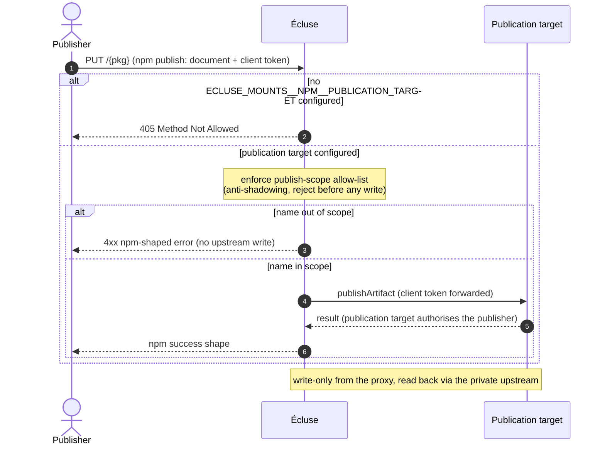
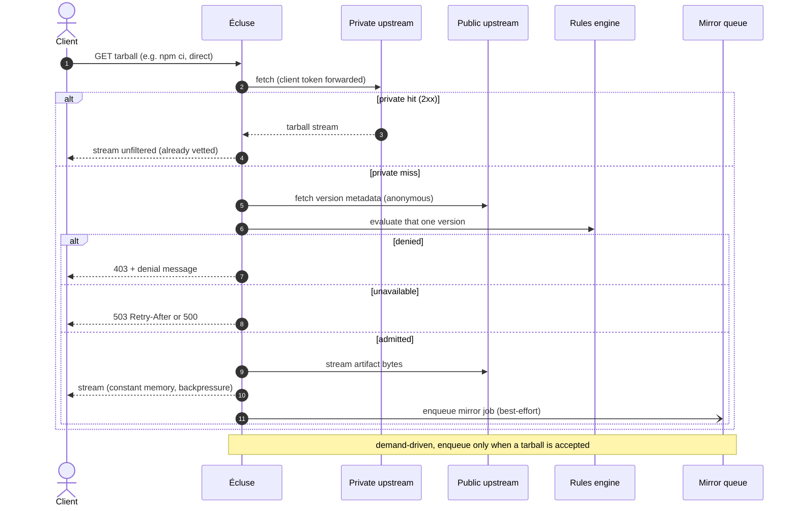
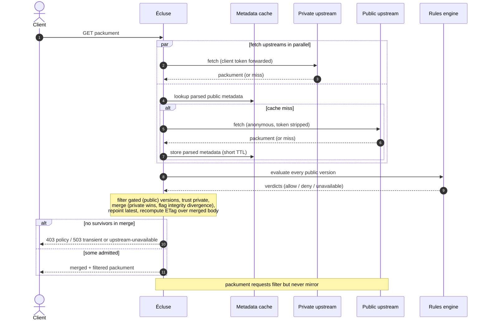

# Registry model

> Part of the [Écluse architecture overview](../architecture.md).

## Registry roles

A mount is configured with up to four registry roles, two reads and two writes, set
independently. Several may map to one physical registry, but the recommended topology keeps
first-party and public-derived stores separate and unions them at the registry level (see
[Registry-level composition](#registry-level-composition-the-recommended-topology)). A single
shared registry is the degenerate floor.

| Role | Purpose |
|------|---------|
| **Private upstream** | The authoritative, already-vetted source, read as trusted. A tarball is a conventional stable read at `{base}/{pkg}/-/{file}`; a packument's versions are trusted and merged with the gated public set. Optional on a serve-only mount. |
| **Public upstream** | The source of versions not yet in the private upstream; everything here is rules-gated. The tarball fallback on a private miss, and fetched alongside the private upstream for a packument. The only required role: a pure public gate serves from it alone. |
| **Mirror target** | Where approved public packages are written after passing the rules. Declaring one is what makes a mount mirror; absent, the mount is serve-only and never writes. Best a distinct store unioned into the private read path. |
| **Publication target** | Where client-published first-party packages are written (`npm publish`). Distinct from the mirror target: client-driven first-party content, not proxy-driven approved-public content. See [Publishing first-party packages](#publishing-first-party-packages-the-publication-target). |

Whether a mount mirrors is **derived from its endpoints, never declared as a mode**. A declared
`mirrorTarget` makes the mount mirror, and its private upstream is then required so the mirror can
be read back (otherwise a `MountMissingPrivateUpstream` boot error). An absent `mirrorTarget`
makes it serve-only: no writes, the private upstream optional, and a mount with neither is the
pure public gate. A serve-only mount runs the full rules gate unchanged; the trade is that every
artifact stays on the gated public leg instead of retiring onto the private read (see
[the V](#registry-level-composition-the-recommended-topology)).

### Credential flow and authority

Reads are credentialled by **passthrough**: Écluse forwards the caller's own credential to the
private upstream and reads the public upstream anonymously. The per-mount
[credential strategy](access-model.md) describes the target edge-authority design; passthrough is
what ships.

- **Private upstream (read)**: the client's credential is forwarded and the upstream authorises
  each request. Per-request, never cached across clients.
- **Public upstream (read/fallback)**: queried anonymously; the client's credential is never
  forwarded. Any auth a public mirror needs is Écluse's own, not the client's.
- **Mirror target (write)**: always Écluse's own
  [`CredentialProvider`](cloud-backends.md#credential-provider) token, derived from the
  mirror-target URL (a CodeArtifact host mints per its domain; any other host uses a static write
  token; see [Configuration](configuration.md#outbound-registry-credentials)). Declared under its
  own key even when it equals the private upstream: the client reads it, Écluse writes it.
- **Publication target (write)**: the client's own forwarded credential; Écluse mints no token.

The non-negotiable invariant, under every strategy: **the client's credential is never sent to
the public upstream.**

The private upstream is the per-client authority for who may read what, so its metadata is read
per request and **never entered into the shared cache**: a credential-blind key would let one
client warm an entry a differently-authorised client then gets as a hit, the cross-client
disclosure hazard in the [threat model](https://ecluse-proxy.com/threat-model.html). Only the
anonymous public origin is cached (see
[access model → why Écluse never caches the private origin](access-model.md#why-écluse-never-caches-the-private-origin)).
Outbound requests are further bounded by the [security invariants](security.md): the host
allowlist, internal-range blocking, canonicalisation, and response bounds.

## Publishing first-party packages (the publication target)

The publication target adds the one client-driven write path. A `PUT /{pkg}` (`npm publish`) is
accepted at the mount and relayed to the publication target, distinct in trigger, content, and
credential from the mirror write.

- **Anti-shadowing guard (the load-bearing control).** A publish is refused unless its name falls
  within the operator's `publishAllow` list (for npm, scopes such as `@acme`), which stops a
  client publishing a name that shadows an existing public package (a dependency-confusion vector).
  The guard holds a **guard-name ≡ URL-path name ≡ every declared body name** invariant: the scope
  check keys on the URL-path name, and because an npm publish document declares its own identity
  (`_id`, top-level `name`, every `versions[].name`), those names are validated too. Any present
  declared name that disagrees is a `403` before any relay, under the same `PackageName` equality
  the route uses. An absent name is no claim; only names are read, and the base64 `_attachments`
  are never decoded.
- **Credential.** Passthrough: the publisher's own token is forwarded; Écluse mints none.
- **No read-back role.** Write-only from the proxy's view. Published packages read back through the
  private upstream, so the operator makes the publication target the same registry as the private
  upstream (or has it aggregated).
- **Opt-in.** The path exists only when `ECLUSE_MOUNTS__NPM__PUBLICATION_TARGET` is set; otherwise a
  `PUT /{pkg}` is `405 Method Not Allowed`.

A client's `npm publish` (`PUT /{pkg}`) is gated by the operator's publish-scope allow-list
(the anti-shadowing guard, rejecting before any upstream write) and relayed to the publication
target with the publisher's own forwarded credential, distinct from the mirror target. It is
opt-in: with no `ECLUSE_MOUNTS__NPM__PUBLICATION_TARGET`, `PUT /{pkg}` is a `405`.

## Serving a tarball

A tarball is one concrete version from one source, so a private-upstream hit is streamed straight
through. The two legs locate the bytes differently, by the trust of their origin.

The **private leg is a conventional stable read**: it fetches the tarball at
`{private-base}/{pkg}/-/{file}` by the client's requested filename, the URL an `npm ci` issues,
without fetching the private packument first, so a lockfile fan-out pays one artifact round-trip
rather than a per-tarball packument fetch it would discard. The client's credential is forwarded
and redirect-following is disabled, so it never follows a `3xx`
([credential-redirect invariant](security.md#egress-scope-what-the-outbound-controls-guard-and-what-they-do-not));
a `2xx` streams, anything else is a clean private miss to the public leg. The leg applies **no
serve-time integrity floor**: a lockfile-pinned version from a trusted registry is fast-tracked,
its bytes still verified client-side by npm and by the mirror worker, so it gives up only the
proactive refuse-weak-integrity stance, not tamper-evidence (the packument route's listing-side
trusted floor, [invariant 5](security.md#invariants), is unchanged). A private upstream that
serves tarballs off-convention (a separate files host or presigned CDN URL the `/-/` path cannot
rebuild) becomes a private miss.

The **public leg** honours the `dist.tarball` the gated version declares, fetched at exactly that
URL rather than a reconstructed `/-/` path, so Écluse can front a registry serving bytes from a
separate host (the PyPI-files-host shape) or a signed CDN URL: such hosts are declared on the
ecosystem's adapter and the same-host gate admits them, with no operator knob to widen the surface.
That location is gated, not trusted: the allowlist and same-host gate bound where it may be
fetched, https-only egress with certificate validation authenticates the host, and a legacy `http`
tarball is upgraded (same host) or dropped (see
[Why `dist.tarball` is honoured](security.md#why-disttarball-is-honoured-and-what-bounds-it)).

A private hit is streamed unfiltered; a private miss gates that one version, then streams
from public and enqueues a demand-driven mirror job, non-blocking, so the client is served
immediately. See [Streaming](web-layer.md#streaming-and-resource-lifetime) and
[Mirror queue](cloud-backends.md#mirror-queue).

## Packument merge across upstreams

A packument is the set of available versions, spread across upstreams: the private upstream holds
what has been vetted or mirrored, the public upstream the full history including versions not yet
mirrored. Serving only the private packument would hide the new versions, so a client never requests
them and demand-driven mirroring never fires (see [Mirror queue](cloud-backends.md#mirror-queue)).
The packument is therefore merged, above the [protocol boundary](#registry-abstraction) as a pure,
ecosystem-agnostic fold over `PackageInfo` that a new ecosystem does not re-implement. The merge is
**order-independent**: private wins a collision and divergence is flagged regardless of fetch order,
and only positional labels track which input a survivor came from so the serve layer can index back
to the raw `Value`.

- **Fetch in parallel.** Private (passthrough) and public (anonymous) concurrently.
- **Trust split by provenance.** Private versions enter unfiltered; public versions are gated by
  the rules engine (see [Applying verdicts](rules-engine.md#applying-verdicts-to-a-packument))
  first. The result is `trusted(private) ∪ filtered(public)`.
- **Collision → private wins; divergence is a signal.** On a shared version key the private copy
  wins. If the public copy contradicts it on a shared artifact's shared integrity algorithm (same
  file, same algorithm, disagreeing digests), that is the supply-chain tampering Écluse exists to
  catch: detected, logged (a `WARNING` naming the package, the versions, and the digests), and
  metered (`ecluse.registry.merge.divergence`), never silently reconciled.
  `ECLUSE_INTEGRITY__DIVERGENCE_POLICY` decides the rest: `warn` (default) serves the trusted copy
  and relies on the alarm; `fail-closed` drops the contested version and any `dist-tag` pointing at
  it. One upstream carrying a digest the other omits is not a divergence.
- **Below-floor versions are inadmissible.** A version whose strongest digest is too weak or absent
  is a divergence blind spot, refused before the merge: the listing drops it, and the public
  artifact path `403`s it as `MissingIntegrity` or `BelowIntegrityFloor` (the private tarball leg
  excepted, its bytes client- and worker-verified). The floors are `ECLUSE_INTEGRITY__MIN_PUBLIC`
  (hard-floored at SHA-256) and `ECLUSE_INTEGRITY__MIN_TRUSTED` (loosenable, refinable per mount;
  see [Configuration](configuration.md#public-integrity-floor)); this is
  [security invariant 5](security.md#invariants).
- **Reconcile over the union.** `dist-tags.latest` follows the
  [keep-unless-denied, stable-preferring rule](rules-engine.md#applying-verdicts-to-a-packument):
  kept when it survives, else repointed to the highest stable survivor. Other tags at an absent
  version are dropped; `time` is restricted to surviving versions but keeps `created` / `modified`.
- **Partial availability.** If one upstream fails while another succeeds, the merge serves the
  best-effort union with a degraded signal (readiness stays
  [lenient about public reachability](web-layer.md#meta-routes-ping-health-and-search)). Only when
  nothing resolves does the request error.

Private and public upstreams are fetched in parallel and merged (private wins, integrity
divergence flagged); public versions are gated by the rules, and metadata filters but never
mirrors. See [Applying verdicts to a packument](rules-engine.md#applying-verdicts-to-a-packument).

### The route name is the served name's validation authority

The proxy knows the requested name from the route, so an upstream's self-reported top-level `name`
is a cross-check, never the served authority: the served `name` is always a value an upstream
genuinely reported which, having passed validation, equals the route name. An origin whose `name`
agrees is merged normally; one whose `name` disagrees is dropped as untrusted for this request and
logged (an absent or undecodable name is instead an undecodable-packument degrade). A single
misreporting upstream drops out while any other valid origin still serves `200`; only when no origin
yields a valid packument *because the responding origins mismatched* is the request `502 Bad Gateway`
(`PackumentBadGateway`; see [Error model](web-layer.md#error-model)), distinct from a genuine
absence. This forecloses cache-poisoning: a misreporting upstream cannot shadow a real package nor
win the union with a divergent `name`.

### Decision surface vs served surface

The merge decides over the typed `PackageInfo` but serves the raw upstream JSON (`Value`) edited in
place: only surviving versions taken, their tarball URLs rewritten, `latest` carried from the plan,
every unmodeled key relayed unchanged. The body is never re-serialised from the lossy typed model,
which is why its schema is
[owned by the API surface](web-layer.md#the-synthesised-packument-schema--the-trust-boundary).

### Graceful degradation: per-version, not per-package

Decoding into the decision surface is lenient at version granularity, with a fail-closed boundary:
non-decisive `dist` sub-fields (`unpackedSize`, `fileCount`, `signatures`) read as absent and the
version survives; a version broken in a required field (no `dist` or `tarball`, an unusable
`version`) is dropped and never served unverifiable while healthy siblings keep serving; only an
unusable top-level document (not an object, absent `name`, non-object `versions`) denies the package
wholesale. Dropped entries are tracked as `InvalidEntry`
([`Package.hs`](../../core/src/Ecluse/Core/Package.hs)) so the drop is observable. This turns "one
poisoned version denies the whole package" into a per-version drop.

### Registry-level composition (the recommended topology)

The recommended deployment keeps the first-party store and the public-derived mirror store physically
separate and unions them at the registry level into the private-upstream read path, for example an
AWS CodeArtifact repository drawing from a mirror-target repo and a first-party repo. The private
upstream then returns the full trusted set in one fetch while each store stays independently
governable (distinct scanning per provenance, clean post-disclosure scoping). Collapsing the roles
onto one store is supported as the degenerate floor: it trades away auditability and
defence-in-depth, not the perimeter.

The topology is a **V**: Écluse fans a read to the public origin and to the private pull-through,
which unions the mirror and first-party stores. Because every admitted public tarball is back-filled
into the mirror, and the mirror feeds the private read path, the private read comes to serve nearly
all tarball traffic once a fleet has warmed. The public tarball leg is a transient, per-artifact
fail-over that a new version transits until the worker promotes it, so its throughput matters for
onboarding, not steady-state capacity: **trading private-hit (hot-path) work to speed the public
fail-over is a regression.** A **serve-only** mount opts out of the back-fill, so its public leg is
permanent: the accepted trade of the low-effort shape is slower installs at scale, egress that never
retires, availability coupled to the public registry, and no mirrored copy surviving an upstream
yank, though the security gate is identical. Declaring a `mirrorTarget` later upgrades the mount in
place.

#### The one rule of registry composition: Écluse is the only path from public

Écluse applies ingestion-time policy (freshness gating, integrity floors, the rule algebra) that
managed registries do not, and that value holds only if public packages enter through Écluse and
nowhere else. So the aggregating read endpoint (the private upstream) must union trusted stores only,
your first-party publications and Écluse's sanitised mirror, and must not carry a direct upstream
connection to the public registry. Such a connection would let raw, ungated public packages reach
clients behind the gate rather than through it, silently nullifying the protection. Écluse cannot
detect this from the outside (the private upstream is trusted by construction), so keeping the
internal registry disconnected from public is an operator-architecture invariant, catalogued in the
[threat model](https://ecluse-proxy.com/threat-model.html).

## The internal domain model

`PackageDetails` ([`core/src/Ecluse/Core/Package.hs`](../../core/src/Ecluse/Core/Package.hs))
is the ecosystem-agnostic per-version snapshot every adapter produces and the rules engine
consumes; its shape follows the npm, PyPI, and RubyGems protocol studies in
[`research/reverse-engineering/`](../research/reverse-engineering/README.md). Two principles
govern it:

- **The rules engine is ecosystem-blind.** It never branches on npm vs PyPI vs RubyGems.
  Adapters project each wire format into normalised signals: a rule sees `CodeExecSignal`,
  `Trust`, `Availability`, never `hasInstallScript`, `packagetype`, or `extensions`.
- **Signal availability is explicit.** A signal the adapter has not (or cannot cheaply)
  determined is represented as such (`CodeExecUnknown`, `TrustUnknown`, `Nothing`), so a pure
  rule yields no decision rather than guessing and an effectful rule can resolve it later.

### The shared vocabulary

| Concern | Representation | Why |
|---|---|---|
| **Identity** | `PackageName`: an ecosystem tag, an optional namespace (npm scope), a normalised `canonical` key, and a `display` form. Equality and ordering are on `(ecosystem, namespace, canonical)`; the display and base forms are excluded. | npm is case-sensitive with scopes, PyPI normalises (PEP 503), RubyGems is verbatim. `Flask` and `flask` are one PyPI package but two npm ones, so the ecosystem tag is part of identity; matching uses the canonical key while rendering stays faithful. |
| **Version** | In [`Ecluse.Core.Version`](../../core/src/Ecluse/Core/Version.hs): opaque, holding the raw text plus a `Maybe VersionKey` parsed at construction. `parseVersionKey :: Ecosystem -> Text -> Either VersionError VersionKey` is the only way to a key, and `compareVersions` works only on keys, so non-canonical text never reaches the comparator. Unparseable means no key, so ordering rules abstain, but the version is still served. `Version` carries no derived `Ord`. | Lexicographic ordering is wrong for every grammar (`"10.0.0" < "9.0.0"`), and the proxy must keep serving a version even when the parser can't order it. |
| **Install-time code execution** | `CodeExecSignal = NoCodeOnInstall \| RunsCodeOnInstall reason \| CodeExecUnknown`. | Unifies npm install scripts, PyPI sdist builds, and RubyGems native extensions; `Unknown` carries the gemspec-fetch case. |
| **Trust / provenance** | `Trust = Trusted (NonEmpty TrustEvidence) \| Untrusted \| TrustUnknown`; `TrustEvidence = Signed \| Attested \| MfaPublished \| OtherEvidence text`. | Signing, attestation, and MFA differ per ecosystem but reduce to one signal; the evidence captures the how without the ecosystem. |
| **Availability** | `Availability = Available \| Deprecated msg \| Yanked (Maybe reason)`, plus a per-artifact `artYanked`. | npm deprecates and RubyGems yanks whole versions; PyPI yanks individual files, so the per-file flag keeps "listed-but-yanked" and lets exact pins resolve. |
| **Artifacts** | A version owns `NonEmpty Artifact`; each carries algorithm-tagged `Hash`es, kind/platform, size, interpreter constraint, and a provenance URL. | npm has one tarball; PyPI an sdist plus many wheels; RubyGems one gem per platform. |
| **Dependencies** | Deliberately not modelled, nor parsed off the wire. | A dependency matters only when itself fetched, and that fetch returns through this gate for its own verdict, so gating a parent's dependency list would duplicate the gate on every child. The raw document still relays the lists untouched. Restore the `Dependency` / `DepKind` vocabulary from history if a dependency-reading rule is designed. |

The types live in [`Ecluse.Core.Package`](../../core/src/Ecluse/Core/Package.hs),
[`Ecluse.Core.Version`](../../core/src/Ecluse/Core/Version.hs), and
[`Ecluse.Core.Ecosystem`](../../core/src/Ecluse/Core/Ecosystem.hs).

A served packument is the merge of several upstreams' `PackageInfo`; see
[Registry model → Packument merge](registry-model.md#packument-merge-across-upstreams) for
how trusted and gated provenances combine.

## Registry abstraction

The proxy core is registry-agnostic. An ecosystem registers one capability record (`RegistryAdapter`,
resolved through the adapter registry at the composition root), whose slices are the sole interface
between the proxy logic and the registry protocol: the serve surface, the metadata capability, the
artifact request formation, and the publish capability. The mirror write splits along what varies per
ecosystem: the adapter contributes a **protocol codec** (`PublishCodec`: publish-document assembly,
the presence probe, and status semantics), and the environment supplies a **shared publish
transport** (`MirrorTransport`: the connection manager, credential mint, response bound, and fault
classification). The composition root marries the two per mounted ecosystem with `newMirrorPublish`
into the `MirrorPublish` handle each worker bundle carries, so a new ecosystem contributes protocol
and never transport.

The effectful operations return plain `IO`, not `App`: an implementation closes over its own state and
never imports the proxy's `Env` / `App`, so backends stay decoupled from the core. Each reports
failures as a typed value (`FetchFault` on a read, `PublishFault` on the mirror write), so no fault
rides up as an exception and a caller's retry-vs-drop decision is total at the call site. See
[Technology stack → the effect model](technology-stack.md#key-decisions). Nothing above the registry
layer imports registry-specific types: the core operates only on `PackageInfo` and `PackageDetails`
(see [The internal domain model](#the-internal-domain-model)), and an adapter projects its wire format into these.
The packument projection takes the route-requested `PackageName` as a validation input (see
[route name validation](#the-route-name-is-the-served-names-validation-authority)).

The protocol vocabulary carries no authentication, because protocol and auth are orthogonal: AWS
CodeArtifact, GCP Artifact Registry, and a self-hosted Verdaccio or Nexus all speak the same npm
protocol and differ only in how a bearer token is obtained. So the npm implementation is used
unchanged and paired with a [`CredentialProvider`](cloud-backends.md#credential-provider) that mints
the token, making the backend matrix ecosystem × credential provider. Only the npm protocol ships at
launch; the abstraction exists from day one to make future backends (PyPI, RubyGems) additive rather
than structural. See [Cloud backends](cloud-backends.md#cloud-backends).
