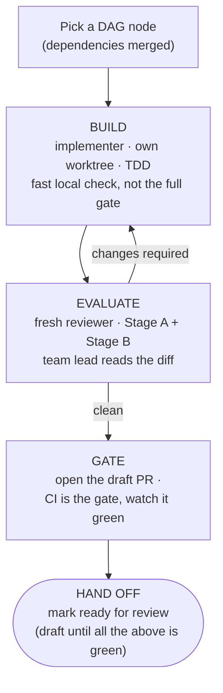

# Implementation Orchestration Strategy

How **Écluse** (package `ecluse`) is built as a coordinated multi-agent effort.
This document is about _process_; the system design lives in
[`../docs/architecture.md`](../docs/architecture.md), the development workflow and
CI in [`../CONTRIBUTING.md`](../CONTRIBUTING.md), Haskell style in
[`../STYLE.md`](../STYLE.md), and agent-facing essentials in
[`../AGENTS.md`](../AGENTS.md).

## Roles

- **Principal architect** (the repo owner), owns the design and the
  requirements, and is the final decision-maker on both. Reviews and merges every
  PR.
- **Team lead** (the coordinating agent), decomposes the _finalized_ architecture
  into PR-sized work, dispatches and supervises implementation subagents,
  evaluates their output, runs a fast local check and lets CI be the gate, and
  hands review-ready PRs to the architect. **The team lead never merges and, during implementation, never
  pushes to `main`**, all code lands through PRs the architect reviews.

## Operating principle: escalate, don't guess

The single most important rule. Whenever an agent is **stuck, unsure, blocked, or
facing ambiguous / missing / contradictory spec, it stops and surfaces the
problem** rather than inventing a way past it. Agents make a _bounded_ attempt
against the existing specs first, then escalate. They do not thrash, and they do
not paper over uncertainty. Specifically, an implementation agent must never:

- fabricate a config key, path, value, or **API behaviour** (verify via
  `hoogle` / docs, or escalate);
- silently weaken, skip, or `xfail` a test to reach green;
- add a `.semgrepignore` entry or `nosemgrep` comment (those require the
  architect's approval, always);
- sprawling beyond the slice's file scope to route around a blocker (rather than staying in scope or justifying the exception);
- leave a `TODO` / `undefined` / stub and call the work done.

A leftover stub or a quietly-relaxed test **is a blocker, not a delivery**, the
team lead scans for exactly that in review, because it is how guessing hides.

Surfacing is also **proactive**: concerns, limitations, and risks are raised _as
warranted_, not only when something is hard-blocked.

## Phase 0, architecture → delivery plan

Done once, when the architecture is frozen (not before). The team lead turns the
design into a **dependency-ordered DAG of PR-sized slices**, recorded in
the issue tracker:

- **Walking skeleton first**, the thinnest end-to-end path, then capabilities
  layered onto it.
- **Handles before consumers**, the Handle-pattern records (`RegistryClient`,
  `MirrorQueue`, `CredentialProvider`) are defined as interfaces early so
  downstream slices can be built in parallel against them.
- **Each slice is one coherent, reviewable-in-a-sitting capability**, with
  acceptance criteria traced to specific architecture sections, the test tier(s)
  it owes, a **limited file scope**, and its dependencies.

The architect signs off on this breakdown **before any code is written**.

## Convergence slices: contract before construction

The DAG encodes _ordering_ (`depends-on`) but not the **shape** of what crosses
each edge. Where several producer slices converge on one consumer; e.g.
the packument pipeline or launch
composition, specify the **consumer's interface, the types that flow across the
boundary, before building the producers**. Producers then build _to_ a known
contract instead of the consumer reverse-engineering whatever they happened to
emit. A convergence slice's interface is a deliverable of **this planning pass**,
not a discovery of the build pass. (Skipping it is how the packument pipeline's
typed-decision-vs-served-`Value` contract surfaced late; see
[Registry Model → decision vs served surface](../docs/architecture/registry-model.md#decision-surface-vs-served-surface).)

## The per-PR loop



**Draft until ready.** A PR is opened as a **draft** and stays one until it has
cleared EVALUATE and the gate and the team lead is confident handing it over. Taking
it out of draft, **marking it ready for review**, is the hand-off signal: it means
_ready for the architect to review and potentially merge_, nothing less. A PR still
building, mid-review, gate-red, or that the team lead is simply not yet sure of stays
a **draft**, so "ready for review" is never ambiguous and the architect never spends
attention on, or merges, work that was not deliberately offered.

**Fix routing.** A reviewer's "changes required" is routed one of three ways. A
**background** implementer agent can be **resumed** (`SendMessage` to its agent ID):
it keeps its full build context, so it is the natural first choice for a fix that
continues what it just built. Alternatively the team lead applies a small,
reviewer-specified fix **directly** (then re-runs the gate); or, for a larger rework
that benefits from a clean slate, briefs a **fresh** build agent with the review.
Either way the fix lands as a distinct, separately-reviewable commit.

## Subagents and isolation

- **Implementer**, builds one slice. General-purpose agent, full tools.
- **Reviewer**, evaluates a slice with **fresh context** (no exposure to the
  implementer's reasoning), read-and-verify only.

**One git worktree per agent**, each on its own branch, is a hard rule: it keeps
parallel slices from colliding on a shared tree and contains each agent's blast
radius. Concurrency is capped (**2-3 slices in flight**) so evaluation quality
does not degrade. After every merge, the team lead rebases the dependent
worktrees onto the new base and re-runs their gate, so integration drift surfaces
immediately rather than at PR time. Slices that genuinely cannot be split become
**stacked PRs**; otherwise they stay small and independent.

**Warm each worktree's HLS index at creation.** A fresh worktree is a fresh HLS
workspace: its `dist-newstyle` and `.hie` start empty, so the first navigation call
pays a cold typecheck. Create worktrees with `task new-worktree BRANCH=<branch>`,
which adds the worktree and kicks off a background `task build` so the interface
files HLS reuses are on disk before the agent arrives, the first call then returns
in seconds, not after a full typecheck. Dependencies come warm from the shared Nix
store, so only this project's own modules cost anything. Two reasons one-worktree-per-
agent is a **hard** rule and not just a speed-up: HLS keys its `hiedb` (a SQLite DB)
by *workspace path*, so multiple agents in one shared checkout contend on a single
database and can stall each other, a separate directory per agent gives each its own
DB; and with 2-3 worktrees in flight, **stagger** the creations so parallel cold
typechecks don't thrash the CPU. After a post-merge rebase, re-run `task build` to
re-warm incrementally.

**Carry the architect's full acceptance criteria into the brief; a brief is not a
summary.** An implementer never sees the alignment conversation that shaped a slice, so the
brief is its only window into it. When requirements were settled through a back-and-forth with
the architect (a type's exact fields, an edge case's disposition, a value that must be
preserved verbatim, the _why_ behind a constraint), the brief transcribes **all of it in its
final agreed form**, not a compressed paraphrase that quietly drops the nuance. A too-terse
brief narrows the target without anyone deciding to: the implementer then either guesses past
the gap (the very failure _escalate, don't guess_ exists to prevent, now displaced onto the
team lead's own omission) or surfaces it late, costing a round-trip. When the architect has
already done the alignment work, **over-specify rather than under-specify**: every refinement,
edge case, and rationale that came out of the discussion belongs in the brief. The
design-checkpoint (the implementer proposes its design and the team lead confirms before deep
work) is a backstop for genuine forks, not licence to hand over a thin brief and let the
checkpoint reconstruct what was already settled.

**Pin the model; there is no effort dial.** The Agent tool's `model` argument, left
unset, takes the general-purpose agent's default, which may be **lighter than the
team lead's own model**, and the tool exposes **no** thinking-effort parameter, so
`model` is the only capability lever the dispatcher controls. A lighter default tends
to head straight to implementation and skip the exploration a slice needs (e.g. it
will name a tool but not bootstrap into it; see below). For **design-bearing or
security-sensitive** work, a shared type, the credential-discipline serve path, a
parse-don't-validate boundary, dispatch with `model` pinned to the strongest
available rather than defaulting; reserve the default only for genuinely mechanical
slices.

**Have agents bootstrap their tools, the LSP MCP especially.** The HLS-over-MCP
navigation tools (`start_lsp`, `go_to_definition`, `find_references`, `hover`,
`get_diagnostics`, `go_to_symbol`, exposed by `agent-lsp`) are surfaced as *deferred*
tools: an agent must **load them before it can call them**, and a less-exploratory
agent skips that step and falls back to `grep`. A brief should direct the agent to
**first call `start_lsp` with `root_dir` set to its worktree root**, without it
agent-lsp drops to single-file mode and HLS reports "Could not find module …", because
a worktree's `.git` is a file, then use find-references for a refactor's blast radius,
go-to-definition across re-exports, and type-at-point to confirm a signature, all
higher-precision and faster than `grep` over this codebase's qualified imports and
re-exports (the compiler stays ground truth for correctness). An instruction to use a
tool the agent cannot actually reach is just decoration, so confirm the MCP is wired
into the agent's environment when you rely on it.

**Invoke the toolchain through the current flake, never the ambient shell.** A
long-lived agent session enters a `nix develop` once and holds it for the whole
session; if a flake upgrade merges _mid-session_ (a new GHC, fourmolu, or
dependency pin), that ambient shell goes stale while the code on disk moves on.
command as `env -u IN_NIX_SHELL nix develop --command task <target>`, which
rebuilds the shell from the on-disk flake and uses its pinned tools regardless of
session age. This is an **agent-workflow rule, not a repo one**: CI enters the
shell fresh per run and humans' direnv re-evaluates on pull, so neither is ever
stale, the Taskfile is deliberately left as-is rather than taxing every consumer
to compensate for an environment defect unique to long-lived agent sessions.

## Evaluation, two independent passes

The implementer's own "it works" does not count; evidence does.

- **Stage A, requirements.** Every acceptance criterion is met _and backed by a
  deterministic, gating test_ (unit or integration), a non-gating smoke test
  detects drift but never stands in for a criterion ([Testing Strategy](../docs/testing.md) → _What gates, and what doesn't_); nothing in the slice's architecture
  scope is silently dropped; **limited scope** (changes stay within the slice's files; touching others needs strong justification); documentation is updated in the _same_ PR
  (per [`../AGENTS.md`](../AGENTS.md) → Documentation Policy).
- **Stage B, quality & security.** Idiomatic Haskell per
  [`../STYLE.md`](../STYLE.md); totality; `-Werror`-clean; no unsafe/partial
  functions; a **security review** appropriate to a supply-chain tool (input
  parsing, deny-by-default invariants, injection-free workflows); **test
  quality**, properties present where required (e.g. rules-engine
  deny-precedence), not tautological assertions, with the **branches you can
  foresee tested by intent** (`codecov/patch` ≥ 85% is a CI backstop, not a number
  to chase); and **comment appropriateness**, Haddock documents
  the timeless contract and the _why_, never project / roadmap / slice narration
  ([`../HADDOCK.md`](../HADDOCK.md) §11). Completeness is not enough: a comment can
  be present, and the wrong kind.

Critical findings block; the fix is routed per __Fix routing__ above, the team lead
resumes the original background agent (`SendMessage`), applies a small
reviewer-specified fix directly, or briefs a fresh build agent for a larger rework, then re-verifies. Review _can_ bounce back to the original implementer now that a
background agent can be resumed with its context intact.

## Inter-wave quality & alignment pass

Per-PR review judges each slice **in isolation**; it cannot see the whole that
parallel slices compose into. Slices built concurrently against the handles drift, divergent idioms, duplicated helpers, inconsistent Haddock, and type-conversion
churn at the boundaries (bouncing a value through `String` / `Text` /
`ByteString`), and none of that fails a single-slice review. So **between waves**,
once a wave's PRs are all merged and before the next wave is dispatched, the team
lead runs a codebase-wide **quality & alignment pass**.

A dedicated agent audits the integrated tree (fresh context, read-and-verify) for:

- **Structural improvements**, cross-slice duplication, misplaced or mis-sized
  modules, abstractions that should be shared or split, leaky handles, and
  error/idiom patterns that diverged across the slices that just landed.
- **Haddock cleanup**, gaps, drift, and HADDOCK.md §11 violations (roadmap /
  slice narration that crept in); consistent voice and cross-references across
  modules.
- **Performance problems likely to surface**, needless type conversions (the
  `String`↔`Text`↔`ByteString` bounce), avoidable re-parsing / re-allocation,
  lazy/strict mismatches, accidentally-quadratic patterns, caught structurally
  now, before later slices build on them. Once the benchmark harness
  exists, this audit is **measured, not
  eyeballed**: the micro-benchmarks quantify these regressions and the audit
  consults the informational trend (which itself never gates).
- **Spec & doc accuracy reconciliation**, for every slice merged in the wave,
  reconcile the as-built code against the slice file and the architecture
  document(s) it derives from: fold any learnings, discoveries, and deviations
  from the original acceptance criteria back into the issue tracker,
  and update the architecture doc so the design of record matches what shipped.
  This stops the plan and
  the architecture drifting from reality as parallel slices land, drift the
  per-PR loop cannot catch, because it never re-reads the spec after the merge.
  **Material design changes are escalated to the architect** (they may reshape
  later slices), not silently rewritten into the docs.

The audit produces a **categorised findings report**; the team lead triages it:

- **Safe, in-scope, behaviour-preserving fixes** (rename, dedupe, Haddock, a
  localised conversion, slice/architecture doc reconciliation) land together as
  one reviewed, gated `refactor` / `docs` PR, the same BUILD → EVALUATE → GATE
  loop.
- **Design-level or far-reaching findings** are **escalated to the architect** as
  new slices / issues rather than silently absorbed. They may reshape later waves.

The pass also includes **housekeeping**: once the wave's PRs have landed, prune the
spent worktrees and their merged branches so `git worktree list` stays an accurate
map of live work. Prune only the merged-and-clean ones, a worktree carrying
uncommitted or not-yet-merged work is surfaced to the architect, never force-removed.

Housekeeping also **closes out the tracker**. A PR that resolves an issue declares it
with a `Closes #N` keyword (per the [Definition of done](#definition-of-done)) so the
merge closes it automatically, but a **squash-merge can drop that keyword**, leaving
the issue open even though its work shipped. Closing resolved issues is therefore a
standing part of the team lead's role: **as each PR lands**, confirm its issue closed
and, if the keyword did not fire, close it manually; and **as a backstop in this
sweep**, scan the open issues against the wave's merged PRs and close any whose fix has
merged, each with a `Resolved by #PR` reference. An issue left open for a real reason
(only partially addressed, or a follow-on tracked separately) is **not** closed; it is
left with a note on what remains.

The pass **gates the next wave**: the integrated base a wave builds on is made
coherent first. It is recorded in the
issue tracker's milestone sequence.

## Verification: fast local, CI is the gate

CI **is** the gate; local verification is for _fast feedback_, not a pre-push
ceremony. Every CI job just calls `task`, and CI runs the tiers **in parallel** on
its own runners, so reproducing the slow, parallelisable ones (Docker
integration, the hermetic `nix-check`, Haddock) serially on one contended host is
wasted work CI does anyway, and the team lead reproducing the whole gate before
pushing is **running it twice**.

The **fast floor** is the agent's whole local obligation before pushing:

```bash
task check
```

`task check` is the pre-push target: build, unit tests, doctest, fourmolu/hlint,
Semgrep, `cabal check`, and workflow-lint (the gating tiers you can run locally,
minus the Docker integration and Haddock tiers CI parallelises for you), **plus
dead-code (`weeder`) and Haskell static analysis (`stan`)**. Those last two are not
yet CI-gate dependencies, but the repo treats them as required-to-fix in practice, so
they run here ahead of their enforcement; each fails `check` on any finding. That
makes `check` a superset of the gate's current requirements, not a subset, and adds
two `-fwrite-ide-info` builds, so it is no longer a quick pass. The hard stops within
it are **Semgrep clean** (zero findings, no new ignores without the architect's
approval) and a clean weeder/stan floor. Then **push early, let CI parallelise the
rest, and watch the real run to green** (`gh pr checks --watch`).

Reproduce a tier locally **only to debug a red**, map the red CI job back to its
`task` target and run just that one, never the whole gate wholesale. The gating
jobs (the `needs` of the terminal `gate` job in
[`../.github/workflows/ci.yml`](../.github/workflows/ci.yml)) map one-to-one:

| Gating CI job                              | Local command                                          |
| ------------------------------------------ | ------------------------------------------------------ |
| `build-and-test` (build + unit)            | `task check` _(build, unit, format-check, lint, sast, weeder, stan)_ |
| `lint` (fourmolu + hlint)                  | ↳ included in `task check`                             |
| `semgrep` (`--config auto`, ERROR/WARNING) | ↳ included in `task check`                             |
| `integration` (ministack / Docker)         | `task test-integration`                                |
| `docs` (Haddock)                           | `task docs-site`                                       |
| `gate`                                     | green iff all of the above are green                   |
| `smoke` (live registries)                  | `task test-smoke`, **non-gating, never blocks**       |

`task nix-check` is the one worth a _proactive_ local run when you have touched the
flake or added a module: it catches `-Werror` warnings and the _flakes only see
git-tracked files_ trap, so a new module must be `git add`-ed (and listed in the
`.cabal` file) **before** it runs, a failure a plain `task build` misses.

Coverage takes the same posture: `codecov/patch` runs in CI as a **backstop**
(≥ 85% on changed lines), so write the behaviour tests you would write anyway and
let it flag genuine gaps, don't pre-run `task coverage` and parse
`coverage/<suite>.json` to colour a number up. ~95% is a long-term aspiration, not
a per-PR bar (chasing it is wasteful); see
[Testing Strategy → Coverage](../docs/testing.md).

> **Coverage comes only from the unit ∪ integration tiers.** The **E2E and Smoke
> suites surface no coverage** (not built with HPC, no Codecov flag), by design.
> So when `codecov/patch` flags changed lines, **reach for a unit or integration
> test**: a path exercised only by an e2e/smoke run still reads as uncovered, on the
> dashboard and in any local `task coverage`. Don't conclude "the e2e test covers it".
> (This is also why the local test loop has a `task coverage-unit` and `task coverage`
> tier; `task coverage` merges both; see [CONTRIBUTING → Coverage](../CONTRIBUTING.md#coverage).)

**Scale verification to the change.** Light by default. Reserve heavier local
reproduction _and_ exhaustive case-enumeration for the genuinely risky surfaces: the parsers and identifier canonicalisation, the credential path, deny-by-default
rule precedence, and egress/SSRF, where a regression is costly and a fast unit
pass under-covers the threat. A small, low-risk refactor must not cost an hour of
ceremony.

Hard stops: **Semgrep reports zero findings** before any push (no new ignores
without the architect's approval); commits are **GPG-signed**, carry a **DCO
`Signed-off-by`** trailer (`git commit -s`, the `DCO` status check gates on it),
and use [Conventional Commits](https://www.conventionalcommits.org/); any workflow change
stays **injection-free** with **SHA-pinned** actions. After pushing, the real run
is confirmed green (`gh pr checks` / `gh run watch`) before handoff, on the
result, not the prediction. A red gate is root-caused, not patched over.

## Definition of done

A PR reaches the architect only when **all** hold:

- [ ] All acceptance criteria met, each with passing **deterministic, gating** (unit/integration) test evidence, a non-gating smoke test never stands in for a criterion
- [ ] Independent review (Stage A + B) passed; no open critical issues
- [ ] Fast local checks pass before pushing (`task check`, the gate minus its Docker + Haddock tiers), not the full gate
- [ ] Foreseeable branches tested by intent; `codecov/patch` green (≥ 85%, a CI backstop, not a number chased locally)
- [ ] Comments are contract + why only, no roadmap / slice / PR references (HADDOCK.md §11)
- [ ] Semgrep clean (no new ignores)
- [ ] CI `gate` (and every job it needs) green on the PR
- [ ] Docs updated in the same PR; changes limited to the slice's file scope (other files only with strong justification)
- [ ] Any GitHub issue the PR resolves is named in its description with a closing keyword (`Closes #N`), so the merge closes it; the tracker must not accrue resolved-but-open issues
- [ ] **The slice-completing PR closes its corresponding GitHub issue**; the merge is what makes the slice true, so the as-built reconciliation **rides with the code**, never deferred to a later sweep, and folds in the as-built delta (design decisions, discoveries, deviations from the acceptance criteria). An issue left open after its PR merged is a hand-off defect, caught at GATE.
- [ ] Commits GPG-signed + DCO `Signed-off-by` (`git commit -s`) + Conventional Commits
- [ ] PR taken **out of draft and marked ready for review**, the hand-off itself, done only once every box above holds; until then the PR stays a **draft** so it is never mistaken for review-ready

## Escalation

The team lead is a filter, not a megaphone: the architect should not see noise,
but must see every real fork.

**Handled by the team lead (silently):** idiomatic implementation choices among
equivalent options; formatting / lint / build wiring and test plumbing; flaky-CI
reruns; worktree / rebase conflicts; anything answerable from the existing specs.

**Escalated to the architect:**

- ambiguous / missing / contradictory **spec or requirement**;
- a requirement that proves infeasible, or materially costlier / riskier than it
  looked;
- a **security or correctness trade-off** with no clear right answer;
- a design assumption that turns out false; scope questions ("is X in this
  slice?");
- external blockers (a missing secret / credential; an upstream API that behaves
  unlike the spec);
- an agent genuinely stuck after its bounded attempt.

Escalations arrive **decision-ready**:

> **Decision needed** (one sentence, phrased as a question) · **Context / what was
> tried** · **Options** (2-3, with a recommendation marked) · **Blast radius**
> (this PR only, or blocking dependents?) + urgency.

## Guardrails (always on)

- Implementation work lands via **PRs only**; the team lead never merges and never
  pushes to `main`.
- **PRs open as a draft; marked ready for review only at hand-off**, once EVALUATE
  and the gate are green and the team lead is confident, never before. "Ready for
  review" is the signal it is ready for the architect to review and potentially merge.
- **One worktree per agent**; agents keep changes within their slice's file scope, touching other files only with strong justification.
- **GPG-signed** commits carrying a **DCO `Signed-off-by`** trailer (`git commit -s`;
  the repo's `DCO` status check gates on it), **Conventional Commits** (`type(scope): summary`).
- **Semgrep clean** before every push; ignores need the architect's approval.
- GitHub Actions **SHA-pinned**; workflows kept **injection-free**.
- Documentation updated in the **same** PR as the change it describes, and that
  includes the **planning record**: a PR that completes a slice **closes its corresponding issue and folds in its as-built delta in the very same PR**. The affected architecture /
  `docs/` pages, and any issue status move **with** the code, not
  in a follow-up reconciliation. The team lead verifies this at GATE; a merged slice with an issue still
  open is drift the per-PR loop was supposed to prevent.
- Generated artifacts (e.g. version-ordering fixtures via
  `task gen-version-fixtures`) are regenerated with their tooling, never
  hand-edited.
- **Cross-cutting invariants live in one helper.** When the same invariant is
  enforced by more than one slice (`latest` resolution in the npm filter and the
  packument merge; lossless `Value` passthrough across filter/merge/serve), extract
  it into a single shared helper the slices call. Duplicated invariant logic drifts
  and gets fixed N times.
- **Surface decisions one at a time.** When several design questions are open at
  once, the team lead does **not** front-load them all on the architect in one
  message. They are **parked** (a short-lived `design-queue.md` under `planning/`, spun
  up when decisions accumulate and removed once drained into `docs/` + issues) and
  brought **one at a time**, lead-with-a-recommendation; the rest wait their turn. This
  complements *escalate, don't guess*. Surface proactively, but serialised, not in
  a flood.
- **Reference work by identifiers the architect can see.** When surfacing or
  escalating, name a piece of work by what is visible to the architect, its PR or issue number (`#168`), or a short descriptive title, never an
  internal task-tracker ID (the architect's view does not render those).
- **The Handle pattern is the canonical name for the records-of-functions
  abstraction.** `RegistryClient`, `MirrorQueue`, and `CredentialProvider` are **the
  Handle pattern**. Say **"the Handle pattern"** for the abstraction and **"integration
  boundary" / "interface contract" / "abstraction boundary"** for where components
  meet, as fits the context.

## What lives under `planning/`

This strategy; and, when design questions accumulate, a short-lived `design-queue.md`
holding area (worked one at a time, then drained into `docs/` and issues, and removed
once empty). See [README](README.md).
